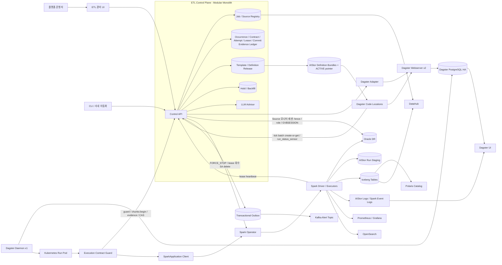
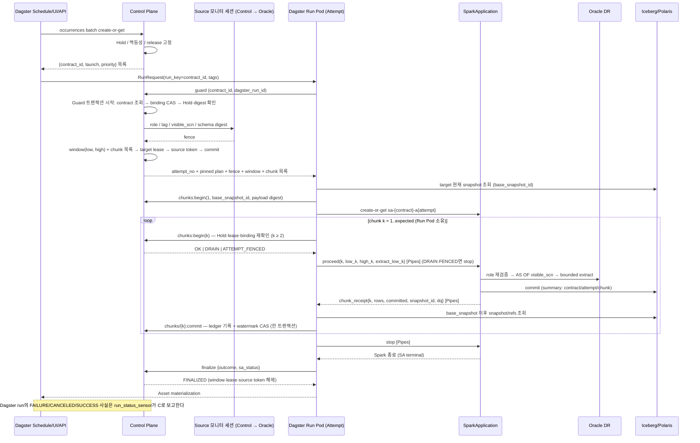

# 신규 ETL Platform 목표 아키텍처 v1.2.2

- 문서 상태: PoC 승인 후보안 — v1.2.2 (Codex 2차 교차 리뷰 반영 semantic patch — 의미론 동결 후보)
- 작성일: 2026-08-22 (v1) · 개정일: 2026-08-23 (v1.1) · 2026-08-23 (v1.2) · 2026-08-23 (v1.2.1) · 2026-08-23 (v1.2.2)
- 변경 근거(v1.2): PoC 시험·합격 기준서 v1 §8.4 “v1.2 반영 후보” 14건, §2.4 계측 테이블, §7 운영 파라미터 시작값
- 변경 근거(v1.2.2): Codex 2차 교차 리뷰(`etl-platform-v1.2.1-codex-second-cross-review.md`)와 검토서 2(`etl-platform-v1.2.1-codex-second-review-assessment.md`) §6 범위 — P0 10(유지 4·P1 하향 6)·P1 15 전부, semantic patch(기능 추가 없음)
- 변경 근거(v1.2.1): Codex 교차 리뷰(`etl-platform-v1.2-codex-cross-review.md`)와 그 검토서(`etl-platform-v1.2-codex-cross-review-assessment.md`) — P0 10·P1 23·P2 8건 중 검토서 §5 범위(P0 전부, P1 중 의미론·판정력 직결 항목, P2 전부, 소규모 P1 4건 선반영)
- 기준 규모: Job 약 10,000개, Run 약 40,000건/일, 정시 Burst 약 500건
- 핵심 적재: Oracle → Spark → Iceberg/Polaris

## v1.2 → v1.2.1 변경 이력

개정 원칙: Codex 교차 리뷰의 결함 지적은 전부 채택하되 처방은 **검토서(`etl-platform-v1.2-codex-cross-review-assessment.md`) §2~§5의 축소안**으로 구현한다 — 새 상태·새 메커니즘(`ADJUDICATION_BLOCKED`, `recovery_epoch`, FenceBundle 동결·재해석 금지, candidate/serving 이중 포인터, `run_submission` 테이블, exact-range repair contract, `TARGET_UNCHANGED_EMPTY_SOURCE`, `TARGET_PROVISIONING`)은 도입하지 않고 기존 상태·필드·경로의 문장을 고쳐 같은 불변식을 얻는다. 실행 모델(Occurrence ⊃ Contract ⊃ Attempt, Guard 1 트랜잭션, Control 전용 Adjudication, lease 순서, 6.2 상태 집합)은 유지한다. 이 개정으로 닫는 네 문장: “verdict를 모름은 commit 안 됨이 아니다”(P0-01), “SCN snapshot 고정은 UPDATE_DT 누락 없음과 같지 않다”(P0-06), “Pod가 없음은 Oracle session이 없음과 같지 않다”(P0-07), “ledger window 연속은 row가 모두 들어옴과 같지 않다”(P0-10, 기준서). 검토서 §5가 v1.2.2로 미룬 P1 중 비용이 작은 4건(P1-08 SA ownerReference, P1-10 `orphan_min_age`, P1-15 `NO_LAG_SIGNAL`, P1-17 target table identity pin)은 이번에 함께 반영했고, P1-04(증거 전용 endpoint 대신 Adjudication의 Pipes 재생으로 verdict reason 확정)는 13.2 한 문장으로 반영했다. 아래 표에 없는 절은 v1.2 그대로다.

| ID | 절 | 변경 요지 | 근거 |
|---|---|---|---|
| P0-01 | 5.4 / 6.2 전이 표·해제 불변식 / 9.3 / 10.2 / 13.4 / 22장 22번; 기준서 FI-28 변형 (c) | `ADJUDICATION_PENDING` 만료 전제를 `WRITER_FENCED`에서 verdict ∈ {NO_COMMIT, PARTIAL_COMMIT} 확정(부분 commit CAS 반영 완료)으로 교체 — fenced ∧ verdict NULL(Polaris 미조회) 계약은 `expires_at`이 지나도 window·target lease 유지·`COALESCED_INTO`·기존 알림. Polaris 재시도 backoff `adjudication_retry_backoff_initial_seconds`(신설, 30초·2배·상한 300초). FI-28 (c) outage > expires_at: 장애 중 `CANCELLED(EXPIRED)`·새 attempt·lease 해제 0, 회복 후 verdict 1개 | 근거: Codex P0-01, 검토서 §2 P0-01 |
| P0-02 | 6.1 / 13.2 3번 / 13.4; 기준서 FI-37a/b/c, §3.5 | 0-row 판정 완비 조건: 0-row receipt가 1..expected를 모두 덮을 때만 `FINALIZED_NO_DATA`, 0-row 접두부는 `high_m`까지 CAS 대행 후 `PARTIAL_COMMIT`(bullet 순서 COMMIT → 접두 → 전체 0-row). watermark는 chunk CAS(`high_k`)로만 전진·NO_DATA 전이는 옮기지 않음. ledger `UNIQUE (contract_id, attempt_no, chunk_no)`. FI-37a/b/c 기대값 watermark = `high_k` ∧ `PARTIAL_COMMIT` ∧ 재개 | 근거: Codex P0-02(P1 하향), 검토서 §2 P0-02 |
| P0-03 | 6.2 상태도·전이 표·verdict reason / 13.1 / 14.3 / 17; 기준서 FI-23 정정, FI-23c, §3.5, §6 | `dq:accept` 재정의 = commit된 chunk k의 DQ 승인(ledger ACCEPTED + CAS `high_k` 한 트랜잭션; k = expected·Full → FINALIZED, 아니면 `ADJUDICATION_PENDING(PARTIAL_COMMIT, DQ_ACCEPTED)` → 기존 RETRY 재개) — “watermark `window.high` 전진” 삭제. `resolve`의 `DQ_FAILED`는 `REPAIR_CONTRACT`·`WATERMARK_SEED`만, `OPERATOR_ACCEPT`는 409 `RESOLUTION_NOT_ALLOWED`(신설). FI-23c로 Incremental partial + accept/resolve/RETRY 검증(Phase 2 게이트) | 근거: Codex P0-03, 검토서 §2 P0-03 |
| P1-01 | 6.1 / 9.1 / 9.3 / 10.2 1번·복구 경로 (c) / 14.3 | `next_eligible_at` NOT NULL DEFAULT `created_at`(stale 루프 `IS NOT NULL` 조건 삭제), `FENCE_EXPIRED` 재제출 금지를 신설 `resubmit_blocked`로 분리, Guard 1번 `PLANNED` inline 만료 한 줄(`ADJUDICATION_PENDING` 제외) | 근거: Codex P1-01, 검토서 §3 P1-01 |
| P1-02 | 6.1 / 9.1 / 9.3 | 계약 row `last_submitted_run_id`·`submitted_at`(신설, 재제출 단일 경로가 기록), 9.1 `launch` 정의에 non-terminal 제출 부재 조건 추가(Adapter 조회 실패는 fail-closed) — FI-02(b)·FI-01(c) 합격 조건의 규범 근거 | 근거: Codex P1-02, 검토서 §3 P1-02 |
| P1-03 | 9.1 / 16.4; 기준서 SC-02b, §3.5 | batch create-or-get 항목별 savepoint 격리 + `ITEM_REJECTED` 응답 항목·Outbox `occurrence item rejected`(신설) — poison item 1건이 499건의 tick을 막지 않음. SC-02b로 검증 | 근거: Codex P1-03, 검토서 §3 P1-03 |
| P1-07 | 5.1 / 6.2 verdict reason / 10.2 반입 표·backoff / 22장 22번; 기준서 FI-06b, §3.5, §6 | `run_retries.max_retries: 1`·`max_resume_run_attempts: 0` 명시, 반입 표 CANCELED 행 분리 — `MAX_RUNTIME_EXCEEDED`·`OPERATOR_CANCELLED`·`PLATFORM_TERMINATE`(신설 reason 3종)는 재결합 대기 없이 fencing → Adjudication → 운영자 대기, 자동 attempt 0. FI-06b로 검증 | 근거: Codex P1-07, 검토서 §3 P1-07 |
| P0-05 | 6.1, 6.2, 7.1, 10.2(6번·표), 11.3, 12.3, 16.4, 17 / P §2.3, §3.4 FI-27·FI-42, §6 | SourceSystem 불변 `db_identity` + 연결 테스트 422 `DB_IDENTITY_MISMATCH`, descriptor·identity pin 시점 = 첫 성공 Guard(재해석 유지), Guard 6번·driver precheck identity 대조, Template SQL `SYS_CONTEXT` 술어, `SOURCE_IDENTITY_MISMATCH`(신설) = `SOURCE_ROLE_MISMATCH` 동일 처리, `db-identity:rotate` API(신설); FI-27(a) identity 단언, FI-42 신설 | Codex P0-05, 검토서 §2·§4 2번 |
| P0-06 | 6.1, 7.1, 7.2(5·13번), 7.3, 11.3, 12.3, 17, 22장 4번 / P §2.1, §3.2 비교 B, §3.4 FI-12·FI-41, §4 H-03 | `max_open_txn_seconds` → `max_commit_minus_watermark_seconds` + `bound_kind(ENFORCED\|OBSERVED)` + `watermark_column_facts`(신설: `timestamp_origin`·`not_null`·`updated_on_every_change`), ZERO_GAP rule `ZERO_GAP_REQUIRES_ENFORCED_BOUND`(개명·확장, hard delete는 `delete_semantics`), overlap 공식 오용·`SCN_TO_TIMESTAMP` 3초 과주장 정정, Audit 필수 범위 11.3↔12.3 통일; FI-41 신설(eligible PK 차집합 0) | Codex P0-06, 검토서 §2·§1 표 2행 |
| P0-07 | 6.1, 6.2, 10.2(8번), 11.2, 16.4, 18, 19장 9번, 22장 9·22번 / P §2.3, §3.4 FI-17·FI-43, §6, §7 | lease `RELEASED`(token 반환)를 `RECLAIMED`(= `WRITER_FENCED`)와 분리 — 조건 = attempt 태그 세션 0 연속 N회, 상한 초과 시 `source session lingering` 알림(신설); grant 식 `observed + requested_weight ≤ pool_cap` 정식화(태그 무관·pool lock 안·fresh), 관측 실패 fail-closed(`FENCE_UNAVAILABLE`); capability `sqlnet_expire_time_seconds`·`idle_time_seconds`; 파라미터 3개 신설; stub ≤5초 종료 구성화(기본 off), FI-17(c) 정정, FI-43 신설 | Codex P0-07(P1 하향), 검토서 §2·§4 3번 |
| P1-11 | 10장 인터페이스, 13.1(검사 1·ledger 컬럼) | 검사 1 기준을 `written_rows`로(overlap Append 오판 제거), receipt·ledger에 `dedup_dropped_rows`·`anti_join_dropped_rows`(+ P1-16 `overlap_recovered_rows`·`extract_window_low`) 추가, Merge metric 수집 불가 → pre-commit `CHUNK_DQ_FAILED` / 사후 null → `DQ_FAILED` | Codex P1-11, 검토서 §3 |
| P1-12 | 10.2(3.4·chunks:begin), 11.4, 12.2, 22장 2번 / P §3.4 FI-44 | `chunks:begin` undo deadline → `FENCE_EXPIRED`(DRAIN과 같은 안전 지점 중단); 11.4 ‘chunk 축소’ 삭제, ORA-01555/01466/08181 → `SPARK_FAILED` + 같은 계약 RETRY 금지(`FENCE_EXPIRED` 동일 처리); `AS OF` 없는 강등 삭제 → publish rule `EXTRACT_EXCEEDS_UNDO_BUDGET`(신설); INITIAL_LOAD `initial_load.fence_mode: EXTRACT_ONCE \| PER_CHUNK_FENCE`(신설, 11.3 예외 명시); FI-44 신설 | Codex P1-12, 검토서 §3 |
| P1-13 | 10.1, 11.3 / P §3.4 FI-45 | role·identity 검사를 `sessionInitStatement` PL/SQL 블록(ORA-20901/20902, task retry fail-fast)으로 모든 JDBC connection에 강제 — driver precheck는 첫 사례, fence revision 재검사 불필요(`AS OF SCN` literal); FI-45 신설(executor 재접속·task retry·failover 변형) | Codex P1-13, 검토서 §3 |
| P1-14 | 6.2, 10장 인터페이스, 16.4, 22장 9번 (6.1 `legacy_concurrent_sessions`는 P0-06 행) / P §2.3, §3.4 FI-16 | ORA-28002를 breaker 입력에서 제거 → `precheck_warning{CREDENTIAL_EXPIRING}`(신설 Pipes message)·Outbox `credential expiring`(신설); 상한식에 모니터 세션 1 + `legacy_concurrent_sessions` 항, `ADG_ACCOUNT_INFO_TRACKING` 적용 단위·`PASSWORD_GRACE_TIME` DBA 확인; FI-16 (B) 28002 변형(Hold 0) | Codex P1-14(부분), 검토서 §3·§4 7번 |
| P1-16 | 6.1, 11.5, 12.2(2·3번) (receipt·ledger 컬럼은 P1-11 행) / P §3.2 비교 A, §3.4 FI-47 | extract window 정의 — overlap은 계약 최초 attempt chunk 1에만(`extract_low = original_logical_low − overlap`), contract `original_logical_low`(신설, 불변), receipt·ledger `extract_window_low`·`overlap_recovered_rows`, anti-join 구간 고정, `logical_window_low/high`는 논리값 유지; 비교 A에 overlap 회수 행, FI-47 신설 | Codex P1-16, 검토서 §3 |
| P1-23 | 6.2(다이어그램·전이 표), 10장 인터페이스, 10.2, 12.1, 13.1, 13.2, 14.3, 16.1, 16.4 / P §3.4 FI-23 | 검사 5(Full −50%)를 driver pre-commit `total-records` 비교로 이동(`CHUNK_DQ_FAILED` 경로 수렴, main 불변, receipt `dq.row_drop`), 정상 급감 반영은 `RERUN_LATEST {accept_row_drop: true}`(신설 플래그); `DQ_FAILED`(검사 1 summary 불일치만) 알림 `main_exposed`·UI ‘main 이미 노출’ 배지; FI-23(b) 정정 | Codex P1-23, 검토서 §3 |
| P1-15 | 10.2(6번), 11.3, 16.4 / P §3.1 | `confidence_reason`에 `NO_LAG_SIGNAL` 추가 — capability 3 Source의 BEST_EFFORT 계약을 `DEGRADED(NO_LAG_SIGNAL)`로 기록(Audit 우선 포함, `degraded confidence` 알림 제외); 'VERIFIED 아니면 거부'는 기존 규정으로 기각 | Codex P1-15(P2 하향), 검토서 §3·§4 8번 |
| P0-04 | 5.4 / 10.1 / 10.2 표 / 17 | PITR 재동기화를 **resync 프로토콜 5단계**로 고정 — Global Hold `DRAIN` + 제출 중지 → 비종결·미인지 attempt 전부 fencing 단계(`WRITER_FENCED`) → catalog head 안정 후 summary·run tag 재구성 + contract별 13.2 Adjudication(actor `RESYNC`) → lease 재구성 ∧ `GV$SESSION` ETL 세션 0 → 해제·CATCHUP. 복구 Control이 모르는 `(contract, attempt)` 호출은 `412 ATTEMPT_FENCED {fence_reason: RESYNC}`(신설 값). recovery epoch 불채택(SA label `control_generation` 선택 기록만). 기준서 FI-05b 신설 | Codex P0-04(P1 하향), 검토서 §2·§4 1번 |
| P0-08 | 6.2 / 10.2 / 17 | release ACTIVE·rollback ACTIVE 재검사 실패 분기 = **shard 포인터를 Control ACTIVE bundle로 복귀 + reload**(VERIFIED fallback 재사용, 이중 포인터 불채택); Run Pod가 `guard`에 `loaded_bundle_digest`(신설 필드)를 실어 attempt에 기록; `INTERFACE_MISMATCH` 2분기 — 더 새 ACTIVE 없음(split) → `PLANNED` 유지 + backoff(200·SUCCESS) / 있음 → `VOID(SUPERSEDED_BY_RELEASE)`(412). 기준서 FI-24b split 변형·§5 오탐 행 정합 | Codex P0-08(P1 하향), 검토서 §2·§4 4번 |
| P1-05 | 14.1 / 14.2 | 14.2 catch-up impacted 집합에 `REJECTED_AT_GUARD(SCHEMA_DRIFT \| SOURCE_ROLE_MISMATCH)`와 breaker가 Hold 생성 트랜잭션에서 마감한 `VOID(SKIPPED_BY_HOLD)` 추가(24h Job 하루 손실 방지); 14.1에 Hold 겹침 의미 신설 — held = 덮는 open Hold ≥ 1, effective mode = max(FORCE_STOP > DRAIN > HOLD_NEW), `chunks:begin`은 하나라도 DRAIN이면 `DRAIN`, 자동 Hold `(scope, reason, key)` open unique. 기준서 FI-13/FI-32 24h 조건, FI-49 신설 | Codex P1-05, 검토서 §3 |
| P1-19+P1-22 | 6.1 구현 규약(신설) / 13.1 | 전역 lock 순서 Source(`source_system` row — Guard `FOR SHARE`, revoke·breaker·ACTIVE 전이 `FOR UPDATE`) → Revision → Job/Occurrence → Contract → watermark → lease; PostgreSQL 제약 9종(occurrence natural key, occurrence당 활성 contract 1, `(contract, attempt)`·ledger `(contract, attempt, chunk)` unique, 제출 run ≤ 1, outbox `event_id`, 자동 Hold open unique, Source당 ACTIVE revision 1, lease exclusion partition range 한정); ledger `cas_applied·cas_at·window_low/high·actor`, `attempt_state_history.terminal_ingested_at`, REATTACH row는 binding 컬럼 트리거. 기준서 §2.4 정합, DDL 부록 + §5.1 dry-run = 주차 1 산출물 | Codex P1-19·P1-22, 검토서 §3 |
| P2-01 | 9.3 | CATCHUP `expires_at` 비면제의 근거를 ‘PLANNED CATCHUP이 NORMAL을 흡수하는 기아’(13.4와 모순)에서 bounded stale intent·설명 주체 교체·queue hygiene으로 교체(결론 유지) | Codex P2-01, 검토서 §3 |
| P2-02 | 19 | 문서 우선순위 반전 — 규범 문장 > executable schema/API(DDL 부록·17장) > 기준서 절차·임계 > 산문, 불일치는 traceability failure로 기록·v1.2.x로 해소(기준서 머리말 동일) | Codex P2-02, 검토서 §3 |
| P2-03 | 9.1 | grouped schedule target 형태 명시 — shard subsettable asset job + `launch=true` 항목마다 `RunRequest(asset_selection=[asset_key], run_key=contract_id, tags)`; 기준서 SC-02에 RunRequest 생성 시간 측정 | Codex P2-03, 검토서 §3 |
| P2-04 | 20 | Phase 0 산출물 `versions.lock`(신설) — 전 구성요소 버전·image digest·CRD digest·기능 probe 결과, 기준서 §2.1 행 동일 | Codex P2-04, 검토서 §3 |
| P2-05 | 17 | 오류 의미를 ‘Guard 200 result 집합’ / ‘HTTP 코드 집합’으로 분리; 423은 Hold 전용(`LEASE_BUSY`·`SOURCE_LAG_EXCEEDED`·`FENCE_UNAVAILABLE` 제거), 412 `CREDENTIAL_REVOKED`는 Hold release 거부 전용임을 명시, `ATTEMPT_FENCED` fence_reason 3종 | Codex P2-05 (b)(c), 검토서 §3·§4 11번 |
| P2-06 | 14.2 | Hold 해제 202 응답의 예상 소요를 `max_S Σ_{i∈S}(D_i × w_i)/C_S`로 교체, `expires_before_completion`은 Source별 판정·목록 반환(H-11 모델 재사용) | Codex P2-06, 검토서 §3 |
| P2-07 | 7.3 / 12.1 / 13.2 / 6.2 / 17 | `load.allow_empty_full: true/false` → `load.on_empty_source: RETAIN_PREVIOUS \| FAIL`(신설 이름, 기본 `FAIL`) 전체 치환 — 이름이 동작(이전 snapshot 유지)을 드러내고 `replace_with_empty`와 대비; 기준서 FI-21 동일 | Codex P2-07, 검토서 §3 |
| P2-08 | — (기준서) | FI-25(c) `max_runtime` 경계 변형(p99 직하·직상, `RUN_WORKER_LOST` 반입), SC-08 retention 30/90/365 비용 집계(22장 7번 입력), FI-34(c′) network partition 변형(`proceed_timeout` 경로); 1,200 burst 제외 | Codex P2-08, 검토서 §3 |
| P1-08 | 10.1 | SparkApplication ownerReference 금지·label 전용(GC는 TTL + Control 명시 delete), UID 기록 후 get 404 → 재생성 금지·fencing 경로 | Codex P1-08, 검토서 §3 |
| P1-10 | 18 / 13.2 / 5.3 | `remove_orphan_files(older_than) ≥ orphan_min_age`(신설 파라미터 = max_runtime + reattach_grace + Adjudication 조사 기간 + margin) 기동·JobSpec 검증 거부 규칙; snapshot 만료 제외 집합에 `DQ_FAILED`·`RECONCILIATION_REQUIRED` 추가 | Codex P1-10, 검토서 §3 |
| P1-17 | 7.2 / 7.3 / 6.2 / 10.2 | publish(VALIDATED)에서 target table 멱등 create-or-get + `table_uuid`·`current_schema_id`·`default_spec_id` pinned, Guard 5번 `loadTable` 불일치 → 기존 `INTERFACE_MISMATCH`(새 상태 없음) | Codex P1-17, 검토서 §3·§4 9번 |
| P1-18 | 22 / 20 | 22장 16번을 Phase 3 진입 게이트(cutover/롤백 runbook 7단계 + 기준서 FI-48)로 승격, 20장 Phase 3에 게이트 문장; 기준서 FI-48 신설(Phase 3 게이트 표기) | Codex P1-18, 검토서 §3·§5 |
| P0-09 | P §2.3, §3.4(FI-40 신설), §3.5 | stub 가시성 모델을 시간 커서(prefix) 모델로 교체 — `visible_scn` = `commit_ts ≤ stub_now − injected_lag`인 마지막 `commit_scn`, `SCN_TO_TIMESTAMP` = 그 commit_ts, `V$DATAGUARD_STATS` 같은 커서 파생, idle·burst 모드; FI-40 stub 자가검증(§3.5 1번, 불합격 시 soak 미착수); §3.5에 신규 FI/SC 전부 배치 | 근거: Codex P0-09, 검토서 §2(P1 하향·ADOPT_MODIFIED) |
| P0-10 | P §5.1(전면), §5('정상 Run 중복/누락'·'Watermark gap/regression'·'Snapshot contract metadata'), §6(데이터 차이·중복/누락·ZERO_GAP·이중 commit), §2.5 | 4층 oracle(occurrence 정확히 1개 / attempt·SA·lease 구간 겹침 0 / `(contract, attempt, chunk)` 유일성+lineage+같은 Job ingest window 쌍별 겹침 0(lane 분리) / 주입 truth vs target 차집합 0); ledger 연속성은 보조 불변식; FI-31/36 snapshot은 `snapshot_id` allowlist로 분모 제외; ZERO_GAP No-Go에 비교 A 연결; backlog 4분해 + oldest age·p95·기울기 | 근거: Codex P0-10·§7.2, 검토서 §2(P0 유지·ADOPT_MODIFIED), `recovery_epoch`는 §4 1번 불채택 |
| P1-21 | P §8.3, §1.2, §2.1, §3.5 6번; A 6.1, 7.2 5번, 17, 19 | 'Scale/Control Go'(stub)와 'Oracle ZERO_GAP Go'(실 primary→physical standby: long txn·late commit·role transition·undo churn·executor reconnect·old timestamp) 게이트 분리, Go 정의 연동, Phase 0 입력에 DG 시험 인스턴스; `SourceCapability.zero_gap_verified`(신설) → `ZERO_GAP` publish 조건 | 근거: Codex P1-21, 검토서 §3(ADOPT_MODIFIED — 'BEST_EFFORT 한정 출시'는 capability로 기존 강제) |
| P1-22 | P §8.1(1·8번), §8.3 주차 1, FI-22 | DDL 부록(6.1 5종 + ledger `cas_applied/cas_at/window_low/high/actor` + contract/attempt/lease 핵심 열·제약·트리거) + §5.1 SQL dry-run을 주차 1 필수 산출물로; FI-22(a) `WRITER_FENCED`를 `attempt_state_history` FENCED로 정정, snapshot 유일성 키에 `attempt_no` | 근거: Codex P1-22, 검토서 §3(ADOPT, P1-19 제약과 합본) |
| P1-20 | P §2.5, H-11, SC-02c 신설; A 19장 H-11, 22장 11번 | ρ 식에 period 항 정정(ρ = Σ_i(D_i × w_i / period_i) / C_S, 무차원); SC-02c 500 Job 단일 Source 집중(hard cap 0회 초과·Guard/모니터 p99) + fence precursor 비교안 | 근거: Codex P1-20, 검토서 §3(ADOPT_MODIFIED) |
| FI-09c | P §3.4(FI-09c 신설), §3.5 2번, §6 | terminal event와 late safety evidence 순서 역전 — 412 `RUN_TERMINAL` 유지 + Adjudication의 Pipes 재생으로 verdict reason `CREDENTIAL_FAILURE` 확정, breaker·Hold 정상 개방, 자동 attempt 0 | 근거: Codex P1-04·§7.1 FI-09c, 검토서 §3(P2 하향·ADOPT_MODIFIED — 증거 전용 endpoint 불채택) |
| SC-04b | P §3.3(SC-04b 신설), §3.5 5번, §2.5, §6 | queue cap 실제 포화(cap 200 축소 + 500 burst + Source 포화 60분) — bounded backlog(4분해 oldest age·p95·기울기), priority starvation 없음, recovery slope 양수; 1,200 burst 제외 | 근거: Codex §7.1 SC-04b·P2-08, 검토서 §3(P2-08 ADOPT_MODIFIED — 1,200 burst 제외) |

신설 이름(v1.2.1): 파라미터 `adjudication_retry_backoff_initial_seconds`·`lease_release_probe_interval_seconds`·`lease_release_zero_count`·`lease_release_max_wait_seconds`·`orphan_min_age`, contract 속성 `resubmit_blocked`·`last_submitted_run_id`·`submitted_at`·`original_logical_low`·`db_identity`, attempt 속성·Guard 입력 `loaded_bundle_digest`, SourceSystem `db_identity`, SourceCapability `max_commit_minus_watermark_seconds`·`bound_kind`·`watermark_column_facts`·`zero_gap_verified`·`legacy_concurrent_sessions`·`sqlnet_expire_time_seconds`·`idle_time_seconds`, JobSpec `on_empty_source`(`allow_empty_full` 치환)·`initial_load.fence_mode`, RERUN_LATEST 플래그 `accept_row_drop`, SA label `control_generation`, Phase 0 산출물 `versions.lock`, lease 상태 `RELEASED`, ledger 컬럼 `cas_applied`·`cas_at`·`window_low/high`·`actor`·receipt 복사 6종, `dq_result ∈ {ACCEPTED, ROW_DROP_OVERRIDDEN}`, verdict reason `MAX_RUNTIME_EXCEEDED`·`OPERATOR_CANCELLED`·`PLATFORM_TERMINATE`·`SOURCE_IDENTITY_MISMATCH`·`DQ_ACCEPTED`, Guard 사유 `SOURCE_IDENTITY_MISMATCH`, API 코드 `409 RESOLUTION_NOT_ALLOWED`, 엔드포인트 `POST /v1/sources/{id}/db-identity:rotate`, validator rule `ZERO_GAP_REQUIRES_ENFORCED_BOUND`·`ZERO_GAP_REQUIRES_VERIFIED_SOURCE`·`DB_IDENTITY_MISMATCH`·`EXTRACT_EXCEEDS_UNDO_BUDGET`·`TARGET_TABLE_INCOMPATIBLE`, batch 응답 `ITEM_REJECTED`, Pipes `precheck_warning`, 이벤트 `credential expiring`·`occurrence item rejected`·`source session lingering`, `fence_reason: RESYNC`, `confidence_reason = NO_LAG_SIGNAL`, 6.1 ‘구현 규약’ 소절(lock 순서·제약 9종). 상세 이름은 각 절의 ‘신설’ 표기를 따른다.

## v1.2.1 → v1.2.2 변경 이력

개정 원칙: **semantic patch** — Codex 2차 교차 리뷰(P0 10·P1 15)의 결함 지적은 전부 채택하되 처방은 검토서 2(`etl-platform-v1.2.1-codex-second-review-assessment.md`) §2~§6의 축소안으로 구현한다. 새 구성요소·새 상태·새 테이블은 두지 않는다 — catalog gateway/`commit_intent` journal, `EXTRACT_ONCE`-only 초기 적재, candidate code location·activation barrier, exact recovery journal(RPO 0), `run_submission` 테이블, maintenance fencing generation, sentinel 메타데이터, 세 clock freshness, `REJECTED_AT_SCHEDULER` occurrence, typed exact 권위 비교, 보수식 reservation, version/topology digest는 도입하지 않고 기존 상태·필드·경로(13.1 lineage 분류, 6.2 상태 집합, 11.2 lease 프로토콜, 9.3 단일 재제출 경로, 16.4 event_id 패턴)를 재사용한다. 이번 개정으로 닫는 핵심: “Pod 부재 ≠ Polaris commit 종료”(head-settle + `chunks:begin(1)` base 연속성 검사), v1.2.1 회귀 2건(`CON_DBID` → `V$CONTAINERS` PDB tuple, overlap을 attempt 번호가 아니라 `window.low == original_logical_low`로), PER_CHUNK_FENCE final sweep, heartbeat witness, canonical target table lock, `effective_from = now()`, conservative recovery 명문화, 제출 멱등성(`submission_in_flight` + deterministic runId). 아래 표에 없는 절은 v1.2.1 그대로다.

| ID | 절 | 변경 요지 | 근거 |
|---|---|---|---|
| P0-01 | 13.2 2번, 22장 22번, 5.4, 10.2(반입 표·검사 9번·chunk 루프), 6.1, 6.2(표·불변식); P FI-50 | Adjudication head-settle 필수(5.4 (3)과 동일, `adjudication_delay_seconds` 폐지), attempt `adjudicated_head_snapshot_id`, `chunks:begin(1)` base 연속성 검사(Guard 응답 `last_committed_snapshot_id` 기대값, 13.1 분류 재사용 — 다른 attempt의 ingest면 SA 생성 전 `RECONCILIATION_REQUIRED(EXTERNAL_SNAPSHOT)`, token 즉시 RELEASED); FI-50 합격식 = 착지 시점 무관 중복 구간 CAS 0 ∧ RECONCILIATION_REQUIRED 정확히 1 ∧ repair 뒤 diff 0 | Codex2 P0-01, 검토서2 §2·§5 1번 |
| P1-01 | 6.1(컬럼·구현 규약 (5)), 9.1, 9.3; P FI-35(e) | contract `submission_in_flight{resubmit_no, run_id, at}`를 `launchRun` 전에 commit, Dagster `executionMetadata.runId = uuid5(contract_id, resubmit_no)` 멱등 제출, 9.1 `launch`·Adapter 사전검사에 in-flight 조건, crash 복구는 in-flight run_id `runOrError` 확정(run_submission 테이블 기각); FI-01(c)·FI-02(b) 유지, FI-35(e) launch 후 crash 변형 | Codex2 P1-01, 검토서2 §3·§5 9번 |
| P1-02 | 10.2(1번·거부 표 `CONTRACT_CLOSED`), 14.3(RETRY 행·절차 (a)), 9.3; P FI-22(a′) | Guard 1번·RETRY (a)의 inline expiry를 verdict 확정 `ADJUDICATION_PENDING`까지 확장 — `CANCELLED(EXPIRED)`(actor `EXPIRY`, 부분 commit 보존) 후 `CONTRACT_CLOSED`, verdict NULL은 만료 안 함; FI-22(a′) RETRY 선행 순서 변형 | Codex2 P1-02, 검토서2 §3 |
| P1-03 | 6.2(attempt 기계 문단·`DQ_ACCEPTED` reason·`DQ_FAILED →` 행) | `finalize{DQ_FAILED\|RECONCILIATION_REQUIRED\|CANCELLED_AT_SAFEPOINT}`·drain_timeout fencing → attempt `TERMINAL_OBSERVED → FENCED`(COMPLETED 아님), `dq:accept` → `FENCED → ADJUDICATED(PARTIAL_COMMIT\|COMMIT, DQ_ACCEPTED)`; `DQ_SEALED` 신설 없음. FI-23c 재번호·P §2.4 actor는 G4 | Codex2 P1-03, 검토서2 §3 |
| P1-05 | 13.1(WAP 규칙 단락 신설), 13.2(2번 ancestor 판정·lease 승격 한 줄); P H-06 변형, §3.1 WAP 케이스 | WAP 경로: `chunks/{n}:commit`·CAS는 `fast_forward` 성공 뒤에만, receipt `branch_head_snapshot_id`·`published_main_snapshot_id`, ledger `committed_snapshot_id = published_main`; ff 실패 receipt `FAST_FORWARD_REJECTED` → `attempt-failure {CHUNK_DQ_FAILED}`(main 불변·자동 재시도 없음); Adjudication은 branch head의 main ancestor 여부로 publish 판정; WAP attempt는 `EXCLUSIVE_TABLE`(1차 이연분); H-06 ff 기각 변형. §5.1 ancestor 조건은 G4 | Codex2 P1-05, 검토서2 §3·§4(OPEN P1-09) |
| P1-07 | 13.1(검사 1 Merge), 20장 Phase 0 | Merge DQ 식 = `inserted + updated + deleted + ignored`(driver가 WHEN 절 조건 선평가), 버전 gate 실패 시 application counter fallback `dq_basis = APP_COUNTER`(Merge 전면 차단 해제), `versions.lock` 확정 전 metric gate 금지 | Codex2 P1-07, 검토서2 §3 |
| P0-02 | 6.1, 6.2, 7.1, 10.2(6번), 11.2, 11.3, 12.3, 22장 9번; P §2.3, FI-27, FI-42 | `db_identity`를 6항 tuple `{cdb_dbid, db_unique_name, resetlogs_change_no, pdb_dbid, pdb_con_uid, pdb_guid}`로 교체 — PDB tuple은 `V$CONTAINERS WHERE con_id = TO_NUMBER(SYS_CONTEXT('USERENV','CON_ID'))`, non-CDB(`CON_ID = 0`)는 `pdb_identity = NOT_APPLICABLE` 명시; Template 술어는 `CON_NAME`, GUID 등은 `sessionInitStatement` 블록; 11.2 승인 뷰·22장 9번에 `V$CONTAINERS`; P §2.3 endpoint B·C(같은 CDB·다른 PDB), FI-42(e), FI-27(a) tuple 단언 | Codex2 P0-02, 검토서2 §2·§4·§6 |
| P0-04 | 12.2(2·3번), 10.2(3.4·9번), 10장 인터페이스; P §3.2, FI-47, FI-47c(신설) | overlap 적용 조건을 '계약의 최초 attempt chunk 1'에서 `contract.window.low == original_logical_low`(durable coverage — CAS로 덮인 뒤에만 재적용 금지)로 교체; Guard·재개 응답에 Control 계산 `extract_window_low`, `proceed{…, extract_low}`; 첫 CAS 전 실패 뒤 재개 attempt chunk 1은 overlap 재적용 — FI-47c | Codex2 P0-04, 검토서2 §2·§6 |
| P0-03 | 11.2, 10.2(8번), 6.1, 6.2(불변식), 14.1, 19장 9번, 22장 9·22번; P FI-17, FI-43c(신설), §6 9번, §2.1 | grant 식 `observed + reserved_unrealized + requested_weight ≤ pool_cap`(`reserved_unrealized` = Σ_t max(0, weight_t − tagged_observed_t), `guard_result.lease_grant`에 추가; 보수식 기각); 정상 `finalize`도 `RECLAIMED → probe → RELEASED`(COMPLETED 경로 `lease_release_zero_count = 1`) — DRAIN 완료·No-Go 9 정합; SourceCapability `session_limit_evidence` 4항(RESOURCE_LIMIT 등) | Codex2 P0-03(P1 하향), 검토서2 §2·§5-10·§6 |
| P0-05 | 12.2(초기 적재), 11.4, 7.2(6번), 10.2(7번), 13.4; P FI-44, FI-44e(신설) | `PER_CHUNK_FENCE`에 final sweep chunk 고정(`expected_chunk_count = n + 1`, chunk n fence 재사용 `AS OF visible_scn_last`, 논리 window `[wm, wm)`·extract window `[fence_ts_1 − overlap, wm)`, anti-join/PK dedup, ledger 형식 동일); sweep 불가면 ZERO_GAP 422 rule `PER_CHUNK_FENCE_REQUIRES_SWEEP`(신설) → BEST_EFFORT; 11.4 'INITIAL_LOAD는 extract-once 필수' 모순 정정; `EXTRACT_ONCE`-only 기각 | Codex2 P0-05(P1 하향), 검토서2 §2·§5-2·§6 |
| P0-08-A | 11.3, 10.2(6번), 6.1, 7.2(5번), 17, 11.2, 22장 3·9번; P §2.3, FI-41, FI-41e(신설) | cutoff `high = min(T_lb, SYSTIMESTAMP_standby) − safety_lag`의 `T_lb`를 primary heartbeat witness(DBA 소유 `ETL_HEARTBEAT(ts)`, `DBMS_SCHEDULER` 3~5초, Guard 6번 `SELECT ts … AS OF SCN :visible_scn`)로 — 방향 보장, 오차는 보수 방향; SourceCapability `fence_time_witness ∈ {HEARTBEAT_TABLE, SCN_TO_TIMESTAMP}`(신설), rule `ZERO_GAP_REQUIRES_ENFORCED_BOUND`에 `HEARTBEAT_TABLE` 조건, `SCN_TO_TIMESTAMP`만이면 BEST_EFFORT; SCN/CDC 한정·DBA directional bound 기각 | Codex2 P0-08-A, 검토서2 §2·§5-4·§6 |
| P0-08-B | 7.2(5번), 17, 11.3(3번·노출 항목) | rule `ZERO_GAP_REQUIRES_ENFORCED_BOUND` 조건 `delete_semantics ∉ {NONE_DECLARED, CDC_LATER}`(`CDC_LATER` 제외, `PK_RECONCILE`은 `interval` 노출); 데이터 계약에 `delete_semantics`·`PK_RECONCILE.interval` 병기, 'ZERO_GAP = window 내 insert/update 완전성, delete는 선언 경로의 bounded lag' 명시; finalize 안 동기 delete reconciliation 기각 | Codex2 P0-08-B, 검토서2 §2·§5-5·§6 |
| P1-08 | 12.3, 11.3, 22장 9번; P FI-45, FI-45d(신설), §8.3 G2 | Template extract SQL에 행 수 무관 1회 평가 예외 발생식(`UNION ALL SELECT … FROM DUAL WHERE CASE WHEN <role/identity 불일치> THEN TO_NUMBER('SOURCE_ROLE_MISMATCH') ELSE 0 END = 1` → ORA-01722; DBA 허용 시 `etl_assert_standby()`) 추가, boolean 술어는 pruning용 유지; 22장 9번 fail-fast 목록에 ORA-01722 매핑; sentinel 메타데이터 기각 | Codex2 P1-08, 검토서2 §3·§5-11·§6 |
| P1-09 | 6.2(credential breaker), 6.1, 22장 9번; P FI-16(e)(e′) | credential breaker 상한식의 '최대 동시 ETL Job' 항을 SourceSafetyEnvelope '최대 총 JDBC connection weight(Σ numPartitions + driver_sessions)'로 교체(fail-fast는 재시도만 끊음); `SourceCapability.password_rollover_registered`(신설 bool, DBA가 `PASSWORD_ROLLOVER_TIME ≥ max_runtime_seconds` 확인) Source만 Job 수 기준 완화; 신규 계산 필드 기각 | Codex2 P1-09, 검토서2 §3·§5-11·§6 |
| P1-10 | 6.1(attempt 모델), 7.1 | attempt에 `connection_revision_id`(신설 — Guard 6번 기록, 재해석 시 ACTIVE 값) 1필드; contract pin(descriptor hash·`db_identity`)은 재해석으로 덮어쓰지 않음 명시(fence origin = contract pin, 실행 revision = attempt 컬럼); digest 2종 기각 | Codex2 P1-10(P2), 검토서2 §3·§6 |
| P1-13 | 6.1(SourceCapability·db_identity rotate), 16.4, 7.2(5번) | `zero_gap_evidence` jsonb(신설 — `g2_report_id`·`verified_at`·`db_identity`·`capability_digest`), `db-identity:rotate`·digest 입력 변경 트랜잭션에서 `zero_gap_verified := false` + Outbox `zero gap verification invalidated`(신설); 이후 ZERO_GAP publish는 기존 rule `ZERO_GAP_REQUIRES_VERIFIED_SOURCE` 422, ACTIVE release는 경고만; version/topology digest 기각 | Codex2 P1-13(P2), 검토서2 §3·§5-11·§6 |
| P0-06 | 6.2 표(DEPLOYED·ACTIVE 행), 8.2 7번, 9.3, 17 publish 주석·rollback (3) / P §3.4 FI-24c(신설, §3.5 7번 배치) | ACTIVE `effective_from = now()` 고정(미래 시각 요청 422 `EFFECTIVE_FROM_NOT_ALLOWED`, rollback과 동일) + release operation 말미 자동 Gap Recovery `scope={shard}, range=[deployed_at − 1 period, now()]`, actor `SYSTEM`(`deployed_at` 신설 컬럼, 9.3 단일 코드 경로); candidate code location·activation barrier 불채택 | Codex2 P0-06(P1 하향), 검토서2 §2·§5-3·§6 |
| P0-07 | 6.1 구현 규약(lock 순서·제약 (9)), 10.2(8번), 13.3 / P §3.4 FI-51(신설, §3.5 2번 배치) | 전역 lock 순서에 `target_table(table_id)` row `FOR UPDATE`(또는 `pg_advisory_xact_lock`) 추가 — watermark와 target lease 사이; 13.3 conflict matrix(`EXCLUSIVE_TABLE` ↔ 전부, `PARTITION_OR_FILESET` range && 또는 정규화 fileset key 교집합, `APPEND` ↔ `EXCLUSIVE_TABLE`만) + 검사·insert 같은 트랜잭션; (9) DB 제약 유지(이중 방어) | Codex2 P0-07(P1 하향), 검토서2 §2·§6 |
| P0-09 | 16.4, 6.2(credential `event_id`), 5.4, 18 / P §3.4 FI-05(정정)·FI-05c(신설, §3.5 5번 배치) | conservative recovery 명문화 — Outbox `event_id = hash(aggregate_id, transition key, event_type)` 일반 규칙(무작위 금지); resync operation row `completed_step`(신설 컬럼) + 재기동 시 `completed_step + 1`부터 재개; snapshot retention 하한 `≥ RPO + RTO + margin`; FI-05 기대집합 = 0-row CAS 제외·후퇴 방향만; journal/RPO 0 불채택 | Codex2 P0-09(P1 하향), 검토서2 §2·§5-6·§6 |
| P1-04 | 12.1, 6.2 표(FINALIZED_NO_DATA 행), 16.2, 16.4, 22장 22번 / P §5 freshness 행, §7 | 세 clock 분리 대신 contract 플래그 `target_unchanged`(신설) + read model 파생 지표 2개(target publication age = 마지막 `committed_snapshot_id`의 `cas_at`, coverage = `window.high`) + `freshness breach` payload 포함; `FINALIZED_NO_DATA`는 orchestration freshness; 연속 `target_unchanged_alert_count`(신설, 3)회 Source 단위 `target unchanged` 경고; `covered_by_contract_id` 불채택 | Codex2 P1-04(P2), 검토서2 §3·§5-11·§6 |
| P1-06 | 18 / P §3.3 SC-11 | 만료 제외 집합에 active attempt branch ref(`branch_x`) 보호 한 줄; maintenance lease 만료 회수 = 11.2 SA 삭제·pod 부재 → `RECLAIMED`, 이후 착지 snapshot은 lease 구간 밖 → 13.1/13.2 3번 `RECONCILIATION_REQUIRED`; SC-11에 expire 제외 집합·`remove_orphan_files(orphan_min_age)` 보호·하한 미만 JobSpec 422·branch retention fixture(P §7 인용과 일치); fencing generation 불채택 | Codex2 P1-06(P2), 검토서2 §3·§5-11·§6 |
| P1-11 | 22장 16번, 20장 Phase 3 / P §3.4 FI-48 | cutover runbook 재배열 — DRAIN Hold → old writer 정지·세션 0 → 권위 old watermark + target head 캡처 → seed → reconcile → lease 이전 → 해제(캡처를 세션 0 뒤로); FI-48 주입 (e) '(1)~(2) 사이 old commit' 추가 | Codex2 P1-11(P1, Phase 3 게이트), 검토서2 §3·§6 |
| P1-12 | 5.4, 6.1 구현 규약 제약 (10) | Control scheduler(stale 루프·lateness sensor·heartbeat gap 감지·만료 스캔·Outbox publisher) = Control API와 분리된 단일 프로세스(`replicas=1` 또는 PostgreSQL advisory lock leader), `planned_scan_interval` 주기, 재기동 시 DB cursor(마지막 완료 operation `to`·`last_expected_checked_at`)부터 재개; `operation (kind, scope_key)` partial unique `WHERE status = 'IN_PROGRESS'`; cursor·unique key는 기존 충족 | Codex2 P1-12(P2), 검토서2 §3·§6 |
| P1-15 | P §3.4 FI-49 | 자동 Hold unique 경합 시험을 H1 생성 전으로 이동(drift 유도 → 경합 Guard 2건 → H3 → H1 → H2 → 해제 H2·H3·H1); 기대값 (b)~(e) 유지, 본문 변경 없음 | Codex2 P1-15(P1, 기준서), 검토서2 §3·§6 |
| P0-10-A | P §2.3 'SCN 기반 가시성' 행, FI-40 | stub에 3초 system tick(`tick_scn`·`tick_ts`, row 없음) 스트림 추가 — 커서 = tick 포함 마지막 항목, `SCN_TO_TIMESTAMP`·apply lag·`DATUM_TIME`은 그 커서에서 파생, idle = table commit 0(tick 계속); FI-40 (b)(d) 양성 증거 = idle 회차 table commit 0 ∧ `tick_count` 진행, apply lag = `injected_lag` ± 3초 | Codex2 P0-10-A, 검토서2 §2 P0-10 A·§6 |
| P0-10-B | A 9.1 / 16.4; P §5.1 (1), SC-02b, §5 '정상 Run 중복/누락' 행, §6 2번 | Outbox `occurrence item rejected`의 payload에 `logical_scheduled_at` 명시(`event_id = hash(job_id, logical_scheduled_at, 'ITEM_REJECTED')`); 기준서 §5.1 (1)은 occurrence 0인 expected 키를 같은 `(job_id, logical_scheduled_at)` Outbox row가 있을 때만 '설명된 누락(ITEM_REJECTED)'으로 분류, 건수 = SC-02b 주입 건·그 외 0 — `REJECTED_AT_SCHEDULER` occurrence는 기각 | Codex2 P0-10-B, 검토서2 §2 P0-10 B·§5 7번 |
| P0-10-C | P §5.1 (2), FI-20(f) | §5.1 (2)(a)(b)를 같은 `(job, lane)`으로 판정 — lane 정의를 (3)(b)와 공유(ingest lane = NORMAL·CATCHUP·INITIAL_LOAD·RERUN_LATEST, repair/backfill lane = REPLAY·BACKFILL·repair); lane 간 동시 SA는 정상이고 안전성은 (c) lease 구간·13.4·(3)(b)가 판정; FI-20(f) 주석 | Codex2 P0-10-C, 검토서2 §2 P0-10 C |
| P0-10-D (+P0-08-B, P1-05 P-side) | P §3.2 비교 A·B, §8.1 8번 | `ora_hash(row)` 폐기 → `STANDARD_HASH(canonical_concat, 'SHA256')` 권위 + canonicalization 규칙(NULL sentinel·UTC ISO-8601 µs·NUMBER scale TO_CHAR·RAWTOHEX·NFC·LOB DBMS_CRYPTO 또는 설명된 차이) + 양방향 PK 차집합(불일치 PK만 typed exact) + `committed_snapshot_id`의 main ancestry 조건; 비교 B는 `PK_RECONCILE.interval` 경과·양방향; 주차 1 dry-run에 이 SQL 실 실행 (iii) 추가 | Codex2 P0-10-D·P0-08-B·P1-05, 검토서2 §2 P0-10 D·P0-08-B·§3 P1-05·§5 8번 |
| P0-10-E (+P1-03 P-side) | P §2.4 ledger 컬럼, FI-23c, FI-07 | ledger actor에 `OPERATOR`(+ `published_main_snapshot_id`) 추가; FI-23c (c4)를 attempt 2 = chunk 1·2(`window_low = high_2`, `expected_chunk_count = 2`)·`(contract_id, attempt_no, chunk_no)` snapshot 2개 0·같은 job ingest window 쌍별 겹침 0으로 재작성, attempt 전이 `TERMINAL_OBSERVED → FENCED → ADJUDICATED`(dq:accept); FI-07 '접두 구간 일치'를 attempt-local 재번호 문구로 정정(FI-06·22는 정합 확인, 무변경); versioned artifact 요구는 §8.1 8번·§8.3 주차 1 게이트로 충족 | Codex2 P0-10-E·P1-03·매트릭스 P1-22, 검토서2 §2 P0-10 E·§3 P1-03·§4 |
| P1-14 | P §2.5 backlog 분해, SC-04b | backlog를 서로소 5분해로 재정의 — `runnable` := PLANNED ∧ eligible ∧ not held ∧ non-terminal run 없음, `submitted_queued`(신설) := PLANNED ∧ non-terminal run 있음, `executing`·`safety_blocked`·`terminal`; `dagster_nonterminal`은 보조 지표; SC-04b (a) := `runnable + submitted_queued + executing + safety_blocked ≤ expected` ∧ 계약당 non-terminal run ≤ 1 | Codex2 P1-14, 검토서2 §3 P1-14 |

신설 이름(v1.2.2): attempt `adjudicated_head_snapshot_id`·`connection_revision_id`, contract `submission_in_flight{resubmit_no, run_id, at}`·`target_unchanged`, SourceSystem `db_identity` v2 = {cdb_dbid, db_unique_name, resetlogs_change_no, pdb_dbid, pdb_con_uid, pdb_guid | NOT_APPLICABLE}, SourceCapability `fence_time_witness ∈ {HEARTBEAT_TABLE, SCN_TO_TIMESTAMP}`·`session_limit_evidence{resource_limit_true, sessions_per_user, scope, cap_plus_one_verified_at}`·`password_rollover_registered`·`zero_gap_evidence{g2_report_id, verified_at, db_identity, capability_digest}`, release `deployed_at`, operation `completed_step`(5.4 resync), Pipes `proceed.extract_low`, receipt `merge_metrics.ignored`·`dq_basis`·`branch_head_snapshot_id`·`published_main_snapshot_id`·`exception_class = FAST_FORWARD_REJECTED`, ledger `dq_basis`·`published_main_snapshot_id`, Guard 응답 `extract_window_low`·`last_committed_snapshot_id`(전 경로), lease `reserved_unrealized`(`guard_result.lease_grant`), 파라미터 `target_unchanged_alert_count`(폐지: `adjudication_delay_seconds`), validator rule `EFFECTIVE_FROM_NOT_ALLOWED`·`PER_CHUNK_FENCE_REQUIRES_SWEEP`, 이벤트 `zero gap verification invalidated`(`reason ∈ {IDENTITY_ROTATED, CAPABILITY_CHANGED}`)·`target unchanged`, 6.1 구현 규약 제약 (10) operation 단일성, 12.2 final sweep chunk, 13.1 WAP 규칙, 13.3 conflict matrix. 상세는 각 절의 ‘v1.2.2’ 표기를 따른다.

## v1.1 → v1.2 변경 이력

개정 원칙: PoC 시험·합격 기준서 v1(`etl-platform-poc-test-plan-v1.md`, 이하 기준서)이 v1.1 밖에서 **전제해야 했던 동작**(§8.4 14건)과 그 문서가 도입·고정한 계측 테이블(§2.4)·파라미터 시작값(§7)만 본문에 정의한다. 실행 모델(Occurrence ⊃ Contract ⊃ Attempt, Guard 1~9번, Commit Adjudication 13.2, lease 13.3/11.2, Hold 14.1/14.2, 6.2 상태 집합)은 바꾸지 않으며 기존 상태·사유·엔드포인트 이름을 재사용한다 — 새 이름은 기존에 없을 때만 만들고 본문에 “신설”로 표시한다. 19장은 기준서로 이관하고 판정 구조 요약만 남긴다. PoC 결과로 확정할 값(22장 1·3·6·7·8·11·20·22번)은 “잠정”으로 표시한다. 아래 표에 없는 절은 v1.1 그대로다.

| ID | 절 | 변경 요지 | 근거 |
|---|---|---|---|
| A1 | 6.1 / 6.2 / 10 / 10.2 / 11.3 / 13.1 / 13.4 / 16.4 | `DEGRADED_CONFIDENCE` = Guard 6번에서 `BEST_EFFORT` 계약에만 기록하는 contract 속성 `confidence = DEGRADED`(`confidence_reason = DATUM_STALE \| LAG_QUERY_FAILED`). lag threshold 초과·fence 미조회는 등급 무관 거부 유지. **attempt 실행 중 lag 재조회·CAS 거부·`ADJUDICATION_PENDING` 전이 없음** — 모든 chunk가 `AS OF visible_scn`으로 읽으므로 Guard 이후 lag 상승은 row 집합을 바꾸지 못한다 | 기준서 §5 apply lag 행, FI-11, §8.4 |
| A2 | 5.4 / 6.2 / 10.2 / 13.2 / 14.1 / 16.4 / 17 | Guard 5번 끝 **target health check**(`target_health_timeout_seconds` 5초) 실패 → Guard 사유 `TARGET_UNAVAILABLE`(200 거부, `PLANNED` + backoff, Source 미조회); breaker key(Polaris catalog·AIStor)별 연속 `platform_breaker_failures`(3)회면 같은 트랜잭션에서 자동 `HOLD_NEW(PLATFORM_BREAKER(key))`(Job 목록/Global scope). Guard 뒤 `base_snapshot_id` 조회 실패는 `attempt-failure {TARGET_UNAVAILABLE}` → SA 미생성이므로 구간 판정 없이 즉시 `NO_COMMIT`. Adjudication의 Polaris 조회 실패는 보류(`RECONCILIATION_REQUIRED` 아님) | FI-28, §8.4 |
| A3 | 6.1 / 10.1 / 10.2 / 17 | Run Pod 호출 수락 조건을 **소유권 검사** 두 조건으로 확정 — binding 일치 ∧ `attempt.terminal_ingested_at IS NULL`(신설 컬럼). 어긋나면 기존 `412 ATTEMPT_FENCED` + `fence_reason: REBOUND \| RUN_TERMINAL`. 반입 전 zombie 호출은 정당한 소유자 호출로 수락(불변식: 소유권 통과 Run Pod ≤ 1). 반입↔commit 경합은 contract row lock 직렬화, driver `proceed`·Control `chunks:begin`은 chunk_no 멱등 | FI-09(A), §8.4 |
| A4 | 6.2 / 10 / 10.2 / 13.1 / 13.2 / 16.4 / 17 | 탐지는 Run Pod(receipt k의 ancestor `lineage`를 `chunks/{n}:commit`에 실음), 판정은 Control(13.2 3번과 같은 분류 함수). lease 기록 없는 개입 snapshot이면 ledger row(`dq_result = EXTERNAL_SNAPSHOT`, CAS 없음) + `RECONCILIATION_REQUIRED(EXTERNAL_SNAPSHOT)` 전이(새 전이 — Adjudication·verdict 없음), Run Pod는 `DQ_FAILED`와 같은 stop → `finalize {outcome: RECONCILIATION_REQUIRED}` 프로토콜, Run FAILURE. OCC 실패 경로는 13.2로 같은 상태에 수렴 | FI-31(a), §8.4 |
| B1 | 6.2 / 9.3 / 13.4 / 14.2 / 16.4 | CATCHUP을 `expires_at`(= `hold_release_at + period`)에서 **면제하지 않음** — 만료는 데이터 손실이 아니라 설명 주체 교체(window는 watermark·fence에서만 파생). `PLANNED` CATCHUP과 `PLANNED` NORMAL은 공존(coalesce 주체·대상은 window를 가진 계약뿐, Job당 `PLANNED` ≤ 2), 만료 알림은 `hold_id` 단위 집계, 해제 202에 `expires_before_completion` | SC-06, §8.4 |
| B2 | 10.2 / 14.3 / 17 | RETRY 응답 확정 — `ATTEMPT_ACTIVE`·`COMMIT_OBSERVED`·verdict 미확정 `ADJUDICATION_PENDING`은 `409 ATTEMPT_IN_PROGRESS`(+`required_action`), `PLANNED`는 `409 CONTRACT_NOT_STARTED`, 미소비 authorization 재요청은 `200 ALREADY_SUBMITTED` 또는 9.3 단일 경로 재제출(`resubmit_no`↑, `retry_no` 유지), `CONTRACT_CLOSED`는 종결 계약 전용 | FI-20, §8.4 |
| B3 | 6.1 / 9.2 / 9.3 / 14.3 / 17 | 수동 NORMAL은 create-or-get 뒤 `PLANNED` ∧ non-terminal run 없음일 때만 제출(`launch_result: SUBMITTED \| ALREADY_SUBMITTED \| NOT_LAUNCHABLE`, `next_eligible_at` 대기 없음); 재제출은 stale 루프·Gap Recovery·Hold 해제·수동 NORMAL·RETRY 재요청이 공유하는 단일 코드 경로(`resubmit_no` 계약 row 채번) | FI-20(b), §8.4 |
| B4 | 9.3 / 16.4 / 17 / 22 | `POST /v1/schedule-gap-recoveries {scope?, range?, dry_run?}` → 202 + operation_id — 자동(heartbeat gap) 경로와 같은 operation·같은 코드(actor·range만 다름), 절차 자체가 멱등(재기동 시 새 row·새 Run 0), 겹치는 진행 중 operation은 200 기존 id, range 상한 `gap_recovery_max_range_seconds`(7일), 완료 이벤트 `schedule gap recovery completed` | FI-02, §8.4 |
| C1 | 6.1 / 6.2 / 10 / 10.2 / 14.1 / 16.4 / 17 / 22 | credential breaker = Source 단위·ACTIVE revision 기준, **attempt당 1건** 계수(입력: 새 reason `CREDENTIAL_FAILURE` — driver precheck 세션을 executor보다 먼저 열어 attempt당 실패 로그인 ≤ 1). `credential_breaker_failures`(1) 도달 시 같은 트랜잭션에서 Source `HOLD_NEW(CREDENTIAL_FAILURE)`; 해제는 새 CredentialRevision ACTIVE 전이 트랜잭션에서만(수동 release는 `412 CREDENTIAL_REVOKED`). validator 상한식 `credential_breaker_failures + 최대 동시 ETL Job ≤ FAILED_LOGIN_ATTEMPTS − 1`(`SourceCapability.failed_login_attempts`) | FI-16, §8.4 |
| C2 | 6.2 / 7.1 / 10.2 / 14.1 / 17 | ConnectionRevision REVOKED는 운영자 명령(`…/connection-revisions/{rid}/revoke {reason, force}`) — 살아 있는 attempt가 참조하면 기본 `412 OPEN_CONTRACTS_RUNNING` 거부(OPEN_CONTRACT_CHECK 본문 재사용), `force`면 FORCE_STOP 프로토콜로 `CANCELLED(CONNECTION_REVOKED)`; ACTIVE 없으면 Guard `CONNECTION_REVOKED`(`CREDENTIAL_REVOKED` 행과 동일 처리, 모니터 세션도 ACTIVE descriptor) | FI-27, §8.4 |
| C3 | 6.2 / 8.2 / 17 | `POST /v1/releases/{id}/rollback {reason}` → 202 {operation_id, release_id} — 동기 단계에서 `409 RELEASE_NOT_ACTIVE`·OPEN_CONTRACT_CHECK 읽기 사전검사(412), rollback release는 VALIDATED에서 시작해 DEPLOYED→VERIFIED→ACTIVE, ACTIVE 트랜잭션에서 `FOR UPDATE` 재검사 + 문제 release ROLLED_BACK + 문제 release를 pin한 `PLANNED` 전부 VOID(`interface_changed` 무관), `rollback_of` unique로 멱등 재개 | FI-24a, §8.4 |
| C4 | 7.2 / 11.3 / 17 | validate·publish 동일 validator — 거부 규칙 위반은 둘 다 `422 VALIDATION_FAILED {violations[{rule_id, field, actual, computed_minimum, inputs, message}], warnings[]}`(409는 상태 충돌 전용). `OVERLAP_BELOW_MINIMUM`: `computed_minimum = max_open_txn_seconds + safety_lag + clock_skew`(11.3 공식을 `safety_lag`로 통일 — `apply_lag`는 fence에 흡수), ZERO_GAP 거부·BEST_EFFORT 경고 | FI-12 대조군, §8.4 |
| C5 | 2 / 6.1 / 16.4 / 22 | Control **lateness sensor**(stale 루프와 같은 스케줄러, `planned_scan_interval` 주기, 읽기 전용)가 `freshness breach`·`expected occurrence missing`의 단일 계산 주체. lateness = `contract.finalized_at − logical_scheduled_at`(새 contract 컬럼 `first_guard_ok_at`·`last_cas_at`·`finalized_at`), `(job, logical_at)`당 1건 dedup, missing grace = `planned_stale_after`·커서 ≤ 1 period·schedule 단위 집계. Dagster freshness policy는 알림 원천에서 제외(22장 20번 확정) | 기준서 §2.2·§5, §8.4 |
| D1 | 6.1 / 5.3 / 5.4 / 16.1 / 16.2 | 기준서 계측 테이블 5종을 운영 1급 테이블로 채택 — `contract_state_history`·`attempt_state_history`·`lease_state_history`(전이와 같은 트랜잭션, 트리거 강제, append-only), `guard_result`(거부의 양성 증거·보호 지연), `attempt_timeline`(lateness 분해 원천). 쓰기 주체·보관 기간·재동기화 시 `actor=RESYNC`·화면/지표 참조 | 기준서 §2.4, §8.4 P-05 |
| — | 19 | **19장 축약** — 19.1~19.5를 기준서 참조로 대체하고 판정 등급(Go/Conditional Go/No-Go), Phase 1 게이트/Phase 2 진입 게이트, 즉시 No-Go 14건, 가설 13건 id·제목만 요약. 9.3·11.2의 19장 인용을 기준서 §5.1/FI-17로 정정 | 기준서 §1.2·§6·§4·§8.3 |
| D2 | 20 | Phase 1에 기준서 §2.2 구현 범위(Phase 2 항목의 API-only 선행 구현)·이력 테이블·시험 훅·Phase 1 게이트 판정 추가, Phase 2에 진입 게이트(실 DR shadow 전) 추가 | 기준서 §2.2·§8.3 |
| D3 | 22 / 5.1 / 9.1 | 22번을 기준서 §7 시작값의 잠정 기본값 + 규칙으로 재서술 — `run_monitoring.poll_interval_seconds` 60, `chunk_proceed_timeout_seconds = reattach_grace_seconds + 120`(Control 기동·설정 검증), Job class별 `freshness_slo` 잠정값, `credential_breaker_failures` 1·`platform_breaker_failures` 3, `daemon_heartbeat_gap_seconds = 2 × 최소 period`, `run_monitoring.max_runtime_seconds` 규칙(Job별 tag `dagster/max_runtime`). 5.1 run_monitoring 행·9.1 batch 응답에 반영 | 기준서 §7 |

신설 이름(v1.2): 상태·사유 `RECONCILIATION_REQUIRED(EXTERNAL_SNAPSHOT)`, `dq_result = EXTERNAL_SNAPSHOT`, verdict/attempt-failure reason `TARGET_UNAVAILABLE`·`CREDENTIAL_FAILURE`·`CONNECTION_REVOKED`, Guard 사유 `TARGET_UNAVAILABLE`·`CONNECTION_REVOKED`, Hold reason `CREDENTIAL_FAILURE`·`PLATFORM_BREAKER(key)`, contract 속성 `confidence`·`confidence_reason`·`first_guard_ok_at`·`last_cas_at`·`finalized_at`·`resubmit_no`, attempt 속성 `terminal_ingested_at`, `ATTEMPT_FENCED.fence_reason`, API 코드 `409 ATTEMPT_IN_PROGRESS`·`409 CONTRACT_NOT_STARTED`·`409 RELEASE_NOT_ACTIVE`·`422 VALIDATION_FAILED`, 응답 필드 `launch_result`·`expires_before_completion`·`lineage`, 엔드포인트 `POST /v1/schedule-gap-recoveries`·`POST /v1/releases/{id}/rollback`·`POST /v1/sources/{id}/connection-revisions/{rid}/revoke`, 이벤트 `degraded confidence`·`target unavailable`·`schedule gap recovery completed`, 파라미터 `target_health_timeout_seconds`·`platform_breaker_failures`·`credential_breaker_failures`·`gap_recovery_max_range_seconds`, 이력 테이블 5종(6.1)과 그 값 `contract_state_history.actor ∈ {RELEASE_CHECK, EXPIRY, GAP_RECOVERY, RESYNC}`·`attempt_state_history.reason = REATTACH`·lease state `GRANTED`·`RELEASED`, validator rule `OVERLAP_BELOW_MINIMUM`·`ZERO_GAP_REQUIRES_MAX_OPEN_TXN`(17), batch 응답 필드 `max_runtime_seconds`·RunRequest tag `dagster/max_runtime`(9.1), release 속성 `rollback_of`(6.2), `source.credential_breaker`(6.2), `SourceCapability.failed_login_attempts`.

## v1 → v1.1 변경 이력

개정 원칙: 리뷰(`etl-platform-target-architecture-v1-review.md` v1.1)의 P0 2건과 §1.4 “① v1.1 선반영” 항목이 지적한 **의미론 결함만** 고친다. PoC에서 판정할 가설(500 RunRequest batch의 성능, WAP 적용 범위, compaction 동시성, snapshot 보존 용량, Run Pod 자원 등)은 본문에 결정으로 쓰지 않고 “PoC 시험·합격 기준서(별도 문서)”로 보낸다. 아래 표에 없는 절은 v1 그대로다. v1.1 초안에 대한 4관점 검증(커버리지·내부 정합·기술 정확성·구현 충분성, 86건)과 재빌드본에 대한 2차 검증(86건 회귀·정합성·8개 시나리오 구현 추적, 51건)을 반영해 실행 모델을 확정했다. 2차 검증에서 확정한 결정: source token은 SparkApplication 종료 확인(`finalize`)에서만 반환, 자동 재시도 사유는 `RUN_WORKER_LOST`뿐이며 그 외 새 attempt는 RETRY API가 발급한 `retry_authorization`을 Guard가 소비, Full 0건은 driver가 쓰지 않고 receipt만 보고, `DQ_FAILED`/`RECONCILIATION_REQUIRED`는 repair REPLAY가 window·lease를 인수해 `RESOLVED`로 닫음, `ADJUDICATION_PENDING`은 `expires_at`에 만료(부분 commit 보존), Run Pod 사망 시 SparkApplication이 살아 있으면 `reattach_grace_seconds` 동안 fencing 보류.

| 절 | 변경 요지 | 리뷰 근거 |
|---|---|---|
| 1 / 4 | “만들지 않는 것” 목록을 실행 계약·evidence·lease 소유와 정합하게 재서술, Iceberg snapshot = 1차 증거(만료 후 증거는 ledger) | 검증 I-07 |
| 2 | 원칙 3(fencing 선행)·4(release 고정 규칙)·5(admission 범위와 예외 3종)·6(정각 논리 시각 유지) 재서술, 원칙 9(visibility fence) 추가 | DOC-01, CON-02, ORA-01 |
| 3 | 논리 아키텍처에 Guard→Control, code location→Control, Spark→Control, Control→Operator/Oracle 경로와 Bundle 저장소 추가 | 검증 I-08 |
| 5.1 / 5.3 / 5.4(신설) | 복구 의미 정정(동일 Run resume 비전제), Webserver read-only 분리, dagster.yaml·daemon 환경변수 기준값, 증거/snapshot 보관 분리, Control PostgreSQL HA/DR | DAG-04, DAG-08, DAG-10, OPS-01, OPS-09, ICE-01 |
| 6.1 / 6.2 | Occurrence ⊃ Contract ⊃ Attempt 3계층. Guard 1 트랜잭션 원자성에 맞춰 `PLANNED → ATTEMPT_ACTIVE → ADJUDICATION_PENDING …`로 계약 상태 단순화, 미실행 종결 `VOID(reason)`, disposition, CredentialRevision(attempt 단위 고정), CommitEvidenceLedger(chunk 단위), DefinitionRelease 전이 주체·`effective_from`·ROLLED_BACK | CON-01, CON-03, CON-06, CON-12, CRT-07, CRT-01, CRT-09, 검증 M1/M2/M4/M10 |
| 7.1 ~ 7.3 | pinned revision의 REVOKED 시 재해석, Wizard 단계(cutoff·초기 적재·delete semantics·타입 경고·용량 Gate), JobSpec 필드 추가 | CRT-05, CRT-06, ORA-02, ORA-09, ICE-02, ORA-06 |
| 8.2 | release 절차에 OPEN_CONTRACT_CHECK·`effective_from`·ROLLED_BACK 반영 | 검증 I-09 |
| 9.1 ~ 9.3 | occurrence 정체성 키(`client_request_id` 포함), release 고정 규칙(Job 단위·ROLLED_BACK 제외), schedule 이름/default_status, tick 정합성(batch 응답 형식·fail-closed·`max_tick_retries`), catch-up 문구 정정, Schedule Gap Recovery 절차, PLANNED stale 검사 파라미터 | CON-01, DOC-03, DAG-06, DAG-02, DAG-01, DOC-13 |
| 10 ~ 10.2 | 시퀀스 수정(fence는 Control Source 모니터 세션이 Guard 시점에 읽음), 실패 경로 3종, attempt별 SparkApplication, Guard 단일 트랜잭션 검사 순서(window → target → source), binding CAS·복구 절차, chunk 루프 소유자 = Run Pod, 거부 사유별 결과 표, `ATTEMPT_FENCED`, Dagster 종료 사실 반입 표 | CON-02, DAG-03, DAG-04, ICE-06, CRT-04, 검증 COV-01/I-01/M1~M9 |
| 11.1 ~ 11.5 | DB-enforced hard limit 명시, Source 모니터 세션, weight 정의·heartbeat 주체·3단계 회수·관측 fence(길이 제한), SourceVisibilityFence(cutoff 3종·보증 등급), 역할 검증, SCN 출처·ORA-01555, contract-scoped staging | CON-05, ORA-03, ORA-01, ORA-10, ORA-05, 검증 M5/I-11 |
| 12.1 ~ 12.4 | Full 모드·overwriteMode 고정·0건 정책·source_scn, Append dedup 범위·0-row·단일 INITIAL_LOAD contract, Merge dedup 규칙·delete semantics enum·lease 종류·literal 규칙, 파티션 역할·타입 매핑 부록 | ICE-02, CRT-05, CRT-08, ICE-09, ORA-09, ORA-07, CRT-06 |
| 13.1 ~ 13.4 | chunk 단위 commit evidence ledger·commit wrapper·DQ 정의(모드별 row 대조)·DQ accept, Commit Adjudication(WRITER_FENCED → writer_kind 필터 구간 판정·접두 chunk·0-row receipt), lease 3단계·isolation 설정, window 계산(high ≤ low → NO_DATA, chunk 생성, exclusion constraint 구현)·RETRY stale·overrun coalesce | ICE-04, CON-08, OPS-05, ICE-05, CON-04, 검증 COV-02/M6/S3/S4/S12 |
| 14.1 ~ 14.4 | HOLD_NEW/DRAIN/FORCE_STOP 의미와 timeout, Hold 중 occurrence disposition, CATCHUP 생성 조건, 모드 표 갱신, INITIAL_LOAD는 BackfillPlan 밖 | CON-06, CRT-07, DOC-03, 검증 I-03/I-10/S10 |
| 16.4 / 17 / 18 | 이벤트·엔드포인트 추가(batch occurrence, guard, chunks:begin, dagster-terminal-event, attempt-failure, watermark:seed, adjudicate, dq:accept, contracts/{id}/retry), maintenance lease 체계 정합 | DAG-03, OPS-06, ORA-10, CRT-09, 검증 I-17 |
| 19 ~ 22 | PoC matrix·fault injection·SLO·No-Go를 v1.1 의미론에 맞춤, Phase 1/2 산출물과 MVP 목록 일치(maintenance Job·purge 포함), 확정 항목 11~22번 추가·10번 교체 | OPS-13, OPS-04, SCL-03, 검증 COV-08/COV-10/I-12~I-16 |

용어 변경(DOC-13): 9.3 “Reconciler” → **Schedule Gap Recovery**(누락 tick 복원 전용, commit 판정은 하지 않음), 13.2 상태 판정 → **Commit Adjudication**(결과 상태는 `RECONCILIATION_REQUIRED` 유지), 11.4/12.3의 정기 대조 → **Data Reconciliation Audit**. “ambiguous commit”은 현상 이름으로만 남긴다.

## 1. 결론

신규 플랫폼은 **Dagster OSS-first + 얇은 ETL Control Plane** 구조를 권고한다.

- Dagster는 Asset 정의, 스케줄 평가, Run Queue, 재실행, 실행 이력과 운영 UI를 담당한다.
- 별도 Control Plane은 Dagster가 알 수 없는 Source/TNS, Job 등록 Wizard, Source 보호, 전역 실행 멱등성, Hold, Template Release, 그리고 Dagster가 보장하지 못하는 실행 계약(Occurrence/Contract/Attempt)·commit evidence·watermark·lease·DQ 판정만 담당한다.
- Spark Operator, Iceberg, Polaris, AIStor, DataHub, Prometheus/Grafana, OpenSearch, Kafka는 유지한다.
- `1 Job/1 Target Table = 1 Dagster Asset`으로 표현하되, **Job마다 Python 파일을 만들지 않는다.** JobSpec과 공용 Asset Factory/Component가 10,000개의 Asset 정의를 생성한다.
- Airbyte는 핵심 오케스트레이터로 도입하지 않는다. 향후 표준 Connector가 필요한 일부 Source에만 선택적으로 검토한다.

이 구조는 Airflow와 HAflow의 역할을 그대로 이름만 바꾸는 것이 아니다. 특히 다음 기능은 새로 만들지 않는다.

- Dagster Run Queue의 대체와 Dagster run 상태(queued/running/failure)의 복제 — Control은 데이터 계약·attempt 종결 사실만 기록하고, 이미 만든 occurrence의 재제출(9.3)은 Dagster Adapter를 통한 bounded 재제출로만 한다
- 자체 Task/step retry 엔진 — Spark 실패의 자동 재시도는 없다. Control RETRY는 운영자 명령이고, 새 attempt 생성은 Guard의 fencing 규칙(13.2)을 따른다
- Job별 DAG/Python 파일
- 범용 DAG 편집기
- 자체 로그/라인리지/인프라 모니터링 화면

다만 Source 보호와 Hold, 모든 실행 채널에 걸친 멱등성은 Dagster 단독으로 충족되지 않으므로 Control Plane이 필요하다. 따라서 “아무 UI도 개발하지 않는 순수 Dagster”는 현재 요구사항과 맞지 않는다.

## 2. 핵심 설계 원칙

1. **의도·실행·데이터 Commit의 권위 저장소를 분리한다.**
2. **LLM 추천보다 Source 보호 정책이 항상 우선한다.**
3. **Retry 전에 이전 writer를 fencing하고, 그 다음 Iceberg commit 여부를 확인한다.** fencing 없이 “commit 증거 없음”만으로 재실행하지 않는다.
4. **모든 실행은 불변 JobSpec·Template·Image digest를 고정한다.** 어떤 버전을 고정할지는 “먼저 요청한 쪽”이 아니라 **논리 실행 시각에 유효했던 Definition Release**로 결정한다.
5. **Control Plane은 due Job을 계산하지 않는다.** Dagster tick이 제시한 (job, logical_time)에 대해 admission(Hold·멱등성·버전 고정·fence)만 판정한다. 예외는 세 가지뿐이며 모두 이미 정의된 cron의 bounded 재해석이다 — 수동 NORMAL의 최근 cron 경계 계산(9.2), Schedule Gap Recovery의 장애 구간 한정 cron 전개(9.3), PLANNED stale 재제출(9.3). CATCHUP의 논리 시각은 cron이 아니라 Hold 해제 시각이다(14.2). 16.4의 lateness sensor는 기대 tick을 전개하지만 occurrence를 만들지 않는 알림 전용 검사이므로 이 예외 목록에 들지 않는다.
6. **Hold 해제 시 누락된 모든 cron을 재생하지 않고, 데이터 의미에 맞게 coalesce한다.** 정각 논리 시각은 유지하며, 실제 실행만 Source admission과 우선순위 queue에서 대기한다.
7. **원천 DB를 다시 읽지 않고 Target 단계만 재시도할 수 있는 경로를 제공한다.**
8. **안전하지 않은 자동화보다 명시적 `RECONCILIATION_REQUIRED` 상태를 허용한다.**
9. **Incremental window의 상한은 호스트 시각이 아니라 Source에서 관측한 가시성 fence에서만 파생한다.** fence를 읽지 못하면 Spark를 제출하지도, watermark를 전진시키지도 않는다.

## 3. 논리 아키텍처



## 4. 시스템별 책임과 권위

| 대상 | 소유하는 사실 | 소유하지 않는 것 |
|---|---|---|
| Job/Source Registry | 사용자가 승인한 Source, JobSpec, 정책과 Release | 실행 중 상태 |
| Occurrence/Execution Contract | 논리 실행 시점·범위, 불변 버전, commit 증거, watermark CAS | Dagster의 queued/running/failure 이력 |
| Dagster PostgreSQL | Schedule/Sensor tick, Run Queue, Run/Step/Retry/Event 이력 | Iceberg commit 진실, Source 정책 원본 |
| SparkApplication CR | Spark 계산의 현재 상태 | 데이터 commit 성공 판정 |
| Iceberg Snapshot | 데이터가 실제로 commit되었다는 1차 증거(만료 전까지 — 만료 후 증거는 Control DB CommitEvidenceLedger, 13.1) | Job 설정과 Run Queue |
| Polaris | Iceberg REST Catalog와 접근 제어 | 오케스트레이션 상태 |
| DataHub | Discovery, ownership, table/column lineage | 실시간 Run 상태의 권위 원본 |
| Prometheus/Grafana | SLO와 시계열 지표/Alert | Job 상세 로그 |
| OpenSearch | 검색 가능한 상세 로그 | Job 설정 원본 |
| Kafka Outbox | 사내 메신저로 전달할 정규화 이벤트 | Run 상태 저장소 |

이 경계가 무너지면 새 Control Plane이 HAflow 2.0으로 커진다. 특히 Control DB에 Dagster의 `QUEUED/RUNNING/FAILURE`를 별도 상태 머신으로 복제하지 않는다. Dagster run 종료 사실(FAILURE/CANCELED/SUCCESS)은 Commit Adjudication의 트리거 이벤트로만 반입하고(10.2) 상태로 저장하지 않는다. 화면에 필요한 통합 상태는 Dagster에서 재생성 가능한 read model로만 유지한다.

## 5. Kubernetes 배포 기준안

### 5.1 Dagster

- Webserver: 2 replicas. 일반 사용자용 `dagster-webserver --read-only` 인스턴스와 플랫폼팀 전용 write 인스턴스를 분리하고, write 인스턴스는 SSO reverse proxy 뒤에 둔다(22장 10번). Dagster OSS에는 인증·RBAC·감사 로그가 없으므로 proxy access log가 감사 기록이다.
- Daemon: 1 replica, Kubernetes가 자동 재시작
- Dagster PostgreSQL: HA 구성, PITR/backup 포함
- Code Location: Source domain 또는 업무 domain 기준으로 shard
- Run Launcher: `K8sRunLauncher`
- Run executor: Run Pod 안에서는 우선 in-process
- Run Pod가 `SparkApplication` CR을 생성·감시·취소하고 chunk 루프를 소유한다(10.2). **Run Pod가 죽은 뒤 같은 Dagster Run이 재개(resume)되지는 않는다.** in-process executor에서는 run monitoring이 해당 run을 FAILED로 표시할 뿐이며, 재접속은 새 Dagster Run이 같은 ExecutionContract를 받아 기존 ExecutionAttempt와 SparkApplication에 재결합하는 방식으로만 이루어진다(10.2 복구 절차).

Dagster OSS는 Webserver 다중 replica는 지원하지만 Daemon active-active와 동일 Code Location의 다중 replica는 지원하지 않는다. 이 replica 제약은 공식 OSS 배포 구조와 일치한다. [Dagster OSS deployment architecture](https://docs.dagster.io/deployment/oss/oss-deployment-architecture) 따라서 목표는 무중단이 아니라 **30분 이내 자동 복구**, 내부 운영 목표는 5분으로 둔다. 30분/5분은 기존 플랫폼 운영 SLA를 잠정 인용한 값이며 22장에서 확정한다.

#### dagster.yaml·daemon 기준값 (PoC 배포안)

정확한 키 이름은 고정 버전 문서에서 재확인한다. 값은 PoC 측정으로 조정하되 아래 항목은 반드시 명시한다.

| 영역 | 설정 | 이유 |
|---|---|---|
| run_coordinator | `max_concurrent_runs` = 최대 동시 Spark 수 + 여유(기본값 10은 정시 burst를 50 wave로 직렬화함), `dequeue_use_threads: true`, `dequeue_num_workers`, `dequeue_interval_seconds` | 10.2, 기준서 §3 |
| run_monitoring | `enabled: true`, `start_timeout_seconds`(burst 고려, 시작값 300), `cancel_timeout_seconds`, `free_slots_after_run_end_seconds`, **`poll_interval_seconds: 60`**(기본 120 — Run Pod 사망 탐지 지연의 상한이며 `chunk_proceed_timeout_seconds` 여유 120초의 근거), `max_runtime_seconds`(instance 기본값 = 최대 period + 여유. Job별 상한은 Control이 내리는 RunRequest tag `dagster/max_runtime` — 실행 중 계약의 유일한 시간 상한, 9.3) | 10.2, 11.2, 22장 22번 |
| run_retries | `enabled: true`, **`max_retries: 1`**(명시 — 기본값에 의존하지 않음), `retry_on_asset_or_op_failure: false` — run worker crash(FAILURE) 자동 재시도만이며 CANCELED는 재시도 대상이 아니다(10.2 반입 표 CANCELED 행: `MAX_RUNTIME_EXCEEDED`·`OPERATOR_CANCELLED`·`PLATFORM_TERMINATE`는 재결합 없이 fencing). `run_monitoring.max_resume_run_attempts: 0`(same-run resume 미사용 — in-process executor에서는 무의미하나 명시 고정). Spark 실패의 retry는 Control RETRY 경유 | 10.2 |
| scheduler (`DagsterDaemonScheduler` config) | `max_tick_retries ≥ 1`(기본 0). `max_catchup_runs`는 파티션 schedule 전용이라 미사용 | 9.1, 9.3 |
| schedules | `use_threads: true`, `num_workers`, `num_submit_workers` | 9.1 |
| daemon 환경변수 (dagster.yaml 아님) | `DAGSTER_SCHEDULE_GRPC_TIMEOUT_SECONDS`(미설정 시 `DAGSTER_GRPC_TIMEOUT_SECONDS`, 둘 다 없으면 60초) | 9.1 |
| concurrency | `pools.granularity: run`, Source별 pool은 느슨한 상한 | 11.2 |
| schedule 정의 | `default_status=RUNNING`, 결정론적 이름 | 9.1 |
| retention | run/event log purge 도구는 OSS 미제공 — 자체 purge(21장) | 5.3 |

### 5.2 Code Location shard

초기값을 고정하지 않고 PoC 결과로 정한다. 시작 후보는 8~16개이며 다음 기준을 동시에 만족해야 한다.

- 10,000 Asset cold load 시간
- 단일 Job publish 후 해당 shard reload 시간
- Code Location 장애 blast radius
- Webserver와 Daemon의 metadata 조회 부하
- 운영자가 이해할 수 있는 Source/domain 경계

Job 1건 변경마다 전체 10,000개를 다시 읽는 구조는 피한다. 변경된 shard의 불변 Definition Bundle만 새로 생성·검증·승격한다.

### 5.3 객체와 이력 보관

하루 40,000 Run이면 연간 약 1,460만 Run이다. Run Pod와 SparkApplication까지 합치면 Kubernetes object churn도 크다.

- 완료된 Run Pod와 SparkApplication에 TTL/GC 적용
- Dagster PostgreSQL의 Run/Event 용량, index, vacuum, backup/restore를 7일 soak test로 측정
- 온라인 상세 이력, 장기 요약 이력, AIStor 로그 보관 기간을 분리
- CommitEvidenceLedger(13.1) 보관 기간 > Commit Adjudication(13.2) 조사 기간. Iceberg snapshot 보관은 ledger와 분리해 테이블 등급별(Full은 짧게, Append/Merge는 time-travel 요구별)로 두되, `ADJUDICATION_PENDING`·`DQ_FAILED`·`RECONCILIATION_REQUIRED` contract의 `base_snapshot` 이후 snapshot은 만료 대상에서 제외하고 orphan 제거는 18장 `orphan_min_age` 하한을 지킨다
- Dagster 버전별 지원 범위를 확인한 뒤 Run/Event archive 또는 purge 절차를 운영 Runbook으로 고정
- v1.2 이력·계측 테이블(6.1): `contract_state_history`·`attempt_state_history`·`lease_state_history`·`guard_result`는 CommitEvidenceLedger와 같은 보관 기간(> Commit Adjudication 조사 기간)을 적용한다 — Adjudication과 사후 감사가 ledger와 이력을 함께 읽기 때문이다. `attempt_timeline`은 온라인 90일(잠정) 후 Job·일 단위 lateness 집계만 남긴다. 월 단위 파티션, append-only(UPDATE/DELETE 금지), purge는 파티션 drop. 규모는 Run당 약 10~12 row(계약 3·attempt 3~4·lease 4) ≈ 50만 row/일, `guard_result`는 거부 재시도를 포함해 5~10만 row/일. 수치는 22장 7번에서 확정

### 5.4 Control PostgreSQL과 플랫폼 장애 동작

Control PostgreSQL은 watermark·ExecutionContract·lease·commit evidence ledger·Outbox의 유일한 권위 저장소다(4장). 오래된 백업으로 복구되면 watermark가 과거로 돌아가 Append 이중 commit, lease/fencing token 소실로 동시 쓰기가 생긴다.

- HA: 동기 복제, PITR. 잠정 RPO ≤ 1분, RTO ≤ 30분. 분기 1회 복구 리허설
- 복구 후 재동기화 Runbook — **resync 프로토콜 5단계**(순서가 규범이며 단계를 건너뛰거나 바꾸지 않는다): (1) Global Hold를 mode **`DRAIN`**(reason `RESYNC`)으로 생성하고 Adapter 제출을 전부 중지한다(stale 루프·Gap Recovery·Hold 해제 핸들러·수동 NORMAL·RETRY의 `launchRun` 0). `HOLD_NEW`가 아닌 이유는 복구된 Control이 진행 중 attempt의 ledger를 신뢰할 수 없기 때문이다; (2) 복구 DB 기준 **비종결 attempt 전부**와 K8s에 살아 있으나 Control이 모르는 SparkApplication·Run Pod(label `contract_id`·`attempt_no`·`control_generation`으로 열거) 전부에 14.1 FORCE_STOP 프로토콜의 **fencing 단계만**(SA 삭제 → driver/executor pod 부재 확인) 적용해 `WRITER_FENCED`를 확정한다 — 이 단계가 끝나기 전에는 어떤 재구성도 하지 않는다(old writer의 in-flight commit이 catalog에 착지한 뒤에 읽어야 하며, 이것이 silent duplicate를 막는 유일한 순서다); (3) 모든 target table의 catalog head가 안정된 뒤(fencing 완료 후 `target_health_timeout_seconds` 간격 2회 연속 같은 `current-snapshot-id`) Iceberg snapshot summary(`etl.*` 키)와 Dagster run tag로 contract·attempt·ledger·watermark를 재구성하고, 비종결 contract마다 기존 13.2 Commit Adjudication을 actor `RESYNC`로 수행한다(`COMMIT`/`PARTIAL_COMMIT`이면 CAS 대행). 0-row chunk의 CAS 소실은 watermark가 빈 구간만큼 **후퇴**하는 방향이라 재추출 비용일 뿐 중복·누락이 아니므로 별도 복구가 없고, 미발행 Outbox는 RPO 범위에서 재생성한다(`event_id` unique가 중복을 막는다); (4) lease 집합을 재구성한 뒤 Source마다 모니터 세션이 `GV$SESSION`에서 ETL 계정·standby 전용 service의 세션(11.2 `observed` 기준 — 태그 유무 무관, 모니터 세션 제외) 0을 확인한다(11.2 관측 fence — 0이 아니면 해제하지 않고 DBA 확인); (5) Global Hold 해제 → 14.2 CATCHUP. 복구 후 Control이 모르는 `(contract_id, attempt_no)`로 들어오는 Run Pod 호출은 `412 ATTEMPT_FENCED {fence_reason: RESYNC}`(신설 fence_reason 값, 17장)로 거부한다 — (2)에서 fence됐으므로 호출자는 이미 소유권이 없다. recovery epoch는 채택하지 않는다 — epoch는 Control API 호출만 막고 driver → Polaris 직접 쓰기는 막지 못하므로 물리 fencing은 (2)뿐이다. 선택: SA label `control_generation`(신설 — Control 기동 세대 번호)을 기록해 (2)의 열거와 사후 감사에 쓴다. 이력 테이블(6.1)은 재구성하지 않으며 재구성된 contract·attempt·lease row마다 `actor=RESYNC` history row 1개만 남긴다 — 복구 이전 이력의 공백은 감사상 “설명된 공백”이다. resync 진행은 operation row(17장 `GET /v1/operations/{id}`와 같은 row, kind `RESYNC`)의 **`completed_step`**(v1.2.2 신설 컬럼, 0..5)에 기록하며 각 단계의 마지막 Control 트랜잭션이 갱신한다. resync 중 Control이 재기동되면 reason `RESYNC`인 open Global Hold가 있는 한 새 resync를 만들지 않고 `completed_step + 1`부터 재개한다 — (2) fencing·(3) 재구성(create-or-get, 재구성된 row당 `actor=RESYNC` row 1개)·(4) lease 재구성은 모두 멱등이므로 단계 중간 재사망은 같은 단계 재실행으로 닫힌다(in-memory 상태 없음). 복구 의미는 **conservative**다 — 0-row CAS처럼 snapshot 증거가 없는 전진은 재구성하지 않고 후퇴를 허용하며, exact 재구성 journal(RPO 0)은 4장 ‘유일한 권위’ 원칙상 두지 않는다. 기준서 FI-05·FI-05b·FI-05c가 이 순서와 재개를 검증한다
- Polaris/AIStor 장애: Guard 5번 끝의 **target health check**(Control이 `target_health_timeout_seconds` 기본 5초 안에 Polaris `GET /v1/config` + pinned target table `loadTable`, AIStor payload/staging bucket `HEAD`)가 실패·timeout이면 `TARGET_UNAVAILABLE`로 거부한다 — 6번(Source 모니터 세션) 앞이므로 Source를 읽지 않고 fence도 소비하지 않으며, 계약은 `PLANNED` 유지 + backoff(10.2 표). breaker key는 Polaris catalog(`target.catalog`) 또는 AIStor이고, key별 연속 `TARGET_UNAVAILABLE` 거부가 `platform_breaker_failures`(기본 3)회에 도달하면 그 Guard 트랜잭션이 자동 `HOLD_NEW`를 만든다(reason `PLATFORM_BREAKER(key)`; Polaris catalog면 그 catalog를 target으로 가진 Job 목록 scope, AIStor면 Global). 카운터는 같은 key의 health check 성공에서 0으로 돌아간다. 해제는 14.1 규칙대로 운영자가 회복을 확인한 뒤 수행하며 CATCHUP이 놓친 회차를 coalesce한다 — 11.1의 circuit breaker는 Source 전용이므로 별도 규정. 실행 중 attempt는 `HOLD_NEW`와 무관하게 끝까지 수행하며 Polaris 오류는 receipt(`committed=null`·`exception_class`)로 보고돼 `attempt-failure` → Commit Adjudication(13.2)으로 간다(staging 보존, 새 attempt는 11.5 재사용). **Adjudication 서비스가 Polaris를 읽지 못하면 verdict를 내리지 않고 `adjudication_retry_backoff_initial_seconds`(신설 — 초기 30초, 2배 증가, 상한 300초, 22장 22번; 13.2 2번 head-settle은 이 backoff와 별개의 판정 전제이며 `adjudication_delay_seconds`는 v1.2.2에서 폐지) backoff로 재시도하며, 그 동안 계약은 `expires_at`이 지나도 만료되지 않는다(9.3 만료 전제 = verdict 확정)** — 조회 실패는 13.2의 ‘증거 만료·상충’이 아니며 `RECONCILIATION_REQUIRED`로 보내지 않는다. Guard 성공 뒤 Run Pod가 `base_snapshot_id`를 읽지 못하면(`guard_retry_budget_seconds` 동안 재시도 후) `attempt-failure {reason: TARGET_UNAVAILABLE}`를 호출한다(10.2 표) — 이때 SA는 생성된 적이 없고(UID 없음) `attempt.base_snapshot_id`도 기록되지 않았으므로 Control은 13.2의 구간 판정 없이 즉시 `WRITER_FENCED` + verdict `NO_COMMIT(TARGET_UNAVAILABLE)`로 둔다(writer가 존재한 적 없음). health check 결과는 breaker key별로 수 초(`target_health_timeout_seconds` 이내) 캐시해 정시 burst 500건의 Guard가 각자 Polaris를 두드리지 않게 하며, 한 Guard의 probe 총 예산은 `target_health_timeout_seconds` 1회다(row lock 보유 중 외부 I/O 상한)
- Source 모니터 세션(11.2)이 끊기면 해당 Source의 Guard는 `FENCE_UNAVAILABLE`로 거부한다(Spark 미제출)

- **Control scheduler 단일성**(v1.2.2): PLANNED stale 루프·재제출(9.3), lateness sensor(16.4), daemon heartbeat gap 감지(Gap Recovery 자동 기동, 9.3), `expires_at` 만료 스캔(9.3), Outbox publisher(16.4)는 Control API 프로세스와 분리된 **단일 프로세스**에서 돈다 — Deployment `replicas=1`, 또는 다중 replica면 PostgreSQL advisory lock(`pg_advisory_lock(scheduler_key)`, 세션 lock) 보유자만 스캔하는 leader(lock 상실 시 즉시 중단). 스캔 주기는 `planned_scan_interval`(22장 22번). 재기동 시 in-memory 상태는 없고 DB cursor부터 재개한다 — Gap Recovery는 scope의 마지막 완료 operation의 `to`(9.3 기본 `from`), lateness sensor는 `last_expected_checked_at`, stale 루프는 `next_eligible_at` 스캔. 안전성(중복 row·중복 Run 0)은 이 단일성이 아니라 9.3 create-or-get·6.1 (10) 진행 중 operation unique·Guard binding CAS가 보장하며, 단일성은 liveness 소유자(heartbeat gap을 감지할 주체가 항상 정확히 하나)를 위한 것이다(기준서 FI-02 (d)의 감지 주체)
- 플랫폼 전체 DR(다른 클러스터/사이트) 범위 내/외는 22장에서 확정

## 6. Control Plane 구조

초기에는 Microservice가 아니라 **Java 기반 Modular Monolith + PostgreSQL**을 권고한다. 현재 중앙 플랫폼팀만 Job을 관리하므로 서비스 분산의 이점보다 트랜잭션 일관성과 운영 단순성이 더 크다.

### 6.1 핵심 Aggregate

- `SourceSystem`
  - `ConnectionRevision`
  - `CredentialRevision` (신설 — 자격증명 교체를 descriptor와 분리해 버전 관리. attempt 단위로 고정)
  - `SecretRef` (외부 Secret 저장소 경로)

  - `db_identity`(v1.2.1 신설, 불변) — 첫 연결 테스트(7.1)에서 `V$DATABASE`의 `DBID`·`DB_UNIQUE_NAME`·`RESETLOGS_CHANGE#`(= `cdb_dbid`·`db_unique_name`·`resetlogs_change_no`)와 `SELECT dbid, con_uid, RAWTOHEX(guid) FROM v$containers WHERE con_id = TO_NUMBER(SYS_CONTEXT('USERENV','CON_ID'))`(= `pdb_dbid`·`pdb_con_uid`·`pdb_guid`)를 읽어 6항 tuple `{cdb_dbid, db_unique_name, resetlogs_change_no, pdb_dbid, pdb_con_uid, pdb_guid}`로 고정한다(v1.2.2 — v1.2.1의 `SYS_CONTEXT('USERENV','CON_DBID')`는 19c USERENV에 없는 속성(ORA-02003)이라 교체; PDB 안의 `V$DATABASE.DBID`는 CDB DBID라 같은 CDB의 PDB를 구분하지 못하므로 `V$CONTAINERS` tuple이 PDB identity다). non-CDB(`CON_ID = 0`)는 `pdb_identity = NOT_APPLICABLE`로 명시 저장한다(null 추론 금지 — 대조 시 양쪽 모두 `NOT_APPLICABLE`이어야 일치). 이후 모든 ConnectionRevision 연결 테스트(7.1)·Guard 6번·driver precheck·모든 JDBC connection(11.3)이 이 값과 대조한다. 변경 경로는 `POST /v1/sources/{id}/db-identity:rotate {reason}`(신설 — 살아 있는 계약이 있으면 `412 OPEN_CONTRACTS_RUNNING`, 6.2 revoke와 같은 본문; 승인자 기록; 같은 트랜잭션에서 `zero_gap_verified := false` + Outbox `zero gap verification invalidated` — 아래 `zero_gap_evidence` 무효화 규칙, v1.2.2) 하나뿐이다. `cdb_dbid`가 같아도 `db_unique_name`·`resetlogs_change_no`가 다르면(다른 standby·재구축·새 incarnation), 또는 `pdb_guid`·`pdb_dbid`·`pdb_con_uid`가 다르면(같은 CDB의 다른 PDB — physical standby의 PDB는 primary와 같은 GUID, clone PDB는 새 GUID·DBID) 별개 identity로 취급해 운영자 rotate를 요구하고, clone(새 `cdb_dbid` 또는 새 `pdb_guid`)은 어떤 경로로도 통과하지 못한다(v1.2.2)
  - `SourceSafetyEnvelopeVersion` (`max_chunk_span`, `safety_lag`, `clock_skew`, `datum_stale_seconds`, lag threshold 포함)
  - `SourceCapability` (lag 신호 종류, Flashback/UNDO retention(`undo_retention_seconds`·`retention_guarantee` — 11.4·10.2 `chunks:begin`), watermark bound **`max_commit_minus_watermark_seconds`**(v1.2.1 — `max_open_txn_seconds` 대체: commit 시각 − watermark 컬럼 값의 상한, 트랜잭션 지속시간이 아니다) + **`bound_kind`**(`ENFORCED` — DBA가 DB 장치(트리거 `SYSTIMESTAMP` + 트랜잭션/세션 시간 상한)로 보증 | `OBSERVED` — 실측·업무 확인값), watermark 컬럼 사실 **`watermark_column_facts`**(신설 — `(schema, table, column) → {timestamp_origin: DB_TRIGGER | APP_SUPPLIED, not_null, updated_on_every_change}`; DBA 등록, `not_null`은 `ALL_TAB_COLUMNS.NULLABLE`로 검증; 7.2 5번 ZERO_GAP rule의 입력), `fence_time_witness`(v1.2.2 신설 — `HEARTBEAT_TABLE` / `SCN_TO_TIMESTAMP`: 11.3 cutoff `high`의 시각 하한 `T_lb`를 어디서 읽는지. `HEARTBEAT_TABLE`은 DBA 소유 primary `ETL_HEARTBEAT(ts)` 1행 + `DBMS_SCHEDULER` 3~5초 갱신 + ETL 계정 SELECT 권한이 전제(22장 3·9번)이며 `ZERO_GAP` 등급의 조건(7.2 5번); `SCN_TO_TIMESTAMP`는 `BEST_EFFORT`만), hard delete, NLS_CHARACTERSET·DB 시간대, `failed_login_attempts` — ETL 계정 profile의 `FAILED_LOGIN_ATTEMPTS` 값, 6.2 credential breaker 상한 검증의 입력, `password_rollover_registered`(v1.2.2 신설 bool, 기본 false — DBA가 `PASSWORD_ROLLOVER_TIME ≥ run_monitoring.max_runtime_seconds`를 확인한 Source; 6.2 상한식에서 JDBC connection weight 항을 최대 동시 ETL Job으로 완화하는 유일한 조건, 22장 9번), `legacy_concurrent_sessions`(신설 — 같은 계정을 쓰는 이관기 Airflow 동시 세션 상한, 6.2 상한식 항·11.2 `observed`), `sqlnet_expire_time_seconds`·`idle_time_seconds`(신설 — `SQLNET.EXPIRE_TIME`·profile `IDLE_TIME`, 11.2 `RELEASED` 대기 상한의 입력), `session_limit_evidence`(v1.2.2 신설 — DBA 등록 4항: `resource_limit_true`(`RESOURCE_LIMIT = TRUE` 확인 — FALSE면 profile `SESSIONS_PER_USER`·`IDLE_TIME`이 집행되지 않는다), `sessions_per_user`(ETL 전용 계정 profile 실제값 — 11.2 `pool_cap < 절대 한도`의 절대 한도), `scope`(PDB / RAC instance별 집계 단위), `cap_plus_one_verified_at`(cap + 1번째 세션이 ORA-02391로 거부됨을 DBA가 양성 대조한 시각); 22장 9번 입력, 기준서 §2.1), `zero_gap_verified`(신설, 기본 false — 기준서 §8.3 ‘Oracle ZERO_GAP Go’를 그 Source의 실 primary → physical standby 시험으로 통과했을 때만 DBA·플랫폼팀이 true로 설정, 7.2 5번 `ZERO_GAP` publish 조건의 입력; stub 시험 결과로는 설정할 수 없다), `zero_gap_evidence`(v1.2.2 신설 jsonb — true로 설정하는 트랜잭션이 함께 기록: `{g2_report_id, verified_at, db_identity, capability_digest}`, `capability_digest` = 시험이 증명한 Oracle 의미론 입력의 hash(`bound_kind`, `max_commit_minus_watermark_seconds`, `watermark_column_facts`, `undo_retention_seconds`, `retention_guarantee`, hard delete capability(7.1 등록값 — `delete_semantics`는 JobSpec 값이라 digest 입력이 아니다), `fence_time_witness`). **무효화 규칙**: `db-identity:rotate`(위) 또는 digest 입력 필드를 바꾸는 SourceCapability 갱신 트랜잭션은 같은 트랜잭션에서 `zero_gap_verified := false`로 되돌리고 Outbox `zero gap verification invalidated`(16.4)를 넣는다 — 이후 그 Source의 `ZERO_GAP` publish는 `ZERO_GAP_REQUIRES_VERIFIED_SOURCE`(17장) 422이고 이미 ACTIVE인 release는 경고(알림)만 받는다. Spark/Iceberg/Oracle 버전·topology는 `versions.lock`(20장 Phase 0)이 따로 관리하므로 digest에 넣지 않는다))
  - `MetadataSnapshot`
  - Source 모니터 세션 상태(11.2)
- `Job`
  - 변경 가능한 `JobDraft`
  - 불변 `JobSpecVersion`
- `Template`
  - 불변 `TemplateVersion`
- `DefinitionRelease`
  - `Bundle`, `Manifest`, 검증 결과, `effective_from`
- **실행 3계층**
  - `ExecutionOccurrence` — 논리 실행 시점. unique key와 종결 disposition을 가진다.
    - `ExecutionContract` — occurrence당 활성 1개. pinned release/digest, 첫 성공 Guard에서 pin되는 descriptor hash·`db_identity`(SourceSystem 값 복사 — fence와 같은 Guard 6번 트랜잭션, 불변; `PLANNED` 계약은 null, 7.1), cutoff 종류와 fence 값(`visible_scn`, `fence_ts` — contract당 1회 고정), `confidence`(`FULL` | `DEGRADED`, `confidence_reason` — Guard 6번에서 1회 결정, 11.3), window(`window_range`, `window_kind`, `low`는 chunk CAS마다 전진, `original_logical_low` — 최초 Guard가 예약한 `low`, 불변, 12.2 extract window의 overlap 기준; v1.2.1), `current_attempt`, `retry_authorization`, `next_eligible_at`(NOT NULL, 생성 시 `created_at` — tick·Gap Recovery가 만든 `PLANNED`가 RunRequest 유실 시에도 9.3 stale 루프에 바로 잡히도록; 재제출 금지는 NULL이 아니라 `resubmit_blocked`로 표현), `resubmit_blocked`(신설 bool, 기본 false — `FENCE_EXPIRED`에서 10.2 복구 경로 (c)가 true로 두며 stale 루프·RETRY가 제외한다), `expires_at`(NORMAL·CATCHUP만), `resubmit_no`(Control 채번 단조 증가 — 9.3 재제출 단일 경로), `last_submitted_run_id`·`submitted_at`(신설 — 9.3 재제출 단일 경로의 Adapter `launchRun`이 성공할 때 기록하는 마지막 제출 run; 9.1 `launch` 조건의 입력. tick의 RunRequest는 Control이 run id를 모르는 채 나가므로 기록하지 않고 Guard binding이 대신한다), `submission_in_flight {resubmit_no, run_id, at}`(v1.2.2 신설 — 9.3 단일 경로가 `launchRun` **전에** commit하는 제출 예약. `run_id = uuid5(contract_id, resubmit_no)`를 Dagster `executionMetadata.runId`로 제출해 같은 `(contract_id, resubmit_no)`의 재제출은 Dagster가 거부한다; launch 성공 기록과 함께 NULL로 돌아가고, non-null이면 9.1 `launch`·Adapter 사전검사가 새 제출을 막고 그 `run_id`를 `runOrError`로 확정한다), `first_guard_ok_at`·`last_cas_at`·`finalized_at`(lateness 분해의 권위 원천, 16.4 — 각 전이 트랜잭션이 기록), 계약 상태와 종결 사유.
      - `ExecutionAttempt` 1..N — `attempt_no`, Dagster run binding 이력(`dagster_run_ids`, 현재 `bound_dagster_run_id`, `rebind_count`, `terminal_ingested_at` — 현재 binding run의 terminal 사실을 반입한 시각, 재결합으로 binding이 바뀌면 NULL로 초기화; 10.2 소유권 검사), SparkApplication 이름·UID·`last_observed_sa_status`, lease 집합, `base_snapshot_id`, `adjudicated_head_snapshot_id`(v1.2.2 신설 — 13.2 2번 head-settle이 읽은 안정 head, 또는 10.2 `chunks:begin(1)` base 연속성 검사가 분류를 마치고 기각한 `base_snapshot_id`; 둘 다 거치지 않은 attempt는 null. 다음 attempt·다음 계약의 Guard 응답 `last_committed_snapshot_id`의 입력), chunk 목록과 `expected_chunk_count`(attempt마다 `low`부터 재산출), `credential_revision_id`, `connection_revision_id`(v1.2.2 신설 — Guard 6번이 attempt 생성 트랜잭션에서 기록하는 실행 ConnectionRevision; pinned revision이 `REVOKED`여서 재해석됐으면 그 ACTIVE revision id, 아니면 contract pin과 같은 값. DDL 부록), `reattach_deadline`, payload URI·digest, attempt 상태와 verdict(reason 포함).
- `BackfillPlan` / `BackfillItem`
- `MaintenanceHold`
- `TargetLease` (`EXCLUSIVE_TABLE` / `PARTITION_OR_FILESET` / `APPEND`), `SourceLease` (weighted token — `GRANTED` → `EXPIRING` → `RECLAIMED`(writer fenced, token 회계 보류) → `RELEASED`(token 반환; v1.2.1에서 `RECLAIMED`와 분리, 11.2))
- `CommitEvidenceLedger` — contract·attempt·chunk 단위 snapshot 증거. Iceberg snapshot 만료와 무관하게 영속. `UNIQUE (contract_id, attempt_no, chunk_no)` — “chunk당 ledger row 1개”(10.2 ‘terminal 반입과 경합한 chunk commit’, 13.2)의 DB 측 근거이며 기준서 FI-09·FI-37 판정의 전제
- **상태 이력·계측 테이블**(v1.2 신설 — PoC 기준서 §2.4의 계측 테이블 5종을 운영 1급 테이블로 채택. 테이블명은 기준서 그대로. 모두 append-only이며 **권위 저장소가 아니다** — 권위는 `ExecutionContract`·`ExecutionAttempt`·lease row의 현재 상태)
  - `contract_state_history` — `contract_id, attempt_no|null, from_state, to_state, reason, actor, dagster_run_id|null, at`. actor ∈ {`GUARD`, `RUNPOD`, `ADJUDICATION`, `SENSOR`, `OPERATOR`, `STALE_LOOP`, `HOLD_RELEASE`, `RELEASE_CHECK`(OPEN_CONTRACT_CHECK, 6.2), `EXPIRY`(`expires_at` 만료, 9.3), `GAP_RECOVERY`(9.3), `RESYNC`(5.4)} — 뒤 4개는 신설 actor 값
  - `attempt_state_history` — `attempt_id, from_state, to_state, reason, verdict|null, bound_dagster_run_id, rebind_count, last_observed_sa_status|null, terminal_ingested_at|null, at`(`terminal_ingested_at`·`verdict`는 v1.2.1 추가 — 전이 시점의 attempt 값 복사; `verdict ∈ {COMMIT, PARTIAL_COMMIT, NO_COMMIT}`는 `to_state = ADJUDICATED` row에만 non-null, 기준서 §2.4·§6 8번·FI-22 FENCED 판정). `reason`은 6.2 verdict reason·Guard 거부 사유를 그대로 쓴다. 재결합은 6.2대로 상태 전이가 아니지만 `from_state = to_state`, `reason = REATTACH`(신설 reason) row를 남기며, 이 row는 상태 컬럼 트리거가 아니라 `bound_dagster_run_id` UPDATE 트리거가 만든다(아래 쓰기 규칙)
  - `lease_state_history` — `lease_id, kind(SOURCE|TARGET), lease_type(TARGET: EXCLUSIVE_TABLE|PARTITION_OR_FILESET|APPEND, SOURCE: null), from_state, to_state, token_weight, granted_to_contract, attempt_no, at`. state는 11.2의 `GRANTED`·`EXPIRING`·`RECLAIMED`·`RELEASED` 집합(v1.2.1: `RELEASED`는 이력 전용 표기가 아니라 11.2의 token 반환 상태이며 `RECLAIMED`와 별도 row로 기록한다 — `RECLAIMED → RELEASED` 간격이 잔존 세션 시간이다)
  - `guard_result` — `contract_id, dagster_run_id, attempt_no|null, result(OK | FINALIZED_NO_DATA | 10.2 표의 거부 사유), contract_state_after, next_eligible_at|null, run_started_at, lease_grant jsonb|null, at`. Guard 호출마다 1 row. `lease_grant`는 8번에 도달한 호출에만 `{observed, reserved_unrealized, requested_weight, pool_cap, fresh}`(11.2 grant 식 평가값 — `reserved_unrealized`는 v1.2.2 추가 — `OK`·`LEASE_BUSY`·`FENCE_UNAVAILABLE`(8번 조회 실패) 모두 기록; 기준서 FI-17(f)·§6 9번의 증거). state history에 접지 않고 별도로 두는 이유: `LEASE_BUSY`·`SOURCE_LAG_EXCEEDED`·`FENCE_UNAVAILABLE`·`CREDENTIAL_REVOKED`·`ATTEMPT_ALREADY_BOUND`·`CONTRACT_CLOSED` 등 대부분의 거부는 계약 상태를 바꾸지 않아 전이 row가 없는데, 거부 횟수·보호 지연과 “0건 조건의 양성 증거”(Hold 중 제출 시도 ≥ 1 등)는 바로 이 row에서 나온다
  - `attempt_timeline` — attempt당 1 row: `attempt_id, t0_queued_at, t1_launch_at, t2_pod_started_at, t3_guard_ok_at, t4_sa_created_at, t5_driver_running_at, t6_first_receipt_at, t7_finalized_at, resubmit_t0[]`. `t7_finalized_at`은 `contract.finalized_at`의 복사이며 lateness의 권위 원천은 contract 컬럼이다(16.4 `freshness breach`, 22장 22번 `freshness_slo`) — 이 테이블은 attempt 단위 분해(t0~t6) 전용. 플랫폼 지연 = `t2 − t0`, 제출 지연 = `t5 − t4`, 실행 = `t6..t7`, 보호 지연 = `guard_result.result ∈ {LEASE_BUSY, SOURCE_LAG_EXCEEDED, FENCE_UNAVAILABLE}`인 row에 대해 Σ(`at − run_started_at`) + Σ(`next_eligible_at − at`) — 16.4와 같은 정의(플랫폼 사유 `TARGET_UNAVAILABLE`·`CONTROL_API_UNAVAILABLE`은 플랫폼 지연)
  - 쓰기 규칙: history 3종은 상태를 바꾸는 **같은 Control 트랜잭션**에서 INSERT한다. 구현은 `execution_contract`·`execution_attempt`·lease 테이블의 상태 컬럼 UPDATE 트리거로 강제하고(재결합은 상태가 바뀌지 않으므로 `execution_attempt.bound_dagster_run_id` UPDATE 트리거가 `REATTACH` row를 따로 만든다 — v1.2.1) reason·actor·dagster_run_id는 트랜잭션 로컬 설정(`SET LOCAL etl.actor …`)으로 넘긴다 — 응용 코드 경로 하나가 빠져 이력이 끊기는 일을 막는다. `guard_result`는 Guard 트랜잭션의 “결과는 commit” 부분(10장 실패 경로 1)에 속해 savepoint 롤백 뒤에도 기록된다. `attempt_timeline`은 t0~t3을 Guard 트랜잭션이(Run Pod가 `guard` 본문에 자기 Dagster run stats의 enqueued/launch/start 시각을 실음 — 거부 시에는 `guard_result.run_started_at`에만 남음), t4~t6을 Run Pod가 `chunks/{1}:commit` 본문으로, t7을 `finalize`(Adjudication의 finalize 대행 포함)가 채운다. 재결합·재제출 run의 t0는 `resubmit_t0[]`에 append한다. attempt 없이 종결된 계약(`PLANNED → FINALIZED_NO_DATA`)은 `attempt_timeline` row가 없지만 `contract.finalized_at`이 같은 전이 트랜잭션에서 기록되므로 lateness는 동일하게 contract 컬럼으로 계산한다(`VOID`는 t7이 없어 16.4 (a)로만 잡힌다)
  - 용도: 13.2 `WRITER_FENCED`·verdict 증빙(`attempt_state_history`의 `TERMINAL_OBSERVED → FENCED → ADJUDICATED`), 11.2 “`RELEASED` 전 재부여 금지”(`RECLAIMED → RELEASED` 간격 = 잔존 세션 시간) 감사(`lease_state_history`), 16.1 contract 상세 화면, 16.2 지표 원천, PoC 기준서 §5.1 판정 쿼리의 운영 재사용
- `AdvisorAnalysis`
- `NotificationOutbox`
- 공통 `AuditEvent` (actor, auth_method, source_ip, idempotency_key 필수), `IdempotencyRecord`

Retry는 같은 Contract와 같은 window를 사용하고 실제 Spark 재실행만 새 `attempt_no`를 가진다. Replay와 Backfill만 별도 Contract를 만든다. Dagster run binding은 Attempt의 속성이며 Contract는 `current_attempt`만 가진다.

#### 구현 규약 (v1.2.1 신설 소절 — lock 순서와 PostgreSQL 제약)

6.1의 불변식은 응용 코드가 아니라 Control PostgreSQL이 증명한다(기준서 No-Go 2·7·9번의 전제). 모든 Control 트랜잭션은 아래 **전역 lock 순서**를 지키며 역순 획득은 금지한다(위반은 코드 리뷰 거부 항목).

- lock 순서: **Source → Revision → Job/Occurrence → Contract → watermark → target_table → target lease → source token**(v1.2.2: `target_table` 항 추가). Source lock의 실체는 `source_system` row이며(대안: `pg_advisory_xact_lock(source_id)`), Guard는 1번에서 `FOR SHARE`(공유 — Guard끼리 직렬화되지 않음)로, ConnectionRevision revoke(6.2)·credential breaker(6.2)·CredentialRevision/ConnectionRevision `ACTIVE` 전이·Source scope 자동 Hold 생성은 `FOR UPDATE`(배타)로 먼저 잡는다. 이 하나로 ‘Guard가 revision R을 읽고 commit하기 전 revoke가 참조 attempt 없음으로 REVOKED를 commit’, ‘breaker와 ACTIVE 전이가 `source.credential_breaker`를 각자 갱신’ 같은 write skew가 닫힌다 — Guard 2번의 contract row `FOR UPDATE`는 Source lock **뒤**에 온다. Revision row lock은 revoke·ACTIVE 전이만 잡고 Guard는 Source 공유 lock 아래에서 ACTIVE revision을 읽는다. watermark row `FOR UPDATE`(Guard 7번) → **`target_table(table_id)` row `FOR UPDATE`**(v1.2.2 신설 — 대안 `pg_advisory_xact_lock(table_id)`; `table_id`는 pinned `table_uuid` 단위의 canonical lock key로, 13.3 conflict matrix 검사와 target lease row insert를 같은 트랜잭션에 묶는다 — Guard 8번·repair REPLAY 인수(13.4)·maintenance·StarRocks 경로 공통, 두 replica의 READ COMMITTED 검사→insert write skew 차단) → lease try-lock(8번, 13.3 순서 target lease → source token)은 이 순서의 꼬리다
- 제약 10종(v1.2.2 (10) 추가; DDL 부록 — 기준서 주차 1 산출물, §5.1 판정 쿼리를 이 DDL 위에서 dry-run한다): (1) `execution_occurrence` natural key unique(9.2의 operation_class별 키 4종 그대로); (2) occurrence당 활성 contract 1 — `execution_contract(occurrence_id)` partial unique `WHERE state NOT IN (종결 집합)`; (3) `execution_attempt (contract_id, attempt_no)` unique; (4) `commit_evidence_ledger (contract_id, attempt_no, chunk_no)` unique; (5) contract당 non-terminal 제출 run ≤ 1 — DDL이 아니라 9.3 단일 재제출 경로가 계약 row `FOR UPDATE` 아래에서 Adapter 확인 → `resubmit_no` 채번 + `submission_in_flight` 기록 → commit → deterministic run id(`uuid5(contract_id, resubmit_no)`)로 launch하는 순서로 보장하며(v1.2.2) `(contract_id, resubmit_no)` unique와 `submission_in_flight`가 증거를 남긴다; (6) `notification_outbox(event_id)` unique(16.4 dedup); (7) 자동 `maintenance_hold (scope_kind, scope_key, reason, key)` partial unique `WHERE released_at IS NULL`(14.1 겹침 의미); (8) Source당 ACTIVE revision 1 — `connection_revision(source_id)`·`credential_revision(source_id)` 각각 partial unique `WHERE state = 'ACTIVE'`; (9) lease exclusion — `EXCLUSIVE_TABLE`은 `target_lease(table_id)` partial unique `WHERE state <> 'RELEASED'`, `PARTITION_OR_FILESET` 중 **partition range 표현만** `EXCLUDE USING gist (table_id WITH =, partition_range WITH &&) WHERE (lease_type = 'PARTITION_OR_FILESET' AND state <> 'RELEASED')`이고 fileset 표현과 `EXCLUSIVE_TABLE` ↔ 그 외 조합은 13.3 conflict matrix가 `target_table(table_id)` row lock 아래 검사→insert 한 트랜잭션으로 맡는다(v1.2.2 — 이 DB 제약은 그대로 두어 이중 방어). (10) 진행 중 operation 단일성(v1.2.2) — `operation (kind, scope_key)` partial unique `WHERE status = 'IN_PROGRESS'`(`scope_key` = 정규화 scope: shard | source_id | 정렬된 job_ids digest | GLOBAL; 9.3 ‘scope가 겹치는 진행 중 operation은 기존 `operation_id` 200’·5.4 resync 재개·6.2 release operation의 DB 측 근거 — 포함 관계의 겹침 검사는 operation row를 만드는 트랜잭션이 기동 주체(자동 = 5.4 scheduler, 수동 = Control API, release 말미 = release operation)와 무관하게 `pg_advisory_xact_lock(hash('GAP_RECOVERY'))` 아래에서 직렬로 수행한다). 13.4의 window exclusion(`job_id`, `window_range &&`)과 Full용 exclusion은 기존 제약이며 이 목록의 전제다
- 계측 컬럼 보정(기준서 §2.4·§5.1과 일치): `commit_evidence_ledger`에 `cas_applied bool, cas_at, window_low, window_high, actor`(13.1) — `dq_result ∈ {FAILED, EXTERNAL_SNAPSHOT}` row는 `cas_applied = false`이며 gap 쿼리는 `cas_applied = true` row만 잇는다; `attempt_state_history`에 `terminal_ingested_at`; 재결합 REATTACH row는 상태 컬럼이 아니라 **binding 컬럼(`bound_dagster_run_id`) UPDATE 트리거**가 만든다(아래 쓰기 규칙)

### 6.2 버전 상태

`ConnectionRevision`:

```text
CANDIDATE → VERIFIED → ACTIVE → SUPERSEDED 또는 REVOKED
```

- ConnectionRevision은 **첫 성공 Guard**(10.2 6번 — fence·`db_identity` pin과 같은 트랜잭션)에서 descriptor hash로 **contract**에 pin된다(7.1); `PLANNED` 계약은 pin이 없고 계약 생성 시점에는 해석하지 않는다. `REVOKED`는 운영자 명령(`POST /v1/sources/{id}/connection-revisions/{rid}/revoke {reason, force}`, 17장)이며 시계가 없다. 그 revision을 참조하는 attempt가 `BOUND`/`SUBMITTED`이고 `WRITER_FENCED` 미확정이면(계약 `ATTEMPT_ACTIVE`·`COMMIT_OBSERVED`·`DQ_FAILED`·`RECONCILIATION_REQUIRED(EXTERNAL_SNAPSHOT)`(finalize 전, 13.1)·`ADJUDICATION_PENDING(RUN_WORKER_LOST, reattach 대기)`) 기본값은 **거부** — `412 OPEN_CONTRACTS_RUNNING` + `{contract_id, attempt_no, state, required_action: DRAIN Hold}` 목록(OPEN_CONTRACT_CHECK와 같은 본문), 상태 변경 없음. `force: true`면 같은 트랜잭션에서 `REVOKED` 전이 후 해당 attempt마다 Source scope Hold의 `FORCE_STOP` 프로토콜(14.1)을 기동하고 결과 reason은 `CONNECTION_REVOKED`다(`CANCELLED(CONNECTION_REVOKED)` 또는 `ABORTED_NO_COMMIT`, 부분 commit은 Adjudication이 CAS 반영). 살아 있는 attempt가 없으면(PLANNED, fenced `ADJUDICATION_PENDING`만) 즉시 `REVOKED`. `REVOKED` 뒤 새 attempt는 Guard가 현재 ACTIVE revision으로 재해석해 attempt에 기록하고(7.1, 10.2 6번 — 재해석은 유지하되 그 revision의 모니터 세션이 읽은 identity(6.1 tuple 6항, v1.2.2)가 contract에 pin된 `db_identity`와 같아야 하며, 다르면 `SOURCE_IDENTITY_MISMATCH`), ACTIVE가 없으면 `CONNECTION_REVOKED`로 거부한다(10.2 표 — `CREDENTIAL_REVOKED` 행과 같은 처리, 새 ACTIVE 등록 시 대기 계약 `next_eligible_at` 리셋). `SUPERSEDED`는 pin된 계약의 새 attempt에서 그대로 쓴다.

`CredentialRevision`:

```text
CANDIDATE → VERIFIED(실제 Spark namespace에서 로그인 테스트) → ACTIVE → SUPERSEDED(grace 기간) → REVOKED
```

- `credential_grace_seconds`(Source별, 기본 `run_monitoring.max_runtime_seconds`)는 SUPERSEDED 전이 시각부터 센다.
- credential은 contract가 아니라 **attempt**에 고정된다. 새 attempt 생성 시 Guard는 현재 ACTIVE revision을 선택해 `attempt.credential_revision_id`에 기록한다. contract의 `pinned_credential_revision`은 최초 attempt 값의 기록일 뿐이다.
- REVOKED는 ACTIVE revision이 없을 때 신규 attempt를 `CREDENTIAL_REVOKED`로 거부하고(Guard 거부 — 200 응답·`PLANNED` 유지 + backoff, 10.2 표; `412 CREDENTIAL_REVOKED`는 breaker가 열린 `CREDENTIAL_FAILURE` Hold의 수동 release 거부에만 쓴다)(ACTIVE가 있으면 그것을 선택), 실행 중 attempt에 대해서는 Source scope Hold의 `FORCE_STOP` 프로토콜(14.1)을 자동 기동한다.
- **credential breaker**(Source 단위, 현재 ACTIVE revision 기준). 입력: attempt의 `attempt-failure {reason: CREDENTIAL_FAILURE}`(driver precheck 세션 로그인 실패 `precheck_failure{reason: CREDENTIAL_FAILURE, ora_code}` 또는 receipt `exception_class ∈ {ORA-01017, ORA-28000, ORA-28001}` — 10장 인터페이스; **ORA-28002는 입력이 아니다**(v1.2.1) — 비밀번호 만료 예고는 로그인 성공 경고(JDBC `SQLWarning`)이므로 breaker 대신 Outbox `credential expiring`(16.4)으로 간다)와, 13.2 1번의 Adjudication이 Pipes 재생으로 읽은 같은 `precheck_failure`·`exception_class`(반입이 먼저 온 경우), 그리고 같은 revision으로 로그인하는 경우에 한해 Source 모니터 세션(11.2)의 재접속 실패. **attempt당 1건**으로 센다(세션 수·Spark task retry와 무관). SUPERSEDED revision(grace 중)에 고정된 attempt의 실패는 ACTIVE breaker에 세지 않고 그 attempt만 아래 규칙대로 `ADJUDICATION_PENDING`에 둔다. 누적이 `credential_breaker_failures`(Source별, 기본 1)에 도달하면 그 `attempt-failure` 트랜잭션(reason이 `CREDENTIAL_FAILURE`면 진입 시 6.1 lock 순서대로 `source_system` row `FOR UPDATE`를 contract row보다 먼저 잡는다 — 13.2 Pipes 재생 트랜잭션도 동일)에서 Source scope `HOLD_NEW` Hold(`reason = CREDENTIAL_FAILURE`, `credential_revision_id` 기록)를 만들고 `source.credential_breaker = {revision_id, failures, opened_at, hold_id}`를 기록하며 Outbox에 `source credential failure` 1건(`event_id = hash(hold_id, ∅, 'SOURCE_CREDENTIAL_FAILURE')`(v1.2.2 — Hold created는 별 event_type))을 넣는다. 실행 중 attempt는 중단하지 않는다(`HOLD_NEW` 의미 — 이미 로그인한 세션은 비밀번호 변경에 영향받지 않고, 아직 로그인 전인 attempt는 실패를 1건씩만 더한다). 실패한 attempt는 `WRITER_FENCED` 확정 후 verdict `NO_COMMIT(reason=CREDENTIAL_FAILURE)`로 `ADJUDICATION_PENDING`에 남고 자동 재시도는 없다(운영자 RETRY — Guard가 새 ACTIVE revision 선택 — 또는 `abort`·`expires_at`, 10.2). breaker가 열린 동안 Control은 같은 revision으로 모니터 세션을 재접속하지 않는다(그 Source의 Guard는 어차피 Hold로 먼저 거부된다). **해제 경로는 하나뿐이다**: 그 Source의 새 CredentialRevision이 `ACTIVE`로 전이하는 트랜잭션에서 breaker를 닫고(`failures = 0`) 같은 Hold를 해제한다(actor = revision을 승격한 운영자, catch-up은 14.2 규칙, 대기 계약 `next_eligible_at` 리셋은 10.2 표의 `CREDENTIAL_REVOKED` 행). `POST /v1/holds/{id}/release`로 `CREDENTIAL_FAILURE` Hold를 직접 해제하려 하면 breaker가 열려 있는 한 `412 CREDENTIAL_REVOKED`다 — 자격증명이 다시 통하는지 증명하는 유일한 수단이 새 revision의 VERIFIED 로그인 테스트이기 때문이다.
- Oracle `FAILED_LOGIN_ATTEMPTS`와의 관계: breaker는 계정이 잠기기(ORA-28000) 전에 열려야 한다. in-flight attempt는 driver precheck 세션(11.3 role 재검증 세션)을 executor보다 먼저 열고 실패 시 executor 세션 없이 종료하므로(10장 인터페이스) attempt당 실패 로그인은 최대 1회다 — 단 precheck 통과 후 비밀번호가 바뀐 경합에서는 executor/JDBC 재접속이 Spark task retry마다 실패할 수 있으므로 Template은 ORA-01017/28000에서 task retry를 끊는 fail-fast를 강제하고(22장 9번), SUPERSEDED grace 동안 구 비밀번호가 유효한지(gradual password rollover)는 DBA 확인 항목이다. 따라서 Source 저장 시 validator가 `credential_breaker_failures + SourceSafetyEnvelope 최대 총 JDBC connection weight(Σ numPartitions + driver_sessions — 11.2) + 1(모니터 세션 — breaker가 열리기 전 재접속 실패 1회) + SourceCapability.legacy_concurrent_sessions(같은 계정을 쓰는 이관기 Airflow 세션, 22장 16번) ≤ SourceCapability.failed_login_attempts − 1`을 강제한다(v1.2.2 — '최대 동시 ETL Job' 항 교체: fail-fast는 task retry만 끊고 precheck 통과 뒤 비밀번호가 바뀐 attempt의 executor partition별 첫 로그인 실패는 numPartitions건 동시에 남으므로 physical connection 기준이어야 한다. DBA가 `PASSWORD_ROLLOVER_TIME ≥ run_monitoring.max_runtime_seconds`를 확인해 `SourceCapability.password_rollover_registered = true`(신설, 6.1)로 등록한 Source만 구 비밀번호가 attempt 내내 유효하므로 그 항을 '최대 동시 ETL Job'(driver precheck 1회)로 둔다; 위반은 17장 validate 형식의 422). 집계 단위는 `ADG_ACCOUNT_INFO_TRACKING`에 따른다 — LOCAL이면 standby instance별 메모리 집계라 instance마다 같은 식을 적용하고, GLOBAL이면 primary 전파 전체 집계(22장 9번). 예: profile 10, 최대 총 JDBC connection weight 6(Job 3 × (numPartitions 1 + driver 1)), legacy 2 → 상한 0 → 422(DBA profile 상향 또는 rollover 등록 필요); 같은 Source가 `password_rollover_registered = true`면 최대 동시 ETL Job 3 기준 상한 3, 기본값 1. TNS ADDRESS failover는 인증 실패를 다른 ADDRESS로 재시도하지 않으므로(연결 수립 실패에만 failover) 항에 넣지 않는다.

`DefinitionRelease`:

```text
DRAFT → COMPILED → VALIDATED → DEPLOYED → VERIFIED → ACTIVE → SUPERSEDED | ROLLED_BACK
                                                ↘ FAILED
```

| 전이 | 수행 주체 | 판정 근거 | 실패 시 |
|---|---|---|---|
| COMPILED | Control compiler | JobSpec → compiled plan 생성. manifest에 Job별 `interface_changed: bool`(asset key·partition spec·schedule group diff) 기록 | DRAFT 유지, 오류 목록 |
| VALIDATED | Python compile service(Dagster 고정 버전) + Control | Bundle을 실제 Definitions로 로드 성공 + 예상 schedule 집합 산출; 같은 단계에서 Control이 Job별 target table을 Polaris에 멱등 create-or-get하고 `table_uuid`·`current_schema_id`·`default_spec_id`를 JobSpecVersion pinned 속성으로 기록(7.2 10번·7.3 — Polaris 불가면 FAILED, 재실행 가능) | FAILED |
| DEPLOYED | Dagster Adapter | Bundle을 불변 객체(AIStor, `bundle_digest` 키)로 게시하고 shard ACTIVE 포인터 변경 후 reload 호출. release row에 `deployed_at`(v1.2.2 신설 컬럼 — 포인터 변경 시각; ACTIVE 행의 release 말미 자동 Gap Recovery range 기준) 기록 | 포인터 롤백 |
| VERIFIED | Dagster Adapter | code location이 노출한 manifest digest == 기대 digest, 기대 schedule 집합이 instance에서 RUNNING | 직전 ACTIVE bundle로 자동 fallback + 알림 |
| ACTIVE | Control | **OPEN_CONTRACT_CHECK**(한 Control 트랜잭션): `interface_changed = true`인 Job의 계약 row를 `FOR UPDATE`로 잠근 뒤 (a) `PLANNED` → `VOID(SUPERSEDED_BY_RELEASE)` + occurrence `SUPERSEDED_BY(RELEASE)`(occurrence는 재생성하지 않으며 다음 정규 tick이 새 release로 실행), (b) 그 외 비종결 상태(`ATTEMPT_ACTIVE`·`COMMIT_OBSERVED`·`ADJUDICATION_PENDING`·`DQ_FAILED`·`RECONCILIATION_REQUIRED`)가 하나라도 있으면 `412 OPEN_CONTRACTS_RUNNING`과 `{contract_id, state, required_action}` 목록 반환 — required_action: ATTEMPT_ACTIVE/COMMIT_OBSERVED → DRAIN Hold, ADJUDICATION_PENDING → `retry` 완료 또는 `abort`, DQ_FAILED → `dq:accept` 또는 repair REPLAY, RECONCILIATION_REQUIRED → 수동 reconcile 후 `resolve`. `interface_changed = false`인 Job의 계약은 상태와 무관하게 건드리지 않으며 pinned release의 plan으로 계속 실행된다. Guard도 contract row `FOR UPDATE`를 잡으므로 두 트랜잭션은 row lock으로 직렬화된다. 자동으로 실행 중 계약을 마감하는 경로는 없다. 통과 시 `effective_from = now()`(ACTIVE 전이 시각, 이후 불변 — v1.2.2: 미래 시각 지정 금지, rollback(8.2 8번)과 동일; publish 요청에 실린 `effective_from`은(값과 무관) validator 422 `EFFECTIVE_FROM_NOT_ALLOWED`, 17장) 확정. **release 말미 자동 Gap Recovery**(v1.2.2): ACTIVE commit 직후, 또는 오른쪽 412 분기의 포인터 복귀 완료 직후, 같은 operation이 9.3 Schedule Gap Recovery를 `scope={shard}, range=[deployed_at − 1 period, now()]`(`deployed_at` = DEPLOYED 행의 포인터 변경 시각, period = shard 내 Job 최소 period), actor `SYSTEM`으로 기동한다 — DEPLOYED~ACTIVE(또는 복귀) split 구간에서 `INTERFACE_MISMATCH` backoff·schedule 변경으로 놓친 tick을 9.2 NORMAL 규칙의 release로 create-or-get·launch하며, 9.3의 같은 operation·단일 코드 경로일 뿐 새 메커니즘이 아니다 | `412 OPEN_CONTRACTS_RUNNING` — 새 release VERIFIED 유지, 같은 operation이 **shard ACTIVE 포인터를 Control ACTIVE release의 `bundle_digest`로 복귀 + reload**한다(VERIFIED 실패 fallback과 같은 Adapter 경로). 복귀 전까지의 split 구간(포인터 ≠ Control ACTIVE)은 Guard 5번이 `loaded_bundle_digest`로 잡아 `PLANNED` 유지 + backoff로 덮는다(10.2). 복귀 자체가 실패하면 operation FAILED + 알림, `GET /v1/operations/{id}` 재개가 복귀를 재시도한다(복귀 완료 뒤 위 자동 Gap Recovery도 같은 재개가 수행) |
| SUPERSEDED / ROLLED_BACK | Control | 다음 release ACTIVE 시 SUPERSEDED. rollback(`POST /v1/releases/{id}/rollback`, 17장)은 직전 ACTIVE bundle을 **새 release**(`rollback_of = id`; bundle 객체가 불변이고 이미 VALIDATED를 통과했으므로 VALIDATED에서 시작)로 DEPLOYED → VERIFIED → ACTIVE 승격하고, 그 ACTIVE 트랜잭션에서 문제 release를 ROLLED_BACK으로 표시한다 | rollback release의 ACTIVE 단계 OPEN_CONTRACT_CHECK 실패 → operation FAILED(412 본문), 새 release VERIFIED 유지, 문제 release ACTIVE 유지 |

Bundle 전달 방식(이미지 내장 vs 외부 저장소 pull)의 최종 선택은 PoC 기준서 항목이다. 어느 쪽이든 code location 기동이 Control API에 의존하지 않도록 ACTIVE 포인터는 AIStor 객체 또는 ConfigMap에 둔다.

`ExecutionOccurrence.disposition` — 실행 없이 끝난 회차도 반드시 설명된다.

```text
PENDING → EXECUTED                           # contract가 ATTEMPT_ACTIVE에 처음 진입할 때, 또는 PLANNED에서 FINALIZED_NO_DATA로 직행할 때
        → COALESCED_INTO(contract_id)        # 열린 window/활성 contract에 흡수
        → SKIPPED_BY_HOLD(hold_id)
        → SUPERSEDED_BY(RELEASE | INITIAL_LOAD)
        → REJECTED_AT_GUARD(reason)          # SCHEMA_DRIFT | SOURCE_ROLE_MISMATCH | SOURCE_IDENTITY_MISMATCH — Spark 미제출, contract VOID(reason)
        → EXPIRED_UNLAUNCHED                 # PLANNED가 expires_at 도달 — NORMAL·CATCHUP 공통, 다음 NORMAL이 [current_watermark, fence)를 덮음 (9.3)
        → CANCELLED(actor, reason)           # 실행 전 운영자 취소 (contract VOID(OPERATOR))
```

`ExecutionContract`는 계산 상태가 아니라 데이터 계약 상태만 가진다. Dagster의 queued/running/failure는 복제하지 않고, 아래 표의 입력 이벤트로만 전이한다. Guard(10.2)는 binding·window·lease를 **한 트랜잭션**으로 처리하므로 중간 상태를 두지 않는다.

`DEGRADED_CONFIDENCE`(11.3)는 상태가 아니라 contract 속성 `confidence = DEGRADED`다. Guard 6번에서 한 번 결정되며 이후의 전이·chunk CAS·finalize 규칙은 `FULL`과 동일하다 — `ZERO_GAP` 계약은 같은 조건에서 Guard가 `SOURCE_LAG_EXCEEDED`로 거부하므로 `DEGRADED`를 가진 채 `ATTEMPT_ACTIVE`에 들어오는 경로가 없다. attempt 실행 중 lag로 인한 전이는 없다.

```text
PLANNED → ATTEMPT_ACTIVE → COMMIT_OBSERVED → FINALIZED            # COMMIT_OBSERVED = committed=true인 첫 chunk CAS 성공(0-row chunk의 CAS는 상태를 바꾸지 않음), FINALIZED = Spark 종료 확인 후 finalize
ATTEMPT_ACTIVE | COMMIT_OBSERVED → DQ_FAILED → FINALIZED | ADJUDICATION_PENDING | RESOLVED # commit 뒤 DQ 실패(13.1 검사 1 summary 불일치 — 검사 5는 driver pre-commit CHUNK_DQ_FAILED, v1.2.1): CAS 없이 ledger row만 기록, main 이미 노출 → dq:accept(chunk k ACCEPTED + CAS high_k; k = expected·Full → FINALIZED, 아니면 ADJUDICATION_PENDING(PARTIAL_COMMIT, DQ_ACCEPTED) → RETRY 재개) 또는 repair REPLAY/resolve(REPAIR_CONTRACT·WATERMARK_SEED만 → RESOLVED)
ATTEMPT_ACTIVE | COMMIT_OBSERVED → RECONCILIATION_REQUIRED → RESOLVED  # chunks/{n}:commit의 lineage 검증이 lease 기록 없는 외부 snapshot 발견(13.1 chunk 검증 규칙, 사유 EXTERNAL_SNAPSHOT): CAS 없이 ledger row만 기록 → repair REPLAY/resolve(RESOLVED). Adjudication 없음
PLANNED → FINALIZED_NO_DATA                                         # high ≤ low (13.4): Spark 미제출
ATTEMPT_ACTIVE → FINALIZED_NO_DATA                                  # 0-row receipt 후 finalize (12.1/12.2)
ATTEMPT_ACTIVE | COMMIT_OBSERVED → ADJUDICATION_PENDING             # Dagster terminal 반입(RUN_WORKER_LOST · FINALIZE_MISSING · CANCELED 3종 MAX_RUNTIME_EXCEEDED | OPERATOR_CANCELLED | PLATFORM_TERMINATE) · attempt-failure · lease 만료 · FORCE_STOP
ADJUDICATION_PENDING → ATTEMPT_ACTIVE | COMMIT_OBSERVED             # RUN_WORKER_LOST 재결합(같은 attempt, 직전 상태 복귀)
ADJUDICATION_PENDING → ATTEMPT_ACTIVE                               # 판정 NO_COMMIT/PARTIAL_COMMIT 후 새 attempt (자동 재시도 사유 또는 retry_authorization)
ADJUDICATION_PENDING → COMMIT_OBSERVED → FINALIZED                  # 판정 COMMIT (Control이 finalize 대행)
ADJUDICATION_PENDING → FINALIZED_NO_DATA                            # 판정 S′ = ∅ + 0-row receipt (13.2; Full on_empty_source=FAIL 제외), 또는 운영자 accept-empty (EMPTY_FULL, 12.1)
ADJUDICATION_PENDING → ABORTED_NO_COMMIT                            # 판정 NO_COMMIT + 운영자 abort, 또는 FORCE_STOP 프로토콜(14.1)의 NO_COMMIT 결과 (종결)
ADJUDICATION_PENDING → RECONCILIATION_REQUIRED                      # 판정 불가 (13.2)
RECONCILIATION_REQUIRED → RESOLVED(resolution)                      # resolution: REPAIR_CONTRACT(replay_contract_id) | WATERMARK_SEED | OPERATOR_ACCEPT
PLANNED → VOID(reason)                                              # 실행 없이 종결: SKIPPED_BY_HOLD | COALESCED | EXPIRED_UNLAUNCHED | SUPERSEDED_BY_RELEASE | SUPERSEDED_BY_INITIAL_LOAD | SCHEMA_DRIFT | SOURCE_ROLE_MISMATCH | SOURCE_IDENTITY_MISMATCH | OPERATOR
ATTEMPT_ACTIVE | COMMIT_OBSERVED | ADJUDICATION_PENDING → CANCELLED_AT_SAFEPOINT | CANCELLED(reason)
                                                                    # reason: FORCE_STOP | HOLD | EXPIRED | STALE_WINDOW | CREDENTIAL_REVOKED | CONNECTION_REVOKED | OPERATOR | SCHEMA_DRIFT | SOURCE_ROLE_MISMATCH | SOURCE_IDENTITY_MISMATCH | SUPERSEDED_BY_RELEASE
```

| 전이 | 입력 이벤트 | 출처 |
|---|---|---|
| PLANNED → ATTEMPT_ACTIVE | Guard 트랜잭션 성공: attempt 생성·binding, window 예약(low·high 확정)과 chunk 목록 산출, target lease → source token 획득 | Run Pod Guard → Control |
| PLANNED → VOID / FINALIZED_NO_DATA | Guard 거부(10.2 표) · OPEN_CONTRACT_CHECK · PLANNED stale 만료 · `high ≤ low`(이때 2번에서 만든 attempt row·binding은 같은 트랜잭션에서 롤백, `current_attempt` NULL) | Control |
| ATTEMPT_ACTIVE → COMMIT_OBSERVED | `committed_snapshot_id`가 있는 첫 `chunks/{n}:commit` 성공(ledger row + watermark CAS 한 트랜잭션). 0-row chunk의 ledger row + CAS는 `ATTEMPT_ACTIVE`를 유지하고, 이후 chunk commit은 상태를 바꾸지 않는다 | Run Pod |
| COMMIT_OBSERVED → FINALIZED | Run Pod가 SA terminal(`COMPLETED`)을 watch로 확인한 뒤 `POST /v1/contracts/{id}/finalize {outcome: FINALIZED, sa_status}` 호출. Control은 ledger row 1..expected_chunk_count가 모두 CAS됐는지 검증한 뒤 마지막 row에 `finalized=true`, 계약 FINALIZED, window·target lease·source token 해제를 한 트랜잭션으로 수행. 누락 row가 있으면 `409 CHUNKS_INCOMPLETE` | Run Pod → Control |
| ATTEMPT_ACTIVE → FINALIZED_NO_DATA | 0-row receipt 후 SA 종료 확인 → `finalize {outcome: FINALIZED_NO_DATA}`(12.1/12.2). window·lease 해제. 모든 `FINALIZED_NO_DATA` 진입(이 행·`PLANNED` 직행·Adjudication 대행·`accept-empty`)은 contract 플래그 `target_unchanged`(v1.2.2 신설)를 기록한다 — Full `RETAIN_PREVIOUS`·`accept-empty` = `true`, Incremental `high ≤ low`·0-row 전 chunk = `false`(12.1; 16.2·16.4 입력, 전이·CAS 규칙은 불변) | Run Pod → Control |
| ATTEMPT_ACTIVE / COMMIT_OBSERVED → ADJUDICATION_PENDING | `dagster-terminal-event`(10.2 표) · Run Pod `attempt-failure` · source lease EXPIRING · FORCE_STOP | Control |
| ADJUDICATION_PENDING → (판정) | Commit Adjudication(13.2): `WRITER_FENCED` 확정 → 구간 판정. 수행 주체는 Control의 Adjudication 서비스뿐 | Control |
| ADJUDICATION_PENDING → ATTEMPT_ACTIVE \| COMMIT_OBSERVED (재결합) | `RUN_WORKER_LOST`이고 SA가 살아 있으며 `reattach_deadline` 이전에 새 Run의 Guard가 재결합 — 같은 attempt, 직전 상태로 복귀 | Run Pod Guard |
| ADJUDICATION_PENDING → ATTEMPT_ACTIVE (새 attempt) | 판정 NO_COMMIT/PARTIAL_COMMIT 후 새 Dagster Run의 Guard가 `attempt_no + 1` 생성 — 자동 재시도 사유(`RUN_WORKER_LOST`, `max_auto_attempts` 내) 또는 `retry_authorization` 소비 | Run Pod Guard |
| ATTEMPT_ACTIVE / COMMIT_OBSERVED → DQ_FAILED | Run Pod의 `chunks/{n}:commit`에 검사 1 summary 불일치(13.1 — v1.2.1: 검사 5는 driver pre-commit `CHUNK_DQ_FAILED`라 여기 오지 않는다)가 실리면 Control은 ledger row(`dq_result=FAILED`)만 기록하고 CAS 없이 전이하며 Outbox `DQ_FAILED`에 `main_exposed: true`·`committed_snapshot_id`를 싣는다(16.4). Run Pod는 driver에 `stop`을 보내고 SA terminal 확인 후 `finalize {outcome: DQ_FAILED, sa_status}`를 호출하며 Control은 그 트랜잭션에서 source token만 반환한다(window·target lease 유지). `drain_timeout_seconds` 안에 finalize가 없으면 fencing 단계로 token 회수 | Run Pod → Control |
| ATTEMPT_ACTIVE / COMMIT_OBSERVED → RECONCILIATION_REQUIRED | Run Pod의 `chunks/{n}:commit` 본문 `lineage`에서 Control이 lease 기록 없는 개입 snapshot을 확인(13.1 chunk 검증 규칙 — 13.2 3번과 같은 분류). ledger row(`committed_snapshot_id` 포함, `dq_result=EXTERNAL_SNAPSHOT`)만 기록하고 CAS 없이 전이(종결 사유 `EXTERNAL_SNAPSHOT`). Run Pod는 driver에 `stop`을 보내고 SA terminal 확인 후 `finalize {outcome: RECONCILIATION_REQUIRED, sa_status}`를 호출하며 Control은 그 트랜잭션에서 source token만 반환한다(window·target lease 유지, attempt `TERMINAL_OBSERVED → FENCED`). `drain_timeout_seconds` 안에 finalize가 없으면 fencing 단계로 token 회수. Adjudication·verdict 없음. **v1.2.2 추가 경로(`ATTEMPT_ACTIVE`만)**: `chunks:begin(1)`의 base 연속성 검사(10.2)가 다른 contract/attempt의 ingest 등 설명되지 않는 개입 snapshot을 발견하면 SA 생성 **전**에 같은 상태로 전이한다 — ledger row 없음(이 attempt의 commit 없음), attempt `BOUND → FENCED`(writer 없음)·`adjudicated_head_snapshot_id = base_snapshot_id`, window·target lease 유지, source token은 같은 트랜잭션에서 즉시 `RELEASED`(SA가 생성된 적 없음), Run Pod는 `finalize` 없이 FAILURE | Run Pod → Control |
| DQ_FAILED → FINALIZED \| ADJUDICATION_PENDING | 운영자 `dq:accept`(사유·승인자 — 검사 1 summary 불일치가 writer 버그가 아닌 확인된 원인일 때) = **commit된 chunk k의 DQ 결과 승인**. 전제: `finalize {outcome: DQ_FAILED}` 수신 또는 `drain_timeout_seconds` fencing으로 SA 종료 확인(= `WRITER_FENCED` — attempt `TERMINAL_OBSERVED → FENCED`, v1.2.2; 아니면 409 `ATTEMPT_IN_PROGRESS`). 같은 트랜잭션에서 ledger `dq_result=ACCEPTED` + watermark CAS(`high_k`, Full은 CAS 없음) + attempt `FENCED → ADJUDICATED`. k = expected(또는 Full)면 attempt `ADJUDICATED(COMMIT, DQ_ACCEPTED)` + 계약 `FINALIZED`(마지막 row `finalized=true`, window·target lease 해제), 아니면 attempt `ADJUDICATED(PARTIAL_COMMIT, DQ_ACCEPTED)` + 계약 `ADJUDICATION_PENDING`으로 두고 window·target lease를 유지한 채 기존 RETRY(`low = high_k`, 같은 fence, 14.3)로 attempt N+1이 `low`부터 재번호한 chunk(13.4)로 잔여 구간을 재개한다. 미실행 chunk를 승인하거나 watermark를 `window.high`로 옮기는 경로는 없다 | Control |
| DQ_FAILED / RECONCILIATION_REQUIRED → RESOLVED | repair REPLAY 계약의 FINALIZED 트랜잭션(`parent_contract_id`가 가리키는 원 계약을 같은 트랜잭션에서 닫고 watermark 전진), 또는 운영자 `POST /v1/contracts/{id}/resolve`(사유·승인자 필수, `watermark:seed` 동반 가능) | Control |
| ADJUDICATION_PENDING → ABORTED_NO_COMMIT / CANCELLED(OPERATOR) | FORCE_STOP 프로토콜(14.1, 부분 commit 없음) 또는 운영자 `POST /v1/contracts/{id}/abort {reason}` — verdict NO_COMMIT → ABORTED_NO_COMMIT, PARTIAL_COMMIT → CANCELLED(OPERATOR), 둘 다 window·lease 해제 후 다음 회차가 `[current_watermark, fence)`를 덮음 | Control |
| → CANCELLED_AT_SAFEPOINT / CANCELLED | Hold DRAIN 또는 `chunks:begin` undo deadline `FENCE_EXPIRED`(10.2, v1.2.1)(`CANCELLED_AT_SAFEPOINT`는 Run Pod `finalize` 호출, `reason = HOLD \| FENCE_EXPIRED`) / FORCE_STOP 프로토콜(14.1), `expires_at` 도달(`ADJUDICATION_PENDING`만, verdict ∈ {NO_COMMIT, PARTIAL_COMMIT} 확정·부분 commit CAS 반영 후 — 9.3; `WRITER_FENCED`만 확정되고 verdict가 없는 계약은 만료하지 않는다), STALE_WINDOW RETRY 거부, CredentialRevision REVOKED(프로토콜 결과의 reason은 `CREDENTIAL_REVOKED`), ConnectionRevision 강제 REVOKED(`force: true`, reason `CONNECTION_REVOKED`) | Control |

`ExecutionAttempt`:

```text
CREATED → BOUND(bound_dagster_run_id) → SUBMITTED(SparkApplication 생성) → COMPLETED(`finalize {FINALIZED | FINALIZED_NO_DATA}` · SA 종료 확인 — v1.2.2: `DQ_FAILED`·`RECONCILIATION_REQUIRED`·`CANCELLED_AT_SAFEPOINT` finalize와 `drain_timeout_seconds` fencing은 아래 TERMINAL_OBSERVED → FENCED)
                       ↘ FENCED(SA 미생성: `TARGET_UNAVAILABLE` → ADJUDICATED(NO_COMMIT, 5.4); `chunks:begin(1)` base 연속성 기각 → verdict 없음, 10.2 v1.2.2)
                                                                       ↘ TERMINAL_OBSERVED → FENCED → ADJUDICATED(verdict = COMMIT | PARTIAL_COMMIT | NO_COMMIT, reason)
```

재결합(reattach)은 BOUND/SUBMITTED attempt의 `bound_dagster_run_id`를 새 run으로 교체하는 것이며(`rebind_count` 증가) 상태 전이가 아니다. SparkApplication의 running 여부는 `last_observed_sa_status` 캐시(10.1)로만 두고 상태 전이가 아니다. verdict reason: `RUN_WORKER_LOST` | `FINALIZE_MISSING` | `SPARK_FAILED` | `SPARK_TERMINATED_WITHOUT_RECEIPT` | `COMMIT_STATE_UNKNOWN` | `CHUNK_DQ_FAILED` | `EMPTY_FULL` | `SOURCE_ROLE_MISMATCH` | `SOURCE_IDENTITY_MISMATCH`(v1.2.1 신설 — DB identity 불일치, 11.3; 이 문서의 모든 reason·disposition·Guard 거부 사유·`CANCELLED(reason)` 집합에서 `SOURCE_ROLE_MISMATCH`와 같은 자리에 들어가고 같은 처리를 받는다) | `FORCE_STOP` | `LEASE_EXPIRED` | `CREDENTIAL_REVOKED` | `TARGET_UNAVAILABLE`(Run Pod가 `base_snapshot_id`를 읽지 못해 SA 미생성 — 구간 판정 없이 즉시 `NO_COMMIT`, 5.4) | `CREDENTIAL_FAILURE`(로그인 실패 — 6.2 credential breaker) | `MAX_RUNTIME_EXCEEDED` | `OPERATOR_CANCELLED` | `PLATFORM_TERMINATE`(신설 3종 — Dagster CANCELED 반입 원인, 10.2 반입 표: 재결합 없이 fencing → Adjudication, 자동 재시도 없음) | `CONNECTION_REVOKED`(ConnectionRevision 강제 REVOKED — 6.2) | `DQ_ACCEPTED`(신설 — `dq:accept`가 chunk k를 CAS한 경우: k < expected면 `ADJUDICATED(PARTIAL_COMMIT, DQ_ACCEPTED)`로 RETRY 재개, k = expected(또는 Full)면 `ADJUDICATED(COMMIT, DQ_ACCEPTED)`와 함께 계약 `FINALIZED`; 6.2 표·13.1).

**DQ·외부 snapshot·안전 지점 중단 뒤의 attempt 전이(v1.2.2)**: `finalize {outcome ∈ DQ_FAILED | RECONCILIATION_REQUIRED | CANCELLED_AT_SAFEPOINT}` 수신과 `drain_timeout_seconds` fencing은 attempt를 `COMPLETED`가 아니라 `TERMINAL_OBSERVED → FENCED`(= `WRITER_FENCED`, verdict 없음)로 둔다 — `COMPLETED`는 `finalize {FINALIZED | FINALIZED_NO_DATA}`뿐이다. `dq:accept`는 같은 트랜잭션에서 `FENCED → ADJUDICATED(PARTIAL_COMMIT | COMMIT, DQ_ACCEPTED)`를 쓰며 `COMPLETED → ADJUDICATED` 경로는 없다(`DQ_SEALED` 같은 새 상태는 두지 않는다). `RECONCILIATION_REQUIRED`·`CANCELLED_AT_SAFEPOINT`의 attempt는 `FENCED`에 머문다(`attempt_state_history`의 `FENCED` row가 기준서 FI-22·FI-23c의 `WRITER_FENCED` 증거).

window·lease 해제 불변식:

- `FINALIZED`, `FINALIZED_NO_DATA`, `RESOLVED`, `ABORTED_NO_COMMIT`, `VOID`, `CANCELLED*` 진입 트랜잭션에서 window 예약과 target lease를 해제한다. **source token은 11.2 규칙대로 SparkApplication 종료 확인 시점에만 반환한다** — `VOID`·`ABORTED_NO_COMMIT`·`CANCELLED(FORCE_STOP | EXPIRED | STALE_WINDOW | CREDENTIAL_REVOKED | CONNECTION_REVOKED | OPERATOR | HOLD | SCHEMA_DRIFT | SOURCE_ROLE_MISMATCH | SOURCE_IDENTITY_MISMATCH | SUPERSEDED_BY_RELEASE)`는 SA가 없거나 `WRITER_FENCED`가 확정된 뒤의 전이(복구 경로 4~8번 거부는 3.3 fencing 이후이며 새 source token은 아직 획득 전)이므로 같은 트랜잭션에서 token을 ‘반환 대기’(`RECLAIMED`; SA가 생성된 적 없는 계약 — `TARGET_UNAVAILABLE` attempt-failure·`PLANNED` 종결·`chunks:begin(1)` base 연속성 검사 기각(`RECONCILIATION_REQUIRED(EXTERNAL_SNAPSHOT)`, 10.2 — v1.2.2) — 만 즉시 `RELEASED`)로 두고 실제 `RELEASED`는 11.2의 세션 0 확인 probe가 닫으며, `FINALIZED`·`FINALIZED_NO_DATA`·`CANCELLED_AT_SAFEPOINT`(DRAIN)·`DQ_FAILED`·`RECONCILIATION_REQUIRED(EXTERNAL_SNAPSHOT, 13.1)`는 Run Pod가 SA 종료(COMPLETED 관측 또는 `RECLAIMED`)를 확인한 `finalize` 호출 트랜잭션에서 `RECLAIMED`로 두고 11.2의 probe가 `RELEASED`를 닫는다(v1.2.2 — COMPLETED 관측 경로는 `lease_release_zero_count = 1`; 경로별 `RELEASED` 의미 차이 제거).
- `ADJUDICATION_PENDING` 동안 window와 target lease는 유지하고, source token은 `WRITER_FENCED`(= source lease `RECLAIMED`, 11.2) 확정 시 ‘반환 대기’로 두며 실제 반환(`RELEASED`)은 11.2의 세션 0 확인 뒤다 — 그 사이 재부여 금지. Adjudication과 새 attempt는 `RECLAIMED`에서 진행하고(`RELEASED`를 기다리지 않음), 새 attempt의 Guard 8번은 반환되지 않은 token을 pool 회계로 보므로 `LEASE_BUSY` backoff가 될 수 있다. verdict가 확정되기 전(`WRITER_FENCED` 전이거나, fenced이지만 5.4의 Polaris 미조회로 verdict 보류 중)에는 `expires_at`이 지나도 window·target lease를 해제하지 않는다(9.3 만료 전제 = verdict 확정). 이 절·6.2 표·10.2 finalize·13.1의 다른 ‘source token 반환/해제’ 문구는 모두 그 트랜잭션의 `RECLAIMED` 전이(반환 대기)를 뜻하며, `RELEASED`는 11.2의 세션 0 probe만 만든다(v1.2.2; 예외는 위 괄호의 ‘SA가 생성된 적 없는 계약’ 즉시 `RELEASED`뿐 — 세션을 연 적이 없다).
- `RECONCILIATION_REQUIRED`와 `DQ_FAILED`는 target lease와 window를 유지한다(source token은 `DQ_FAILED`·`RECONCILIATION_REQUIRED(EXTERNAL_SNAPSHOT)` 진입 직후의 `finalize {outcome: DQ_FAILED | RECONCILIATION_REQUIRED}` 또는 `WRITER_FENCED`에서 이미 반환됨). 이 두 상태에 도착하는 `attempt-failure`·lease EXPIRING·terminal event는 감사 로그만 남기고 무시한다. 두 상태는 commit이 존재하나 watermark가 전진하지 않은 상태이므로, 원 계약이 `RESOLVED`(repair REPLAY FINALIZED 또는 `resolve` 호출) 또는 `FINALIZED`(`dq:accept`, k = expected)로 전이할 때까지(k < expected인 `dq:accept`는 `ADJUDICATION_PENDING(DQ_ACCEPTED)`로 window를 계속 유지하고 RETRY가 재개한다) 같은 job의 새 window 예약은 `OPEN_WINDOW`로 막힌다(후속 NORMAL occurrence는 `COALESCED_INTO`). repair REPLAY는 parent의 window를 인수하고 target lease는 repair 쓰기 방식에 맞게 새로 획득한다(13.4). 알림은 계약 단위 1건으로 집계한다.
- 상태 전이와 해제가 같은 트랜잭션이 아니면 14.2의 catch-up이 “열린 window 1개” 규칙에 막힌다.

## 7. Job 생성 UX

### 7.1 Source System 관리

필수 화면과 기능:

- Source 이름, 소유 부서, 중요도, Primary/DR 구분
- Oracle service 정보와 기본 Schema
- Secret 저장소의 Credential reference
- TNS 연결 방식
  - Easy Connect
  - `tnsnames.ora` Alias
  - Raw Connect Descriptor
- Wallet/인증서는 일반 설정이 아니라 Secret으로 분리
- 실제 Spark 실행 namespace/network path에서 연결 테스트 — 모든 ConnectionRevision(`CANDIDATE → VERIFIED`)의 테스트는 `V$DATABASE`·`V$CONTAINERS`(6.1 tuple 조회 — `SYS_CONTEXT('USERENV','CON_ID')`로 자기 container 행 선택)로 읽은 identity 6항(non-CDB는 `pdb_identity = NOT_APPLICABLE`)을 SourceSystem `db_identity`(6.1)와 대조하고, 불일치면 `422 VALIDATION_FAILED` rule `DB_IDENTITY_MISMATCH`(17장 형식, `actual`과 기대값 동봉)로 VERIFIED 전이를 거부한다. 첫 revision의 테스트가 `db_identity`를 채운다
- metadata 조회 권한 테스트
- Flashback SCN·UNDO retention, Data Guard lag, hard delete, watermark bound(`max_commit_minus_watermark_seconds` + `bound_kind`)와 컬럼별 watermark 사실(`timestamp_origin`·`not_null`·`updated_on_every_change`) 등 capability 등록(6.1)
- Source 보호 정책과 변경 이력

Job은 TNS revision을 직접 참조하지 않고 `source_system_id`만 참조한다. **첫 성공 Guard**(10.2 6번, fence와 같은 트랜잭션)에서 ACTIVE revision을 실제 descriptor hash로 해석해 contract에 고정하고 같은 트랜잭션에서 SourceSystem의 `db_identity`를 contract에 복사한다 — 모니터 세션이 fence를 읽은 DB와 pin된 descriptor가 구조적으로 같은 revision이 된다(v1.2.1; v1.2의 '계약 생성 시점 pin'은 계약 생성~Guard 사이 revision 교체에서 fence/extract 조합이 어긋날 수 있었다). 그래서 TNS를 승격해도 10,000 Job을 다시 publish할 필요가 없다. descriptor hash는 첫 Guard에서 pin하고(`PLANNED` 계약은 pin 없음), credential revision은 계약이 아니라 Guard가 attempt를 만들 때 현재 ACTIVE revision을 선택해 attempt에 기록한다(6.2). ACTIVE revision이 없고 REVOKED만 있으면 `CREDENTIAL_REVOKED`로 거부한다. `SUPERSEDED`는 grace 기간 내 그대로 사용한다. descriptor의 ConnectionRevision이 `REVOKED`이면 Guard가 현재 ACTIVE revision으로 재해석해 attempt에 기록한다(`attempt.connection_revision_id`, 6.1 — 갱신 이력 보존). 재해석은 contract의 pin(descriptor hash·`db_identity`)을 **덮어쓰지 않는다** — fence origin 감사는 contract pin, 실제 실행 revision 감사는 attempt 컬럼으로 한다(v1.2.2). 실행 중 attempt가 참조하는 ConnectionRevision은 기본적으로 `REVOKED`할 수 없고(`412 OPEN_CONTRACTS_RUNNING` 목록 — 먼저 DRAIN Hold로 비운다, 6.2), `force`로 REVOKED하면 그 attempt는 `FORCE_STOP` 프로토콜로 `CANCELLED(CONNECTION_REVOKED)`가 된다. ACTIVE ConnectionRevision이 없으면 Guard는 `CONNECTION_REVOKED`로 거부한다(10.2 표).

Raw Descriptor는 허용 host/port/protocol을 검증하고 `IFILE`, 외부 경로, 허용되지 않은 protocol을 차단한다.

### 7.2 Job Wizard

운영자가 한 화면 흐름에서 다음을 완료한다.

1. Source System 선택
2. Schema/Table 탐색과 컬럼·PK·Index·통계 확인 — 위험 타입(정밀도 미지정 NUMBER, LONG/RAW, CLOB, VARCHAR2 BYTE 길이, DATE vs TIMESTAMP) 경고 표시
3. LLM/Rule Advisor 추천 확인 (선택 단계 — Advisor 장애 시 건너뜀)
4. Full / Append / Merge 선택. Full은 `FULL_STATIC_REPLACE` / `PARTITION_REPLACE` 중 택일
5. Watermark 컬럼과 **cutoff 종류** 선택: `APPLICATION_TIMESTAMP_WITH_OVERLAP`(기본) / `STANDBY_VISIBLE_SCN`(PoC 한정) / `CDC_OFFSET`(향후). APPLICATION_TIMESTAMP는 Source capability가 **`bound_kind = ENFORCED` ∧ 선택 컬럼의 `timestamp_origin = DB_TRIGGER` ∧ `not_null` ∧ `updated_on_every_change`**(6.1 `watermark_column_facts`) ∧ **`fence_time_witness = HEARTBEAT_TABLE`**(6.1, 11.3 — v1.2.2; `SCN_TO_TIMESTAMP`만이면 `BEST_EFFORT`)이고 `delete_semantics ∉ {NONE_DECLARED, CDC_LATER}`(v1.2.2 — `CDC_LATER`는 삭제 경로가 없어 제외, `CDC_OFFSET` cutoff 구현 시 재허용; `PK_RECONCILE`은 허용하되 `interval`을 데이터 계약에 노출 — 11.3)이며 **`SourceCapability.zero_gap_verified = true`**(기준서 §8.3 ‘Oracle ZERO_GAP Go’ 통과 Source; 6.1 무효화 규칙으로 false로 되돌아간 Source는 새 publish가 같은 rule로 거부되고 기존 ACTIVE release는 경고만 — v1.2.2)일 때만 `ZERO_GAP` 등급 허용(rule `ZERO_GAP_REQUIRES_ENFORCED_BOUND`·`ZERO_GAP_REQUIRES_VERIFIED_SOURCE`, 17장) — 하나라도 아니면 `BEST_EFFORT`만 publish 가능하며 `OBSERVED` 값은 overlap 계산에는 쓰되 등급을 올리지 못한다
6. 초기 적재 모드(`initial_load`)와 delete semantics(`NONE_DECLARED` / `SOFT_DELETE` / `PK_RECONCILE` / `CDC_LATER`) 선택. Critical 테이블은 `NONE_DECLARED` publish 거부. `initial_load.fence_mode = PER_CHUNK_FENCE`는 12.2 final sweep chunk가 전제이며 sweep 불가(`delete_semantics = NONE_DECLARED` 등 anti-join/PK dedup 기준 없음)면 `ZERO_GAP`은 `422 VALIDATION_FAILED` rule `PER_CHUNK_FENCE_REQUIRES_SWEEP`(신설, 17장 형식)로 거부되고 `BEST_EFFORT`로만 publish된다(v1.2.2)
7. Source → Target 컬럼 mapping — 플랫폼 표준 타입 매핑표(12.4 부록) 기본 적용, 등록자가 수정
8. 표준화/단순 가공식/업무 WHERE 입력
9. `dt/wt/mt/yt` 파생 partition 선택 — 물리 partition은 원천 timestamp 컬럼의 hidden transform만 사용하고 dt/wt/mt/yt는 `partition_granularity` 메타데이터로 유지(12.4)
10. Target namespace/schema/table 확인 — publish가 target table을 **멱등 create-or-get**하고(13.3 `serializable` 속성 고정 포함) `table_uuid`·`current_schema_id`·`default_spec_id`를 pinned 속성으로 기록한다(7.3). 이미 존재하는 테이블은 schema·partition spec이 JobSpec과 호환할 때만 통과(아니면 `422 VALIDATION_FAILED`, rule `TARGET_TABLE_INCOMPATIBLE`)
11. 1/2/4/6/12/24시간 또는 cron 설정 — validator가 최소 주기 1시간을 강제(1시간 미만은 22장 확정 전 금지)
12. Spark profile과 Source read profile 확인
13. Preview SQL, 실행계획 점검, **Source 용량 Gate**(해당 Source·주기 band의 utilization ρ > 0.7 경고, > 1.0 거부 또는 DBA 승인), overlap ≥ `max_commit_minus_watermark_seconds + safety_lag + clock_skew` 검증(`ZERO_GAP`은 거부 — `422 VALIDATION_FAILED`, rule `OVERLAP_BELOW_MINIMUM`, 계산된 최소값 동봉; `BEST_EFFORT`는 경고만; `ZERO_GAP`은 5번의 `ZERO_GAP_REQUIRES_ENFORCED_BOUND`도 함께 검사. validate와 publish가 같은 validator·같은 응답 형식, 17장), 초기 적재 예상 row·시간·부하 표시 후 publish

컬럼은 기본적으로 1:1 자동 생성하고 등록자가 이름·타입·표준화·가공식을 직접 수정한다. 복잡한 사용자 코드는 일반 JobSpec에 문자열로 넣지 않고 별도 고급 Template로 승격한다.

### 7.3 JobSpec 예시

```yaml
job_id: oracle_eqp_event_001
source_system_id: EQP_DR_A
ownership:
  team: MES-DATA
  contact: mes-data@corp
  severity_class: CRITICAL
source:
  schema: MES
  table: EQP_EVENT
  consistency_mode: FLASHBACK_SCN        # AS OF <visible_scn>, 11.4
load:
  mode: MERGE
  merge_mode: COPY_ON_WRITE              # | MERGE_ON_READ (PoC 비교)
  primary_key: [EVENT_ID]
  cutoff:
    kind: APPLICATION_TIMESTAMP_WITH_OVERLAP   # | STANDBY_VISIBLE_SCN | CDC_OFFSET
    columns: [INSERT_DT, UPDATE_DT]
    predicate_strategy: UNION_DEDUP
    overlap: PT30M                        # ≥ source.max_commit_minus_watermark_seconds + safety_lag + clock_skew (publish 검증; ZERO_GAP은 bound_kind=ENFORCED 필수)
    guarantee_grade: ZERO_GAP             # | BEST_EFFORT — lag 신호 없는 Source는 BEST_EFFORT만 허용
  dedup:
    order_by: [UPDATE_DT DESC NULLS LAST, ROW_HASH DESC]
  delete_semantics:
    kind: SOFT_DELETE                     # | NONE_DECLARED | PK_RECONCILE | CDC_LATER
    column: DEL_YN
    value: "Y"
    target_action: FLAG                   # | DELETE
    # PK_RECONCILE이면: {kind: PK_RECONCILE, interval: P1D, window: P7D}
  initial_load:
    mode: FULL_SNAPSHOT_THEN_INCREMENTAL  # | FROM_TIMESTAMP | NONE
    chunk: P1D
    cooldown: PT2M
    fence_mode: EXTRACT_ONCE            # | PER_CHUNK_FENCE — 12.2 (retention_guarantee=false Source는 EXTRACT_ONCE만; PER_CHUNK_FENCE는 final sweep chunk 필수)
target:
  catalog: polaris
  namespace: raw_mes
  table: eqp_event
  partition_transform: day(event_dt)
  partition_granularity: DAY              # dt/wt/mt/yt 메타데이터 (12.4)
  timestamp_type: TIMESTAMP_NTZ           # 잠정 기본 NTZ — 전사 확정은 22장 12번
schedule:
  cron: "0 * * * *"
  timezone: Asia/Seoul
freshness_slo: PT20M                      # lateness = FINALIZED − logical_scheduled_at
template:
  channel: approved
read_profile:
  num_partitions: 1
  query_timeout_seconds: 1800             # ≤ source lease TTL − margin
  extract_once: true
```

Full Job의 경우 `load.mode: FULL`, `load.full_mode: FULL_STATIC_REPLACE | PARTITION_REPLACE`, `load.on_empty_source: RETAIN_PREVIOUS | FAIL`(기본 `FAIL` — v1.2.1에서 `allow_empty_full: true/false`를 치환한 이름. `RETAIN_PREVIOUS`는 0-row에서 target을 이전 snapshot으로 유지하고 `FINALIZED_NO_DATA`, `FAIL`은 `EMPTY_FULL`로 운영자 대기; 빈 테이블을 실제로 반영하는 것은 어느 값도 아니고 `RERUN_LATEST {replace_with_empty: true}`뿐이다, 12.1), 선택적 `load.change_detection: NONE | MAX_UPDATE_DT | TAB_MODIFICATIONS`를 가진다. `PARTITION_REPLACE`는 `load.partition_replace: {column, lookback: P3D}`로 범위를 지정한다.

실제 publish 결과에는 alias 대신 `definition_release_id`, `job_spec_digest`, `template_digest`, `definition_bundle_digest`, `Spark image digest`, compiler version, `connection_revision_id`, `credential_revision_id`, 그리고 **target table identity `table_uuid`·`current_schema_id`·`default_spec_id`**(v1.2.1 — publish의 create-or-get 결과, 7.2 10번)가 들어간다. 이 값들은 9.2 규칙에 따라 ExecutionContract(credential은 attempt)에 고정되며, Guard 5번은 `loadTable` 결과의 UUID·schema id·spec id가 pinned 값과 다르면(drop/recreate, 승인 없는 schema·partition 변경) `INTERFACE_MISMATCH`로 거부한다(10.2) — 빈 재생성 테이블(base null)이 같은 이름으로 Guard를 통과하는 경로를 막는다. schema/partition 변경은 기존대로 release change(12.4)다.

## 8. Template와 Definition 배포

### 8.1 소스 파일 생성 방식

- Job마다 Python/DAG 파일 생성: 금지
- 상위 10개 유형: 공용 Component/Asset Factory로 구현
- 나머지 유형: 검토 후 재사용 가능한 TemplateVersion으로 추가
- Job Registry의 불변 JobSpec을 compile하여 Asset 정의를 생성

Dagster는 설정에서 여러 Asset을 생성하는 Asset Factory 패턴을 공식 지원한다. [Creating asset factories](https://docs.dagster.io/guides/build/assets/creating-asset-factories)

외부 Registry 상태를 실행 시마다 live 조회하지 않는다. publish 시 검증된 **Definition Bundle**로 freeze하고 Code Location은 그 Bundle만 읽는다. Dagster의 state-backed component를 사용할 경우에도 OSS reload가 최신 state를 읽는 특성을 고려해, 별도 Manifest digest 검증으로 의도치 않은 최신 버전 유입을 막는다. [State-backed components](https://docs.dagster.io/guides/build/components/state-backed-components)

### 8.2 공용 Template 일괄 변경

기존처럼 Template 하나의 변경을 다수 Job에 반영할 수 있다. 단 즉시 전역 반영 대신 다음 Release 절차를 적용한다.

1. 새 `TemplateVersion` 생성
2. 영향 Job 목록과 변경된 compiled plan 산출
3. Unit/contract test
4. 대표 Job canary
5. Definition Bundle 생성
6. 특정 shard 배포와 load 검증
7. OPEN_CONTRACT_CHECK(6.2, 9.2) 통과 후 approved channel 승격(ACTIVE), `effective_from = now()` 기록(v1.2.2 — 미래 시각 지정 불가, 8번 rollback과 동일) → 같은 operation 말미에 shard 범위 자동 Gap Recovery(`scope={shard}, range=[deployed_at − 1 period, now()]`, actor `SYSTEM`, 9.3)로 DEPLOYED~ACTIVE 구간에 놓친 tick을 복원
8. 이상 시 rollback: `POST /v1/releases/{id}/rollback {reason}`(17장)으로 직전 bundle을 **새 release**로 ACTIVE 승격(`effective_from = rollback release의 ACTIVE 전이 시각`, 미래 시각 지정 불가)하고 문제 release를 `ROLLED_BACK`으로 표시. 같은 ACTIVE 트랜잭션에서 문제 release를 pin한 `PLANNED` contract는 Job의 `interface_changed` 여부와 무관하게 `VOID(SUPERSEDED_BY_RELEASE)`로 닫고(다음 tick이 새 release로 실행), 실패 contract의 RETRY는 `PINNED_RELEASE_INACTIVE`로 거부되어 REPLAY로 안내한다(14.3). `interface_changed = true`인 Job에 비종결 계약이 있으면 6.2 규칙대로 `412 OPEN_CONTRACTS_RUNNING`이며 실행 중 계약을 자동으로 마감하는 경로는 rollback에도 없다

Rollback은 **미래 Run의 코드 버전만** 되돌린다. 이미 Iceberg에 commit된 잘못된 데이터는 snapshot rollback, repair backfill 등 별도 데이터 복구 절차가 필요하다.

`latest` image tag는 사용하지 않는다. Queue 대기, Retry, Backfill에서도 이전 image digest를 실행할 수 있도록 Artifact 보관 기간을 데이터 재처리 기간보다 길게 둔다.

## 9. 스케줄과 전역 멱등성

### 9.1 정상 경로

정상 스케줄링의 권위는 Dagster이다.

- Definition Bundle이 동일 `(cron, timezone, shard)` Job을 묶은 `ScheduleDefinition`을 생성한다. 이름은 `sched__{shard}__{cron_slug}__{tz}`로 결정론적이며 digest를 포함하지 않는다(이름이 바뀌면 Dagster의 schedule 상태·tick 이력이 끊긴다).
- 모든 생성 schedule은 `default_status=RUNNING`이다. 새 `(cron, tz)` 조합이 생겨도 STOPPED로 배포되지 않는다. Release VERIFIED 단계에서 기대 schedule 집합이 instance에서 RUNNING인지 대조하고, Schedule Gap Recovery가 주기적으로 STOPPED를 알림한다. Dagster UI에서 schedule을 끄는 것은 운영 절차로 금지하며 정지는 Hold로만 한다.
- schedule의 **target은 그 shard의 subsettable asset job 1개**(shard 전체 asset을 가진 job — Job별 job definition을 만들지 않는다)이며, tick은 대상 Job에 대해 Control API를 호출해 occurrence를 create-or-get하고, `launch=true`인 항목마다 `RunRequest(asset_selection=[해당 Job의 asset_key], run_key=contract_id, tags={contract_id, dagster/priority, dagster/max_runtime})`를 **하나씩 yield**한다(schedule 평가 1회가 복수 RunRequest를 낸다). Job별 10,000 Schedule을 만들지 않으면서 각 Job은 독립 Run(asset 1개 subset)을 유지한다. selection 생성 비용은 tick 소요에 포함되며 기준서 SC-02가 RunRequest 생성 시간을 따로 측정한다.
  - 호출은 **batch 1회**(`POST /v1/occurrences:batch-create-or-get`, 한 트랜잭션)를 기본안으로 한다. schedule 평가는 code server gRPC 호출 안에서 실행되며 기본 timeout이 60초이므로(5.1 환경변수), 500건이 그 안에 드는지는 PoC 기준서에서 실측으로 판정한다.
  - 응답은 Job별 `{job_id, occurrence_id, disposition, contract_id|null, contract_state, priority, max_runtime_seconds, launch: true|false}`이며 schedule은 `launch=true`인 항목만 RunRequest로 만든다(`launch`는 disposition=PENDING이고 contract_state=PLANNED이며 binding이 없고, **(`submission_in_flight IS NULL` 또는 그 `run_id`가 terminal) ∧ (`last_submitted_run_id IS NULL` 또는 그 run이 terminal)**(v1.2.2 — 두 run 모두 Control이 반입한 terminal 사실, 없으면 Adapter `runOrError(runId).status` 동기 조회 — `adapter_sync_timeout_seconds`; 조회 실패는 `launch=false`로 fail-closed하고 stale 루프가 회수)일 때만 true — Gap Recovery·stale 루프·Hold 해제가 Adapter로 제출한 Run이 daemon 부재로 QUEUED인 채 있을 때 Dagster catch-up tick이 Run을 하나 더 내지 않기 위함이다, 9.3). 항목은 **savepoint로 격리**한다: 항목마다 `SAVEPOINT item_k`를 두고, 그 항목만의 처리 실패(제약 위반·cron 파싱·데이터 오류 등 항목 고유 예외)는 `ROLLBACK TO item_k` 후 응답 항목을 `{job_id, launch: false, error: ITEM_REJECTED(reason)}`(신설)로 돌려주며 같은 트랜잭션에서 Outbox `occurrence item rejected`(신설, Job 단위 — payload `{job_id, logical_scheduled_at, reason}`; v1.2.2: 기준서 §5.1 (1)이 이 row를 expected 키 `(job_id, logical_scheduled_at)`의 '설명된 누락'으로 읽으므로 `logical_scheduled_at`은 필수다 — 거부 항목에는 occurrence row가 없고 `REJECTED_AT_SCHEDULER` occurrence는 만들지 않는다: 거부 원인이 occurrence row 자체의 제약 위반일 수 있어 같은 savepoint에서 생성 불가) 1건을 넣는다 — Guard의 “예약은 rollback, 결과는 commit” savepoint 패턴(10장 실패 경로 1)의 batch 적용이다. 나머지 항목은 정상 commit되어 RunRequest를 받고, 거부된 Job만 16.4 `expected occurrence missing`이 잡는다(poison item 하나가 같은 `(cron, tz, shard)`의 모든 Job을 매 tick 막는 일이 없다). 트랜잭션 전체의 실패(connection 단절·DB 불가 등 항목과 무관한 오류)만 rollback하고 5xx를 반환한다.
  - 응답 항목에 `max_runtime_seconds`(Job별 `run_monitoring.max_runtime_seconds` 값, 22장 22번 규칙)를 함께 내리고 schedule은 이를 RunRequest tag `dagster/max_runtime`으로 쓴다(`priority` → `dagster/priority`와 같은 경로). 9.3 stale 루프·14.2 CATCHUP·14.3 RETRY의 Adapter `launchRun`도 같은 tag를 붙인다.
  - Control API timeout/5xx → 해당 tick은 **fail-closed**: RunRequest를 내지 않고 tick FAILURE로 기록한다. `scheduler.config.max_tick_retries ≥ 1`(DagsterDaemonScheduler)로 재시도한다. create-or-get은 멱등이므로 재시도는 안전하다.
  - 부분 성공(occurrence는 PLANNED로 생성됐지만 RunRequest가 나가지 못함)은 9.3의 PLANNED stale 검사가 회수한다 — 생성 시 `next_eligible_at = created_at`(NOT NULL, 6.1)이므로 `planned_stale_after` 경과 즉시 스캔 조건에 든다.
  - Hold 중인 Job은 occurrence를 `SKIPPED_BY_HOLD(hold_id)`, contract를 `VOID(SKIPPED_BY_HOLD)`로 생성하고 RunRequest를 내지 않는다.
  - `INITIAL_LOAD` contract가 비종결인 Job의 NORMAL tick은 occurrence를 `SUPERSEDED_BY(INITIAL_LOAD)`, contract를 `VOID(SUPERSEDED_BY_INITIAL_LOAD)`로 생성하고 RunRequest를 내지 않는다(12.2).
- RunRequest의 `run_key`는 `contract_id`로 둔다. 동일 tick/복구 범위의 중복 억제에만 쓰고 전역 멱등성의 권위로 쓰지 않는다. `dagster/priority` 태그는 Control이 응답에 내려준 `priority` 값을 그대로 쓴다(계산은 Control: `floor(100 × (now − logical_at)/period) + critical_bonus + Source round-robin offset`).

Dagster 공식 API도 sensor의 `run_key`는 해당 sensor 평가 전체, schedule의 `run_key`는 해당 tick/복구 범위에서 중복 Run 생성을 막는다고 설명한다. [Dagster schedules and sensors API](https://docs.dagster.io/api/dagster/schedules-sensors)

### 9.2 ExecutionOccurrence 정체성과 버전 고정

occurrence의 정체성은 **데이터 의미**로만 구성한다. 전역 중복 방지는 Control PostgreSQL unique constraint가 담당한다.

```text
NORMAL / CATCHUP / INITIAL_LOAD:
  UNIQUE (job_id, operation_class, logical_scheduled_at_utc)

BACKFILL:
  UNIQUE (backfill_plan_id, job_id, logical_window)

REPLAY:
  UNIQUE (job_id, 'REPLAY', parent_contract_id, client_request_id)

RERUN_LATEST:
  UNIQUE (job_id, 'RERUN_LATEST', client_request_id)      -- parent_contract_id는 선택 속성
```

`schedule_revision_id`, `job_spec_digest`, `template_digest`, `definition_bundle_digest`, image digest, connection descriptor hash는 **정체성이 아니라 ExecutionContract의 `pinned_*` 속성**이다(credential revision은 attempt 속성, 6.2). 템플릿을 재배포해도 같은 논리 시각의 Job이 두 번 만들어지지 않는다.

`schedule_revision_id`는 Job의 `(cron, timezone, shard)` 조합이 바뀔 때마다 1 증가하며 release에 기록된다. 그룹 이동 release가 ACTIVE가 되면 이전 revision으로 생성된 `PLANNED` occurrence는 OPEN_CONTRACT_CHECK에서 `SUPERSEDED_BY(RELEASE)`로 닫고 새 그룹의 다음 tick부터 정상 키로 생성한다. 같은 logical_at에 두 revision의 tick이 도달해도 키에 revision이 없으므로 occurrence는 1개다.

버전 고정 규칙:

- NORMAL: `logical_scheduled_at`에 유효했던 Definition Release를 고정한다. 판정은 shard 단위가 아니라 **Job 단위**다 — 해당 Job의 manifest entry(job_spec_digest)가 포함된 ACTIVE·SUPERSEDED release 중 `effective_from ≤ logical_at`인 최신 것. `ROLLED_BACK`·FAILED release는 후보에서 제외한다(rollback은 새 release를 ACTIVE로 만들므로 문제 release가 유효했던 구간은 직전 정상 release가 덮는다). 조건을 만족하는 release가 없으면(첫 release 이전 tick) occurrence를 `SUPERSEDED_BY(RELEASE)`로 마감하고 실행하지 않는다. 배포와 정각 tick이 경합해도 결과가 결정론적이다.
- CATCHUP / INITIAL_LOAD / REPLAY / RERUN_LATEST / BACKFILL: 생성 시점의 현재 ACTIVE release를 고정한다(논리 시각이 과거라도 버그 수정 release를 받는다).
- 이미 만들어진 contract는 republish로 바뀌지 않는다. 실행 인터페이스(asset key, partition spec, schedule group)가 바뀌는 release만 OPEN_CONTRACT_CHECK(6.2)에서 영향 Job의 `PLANNED` contract를 `VOID(SUPERSEDED_BY_RELEASE)`로 마감한다. 예외는 rollback(8.2 8번)으로, 문제 release를 pin한 `PLANNED` contract는 `interface_changed`와 무관하게 같은 사유로 마감한다(pinned release가 ROLLED_BACK이면 어차피 Guard `PINNED_RELEASE_INACTIVE`). 실행 중 contract는 어느 경우에도 자동으로 마감하지 않는다.

모드 × 키 × 충돌 시 동작:

| 모드 | operation_class | 정체성 키 | 이미 있으면 | 고정 버전 | Watermark |
|---|---|---|---|---|---|
| NORMAL (schedule·수동) | NORMAL | job + logical_at | 기존 contract 반환 | 논리 시각 기준 release | 성공 시 이동 |
| RETRY | (contract 재사용) | contract_id | `attempt_no` 증가 | 기존 contract 값 | 기존 규칙 (13.4 stale 규칙 적용) |
| CATCHUP (Hold 해제) | CATCHUP | job + hold_release_at | 기존 반환 | 현재 ACTIVE | 이동 |
| INITIAL_LOAD | INITIAL_LOAD | job + publish_at | 기존 반환 | 현재 ACTIVE | 초기값 설정 |
| REPLAY | REPLAY | job + parent_contract + client_request_id | 기존 반환 | 현재 ACTIVE | 기본 미이동 |
| BACKFILL | BACKFILL | plan + job + window | 기존 반환 | 현재 ACTIVE | 기본 미이동 |
| RERUN_LATEST | RERUN_LATEST | job + client_request_id | 기존 반환 | 현재 ACTIVE | 모드별 |

- 수동 NORMAL(`POST /v1/jobs/{id}/runs {mode: NORMAL}`, Custom UI·자동화)은 Control API가 `logical_scheduled_at`(가장 최근 cron 경계)을 계산해 같은 키로 create-or-get한다. 그래서 UI에서 같은 시간의 NORMAL 실행을 눌러도 이미 schedule occurrence가 있으면 같은 계약을 반환한다. 반환 뒤의 제출 규칙: (a) contract가 `PLANNED`가 아니면(이미 `ATTEMPT_ACTIVE` 이상이거나 종결) Run을 만들지 않고 `200 {launch_result: NOT_LAUNCHABLE, contract_state}`; (b) `PLANNED`이고 Adapter가 tag `contract_id`인 non-terminal Dagster run(queued·starting·running)을 확인하면 Run을 추가 제출하지 않고 `200 {launch_result: ALREADY_SUBMITTED, dagster_run_id}` — 같은 계약에 Run을 하나 더 넣어도 Guard binding CAS에서 `ATTEMPT_ALREADY_BOUND`로 끝날 뿐 Run Pod만 낭비하기 때문이다; (c) `PLANNED`이고 non-terminal run이 없으면(tick의 RunRequest 유실·queue에서 terminal·stale 대기·신규 생성) 9.3 재제출 경로와 같은 Adapter `launchRun`(tag `contract_id`·`resubmit_no`·`dagster/priority`)으로 제출하고 `202 {launch_result: SUBMITTED, operation_id}` — 이때 `next_eligible_at` backoff는 기다리지 않는다(운영자 의도 우선, admission은 어차피 Guard가 다시 판정한다). Hold 중이면 create-or-get 전에 423이며 occurrence를 만들지 않는다(17장). 최종 중복 차단은 어느 경우든 Guard의 binding CAS다. Dagster UI 직접 실행(origin=DAGSTER_UI, 10.2)은 Run Pod 자신이 이미 Run이므로 이 제출 규칙을 타지 않고 곧바로 `guard`로 간다.
- HTTP `Idempotency-Key` 헤더는 호출 중복 억제용 `IdempotencyRecord`에만 쓴다. REPLAY/RERUN_LATEST는 요청 본문의 `client_request_id`(운영자·자동화가 부여, 필수)가 occurrence 정체성의 일부다 — 헤더와 별개 값이다.
- Replay는 의도적으로 새 계약을 만들며 `parent_contract_id`, 사유, 승인자를 요구한다.
- 모든 write는 추가로 target lease(13.3)를 획득하고, Incremental은 job당 열린 window 1개 규칙(13.4)을 따른다.

### 9.3 장애 복구 — Schedule Gap Recovery

Dagster scheduler는 **비파티션 schedule의 놓친 tick 중 가장 최근 1개만** 평가한다. `max_catchup_runs`는 파티션 schedule에만 적용되므로 grouped schedule에는 조정할 catch-up 설정이 없다. [Dagster scheduler 구현](https://github.com/dagster-io/dagster/blob/1.13.18/python_modules/dagster/dagster/_scheduler/scheduler.py)

최소 주기 1시간·RTO 30분 조건에서는 보통 tick 1개 이상 놓치지 않으며, 놓친 tick 1개는 데이터 의미상 안전하다 — Full은 최신 1회로 coalesce되고 Incremental은 다음 회차가 `[last_watermark, fence)`로 덮는다.

복구 의미:

- 정기 복구: 최신 logical tick 1건
- Incremental: 마지막 production watermark부터 최신 safe cutoff까지 논리적 1회(물리적으로 여러 chunk 가능)
- Full: 최신 상태 1회
- 1 cron 주기 이상 장애: **Schedule Gap Recovery**가 expected cron 전개와 occurrence(disposition 포함)를 비교해 명시적 disposition을 만든다. 트리거는 daemon heartbeat gap 감지(`daemon_heartbeat_gap_seconds`, 기본 2 × 최소 period) 또는 운영자 요청이며, 검사 범위는 장애 구간 + 1 주기로 bounded. 복원 절차: (1) 최신 expected tick에 대해 `NORMAL` occurrence를 create-or-get(키 job + logical_at, release는 9.2 NORMAL 규칙 — Dagster 자체 catch-up tick과 같은 row로 수렴), (2) 그 contract_id를 받아 중간 누락 tick을 `COALESCED_INTO(contract_id)`로 생성, (3) (1)의 contract가 PLANNED이고 binding이 없으면 PLANNED stale 경로와 같은 Adapter launch로 제출. Gap Recovery는 Hold·lease·window·commit 판정을 하지 않는다 — 그것은 Guard와 Commit Adjudication의 몫이다.
  - 수동 기동: `POST /v1/schedule-gap-recoveries {scope?: {job_ids | shard | source_id}, range?: {from, to}, dry_run?: false}` → `202 {operation_id}`, 결과는 `GET /v1/operations/{operation_id}`(expected tick 수, disposition별 생성 건수, launch 건수, Hold로 건너뛴 건수). 기본값은 `to = now()`, `from = scope의 마지막 완료 Gap Recovery의 to(없으면 now() − daemon_heartbeat_gap_seconds) − 1 period`이며 `to − from > gap_recovery_max_range_seconds`(기본 7일, 22장 22번)면 400. 자동 경로(heartbeat gap 감지, actor `SYSTEM`, range = 마지막 heartbeat − 1 period ~ now)·**release 말미 경로**(v1.2.2 — 정상 release·rollback operation이 ACTIVE commit 직후 또는 412 포인터 복귀 완료 직후 `scope={shard}, range=[deployed_at − 1 period, now()]`, actor `SYSTEM`으로 기동한다; 6.2 ACTIVE 행·17장 rollback (3). DEPLOYED~ACTIVE split 구간의 `INTERFACE_MISMATCH` backoff·schedule 변경으로 놓친 tick을 운영자 개입 없이 create-or-get·launch한다)와 수동 경로는 **같은 operation을 만드는 같은 코드**이며 차이는 actor·range·호출 주체뿐이다. 수동 기동의 용도는 `daemon_heartbeat_gap_seconds` 미만의 장애(자동 기동 없음), 금지된 schedule STOPPED의 복원 뒤(9.1), `expected occurrence missing` 알림 후속(16.4), Control PostgreSQL PITR 재동기화(5.4)다. 멱등성: `Idempotency-Key`(IdempotencyRecord)와 별개로 절차 자체가 멱등이다 — (1)은 unique key create-or-get, (2)는 row가 없는 tick에만 생성, (3)은 `PLANNED` ∧ binding 없음 ∧ Adapter non-terminal run 없음일 때만 제출(9.3 재제출 단일 경로)하므로 같은 범위를 다시 기동해도 새 row·새 Run이 0이다. scope가 겹치는 operation이 진행 중이면 새로 만들지 않고 그 `operation_id`를 200으로 반환한다. `dry_run: true`는 expected − 설명된 누락 목록만 돌려주고 쓰지 않는다. 완료 시 `schedule gap recovery completed`(16.4)를 Outbox에 남긴다. 어느 경로든 Hold·lease·window·commit 판정은 하지 않는다(Hold 중 Job은 create-or-get이 `SKIPPED_BY_HOLD`로 설명한다, 9.1).
- `SKIPPED_BY_HOLD`, `COALESCED_INTO`, `SUPERSEDED_BY`는 “설명된 누락”이다. PoC 기준서 §5.1 “정상 Run 중복/누락” 판정 쿼리(19장 즉시 No-Go 2번)의 기대 집합 = cron 전개 − 설명된 누락.
- 정각 논리 시각은 유지한다. 복구 직후 동시 제출은 cron 분산이 아니라 Source admission과 우선순위 queue(10.2)가 제한한다.

PLANNED stale 검사와 재제출 루프: `state = PLANNED AND created_at < now() − planned_stale_after AND next_eligible_at ≤ now() AND NOT held`(`next_eligible_at`은 NOT NULL·생성 시 `created_at`, 6.1 — NULL로 스캔에서 빠지는 계약은 없다)를 `planned_scan_interval`(기본 60초) 주기로 스캔한다(`operation_class = CATCHUP`는 `planned_stale_after` 면제). `planned_stale_after` 기본값은 `max(5분, run_monitoring.start_timeout_seconds)`로 Dagster queue 대기를 포함한다. 재제출 전에 계약 row `FOR UPDATE` 아래에서 `submission_in_flight IS NULL`을 확인하고(non-null이면 새로 채번하지 않고 그 `run_id`를 `runOrError`로 확정하는 아래 복구 규칙 — v1.2.2), Dagster에 `tag contract_id = ?`인 non-terminal run이 **없음**을 Adapter가 확인한 뒤(`run_key`는 tick 범위 억제일 뿐이다) GraphQL `launchRun`에 `executionMetadata.runId = uuid5(contract_id, resubmit_no)`와 tag `contract_id`·`resubmit_no`·`dagster/priority`를 붙여 제출한다. 최종 중복 차단은 Guard의 binding CAS(10.2)다. 같은 루프가 `ADJUDICATION_PENDING`이고 (verdict NO_COMMIT/PARTIAL_COMMIT이며 reason이 자동 재시도 사유 `RUN_WORKER_LOST`이고 attempt 수 < `max_auto_attempts`) 또는 (`retry_authorization.consumed = false`)인 계약도 `resubmit_blocked = false`이면 `next_eligible_at` 이후 재제출한다(`FENCE_EXPIRED`는 `resubmit_blocked = true`, 10.2 복구 경로 (c)).

이 재제출 로직 — 계약 row `FOR UPDATE` 아래에서 `submission_in_flight IS NULL` 확인 ∧ Adapter의 “tag `contract_id` non-terminal run 없음” 확인 → `resubmit_no` 채번 + `submission_in_flight = {resubmit_no, run_id: uuid5(contract_id, resubmit_no), at: now()}` 기록 → **commit** → `launchRun`(`executionMetadata.runId = 그 run_id`, tag `contract_id`·`resubmit_no`·`dagster/priority`·`dagster/max_runtime`) → 성공 시 별도 트랜잭션에서 `last_submitted_run_id = run_id`·`submitted_at` 기록 + `submission_in_flight` NULL — 는 stale 루프, Schedule Gap Recovery (3), Hold 해제 핸들러(14.2), 수동 NORMAL(9.2 (c)), RETRY 발급·재요청(14.3 (c)·(3))이 공유하는 **단일 코드 경로**다(v1.2.2). `resubmit_no`는 계약 row(`FOR UPDATE`)에서 Control이 채번하는 단조 증가 값이며(tick의 RunRequest는 0), 경로마다 다른 것은 호출 주체·actor와 `next_eligible_at` 대기 여부뿐이다. `launchRun`이 성공하면 같은 계약 row에 `last_submitted_run_id`·`submitted_at`을 기록한다(6.1) — 9.1 `launch`가 이 run의 non-terminal 여부를 보고 tick의 RunRequest를 억제하므로, 제출된 Run이 QUEUED인 채 daemon이 복귀해도 tick이 Run을 하나 더 내지 않는다(기준서 FI-02(b) `launch=false`의 근거). Control이 run id를 결정하므로 같은 `(contract_id, resubmit_no)`의 재제출은 Dagster가 중복 run id로 거부하고(= 이미 제출된 것으로 처리), `launchRun` 뒤 기록 전에 Control이 죽어도 `submission_in_flight` row가 남는다: 어느 경로든 in-flight가 non-null인 계약은 새로 채번하지 않고 그 `run_id`를 Adapter `runOrError`로 조회해 run이 있으면 `last_submitted_run_id`로 확정하고 in-flight를 비우며(non-terminal이면 제출하지 않음), 없으면(요청이 Dagster에 닿지 않음) 같은 `run_id`로 `launchRun`을 재시도한다(조회 실패는 fail-closed — 다음 스캔). 따라서 Adapter 경로 둘이 같은 계약에 Run을 둘 만드는 창은 없고 한 계약의 non-terminal 제출 Run은 어느 시점에도 ≤ 1이다(6.1 구현 규약 제약 (5), 기준서 FI-01(c)·FI-02(b)·FI-35(e)). tick RunRequest와 Adapter 제출의 경합만 남으며 9.1 `launch` 조건과 Guard binding CAS가 막는다(진 쪽은 `ATTEMPT_ALREADY_BOUND`로 조용히 끝난다, 알림 없음).

`expires_at`은 cron 기반 occurrence(NORMAL·CATCHUP)에만 두며 `logical_scheduled_at + period`다(INITIAL_LOAD·REPLAY·BACKFILL·RERUN_LATEST는 `expires_at = NULL`, 운영자 취소만). 재제출 대기 중인 `PLANNED` 또는 `ADJUDICATION_PENDING` 계약이 `expires_at`을 넘기면 재제출하지 않고 각각 occurrence `EXPIRED_UNLAUNCHED` + contract `VOID(EXPIRED_UNLAUNCHED)` / contract `CANCELLED(EXPIRED)`(이미 CAS된 부분 commit은 보존, window·lease 해제)로 마감하고 알림한다(v1.2.2: 같은 만료를 Guard 1번과 RETRY (a)도 contract row lock 안에서 inline 적용한다 — 10.2·14.3; 스캐너·Guard·RETRY 중 누가 먼저 lock을 잡든 결과와 actor `EXPIRY`는 같다). 실행 중(`ATTEMPT_ACTIVE`·`COMMIT_OBSERVED`) 계약은 `expires_at`로 취소하지 않으며 `run_monitoring.max_runtime_seconds`(Job별 RunRequest tag `dagster/max_runtime`, 22장 22번)·Hold만 중단시킨다. `ADJUDICATION_PENDING`의 만료 전제는 **verdict ∈ {NO_COMMIT, PARTIAL_COMMIT} 확정**(`WRITER_FENCED` 확정 → 13.2 구간 판정 완료 → 부분 commit의 ledger row·CAS 반영 완료)이며 `WRITER_FENCED`만으로는 만료하지 않는다 — “verdict를 모름”은 “commit 안 됨”이 아니다. verdict가 없는 계약은 `expires_at`이 지나도 `ADJUDICATION_PENDING`·window·target lease를 유지하고(source token은 `RECLAIMED` 확정 시 반환 대기 → 11.2 세션 0 확인 후 `RELEASED`, 6.2 불변식), 후속 NORMAL은 `COALESCED_INTO`이며, escalation은 기존 `adjudication_pending_alert_after` 알림이다: (i) `RUN_WORKER_LOST`로 SA가 살아 있고 `reattach_deadline` 미경과인 계약은 `reattach_deadline`까지 기다렸다가 10.2 표의 fencing → Commit Adjudication을 먼저 수행하고, (ii) fenced이지만 5.4의 Polaris 미조회로 verdict가 보류된 계약은 `adjudication_retry_backoff_initial_seconds`(신설, 22장 22번 — 2배 증가, 상한 300초) backoff로 판정을 재시도한다. 어느 경우든 verdict가 `COMMIT`이면 finalize 대행으로 `FINALIZED`, `NO_COMMIT`/`PARTIAL_COMMIT`이면 그제서야 `CANCELLED(EXPIRED)`로 마감하며, 그 전에는 window·lease를 해제하지 않는다. Incremental은 다음 회차가 `[last_watermark, fence)`로 덮으므로 데이터 손실이 없고, Full은 최신 회차가 대체한다. 이는 due 계산이 아니라 Control이 이미 만든 row의 stale 검사이므로 원칙 5와 충돌하지 않는다.

CATCHUP의 `expires_at`도 같은 규칙이다 — `logical_scheduled_at = hold_release_at`이므로 `hold_release_at + period`이며 면제하지 않는다. catch-up 대기열이 period를 넘는 경우(ΣD/C > period) lease를 얻지 못한 CATCHUP은 `EXPIRED_UNLAUNCHED` / `VOID(EXPIRED_UNLAUNCHED)`로 마감되고, 그 뒤 Guard에 도달하는 NORMAL이 `[current_watermark, safe_cutoff(fence))`를 덮는다. 이것이 데이터 손실이 아닌 이유는 window가 논리 시각이 아니라 **watermark와 Guard 시점 fence**에서만 파생하기 때문이다(13.4) — `PLANNED` CATCHUP은 window·fence·lease를 갖지 않으므로 NORMAL이 계산하는 window와 정확히 같은 구간을 계산했을 것이고, pinned release도 NORMAL(`effective_from ≤ logical_at`인 최신, `logical_at ≥ hold_release_at`)이 CATCHUP(해제 시점 ACTIVE)보다 같거나 새롭다. CATCHUP을 `expires_at`에서 면제하지 않는 근거는 세 가지다 — (a) **bounded stale intent**: `PLANNED` 계약은 window가 없어 다른 계약을 흡수하지 못하므로(13.4) 면제해도 NORMAL을 막지는 않지만, 만료가 없으면 포화 Source에서 실행되지 못한 CATCHUP이 무한히 `PLANNED`에 쌓여 ‘Job당 `PLANNED` ≤ 2’ 상한과 기준서 SC-05 합격 조건이 성립하지 않는다; (b) **설명 주체 교체**: 만료된 CATCHUP의 구간은 다음 NORMAL이 정확히 같은 `[current_watermark, fence)`로 덮으므로 데이터 의미가 바뀌지 않고 설명하는 occurrence만 바뀐다; (c) **queue hygiene**: stale 루프·lease 대기열에 영원한 후보가 남지 않는다. 만료 알림은 `operation_class = CATCHUP`이면 Job 단위가 아니라 `hold_id` 단위 집계 1건이다(10.2 표의 `HOLD` 거부와 같은 집계 단위, 16.4). 만료 전까지 같은 Job의 `PLANNED` CATCHUP과 `PLANNED` NORMAL은 공존할 수 있으며(최대 1 period, Job당 `PLANNED` 계약 ≤ 2 — Hold 이전부터 남은 `DQ_FAILED`·`RECONCILIATION_REQUIRED`는 별도), 둘 중 Guard 7번에서 먼저 window를 예약한 쪽이 실행하고 다른 쪽은 `operation_class`와 무관하게 `OPEN_WINDOW` → `VOID(COALESCED)` / `COALESCED_INTO`다. `PLANNED`끼리는 coalesce하지 않는다(13.4).

PoC에서 한 건이라도 missing/duplicate가 나오면 precomputed occurrence + cursor sensor 방식으로 승격한다. 이 승격안은 원칙 5의 명시적 예외다.

## 10. 실행 흐름



실패 경로 3종:

1. **Guard 거부** — Guard는 한 Control 트랜잭션이며 검사 1번(contract 조회·`FOR UPDATE`) 직후에 `SAVEPOINT reserve`를 둔다. 거부가 확정되면 savepoint 이후의 쓰기(2번·3.4의 attempt row·`current_attempt`·`bound_dagster_run_id`/`rebind_count`·`retry_authorization.consumed`, 7번 window 예약, 8번 lease)만 `ROLLBACK TO SAVEPOINT reserve`로 되돌리고, 거부 결과(계약 상태 마감·occurrence disposition·`next_eligible_at`·감사 이벤트·Outbox)는 savepoint 롤백 뒤 같은 트랜잭션에서 기록해 commit한다 — “예약은 rollback, 결과는 commit”이 항상 원자적이다. 단 2번에서 같은 트랜잭션에 반입한 Dagster terminal 사실과 3.3의 `WRITER_FENCED`·verdict는 거부 결과에 속하므로 savepoint 롤백 후 다시 기록한다. Spark는 제출되지 않는다.
2. **Run Pod 사망(RUN_WORKER_LOST)** — `dagster-terminal-event` FAILURE 반입 → `ADJUDICATION_PENDING(RUN_WORKER_LOST)`. SparkApplication이 살아 있으면 Control은 fencing하지 않고 `reattach_deadline`을 기록한다. `run_retries`가 띄운 새 Run의 Guard가 deadline 전에 도착하면 **재결합**(같은 attempt, Pipes 경로 재생으로 누락 receipt 회수, 직전 상태 복귀). deadline까지 재결합이 없거나 SA가 이미 terminal이면 `WRITER_FENCED` → Commit Adjudication(13.2) → `COMMIT`이면 Control이 finalize를 대행, `NO_COMMIT`/`PARTIAL_COMMIT`이면 자동 재시도 예산 내에서 새 attempt(재개 지점 = 마지막 CAS 값).
3. **Hold FORCE_STOP / lease 만료 / attempt-failure** — Control이 SparkApplication을 삭제하고 driver/executor pod 부재를 확인(`WRITER_FENCED`) → Commit Adjudication → 부분 commit이 있으면 반영해 CAS 후 `CANCELLED`(또는 운영자 RETRY 대기), 없으면 `ABORTED_NO_COMMIT`/`ADJUDICATION_PENDING` → window·lease 해제 규칙(6.2).

인터페이스:

- RunRequest tag에는 `contract_id`만(재제출은 `resubmit_no`, RETRY는 `retry_no` 추가).
- Guard 응답: `attempt_no`, pinned compiled plan URI+digest, fence(`visible_scn`, `fence_ts`), `confidence`·`confidence_reason`(11.3), window, `extract_window_low`(12.2 조건으로 Control 계산 — v1.2.2), chunk 목록·`expected_chunk_count`, descriptor hash, secret ref, `credential_revision_id`, lease id, `last_committed_snapshot_id`(v1.2.2 — 모든 Guard 성공 응답에 포함, 10.2 9번 정의: 그 table의 마지막 ledger `committed_snapshot_id`와 직전 attempt `adjudicated_head_snapshot_id` 중 나중 것; `chunks:begin(1)` base 연속성 검사의 기대값). 재결합 응답(10.2 3.2)의 같은 필드는 v1.2.1대로 가장 최근 non-null `committed_snapshot_id`(13.1 lineage base)다.
- contract payload는 Run Pod가 Guard 응답에서 조립해 `contracts/{contract_id}/a{attempt_no}/payload.json`으로 AIStor에 쓰고(내용: 위 응답 전체 + `attempt_no`·`dagster_run_id`), 그 URI와 sha256을 SparkApplication spec과 chunk 1의 `chunks:begin` 본문에 싣는다. Control은 digest를 attempt에 기록만 하고 AIStor에 쓰지 않는다. 재결합 시 새 Run Pod는 같은 경로의 기존 객체를 재사용한다(덮어쓰기 금지). CR에 descriptor·자격증명 평문 금지.
- Spark → Run Pod Pipes message 네 종류(v1.2.1): `chunk_receipt{chunk_no, extracted_rows, written_rows, dedup_dropped_rows, anti_join_dropped_rows, overlap_recovered_rows, extract_window_low(뒤 넷은 v1.2.1 — 13.1 검사 1·12.2 extract window; Full은 null), merge_metrics: {inserted, updated, deleted, ignored}|null, dq_basis: ENGINE_METRIC|APP_COUNTER|null(Merge만 — 13.1 검사 1, v1.2.2), committed: bool|null, snapshot_id|null, branch_head_snapshot_id|null, published_main_snapshot_id|null(WAP 경로만 — 13.1 WAP 규칙, v1.2.2: `fast_forward` 성공 뒤 둘 다 non-null·동일; ff 기각은 `committed=false, exception_class=FAST_FORWARD_REJECTED`), dq: {pk_unique, not_null, watermark_max_le_high, row_drop}(`row_drop`은 13.1 검사 5 — Full만, 그 외 null; v1.2.1), dq_failed: bool, exception_class|null}` — 모든 chunk 종료마다 1건(`committed=true`가 commit 성공, `CommitStateUnknownException`은 `committed=null` + `exception_class`, 0-row는 `committed=false, dq_failed=false`, driver DQ 실패는 `committed=false, dq_failed=true`, 그 외 쓰기 실패는 `committed=false, exception_class` → `attempt-failure {reason: SPARK_FAILED}`); `precheck_failure{reason}` — role 재검증 실패 등 쓰기 전 중단; `proceed_timeout{last_chunk_no}` — `chunk_proceed_timeout_seconds` 초과 종료(10.1); `precheck_warning{reason: CREDENTIAL_EXPIRING, ora_code: ORA-28002, credential_revision_id, expires_in_days}`(v1.2.1 신설) — precheck 로그인이 성공하며 `SQLWarning` ORA-28002를 받은 경우, 쓰기는 계속한다. Run Pod는 이를 `chunks/{1}:commit` 본문 `credential_warning`으로 실어 보내고 Control은 Outbox `credential expiring`(16.4)을 `(source_id, credential_revision_id, 일)` 단위 1건으로 집계한다; 모니터 세션 접속의 같은 경고도 같은 이벤트다. Pipes 경로는 Dagster run이 아니라 attempt에 귀속한다: `pipes/{contract_id}/a{attempt_no}/messages`.
- Run Pod → Spark Pipes message: `proceed{chunk_no, low, high, extract_low}`(v1.2.2 — `extract_low`는 chunk 1에 Guard·재개 응답의 `extract_window_low`를, `PER_CHUNK_FENCE`의 final sweep chunk(12.2, `chunk_no = n + 1`)에 `chunks:begin(n + 1)` 응답의 `extract_window_low`(= Control이 attempt에 기록한 chunk 1의 `fence_ts_1 − overlap`)를, 그 외 chunk에 `low`를 Run Pod가 그대로 복사; driver는 계산하지 않는다), `stop`.
- credential 실패 매핑: driver는 추출 직전 role 재검증 세션(11.3)을 **executor보다 먼저** 열며, 이 로그인이 ORA-01017/28000/28001로 실패하면(ORA-28002는 실패가 아니라 경고 — 위 `precheck_warning`) executor 세션을 열지 않고 `precheck_failure{reason: CREDENTIAL_FAILURE, ora_code}`를 남기고 exit code 1로 종료한다(Template 요구사항). Run Pod는 이것과, receipt `exception_class`가 위 코드인 경우(precheck 이후 비밀번호가 바뀐 경합)를 `attempt-failure {reason: CREDENTIAL_FAILURE, ora_code, credential_revision_id}`로 attempt당 1회 보고한다. Control은 6.2 credential breaker 규칙을 같은 트랜잭션에서 적용한다.
- Spark → Iceberg는 snapshot summary `etl.*` 키. extract-once 경로의 staging manifest는 commit receipt가 아니라 extract 증거(13.1 DQ)다.
- Run Pod는 Oracle에 접속하지 않는다. Run Pod의 Iceberg 조회는 target 현재 snapshot(`base_snapshot_id`)과 chunk 검증(13.1)에 한정한다.

### 10.1 SparkApplication adapter

Dagster Pipes의 일반 Kubernetes Pod 실행 기능만으로 `SparkApplication` CR의 create/watch/reconnect 의미가 자동 해결되지는 않는다. 얇은 전용 client를 둔다. Pipes 프로토콜(`open_pipes_session` + AIStor message reader)은 driver ↔ Run Pod 메시지 채널로 재사용한다.

- 이름: `sa-{contract_short}-a{attempt_no}` — attempt마다 다른 이름. DNS-1123 subdomain이지만 Operator가 이름을 pod label 값으로 쓰므로 **실질 상한은 63자**(소문자·숫자·`-`)
- chunk는 같은 attempt의 SparkApplication 안에서 driver가 순차 실행한다. chunk마다 SA를 새로 만들지 않는다
- `create-or-get`: 같은 attempt에 대해서만 멱등. API timeout 후 중복 생성 방지
- spec 불변: 기존 CR의 spec을 업데이트하지 않는다(Operator의 “업데이트 → 재제출” 의미 회피)
- attempt에 CR UID, `status.sparkApplicationId`, `last_observed_sa_status`를 기록(선택 진단 컬럼: namespace, `submissionID`, `executionAttempts`). get 결과 “없음”은 ledger·attempt 기록과 대조해 TTL GC인지 미생성인지 판정한다 — **attempt에 UID가 기록된 뒤의 404는 같은 이름으로 재생성하지 않고** 10.2 복구 3.3(fencing — driver/executor pod 부재 확인 → `WRITER_FENCED` → Adjudication)으로 간다. create-or-get의 ‘create’는 UID 기록 전에만 허용된다
- `timeToLiveSeconds ≥ Commit Adjudication 조사 기간`
- watch reconnect: resourceVersion 만료와 API disconnect 처리
- cancel: Dagster cancel과 SparkApplication delete/terminate 연결
- Pipes 메시지 경로는 attempt 단위(`pipes/{contract_id}/a{attempt_no}/messages`)다. 재결합한 Run Pod는 같은 경로를 **처음부터 재생**해 `chunk_receipt` 중 ledger row가 없는 chunk는 snapshot 검증 → `chunks/{n}:commit`을 대신 수행한 뒤 그 다음 chunk부터 `chunks:begin` → `proceed`를 이어간다. driver가 마지막으로 보낸 receipt의 chunk_no와 ledger 최대 chunk_no가 같을 때만 `proceed(next)`를 보낸다
- driver는 `proceed{chunk_no}`를 **chunk_no 기준으로 멱등** 처리한다 — 이미 시작했거나 완료한 chunk_no의 `proceed`는 무시한다. terminal 반입 직전에 `chunks:begin(k+1)` OK를 받은 zombie Run Pod와 재결합 Run Pod가 같은 `proceed(k+1)`을 보낼 수 있기 때문이다(10.2 소유권 검사). `stop`은 소유권 검사를 통과한 Run Pod 또는 Control(FORCE_STOP·lease 회수)만 보낸다
- Control의 `chunks:begin`도 같은 `(attempt_no, chunk_no)`에 대해 멱등이다 — 재결합 Run Pod가 zombie의 OK 이후 같은 chunk의 `chunks:begin`을 다시 호출해도 ledger·상태는 바뀌지 않고 같은 응답(`OK`/`DRAIN`)을 받는다
- driver는 `proceed` 대기가 `chunk_proceed_timeout_seconds`를 넘기면 Pipes에 `proceed_timeout{last_chunk_no}`를 남기고 exit code 1로 종료한다 — SA는 `FAILED`가 되어 Adjudication의 `WRITER_FENCED` 조건을 만족한다
- Wallet/`TNS_ADMIN`·`sessionInitStatement`는 driver와 executor pod 모두에 동일하게 마운트·적용한다(executor가 JDBC 세션을 연다). `sessionInitStatement`는 물리 connection마다 실행되며 11.3의 role·identity 검사 PL/SQL 블록을 포함한다(v1.2.1) — 검사 실패는 connection 실패(ORA-20901/20902)이고 Template은 이 오류에서 task retry를 끊는다(fail-fast)
- label 전용, **ownerReference 금지**: SparkApplication CR에 Job·contract·attempt·Dagster run·template digest·`control_generation`(5.4)을 **label**로만 기록하고 Run Pod의 K8s Job이나 Dagster run을 ownerReference로 두지 않는다 — owner가 있으면 Run Pod Job의 삭제·TTL이 SA를 cascade delete해 ‘SA가 Run Pod보다 오래 산다’는 재결합 설계(10.2 복구 2번)가 무너진다. SA의 GC는 `timeToLiveSeconds`와 Control의 명시 delete(FORCE_STOP·fencing 단계·lease 회수)뿐이다
- Spark Operator restart policy: 기본 `Never`; Application-level retry는 Dagster/Control 정책이 결정

### 10.2 Execution Contract Guard

Custom UI뿐 아니라 Dagster UI에서도 수동 실행·Retry·Backfill이 가능해야 하므로 **모든 Asset의 Spark submit 직전** Guard를 강제하고, chunk마다 재확인한다. Guard(`POST /v1/contracts/{id}/guard`, 입력 `(contract_id, dagster_run_id, loaded_bundle_digest)` — `loaded_bundle_digest`(신설 필드)는 Run Pod가 자기 code location이 노출한 manifest digest를 실은 것이며 Guard 트랜잭션이 attempt에 기록한다(5번 비교, 13.1 lineage 증거) — + 선택 필드 `run_stats {enqueued_at, launch_at, pod_started_at}` — Run Pod가 자기 Dagster run의 시각을 실으며 Guard 트랜잭션이 `attempt_timeline` t0~t2와 `guard_result.run_started_at`에 기록한다, 6.1)는 Control의 **한 트랜잭션**이며 거부 시 savepoint 규칙(10장 실패 경로 1 — savepoint는 1번 직후)으로 예약은 rollback되고 결과는 commit된다. Guard의 거부는 HTTP 오류가 아니라 **정상 응답(200)** `{result: <사유>, contract_state, next_eligible_at?}`이다(17장). Guard의 Oracle 조회는 모두 Control의 Source 모니터 세션(11.2)에서 트랜잭션 안(6번 시점, contract row lock 보유 중 조회 1회, `monitor_query_timeout_seconds` 기본 5초 초과 시 `FENCE_UNAVAILABLE`)에 수행하고 Run Pod는 Oracle에 접속하지 않는다.

contract tag가 없는 Run(Dagster UI 직접 실행)은 Run Pod가 먼저 `POST /v1/occurrences:batch-create-or-get`을 단일 항목 `{job_id, operation_class: NORMAL, origin: DAGSTER_UI, dagster_run_id}`로 호출한다. Control이 9.2 규칙으로 `logical_scheduled_at`(가장 최근 cron 경계)을 계산해 같은 키로 create-or-get하고 `{contract_id, contract_state}`를 돌려주며 occurrence에 `origin=DAGSTER_UI`를 감사 기록한다. Critical Job(`severity_class = CRITICAL`)은 `412 DIRECT_LAUNCH_FORBIDDEN`을 반환하고 Run Pod는 Run을 FAILURE로 끝낸다(사용자에게 보이도록, op failure 예외 — `run_retries` 비대상). 반환된 contract_id로 `guard`를 호출해 같은 순서를 따른다.

검사 순서:

1. Source row `FOR SHARE`(6.1 구현 규약 — contract row보다 먼저) → contract 조회(`FOR UPDATE`). 종결 상태(`FINALIZED*`, `RESOLVED`, `ABORTED_NO_COMMIT`, `VOID`, `CANCELLED*`, `DQ_FAILED`, `RECONCILIATION_REQUIRED`)면 `CONTRACT_CLOSED`로 거부. 재실행 의도는 RETRY(`ADJUDICATION_PENDING` 계약만)·REPLAY·RERUN_LATEST를 Control API로 명시해야 한다. `PLANNED`이고 `expires_at ≤ now()`이면(9.3 스캐너보다 먼저 도달) 같은 트랜잭션에서 occurrence `EXPIRED_UNLAUNCHED` + contract `VOID(EXPIRED_UNLAUNCHED)`로 마감한 뒤 `CONTRACT_CLOSED`로 거부한다 — 만료의 inline 적용은 `PLANNED`와 **verdict가 확정된 `ADJUDICATION_PENDING`**에 한정한다(row lock으로 스캐너와 직렬화 — v1.2.2): `ADJUDICATION_PENDING ∧ verdict ∈ {NO_COMMIT, PARTIAL_COMMIT} ∧ expires_at ≤ now()`(NORMAL·CATCHUP)이면 3번 복구 절차로 가지 않고 9.3과 같은 `CANCELLED(EXPIRED)`(부분 commit 보존, window·target lease 해제, actor `EXPIRY`)로 마감한 뒤 `CONTRACT_CLOSED`로 거부한다 — 만료된 계약이 구 fence로 attempt N+1을 만드는 경로를 닫는다. verdict NULL(`WRITER_FENCED` 전·5.4 Polaris 미조회 보류)은 9.3대로 만료하지 않는다; 14.3 RETRY (a)도 같은 검사를 한다. `COMMIT_OBSERVED`·`ADJUDICATION_PENDING`은 2~3번 복구 절차로 재진입한다
2. **binding CAS** — contract row를 `FOR UPDATE`로 읽고 `current_attempt`(없으면 NULL)와 그 attempt의 `bound_dagster_run_id`를 확인한다.
   - `current_attempt IS NULL`: attempt 1을 CREATED→BOUND로 생성, `UPDATE contract SET current_attempt = 1 WHERE id = ? AND current_attempt IS NULL`
   - binding run ≠ 호출 run이면 Control은 먼저 자신이 반입한 terminal 사실을 보고, 없으면 **동기적으로 Dagster Adapter(`runOrError(runId).status`)를 조회**한다(`adapter_sync_timeout_seconds` 기본 5초, 실패 시 `CONTROL_API_UNAVAILABLE`과 같은 client 재시도). terminal(FAILURE/CANCELED/SUCCESS)이면 그 사실을 같은 트랜잭션에서 반입(아래 반입 표 적용)하고 3번 복구 절차로 간다. SUCCESS인데 계약이 `ATTEMPT_ACTIVE`/`COMMIT_OBSERVED`/`ADJUDICATION_PENDING`이면 `FINALIZE_MISSING` 경우로 같은 절차를 따른다
   - non-terminal이면 `ATTEMPT_ALREADY_BOUND`로 거부(거부된 Run은 materialization 없이 SUCCESS로 종료, 계약 변경 없음)
   `attempt_no`는 Guard가 계산하며 Run은 제시하지 않는다
3. **복구 절차**(기존 attempt가 있는 경우):
   1. 기존 `ExecutionAttempt`와 SparkApplication 존재 여부를 확인한다
   2. SparkApplication이 살아 있고 계약이 `ATTEMPT_ACTIVE`·`COMMIT_OBSERVED` 또는 `ADJUDICATION_PENDING(RUN_WORKER_LOST, reattach_deadline 미경과)`이면 **재결합**: `bound_dagster_run_id` 교체(`rebind_count` 증가), `ADJUDICATION_PENDING`이었으면 같은 트랜잭션에서 직전 상태(`ATTEMPT_ACTIVE`/`COMMIT_OBSERVED`)로 복귀, 새 attempt 없음. 재결합은 여기서 Guard 트랜잭션을 commit하고 4~9번을 **수행하지 않는다** — 응답은 기존 attempt의 `attempt_no`·pinned plan·fence·window(`low` = 마지막 CAS 값)·남은 chunk 목록·lease id·`credential_revision_id`·`extract_window_low`(12.2 조건으로 Control이 재계산 — chunk 1 CAS 전 재결합이면 원 Guard 값과 같고, 재결합 Run Pod가 재사용하는 payload.json의 값과도 같다)·`last_committed_snapshot_id`(13.1 lineage base = 가장 최근 non-null `committed_snapshot_id`)이고, Hold는 다음 `chunks:begin`에서 재확인한다(`DRAIN`만 중단). 단 SA가 살아 있어도 pinned release가 ROLLED_BACK/FAILED이면 재결합하지 않고 3.3(fencing)으로 간다. Run Pod는 Pipes 경로를 재생해 누락 receipt를 회수한 뒤 watch와 chunk 루프를 이어받는다(10.1)
   3. 종료됐으면 `WRITER_FENCED`(SA terminal 확인, 또는 SA 삭제 + driver/executor pod 부재 확인)를 먼저 확정하고 Commit Adjudication(13.2)을 수행한다
   4. verdict `COMMIT`이면 Spark를 재제출하지 않고 finalize 단계로 직행. `NO_COMMIT`/`PARTIAL_COMMIT`이고 writer가 확실히 fence됐으며 **다음 중 하나**일 때만 `UPDATE contract SET current_attempt = N + 1 WHERE id = ? AND current_attempt = N`으로 새 attempt를 만들고 4번 이후를 계속한다: (i) verdict reason이 `RUN_WORKER_LOST`이고 기존 attempt 수 < `max_auto_attempts`, (ii) `contract.retry_authorization.consumed == false`(같은 트랜잭션에서 `consumed = true`). 둘 다 아니면 `RETRY_REQUIRED`로 거부(계약 `ADJUDICATION_PENDING` 유지, Run SUCCESS 종료). 새 attempt는 window·fence를 **재계산하지 않는다**: `contract.window`(low = 마지막 CAS 값, high·`visible_scn` = 최초 Guard 값)를 그대로 쓰되 `extract_window_low`만 12.2 조건(`window.low == original_logical_low`이면 `original_logical_low − overlap`, 아니면 `window.low` — v1.2.2)으로 Control이 다시 계산해 응답에 싣고, `low == current_watermark`만 검증하며(아니면 `STALE_WINDOW`), `now() − contract.fence_ts > source_capability.undo_retention_seconds × 0.5`이면 `FENCE_EXPIRED`로 거부한다(운영자는 `abort` 후 다음 회차 또는 Full은 `RERUN_LATEST`; 실행 중 chunk 단위의 같은 검사는 아래 `chunks:begin` undo deadline, ORA-01555 계열 receipt도 같은 처리 — 11.4). window 예약과 target lease는 계약이 이미 보유한 것을 재사용하고 8번에서 source token만 새로 획득한다. 6번의 모니터 세션 조회는 role·lag·schema 검사용이며 contract의 `visible_scn`·`fence_ts`는 갱신하지 않는다(11.3 “contract당 1회”)
4. Hold 재확인 — `PLANNED` 계약은 `VOID(SKIPPED_BY_HOLD)`, attempt가 있던 계약은 `CANCELLED(HOLD)`
5. pinned digest 확인 — 실행 내용(plan·template·image)은 contract의 pinned 값을 항상 우선하고 Launchpad 입력은 무시. 실행 인터페이스 불일치(asset key/partition spec, 또는 pinned target table identity `table_uuid`·`current_schema_id`·`default_spec_id`(7.3)가 `loadTable` 결과와 다름)만 `INTERFACE_MISMATCH`이며 **2분기**다: (a) contract의 pinned release가 여전히 Control ACTIVE이고 더 새 ACTIVE release가 없으면 원인은 shard 포인터 split(6.2 ACTIVE 실패 분기·17장 rollback (4) — `loaded_bundle_digest ≠ ACTIVE bundle_digest`로 확인)이므로 계약은 `PLANNED` 유지 + `next_eligible_at = now() + backoff`(200 거부, Run SUCCESS)이고 Guard 트랜잭션은 operation row(또는 Outbox)를 남겨 **commit 뒤** Adapter에 포인터 복귀 + reload를 요청한다(row lock 보유 중 외부 I/O는 5.4의 health check 예산뿐); (b) 더 새 ACTIVE release가 있으면 `VOID(SUPERSEDED_BY_RELEASE)`(412, 재시도 금지). `pinned_release`가 ROLLED_BACK/FAILED면 `PINNED_RELEASE_INACTIVE`. 이어서 **target health check**(5.4): Polaris `GET /v1/config` + pinned target table `loadTable`, AIStor payload/staging bucket `HEAD`를 `target_health_timeout_seconds`(기본 5초) 안에 수행하고 실패·timeout이면 `TARGET_UNAVAILABLE`로 거부한다 — 6번 앞이므로 Source를 읽지 않는다. 같은 트랜잭션에서 breaker key(Polaris catalog / AIStor)의 연속 실패 카운터를 증가시키고 `platform_breaker_failures`에 도달하면 자동 `HOLD_NEW`(scope는 5.4)를 같은 트랜잭션에서 생성한다(이번 계약은 `guard_result.result = TARGET_UNAVAILABLE`로 기록하되 Hold를 만드는 같은 트랜잭션에서 `VOID(SKIPPED_BY_HOLD)` / `SKIPPED_BY_HOLD(hold_id)`로 마감해 stale 루프 대상에서 제외한다 — 14.1의 Guard `HOLD` 거부와 같은 처리; 이후 계약은 4번에서 `HOLD`). 성공이면 카운터를 0으로. probe 결과는 key별 수 초 캐시·Guard당 총 예산 `target_health_timeout_seconds` 1회(5.4)
6. Source precheck(모니터 세션): `DATABASE_ROLE`/`OPEN_MODE` 검증 → `SOURCE_ROLE_MISMATCH`; 같은 조회(`V$DATABASE` + `V$CONTAINERS` tuple, 6.1; `SYS_CONTEXT('USERENV','CON_NAME')`도 함께 읽어 12.3 술어용으로 contract payload에 싣는다)에서 읽은 `db_identity` 6항(`cdb_dbid`·`db_unique_name`·`resetlogs_change_no`·`pdb_dbid`·`pdb_con_uid`·`pdb_guid`; non-CDB는 `NOT_APPLICABLE` 일치)을 SourceSystem `db_identity`(이미 pin된 계약은 contract 값)와 대조 → 불일치면 `SOURCE_IDENTITY_MISMATCH`(`SOURCE_ROLE_MISMATCH`와 같은 처리 — 아래 표), 일치하면 첫 Guard는 descriptor hash와 `db_identity`를 같은 트랜잭션에서 contract에 pin(7.1); fence 읽기 — `visible_scn`·`fence_ts`, 그리고 `fence_time_witness = HEARTBEAT_TABLE` Source는 같은 조회에서 `SELECT ts FROM etl_heartbeat AS OF SCN :visible_scn`(`T_lb`, 11.3 v1.2.2)을 읽으며 셋 중 하나라도 읽지 못하면 등급과 무관하게 `FENCE_UNAVAILABLE`(high를 계산할 수 없음); `apply_lag`가 envelope threshold 초과면 등급과 무관하게 `SOURCE_LAG_EXCEEDED`; lag 신호가 불확실(`DATUM_TIME`이 `datum_stale_seconds` 초과 stale, 또는 lag 조회만 실패/timeout)이면 `ZERO_GAP`은 `SOURCE_LAG_EXCEEDED`로 거부하고 `BEST_EFFORT`는 통과하되 같은 트랜잭션에서 `contract.confidence = DEGRADED`·`confidence_reason = DATUM_STALE | LAG_QUERY_FAILED`를 기록한다(11.3 `DEGRADED_CONFIDENCE`); lag 신호 capability가 없는 Source(11.3 3번)의 `BEST_EFFORT`는 같은 자리에서 `confidence_reason = NO_LAG_SIGNAL`을 기록한다(v1.2.1, 알림 없음); `ALL_TAB_COLUMNS` digest 비교 → `SCHEMA_DRIFT`. credential: 현재 ACTIVE revision 선택(REVOKED만 있으면 `CREDENTIAL_REVOKED`). descriptor: 첫 Guard는 현재 ACTIVE revision을 contract에 pin하고(7.1 — v1.2.1, 계약 생성 시점 pin 폐지), 이미 pin된 ConnectionRevision이 `REVOKED`면 현재 ACTIVE revision으로 재해석해 attempt에 기록(7.1 — 재해석 뒤에도 위 identity 대조는 contract의 pin된 `db_identity` 기준), ACTIVE가 없으면 `CONNECTION_REVOKED`(모니터 세션 조회 전에 판정 — 모니터 세션 자체도 ACTIVE revision의 descriptor로 접속하며, 그 revision은 연결 테스트에서 `db_identity` 대조를 통과한 것이다). 이것이 contract의 **유일한** lag 조회다 — `chunks:begin`·`chunks/{n}:commit`·`finalize`는 Oracle을 조회하지 않는다(11.3; 유일한 예외는 `INITIAL_LOAD` `PER_CHUNK_FENCE`의 `chunks:begin(k)`, 12.2)
7. Incremental window 예약(13.4): watermark row `FOR UPDATE`, `low = current_watermark`, `high = safe_cutoff(fence)`. `high ≤ low`이면 `FINALIZED_NO_DATA`로 마감(Spark 미제출, 2번의 attempt row·binding은 롤백). 열린 window가 있으면 lease를 잡기 전에 `VOID(COALESCED)` + occurrence `COALESCED_INTO`로 마감하고 Skip(열린 contract가 `INITIAL_LOAD`면 `VOID(SUPERSEDED_BY_INITIAL_LOAD)` / `SUPERSEDED_BY(INITIAL_LOAD)`; 열린 contract가 이 계약의 `parent_contract_id`인 repair REPLAY는 13.4 인수 규칙). Full은 job당 활성 contract 존재 여부로 같은 판정. **chunk 목록 `[low_k, min(low_k + max_chunk_span, high))`과 `expected_chunk_count = ceil((high − low) / max_chunk_span)`(`PER_CHUNK_FENCE`는 +1 sweep chunk — 12.2 v1.2.2)를 Guard가 산출해 attempt에 기록**한다 — Run Pod는 이 목록을 순서대로 소비할 뿐 chunk를 새로 만들거나 합치지 않는다
8. lease 획득 — 전역 고정 순서 **window 예약 → `target_table(table_id)` row `FOR UPDATE`(6.1 lock 순서·13.3 conflict matrix, v1.2.2) → target lease → source weighted token**(13.3). source token은 Source pool lock 안에서 모니터 세션이 `GV$SESSION`을 1회 조회(`monitor_query_timeout_seconds` 예산, 6번과 별도 round trip — Guard당 모니터 세션 조회는 2회)해 **`observed + reserved_unrealized + requested_weight ≤ pool_cap`**일 때만 부여한다(11.2 grant 식, v1.2.2; `observed` = ETL 계정·standby 전용 service의 총 세션 수, 모니터 세션 자신 제외, 태그 유무 무관; `reserved_unrealized` = 같은 조회로 계산한 Σ_t max(0, `weight_t` − `tagged_observed_t`), t = 미반환 token). 조회 실패·timeout·stale이면 `LEASE_BUSY`가 아니라 `FENCE_UNAVAILABLE`로 거부한다(fail-closed, 10.2 표 같은 행). bounded try-lock(`lease_try_timeout_seconds`), 실패 시 역순 해제 후 `LEASE_BUSY`
9. 성공: contract `ATTEMPT_ACTIVE`, occurrence `EXECUTED`. 응답에 `attempt_no`·pinned plan·fence·window·`extract_window_low`(v1.2.2 — Control 계산: `window.low == original_logical_low`이면 `original_logical_low − overlap`, 아니면 `window.low`; 12.2)·chunk 목록·lease id·`credential_revision_id`·`last_committed_snapshot_id`(v1.2.2 — 재결합 응답(3.2) 외 모든 Guard 성공 응답에 포함: 그 table의 마지막 ledger row non-null `committed_snapshot_id`와 같은 target table의 직전 attempt(계약 무관)의 `adjudicated_head_snapshot_id` 중 catalog 이력상 나중 것, 없으면 null; `chunks:begin(1)` base 연속성 검사의 기대값)

chunk 루프의 소유자는 **Run Pod**다. Run Pod는 **모든 chunk k ≥ 1 직전**에 `POST /v1/contracts/{id}/chunks:begin`을 호출한다. chunk 1의 `chunks:begin`은 SparkApplication 생성 **전**에 호출하며 본문에 Run Pod가 Polaris에서 읽은 target table의 현재 snapshot id(`base_snapshot_id`, 테이블이 비어 있으면 null)와 payload digest를 싣고, Control은 이를 `attempt.base_snapshot_id`·payload digest에 기록한다(이미 기록된 attempt에 다른 값이 오면 `412 BASE_SNAPSHOT_MISMATCH`). **base 연속성 검사(v1.2.2)**: Control은 `chunks:begin(1)` 트랜잭션에서 `base_snapshot_id`를 Guard 응답의 `last_committed_snapshot_id`(9번 — 그 table의 마지막 ledger row non-null `committed_snapshot_id`와 직전 attempt의 `adjudicated_head_snapshot_id`(6.1) 중 catalog 이력상 나중 것, 없으면 null)와 비교한다. 같으면 OK. Run Pod는 자기가 읽은 현재 snapshot이 그 값과 다르면 본문 `lineage`에 `last_committed_snapshot_id`부터 `base_snapshot_id`까지의 ancestor 목록(13.1 chunk 검증과 같은 형식, `etl.*` summary·operation)을 싣고(없거나 시작점이 Control 기대값과 다르면 `412 BASE_SNAPSHOT_MISMATCH`), Control은 13.1 (2)(3)과 같은 분류 함수를 적용한다: 개입 snapshot이 전부 ledger에 유효한 lease 기록이 있는 maintenance/repair면 OK, 하나라도 그 외(다른 contract/attempt의 ingest — 13.2 head-settle 뒤 착지한 late apply 포함 —, `etl.*` 키 없음, lease 기록 없는 maintenance/repair)면 SA를 만들기 **전에** 응답 `RECONCILIATION_REQUIRED`와 함께 계약을 `RECONCILIATION_REQUIRED(EXTERNAL_SNAPSHOT)`로 전이한다(6.2 표 — 이 attempt의 commit이 없으므로 ledger row 없음, `contract_state_history.reason = EXTERNAL_SNAPSHOT`, AuditEvent에 개입 snapshot id 목록; attempt는 writer가 존재한 적 없으므로 `BOUND → FENCED`·verdict 없음이고 `adjudicated_head_snapshot_id = base_snapshot_id`를 기록해 — 개입 snapshot의 설명 책임은 이 계약과 repair에 있다 — 다음 attempt가 같은 snapshot으로 반복 기각되지 않는다; window·target lease 유지, source token은 같은 트랜잭션에서 즉시 `RELEASED`). Run Pod는 SA를 만들지 않고 Pipes 메시지·`finalize` 없이 Run을 FAILURE(op failure 예외)로 끝낸다. 복구는 13.1과 같이 repair REPLAY 또는 `resolve`뿐이다. 재결합 Run Pod의 `chunks:begin(k ≥ 2)`은 이 검사를 하지 않는다(base(k)는 ledger가 준다). 기준서 FI-50이 세 착지 시점을 검증한다. chunk k ≥ 2의 ledger row `base_snapshot_id`는 가장 최근의 non-null `committed_snapshot_id`(없으면 `attempt.base_snapshot_id`)다. `chunks:begin`이 `OK`를 반환한 뒤에만 SA create-or-get(k=1) 또는 driver `proceed{chunk_no, low, high, extract_low}` 전송을 한다. driver는 chunk 커밋 후 `chunk_receipt`를 보내고 다음 `proceed`를 대기한다. Run Pod는 receipt마다 snapshot 검증 → `chunks/{n}:commit`(ledger 기록 + watermark CAS 한 트랜잭션)을 수행한다. `chunks:begin` 응답이 `DRAIN`이면 `stop`을 보내고 SA 종료를 기다려 14.1 (3)의 `finalize`를 호출한다. **undo deadline(v1.2.1)**: `chunks:begin(k)`은 Oracle을 조회하지 않고 Control 값만으로 `now() + 예상 chunk 소요 > contract.fence_ts + source_capability.undo_retention_seconds × 0.5`를 검사한다(예상 chunk 소요 = max(이번 attempt 직전 chunk 실측, Job 예상 chunk 시간 — `drain_timeout_seconds`의 입력과 같은 값)). 초과면 `FENCE_EXPIRED`를 응답하고 Run Pod는 `DRAIN`과 같은 안전 지점 중단을 수행한다 — `stop` → SA 종료 확인 → `finalize {outcome: CANCELLED_AT_SAFEPOINT, reason: FENCE_EXPIRED}` → 계약 `CANCELLED_AT_SAFEPOINT`(`contract_state_history.reason = FENCE_EXPIRED`), `window.low` = 마지막 CAS, window·target lease 해제, 다음 회차가 `[current_watermark, fence_new)`를 덮는다(ORA-01555를 기다리지 않는다, 11.4). `INITIAL_LOAD`의 `PER_CHUNK_FENCE` 모드(12.2)는 기준이 chunk k의 `fence_ts_k`다. 응답이 `412 ATTEMPT_FENCED`이면 이 Run Pod는 더 이상 attempt의 소유자가 아니므로 driver에 **어떤 Pipes 메시지도 보내지 않고**(`stop` 포함 — SA는 재결합한 Run Pod 또는 Control이 소유) `finalize`도 호출하지 않은 채 tag `guard_result=attempt_fenced`로 SUCCESS 종료한다. `HOLD_NEW`는 진행 중 attempt의 후속 chunk를 막지 않는다. `chunks/{n}:commit` 응답이 `DQ_FAILED`(검사 1 summary 불일치, 13.1 — 검사 5는 v1.2.1부터 driver pre-commit `CHUNK_DQ_FAILED`)이면 Control은 그 chunk의 ledger row를 `dq_result=FAILED`·CAS 없이 기록하고 계약을 `DQ_FAILED`로 전이한다. Run Pod는 `stop`을 보내고 SA terminal을 watch로 확인한 뒤 `finalize {outcome: DQ_FAILED, sa_status}`를 호출하며, Control은 상태를 바꾸지 않고(`DQ_FAILED` 유지, window·target lease 유지) source token만 반환한다. Run은 materialization 없이 FAILURE(op failure 예외 — `run_retries` 비대상)로 끝내 운영자에게 보이게 한다. `drain_timeout_seconds` 안에 finalize가 없으면 FORCE_STOP 프로토콜의 fencing 단계로 token을 회수한다. driver는 추출 직전 role을 재검증하며(fence는 다시 읽지 않고 contract의 `visible_scn`으로 `AS OF SCN`만 적용), 불일치면 쓰기 없이 종료하고 `precheck_failure`를 남긴다. receipt 없이 SA가 terminal(FAILED/COMPLETED)이 되면 Run Pod는 `POST /v1/contracts/{id}/attempt-failure {reason: SPARK_TERMINATED_WITHOUT_RECEIPT, sa_status}`를 호출한 뒤 Run을 FAILURE로 끝낸다. `committed=null` receipt는 `attempt-failure {reason: COMMIT_STATE_UNKNOWN}`, `committed=false`이고 `exception_class`가 있는 receipt(쓰기 전 실패, commit 없음 확실)는 `attempt-failure {reason: SPARK_FAILED, exception_class}`(예외: `exception_class = FAST_FORWARD_REJECTED`는 branch commit이 있는 WAP ff 기각이므로 13.1 WAP 규칙대로 `attempt-failure {reason: CHUNK_DQ_FAILED, exception_class}`), `precheck_failure`는 `attempt-failure {reason}` 경로다. Control은 SA terminal 확인(`WRITER_FENCED`) 후 판정한다.

`chunks/{n}:commit` 응답이 `RECONCILIATION_REQUIRED`이면(본문 `lineage`의 개입 snapshot 중 lease 기록 없는 외부 writer가 있음 — 13.1 chunk 검증 규칙) Control은 그 chunk의 ledger row를 `committed_snapshot_id` 포함·`dq_result=EXTERNAL_SNAPSHOT`·CAS 없이 기록하고 계약을 `RECONCILIATION_REQUIRED(EXTERNAL_SNAPSHOT)`로 전이한다(6.2). Run Pod는 `DQ_FAILED`와 같은 절차로 driver에 `stop`을 보내고 SA terminal을 watch로 확인한 뒤 `finalize {outcome: RECONCILIATION_REQUIRED, sa_status}`를 호출하며(Control은 source token만 반환, window·target lease 유지, `drain_timeout_seconds` 초과 시 fencing 단계로 회수), Run을 materialization 없이 FAILURE(op failure 예외 — `run_retries` 비대상)로 끝낸다. 이 경로는 Commit Adjudication이 아니다(writer는 자기 attempt이고 살아 있음). RETRY는 `CONTRACT_CLOSED`(14.3)이며 복구는 repair REPLAY(parent window 인수, 13.4) 또는 `resolve`뿐이다.

마지막 chunk의 CAS 뒤 Run Pod는 `stop`을 보내고 SA terminal(`COMPLETED`)을 watch로 확인한 뒤 `POST /v1/contracts/{id}/finalize {outcome: FINALIZED | FINALIZED_NO_DATA | CANCELLED_AT_SAFEPOINT | DQ_FAILED | RECONCILIATION_REQUIRED, sa_status, hold_id?}`를 호출한다. Control은 ledger row 1..expected_chunk_count(DRAIN은 `window.low == 마지막 CAS 값`)를 검증한 뒤 상태 전이와 window·target lease·source token 해제를 한 트랜잭션으로 수행한다. Run Pod가 finalize 전에 죽으면 Commit Adjudication이 verdict `COMMIT`으로 같은 finalize 로직을 대행한다.

Run Pod → Control의 모든 contract 호출(`guard` 이후의 `chunks:begin`, `chunks/{n}:commit`, `finalize`, `attempt-failure`)은 `(contract_id, attempt_no, dagster_run_id)`를 필수로 실으며, Control은 contract row `FOR UPDATE` 아래에서 **소유권 검사** 두 조건을 확인한다: (1) `contract.current_attempt == attempt_no AND attempt.bound_dagster_run_id == dagster_run_id`, (2) `attempt.terminal_ingested_at IS NULL` — 그 binding run에 대한 Dagster terminal 사실(FAILURE/CANCELED/SUCCESS)이 아직 반입되지 않음. `terminal_ingested_at`은 `dagster-terminal-event` 수신 또는 Guard 2번의 동기 Adapter 조회가 binding run의 terminal을 반입할 때 계약 상태와 무관하게(아래 반입 표에서 ‘무시’로 처리되는 경우 포함) 같은 트랜잭션에서 기록하고, 재결합으로 binding이 바뀌면 NULL로 초기화한다. 둘 중 하나라도 어긋나면 `412 ATTEMPT_FENCED {fence_reason: REBOUND | RUN_TERMINAL}`로 거부한다(`fence_reason`은 진단·지표용이며 Run Pod 동작은 같다). 따라서 run_monitoring이 FAILED로 표시했으나 프로세스가 살아 있는 Run Pod(zombie)는 **재결합 전이라도** terminal 반입 직후부터 거부된다. 재결합은 terminal 반입 뒤에만 일어나므로 어느 시점에도 소유권 검사를 통과하는 Run Pod는 최대 1개다. 반입 이전의 zombie 호출은 정당한 소유자의 호출이므로 정상 처리한다 — SA는 아직 그 Run Pod가 쥐고 있고 다른 Run은 binding될 수 없다. 거부받은 Run Pod는 driver에 `proceed`·`stop`을 포함한 어떤 Pipes 메시지도 보내지 않고 `finalize`도 호출하지 않은 채 종료한다(Run이 이미 terminal이면 종료 자체는 무의미하다).

terminal 반입과 경합한 chunk commit: `dagster-terminal-event` 반입 트랜잭션과 `chunks/{n}:commit` 트랜잭션은 같은 contract row lock으로 직렬화된다. (a) commit이 먼저면 ledger row·CAS는 그대로 유효하고(재결합 Run은 `low = 마지막 CAS 값`부터 이어감) zombie의 다음 `chunks:begin`이 `RUN_TERMINAL`로 거부된다 — `proceed`는 `chunks:begin` OK 이후에만 보내므로 driver에 추가 proceed가 가지 않는다. (b) 반입이 먼저면 commit은 `ATTEMPT_FENCED(RUN_TERMINAL)`로 거부되고 그 chunk의 receipt는 Pipes 경로에 남아 재결합 Run Pod의 재생(10.1) 또는 Commit Adjudication의 접두 구간 판정(13.2)이 ledger·CAS를 대행한다 — 어느 쪽이든 chunk당 ledger row는 1개다. (c) zombie가 `chunks:begin(k+1)` OK 직후 반입이 일어나 `proceed(k+1)`을 이미 보낸 경우 재결합 Run Pod가 `proceed(k+1)`을 다시 보낼 수 있으므로 driver는 `proceed`를 chunk_no 기준으로 멱등 처리한다(10.1). 거부는 감사 이벤트와 지표(`attempt_fenced_total{fence_reason}`)로만 남기고 Kafka 알림은 내지 않는다. `DQ_FAILED`(finalize 전) 계약의 binding run terminal도 반입·기록되므로 그 Run Pod의 정당한 `finalize {outcome: DQ_FAILED}`가 `RUN_TERMINAL`로 막힐 수 있다 — 이 경우 `drain_timeout_seconds` 초과 시 fencing 단계가 source token을 회수한다(6.2, 상태는 `DQ_FAILED` 유지).

거부된 Run의 종료 규칙: `INTERFACE_MISMATCH`(더 새 ACTIVE 있음 분기)와 `DIRECT_LAUNCH_FORBIDDEN`을 제외한 모든 Guard 거부는 Run Pod가 예외를 던지지 않고 tag `guard_result=<사유>`를 남기며 **materialization 없이 SUCCESS**로 종료한다(`run_retries`·실패 알림 비대상). Guard가 `FINALIZED_NO_DATA`로 마감한 경우 Run Pod는 metadata `{rows: 0, no_data: true, contract_id}`를 가진 materialization을 내고 SUCCESS로 종료한다(freshness는 정상 갱신).

Guard 거부 사유별 결과(attempt가 없던 계약 기준):

| 사유 | Run 결과 | 계약 / occurrence | 재제출 | 알림 |
|---|---|---|---|---|
| `CONTRACT_CLOSED` | SUCCESS(tag `contract_closed`) | 변경 없음(1번 inline 만료의 경우만 `PLANNED`는 `VOID(EXPIRED_UNLAUNCHED)` / `EXPIRED_UNLAUNCHED`, verdict 확정 `ADJUDICATION_PENDING`은 `CANCELLED(EXPIRED)`(v1.2.2, 부분 commit 보존·window·target lease 해제)로 마감 후 거부, `EXPIRY` actor) | 없음 | 없음(지표만) |
| `ATTEMPT_ALREADY_BOUND` | SUCCESS | 변경 없음 | 없음 | 없음 |
| `RETRY_REQUIRED` | SUCCESS | `ADJUDICATION_PENDING` 유지 | 없음(운영자 RETRY/ABORT) | `adjudication_pending_alert_after` 규칙 |
| `HOLD` | SUCCESS(tag `skipped_by_hold`) | `VOID(SKIPPED_BY_HOLD)` / `SKIPPED_BY_HOLD` | 없음(CATCHUP이 대체) | Hold 단위 집계 1건 |
| `OPEN_WINDOW` | SUCCESS | `VOID(COALESCED)` / `COALESCED_INTO` | 없음 | 없음 |
| `INTERFACE_MISMATCH` (pinned release가 Control ACTIVE이고 더 새 ACTIVE 없음 — 포인터 split, `loaded_bundle_digest` 불일치) | SUCCESS(tag `interface_mismatch_split`) | `PLANNED` 유지, `next_eligible_at = now() + backoff`(상한 period/2); Guard가 Adapter에 포인터 복귀 + reload 요청 | stale 루프(9.3) — 포인터 복귀 후 통과 | 운영자 + shard 단위 집계 1건 |
| `INTERFACE_MISMATCH` (더 새 ACTIVE release 있음) | FAILURE, 재시도 금지 | `VOID(SUPERSEDED_BY_RELEASE)` / `SUPERSEDED_BY(RELEASE)` | 없음 | 운영자 |
| `PINNED_RELEASE_INACTIVE` | SUCCESS | `VOID(SUPERSEDED_BY_RELEASE)` / `SUPERSEDED_BY(RELEASE)` | 없음(REPLAY 안내) | 운영자 |
| `SOURCE_ROLE_MISMATCH` / `SOURCE_IDENTITY_MISMATCH` (Guard 감지 — role 또는 `db_identity` 불일치, 6번) | SUCCESS | `VOID(reason)` / `REJECTED_AT_GUARD(reason)` + Source 자동 `HOLD_NEW` | 없음 | 즉시(`source role mismatch`, `mismatch_kind = ROLE \| IDENTITY`) |
| `SOURCE_ROLE_MISMATCH` / `SOURCE_IDENTITY_MISMATCH` (driver precheck 또는 executor connection의 `sessionInitStatement` 검사, `attempt-failure` — 11.3) | FAILURE | `ADJUDICATION_PENDING` → fencing 후 `CANCELLED(reason)` + Source 자동 `HOLD_NEW`(쓰기 없음 확인 시 `ABORTED_NO_COMMIT`) | 없음 | 즉시(`source role mismatch`, `mismatch_kind = ROLE \| IDENTITY`) |
| `SCHEMA_DRIFT` | SUCCESS | `VOID(SCHEMA_DRIFT)` / `REJECTED_AT_GUARD(SCHEMA_DRIFT)` + 해당 Job 자동 `HOLD_NEW`(schema 승인 시 해제, 이후 회차는 SKIPPED_BY_HOLD) | 없음 | 운영자 + `schema drift detected` |
| `SOURCE_LAG_EXCEEDED` / `FENCE_UNAVAILABLE` | SUCCESS | `PLANNED` 유지, `next_eligible_at = now() + backoff` | stale 루프(9.3) | Source 단위 집계 1건 |
| `TARGET_UNAVAILABLE` (Guard 5번 health check) | SUCCESS | `PLANNED` 유지, `next_eligible_at = now() + backoff`; breaker key 연속 `platform_breaker_failures`회면 같은 트랜잭션에서 자동 `HOLD_NEW` 생성(5.4) | stale 루프(9.3) — breaker 도달로 Hold를 만든 트랜잭션에서는 이 계약도 `VOID(SKIPPED_BY_HOLD)`로 마감(stale 루프는 `NOT held`라 재제출하지 않음), 이후 회차는 `SKIPPED_BY_HOLD`, 해제 시 CATCHUP이 대체(14.2) | breaker key 단위 집계 1건(`target unavailable`), Hold 생성 시 Hold 이벤트 동반 |
| `TARGET_UNAVAILABLE` (Run Pod `base_snapshot_id` 조회 실패, `attempt-failure`) | FAILURE | `ADJUDICATION_PENDING` → SA 미생성 확인 = `WRITER_FENCED` → verdict `NO_COMMIT(TARGET_UNAVAILABLE)` 유지, 운영자 RETRY/abort 대기 | 없음(자동 재시도 사유 아님) | `adjudication_pending_alert_after` 규칙 |
| `LEASE_BUSY` | SUCCESS | `PLANNED` 유지, `next_eligible_at = now() + backoff` | stale 루프(9.3) | 없음(대기 지표) |
| `CREDENTIAL_REVOKED` | SUCCESS | `PLANNED` 유지, `next_eligible_at = now() + backoff`(상한 period/2) | 새 ACTIVE credential 등록 시 Control이 해당 Source의 대기 계약 `next_eligible_at = now()`로 리셋 → stale 루프 | 즉시 |
| `CONNECTION_REVOKED` | SUCCESS | `PLANNED` 유지, `next_eligible_at = now() + backoff`(상한 period/2) | 새 ACTIVE ConnectionRevision 등록 시 Control이 해당 Source의 대기 계약 `next_eligible_at = now()`로 리셋 → stale 루프 | 즉시 |
| `CONTROL_API_UNAVAILABLE` (client) | Run Pod가 `guard_retry_budget_seconds`(기본 120) 동안 재시도 후 SUCCESS(tag) 종료 | `PLANNED` 유지 | stale 루프(9.3) | 집계 1건 |
| `FENCE_EXPIRED` (복구 경로) | SUCCESS | `ADJUDICATION_PENDING` 유지 | 없음(운영자 abort) | 운영자 |
| `STALE_WINDOW` / `PINNED_RELEASE_INACTIVE` (RETRY API) | Run 미생성(Control API 409) | `CANCELLED(STALE_WINDOW)` / 변경 없음 + REPLAY 링크 | 없음 | 운영자 |
| `ATTEMPT_IN_PROGRESS` / `CONTRACT_NOT_STARTED` (RETRY API, 14.3) | Run 미생성(Control API 409) | 변경 없음(`required_action` 안내) | 없음(진행 중 attempt 완료 대기 / 9.2 재제출) | 없음(감사 이벤트만) |
| `ATTEMPT_FENCED` (chunk·finalize·attempt-failure 호출 412, `fence_reason: REBOUND \| RUN_TERMINAL \| RESYNC`) | 해당 Run은 이미 terminal이거나 binding을 잃음 — Run Pod는 driver에 어떤 Pipes 메시지도 보내지 않고 `finalize` 없이 종료(tag `guard_result=attempt_fenced`) | 변경 없음(소유권은 재결합 Run 또는 Adjudication에 있음) | 없음 | 없음(지표 `attempt_fenced_total{fence_reason}` + 감사 이벤트) |

복구 경로(기존 attempt가 있어 3번을 거친 경우)의 거부 결과: 새 attempt row·binding은 savepoint 롤백되고(3.4에서 소비한 `retry_authorization.consumed`도 `false`로 돌아가 다음 재제출이 같은 권한을 소비한다), 계약은 (a) `LEASE_BUSY`·`SOURCE_LAG_EXCEEDED`·`FENCE_UNAVAILABLE`·`TARGET_UNAVAILABLE`·`CREDENTIAL_REVOKED`·`CONNECTION_REVOKED`·`CONTROL_API_UNAVAILABLE`이면 `ADJUDICATION_PENDING`을 유지하고 `next_eligible_at = now() + backoff`로 stale 루프(9.3) 대상이 되며(자동 재시도 사유 또는 미소비 `retry_authorization`이 있을 때만 재제출; `TARGET_UNAVAILABLE`의 breaker 카운터·자동 `HOLD_NEW`는 복구 경로에서도 동일), (b) `HOLD`·`SCHEMA_DRIFT`·`SOURCE_ROLE_MISMATCH`·`STALE_WINDOW`(3.4, 13.4)는 같은 reason의 `CANCELLED(reason)`, `PINNED_RELEASE_INACTIVE`와 더 새 ACTIVE release가 있는 `INTERFACE_MISMATCH`는 `CANCELLED(SUPERSEDED_BY_RELEASE)`(REPLAY 안내)로 마감하고 `retry_authorization`을 무효화한다(더 새 ACTIVE가 없는 `INTERFACE_MISMATCH`는 (a)와 같이 `ADJUDICATION_PENDING` 유지 + backoff — 5번 2분기), (c) `FENCE_EXPIRED`는 `ADJUDICATION_PENDING`을 유지하되 `resubmit_blocked = true`(재제출 금지 — `next_eligible_at`은 NOT NULL이므로 NULL로 표현하지 않는다, 6.1)로 두고 `retry_authorization`을 무효화한다 — 운영자 `abort` 또는 `expires_at` 만료만 남는다. occurrence disposition은 이미 `EXECUTED`이므로 바꾸지 않는다.

backoff: 초기 `guard_backoff_initial_seconds`(기본 30), 2배 증가, 상한 period/2. `PLANNED`·`ADJUDICATION_PENDING`이 `expires_at`에 도달하면 9.3 규칙으로 만료된다(`ADJUDICATION_PENDING`은 verdict ∈ {NO_COMMIT, PARTIAL_COMMIT} 확정·부분 commit CAS 반영 후에만 — fenced이더라도 verdict가 없으면 만료하지 않고 Polaris 조회를 `adjudication_retry_backoff_initial_seconds` backoff로 재시도한다, 5.4). **자동 재시도가 허용되는 verdict reason은 `RUN_WORKER_LOST`뿐**이며 횟수는 `max_auto_attempts`(기본 3)로 제한한다. `SOURCE_ROLE_MISMATCH`·`SOURCE_IDENTITY_MISMATCH`·`EMPTY_FULL`은 재시도하지 않고 표/12.1대로 마감하거나 운영자 대기하며, `FINALIZE_MISSING`(Adjudication이 COMMIT이 아닐 때)·`SPARK_FAILED`·`SPARK_TERMINATED_WITHOUT_RECEIPT`·`COMMIT_STATE_UNKNOWN`·`CHUNK_DQ_FAILED`·`TARGET_UNAVAILABLE`(attempt-failure — SA 미생성이면 구간 판정 없이 즉시 `NO_COMMIT`)·`LEASE_EXPIRED`·`CREDENTIAL_FAILURE`(6.2 breaker가 Source Hold를 만들고, 새 ACTIVE revision 등록으로 Hold가 풀린 뒤 운영자 RETRY의 Guard가 그 revision을 선택한다)·`MAX_RUNTIME_EXCEEDED`·`OPERATOR_CANCELLED`·`PLATFORM_TERMINATE`(Dagster CANCELED 반입 — 반입 표 CANCELED 행, 재결합 없음)는 운영자가 RETRY 또는 ABORT를 선택하거나 `expires_at`(9.3)에 도달할 때까지 `ADJUDICATION_PENDING`을 유지하고 `adjudication_pending_alert_after`(기본 period/2)를 넘으면 알림한다. `FENCE_UNAVAILABLE`·`SOURCE_LAG_EXCEEDED`·`TARGET_UNAVAILABLE`(Guard)·`LEASE_BUSY`는 attempt 생성 전 Guard 거부이므로 이 예산과 무관하다.

우선순위: Control이 응답에 내려준 `priority`를 `dagster/priority` 태그로 쓴다(9.1). Dagster concurrency pool은 `granularity: run`의 느슨한 상한이고, 대기 지점은 Control lease 하나다.

Dagster → Control 사실 반입: 상태별 `run_status_sensor` 3개(`run_status = FAILURE | CANCELED | SUCCESS`, 각 `monitor_all_code_locations=True` 또는 shard `monitored_jobs`)가 `POST /v1/contracts/{id}/dagster-terminal-event`(Idempotency-Key = run_id + status)를 호출하고, Control은 상태 변경과 Outbox insert를 한 트랜잭션으로 수행한다. 보조로 `ATTEMPT_ACTIVE`·`COMMIT_OBSERVED` 계약의 binding run에 대한 주기적 run 상태 polling을 둔다. `run_monitoring.enabled: true`가 전제다.

| 이벤트 | binding run과 일치 | contract 상태 | 동작 |
|---|---|---|---|
| FAILURE | 일치 | ATTEMPT_ACTIVE / COMMIT_OBSERVED | `ADJUDICATION_PENDING(reason=RUN_WORKER_LOST)` 전이. Control은 SA 상태를 조회해 **SA가 running이면 fencing하지 않고** `attempt.reattach_deadline = now() + reattach_grace_seconds`(기본 `run_monitoring.start_timeout_seconds + 60`)를 기록한다. deadline까지 재결합이 없으면 Control이 SparkApplication 삭제 + driver/executor pod 부재 확인(14.1 FORCE_STOP 프로토콜의 **fencing 단계만** 차용)으로 `WRITER_FENCED`를 확정하고 Adjudication을 수행한다. verdict reason은 `RUN_WORKER_LOST`를 유지하며 계약은 `ADJUDICATION_PENDING`에 남아 자동 재시도 예산(`max_auto_attempts`) 안에서 새 attempt를 만든다 — `CANCELLED(FORCE_STOP)`/`ABORTED_NO_COMMIT`로 종결하지 않는다. SA가 이미 terminal이면 즉시 `WRITER_FENCED` → Adjudication(13.2 2번 head-settle 뒤 구간 판정, v1.2.2 — 고정 지연 없음) |
| CANCELED | 일치 | ATTEMPT_ACTIVE / COMMIT_OBSERVED | 원인을 분류해 `ADJUDICATION_PENDING(reason)`으로 전이한다: Control/Adapter 자신이 낸 terminate(자기 AuditEvent로 식별 — FORCE_STOP·lease 회수 등)는 `PLATFORM_TERMINATE`, run 소요 ≥ RunRequest tag `dagster/max_runtime`이면 `MAX_RUNTIME_EXCEEDED`, 그 외(Dagster UI·GraphQL terminate)는 `OPERATOR_CANCELLED`(write 인스턴스 proxy 감사 로그로 actor 보강). 세 경우 모두 **재결합 대기 없이**(`run_retries`는 CANCELED를 재시도하지 않으므로 재결합할 Run이 없다 — `reattach_deadline` 기록 없음) 즉시 SparkApplication 삭제 + driver/executor pod 부재 확인(fencing 단계)으로 `WRITER_FENCED`를 확정하고 Adjudication을 수행한다. verdict reason은 위 값을 유지하고 **자동 재시도 0**(`max_auto_attempts` 비대상) — 부분 commit은 CAS 반영 후 `ADJUDICATION_PENDING`에 남아 운영자 RETRY/ABORT 또는 `expires_at`(9.3)을 기다리며 `adjudication_pending_alert_after` 규칙으로 알림한다. 이미 `ADJUDICATION_PENDING`이면(FORCE_STOP 프로토콜이 먼저 전이한 경우) 아래 행대로 무시 |
| FAILURE / CANCELED / SUCCESS | 일치 | ADJUDICATION_PENDING | 무시(이미 판정 중, 감사 로그만) |
| SUCCESS | 일치 | ATTEMPT_ACTIVE / COMMIT_OBSERVED(finalize 미호출) | `ADJUDICATION_PENDING(reason=FINALIZE_MISSING)` 전이 + 알림 `FINALIZE_MISSING`. Run이 SUCCESS로 끝나 재결합할 Run이 없으므로 `reattach_deadline` 없이 즉시 SA 상태를 조회해 terminal이면 `WRITER_FENCED` → Adjudication(verdict `COMMIT`이면 finalize 대행 → `FINALIZED`), running이면 fencing 단계로 fence → Adjudication. `NO_COMMIT`/`PARTIAL_COMMIT`이면 자동 재시도 없이 운영자 RETRY/ABORT 대기 |
| FAILURE / CANCELED / SUCCESS / lease EXPIRING / attempt-failure | 일치 | DQ_FAILED / RECONCILIATION_REQUIRED | 무시(운영자 대기 상태, 감사 로그만) |
| 모든 이벤트 | 일치 | FINALIZED* / RESOLVED / CANCELLED* / VOID / DQ_FAILED / RECONCILIATION_REQUIRED | 무시(감사 로그만) |
| 모든 이벤트 | 불일치(이전 binding) | — | 무시 + 감사 로그 |

Commit Adjudication의 수행 주체는 Control의 단일 Adjudication 서비스이며 호출 경로는 다섯 개뿐이다: (a) Run Pod 복구 진입(Guard 3번), (b) `dagster-terminal-event` 수신, (c) FORCE_STOP 또는 source lease `RECLAIMED` 직후, (d) `POST /v1/contracts/{id}/adjudicate`, (e) Run Pod `attempt-failure`. 어느 경로든 `WRITER_FENCED` 확정 → 구간 판정 순서는 동일하다(13.2).

그래서 GraphQL이나 Dagster UI를 직접 사용해도 **Spark submit과 Iceberg write**는 Source 보호와 Hold를 우회할 수 없다. schedule 정지·run terminate/delete·concurrency 편집 같은 Dagster UI mutation은 Guard 범위 밖이므로 5.1의 read-only 분리와 proxy 감사로 통제한다.

## 11. Oracle 읽기와 Source 보호

### 11.1 정책 계층

우선순위는 다음과 같다.

```text
DB-enforced hard limit (ETL 전용 user Profile / Resource Manager / standby 전용 service — 11.2, 22장 9번)
  > DBA/플랫폼이 승인한 SourceSafetyEnvelope
    > JobReadProfile override
      > LLM recommendation
```

LLM은 Source 전체의 동시 세션/CPU 한도를 변경하지 못한다. LLM이 추천하는 것은 그 절대 상한 안의 Job별 read profile뿐이다.

`SourceSafetyEnvelope` 예:

- 최대 동시 ETL Job
- 최대 총 JDBC connection weight
- Job당 최대 `numPartitions`
- query timeout, fetch size
- 허용 실행 시간대
- catch-up chunk 크기, cooldown
- DR apply/transport lag threshold
- circuit breaker와 자동 Source Hold 조건
- Primary 자동 fallback 금지
- `max_chunk_span`, `safety_lag`, `clock_skew`, `datum_stale_seconds`(13.4·11.3에서 참조)
- Source 모니터 세션 1개(11.2) — envelope 한도와 별도로 예약

Spark의 `numPartitions`는 최대 동시 JDBC connection 수도 결정하므로 Source quota의 핵심 변수이다. [Spark JDBC options](https://spark.apache.org/docs/latest/sql-data-sources-jdbc.html)

### 11.2 Connection 예산

PoC/MVP의 Critical Source 기본값은 `numPartitions=1`이다. `numPartitions`는 병렬 JDBC connection의 최대치이지 전체 과정의 Oracle session 수가 아니다 — driver의 schema 해석 세션(짧음), Spark task retry의 재연결이 더해진다.

- **Source 모니터 세션**: Control이 Source별로 읽기 전용 세션 1개를 상시 유지한다(DBA 승인 뷰만: `V$DATABASE`, `V$DATAGUARD_STATS`, `DBMS_FLASHBACK.GET_SYSTEM_CHANGE_NUMBER`, `GV$SESSION`, `ALL_TAB_COLUMNS`, `V$CONTAINERS`(v1.2.2 — 6.1 PDB identity tuple; `V$PDBS`로 대체 가능)). Guard의 fence·role·schema 사전검사와 관측 fence가 모두 이 세션에서 수행되며, envelope 한도와 별도로 예약한다. 세션이 끊기면 해당 Source의 Guard는 `FENCE_UNAVAILABLE`로 거부한다. `fence_time_witness = HEARTBEAT_TABLE` Source는 같은 세션이 DBA 소유 `ETL_HEARTBEAT`(11.3, v1.2.2)도 승인 목록에 포함해 읽는다
- weight = `numPartitions + driver_sessions`(기본 1). Phase 0에서 `V$SESSION` 실측으로 확정한다. Registry의 MetadataSnapshot으로 `customSchema`를 주입해 driver schema 조회를 줄이는 옵션을 검토한다
- lease heartbeat 주체는 Run Pod가 아니라 **Spark driver(또는 sidecar)**다 — 세션을 실제로 쥔 프로세스의 생존과 lease를 묶는다
- 3단계 회수(v1.2.1): 만료 → `EXPIRING`(token 미반환) → Control이 SparkApplication 삭제 + driver/executor pod 부재 확인 → `RECLAIMED`(writer fenced — 곧 13.2의 `WRITER_FENCED`; Adjudication과 후속 attempt는 여기서 진행) → 모니터 세션이 `GV$SESSION`에서 해당 attempt 태그(`CLIENT_IDENTIFIER`/`MODULE`, 아래 관측 fence) 세션 0건을 `lease_release_probe_interval_seconds`(신설, 기본 10) 간격으로 연속 `lease_release_zero_count`(신설, 기본 3)회 관측 → `RELEASED`(token 반환). **`RELEASED` 전 재부여 금지.** pod 부재는 Oracle 세션 종료와 같지 않다(FIN 미전달·노드 파티션이면 서버 프로세스는 TCP 재전송 timeout~`SQLNET.EXPIRE_TIME`/profile `IDLE_TIME`까지 잔존) — 그래서 회계 회수(`RECLAIMED`)와 token 반환(`RELEASED`)을 분리한다. `RECLAIMED` 후 `lease_release_max_wait_seconds`(신설, 기본 = `SourceCapability.sqlnet_expire_time_seconds` + 60, 미등록이면 600) 안에 0건이 되지 않으면 Outbox `source session lingering`(신설, Source 단위 집계 1건)으로 운영자·DBA에 알리고 probe는 계속한다 — 자동 반환은 없고 DBA가 세션을 kill하면 같은 probe가 닫는다(별도 API 없음). 정상 종료(`finalize`, SA `COMPLETED` 관측)도 같은 경로다(v1.2.2 — v1.2.1의 'finalize 트랜잭션에서 바로 `RELEASED`' 예외 삭제): finalize 트랜잭션은 token을 `RECLAIMED`로 두고 같은 probe가 `RELEASED`를 닫되 `lease_release_zero_count = 1`(COMPLETED 관측 경로 전용 — 약 `lease_release_probe_interval_seconds` 1회분 지연)로 줄인다. `RELEASED`의 의미는 모든 경로에서 '세션 0 확인 뒤 token 반환' 하나다. 어느 경로든 실제 세션 수는 grant 식의 `observed`가 본다
- 관측 fence: JDBC 세션의 `MODULE`(≤48B, `DBMS_APPLICATION_INFO.SET_MODULE`) / `ACTION`(≤32B) / `CLIENT_IDENTIFIER`(≤64B, `DBMS_SESSION.SET_IDENTIFIER`; 초과분 절단)에 job·contract_short·attempt를 길이 제한에 맞춰 기록한다(`sessionInitStatement` 또는 드라이버 `OCSID.*` clientInfo). token 부여 직전(Guard 8번, Source pool lock 안) 모니터 세션이 `GV$SESSION`을 조회해 grant 식 **`observed + reserved_unrealized + requested_weight ≤ pool_cap`**을 검사한다(v1.2.2 정식화 — v1.2.1의 `observed + requested_weight`는 Σ 미반환 token 회계를 암시만 했다) — `observed` = `USERNAME` = ETL 전용 계정 또는 `SERVICE_NAME` = standby 전용 service인 세션 총수(태그 유무와 무관: 태그 전 세션·비태그 세션·`RELEASED` 대기 중 잔존 세션·이관기 Airflow 세션(`SourceCapability.legacy_concurrent_sessions`, 6.2) 포함, 모니터 세션 자신 제외), `reserved_unrealized` = Σ_t max(0, `weight_t` − `tagged_observed_t`)(t = 이 Source의 `RELEASED`가 아닌 모든 token, `tagged_observed_t` = 같은 `GV$SESSION` 조회에서 그 token의 attempt 태그(`MODULE`/`CLIENT_IDENTIFIER`, 아래 관측 fence)를 가진 세션 수 — 아직 세션을 열지 않은 grant의 미실현 weight만 더하고 실현된 세션은 `observed`가 이미 세므로 이중 계산이 없다; 비태그·잔존·legacy 세션은 `observed`에만 남아 보수적), `fresh` = 조회가 pool lock 획득 이후에 수행됨, `pool_cap` = SourceSafetyEnvelope 최대 총 JDBC connection weight. 초과면 `LEASE_BUSY`(대기 지표); 조회 실패·timeout·stale이면 `FENCE_UNAVAILABLE` 계열로 fail-closed(부여 0, 10.2 표). 이것이 Oracle에서 집행 가능한 유일한 fencing이다
- `read_profile.query_timeout_seconds ≤ lease TTL − margin` — 같은 정책 테이블에서 파생
- pool 한도(`pool_cap`) < 절대 한도(DB Profile `SESSIONS_PER_USER` — 회수 지연·잔존 세션 여유; `RELEASED` 대기 중 token은 pool 회계에 남고 잔존 세션은 `observed`에 잡힌다)
- lease 해제(`RELEASED`) 조건은 모든 경로에서 SparkApplication 종료 확인 + 위 세션 0 확인이다(v1.2.2 — 정상 finalize 경로도 `RECLAIMED` 경유, `lease_release_zero_count = 1`). 유일한 예외는 6.2 불변식의 ‘SA가 생성된 적 없는 계약’(`TARGET_UNAVAILABLE` attempt-failure·`PLANNED` 종결·`chunks:begin(1)` base 연속성 기각)이다 — 세션을 연 적이 없으므로 probe 없이 그 트랜잭션에서 `RELEASED`. Dagster concurrency pool은 `granularity: run`의 보조 상한으로만 쓰고 `run_monitoring.free_slots_after_run_end_seconds`를 설정한다. [Dagster concurrency pools](https://docs.dagster.io/guides/operate/managing-concurrency/concurrency-pools)
- 가변 `numPartitions` weighted lease는 MVP 이후이며, 위 회수 프로토콜은 PoC 기준서 FI-17(lease 만료/회수)의 합격 조건이자 19장 즉시 No-Go 9번의 검출 근거(`lease_state_history`, 6.1)다

병렬 읽기가 필요한 Job은 Source별 고정 profile 또는 weighted lease 중 하나를 선택한다.

DB 측 강제(ETL 전용 user Profile `SESSIONS_PER_USER`, Resource Manager consumer group, standby 전용 role-based service)는 Control lease와 별개의 두 번째 겹이며 22장에서 DBA와 확정한다. 11.1 계층 최상위 “DB-enforced hard limit”의 실체가 이것이다.

### 11.3 Source Visibility Fence와 DR lag

Incremental window의 상한(high)은 호스트 시각에서 파생하지 않는다. **fence는 Guard 시점에 Control의 Source 모니터 세션(11.2)이 읽으며**, contract에 `visible_scn`, `fence_ts`, `apply_lag`, `DATUM_TIME`을 기록한다. fence는 contract당 1회 읽고 chunk마다 다시 읽지 않는다(유일한 예외: `INITIAL_LOAD`의 `initial_load.fence_mode = PER_CHUNK_FENCE` — 12.2). Spark driver는 fence를 다시 읽지 않으며 contract의 `visible_scn`으로 `AS OF SCN`만 적용하고 추출 직전 role만 재검증한다. 모니터 세션이 읽은 SCN은 **같은 `db_identity`의 DB**에서 뒤에 열리는 driver·executor 세션에서도 유효하다(SCN은 DB 단위 전역이며 undo retention 내 `AS OF SCN` 조회 가능) — 전제인 '같은 DB'는 contract에 pin된 `db_identity`(6.1)와 모든 세션의 identity 대조(이 절 끝)로 강제한다. identity가 다른 DB(clone·다른 계열 standby)에서는 같은 SCN 값이 다른 시점을 가리켜 `ORA-08181`조차 나지 않을 수 있으므로, 대조 없이는 ZERO_GAP window가 조용히 틀린다.

cutoff 종류(`load.cutoff.kind`):

- `APPLICATION_TIMESTAMP_WITH_OVERLAP`(기본): `high = min(T_lb, SYSTIMESTAMP_standby) − safety_lag`. **`T_lb`는 fence 시각의 하한 witness다(v1.2.2)**: `SourceCapability.fence_time_witness = HEARTBEAT_TABLE`(6.1)인 Source는 DBA 소유 `ETL_HEARTBEAT(ts)` 1행을 primary의 `DBMS_SCHEDULER` job이 3~5초마다 `SYSTIMESTAMP`로 갱신·commit하고, Guard 6번이 `visible_scn`을 읽은 같은 모니터 세션 조회에서 `SELECT ts FROM etl_heartbeat AS OF SCN :visible_scn`을 `T_lb`로 읽는다 — `visible_scn`에서 보이는 heartbeat는 `visible_scn` 이전에 commit된 값이므로 `T_lb ≤ T(visible_scn)`가 구조적으로 보장되고(DB_TRIGGER `SYSTIMESTAMP`와 같은 primary 시계), 오차(heartbeat 간격 + 전파 지연)는 high를 낮추는 보수 방향뿐이다; 읽지 못하면 `FENCE_UNAVAILABLE`(10.2 6번). `fence_time_witness = SCN_TO_TIMESTAMP`인 Source는 `T_lb = SCN_TO_TIMESTAMP(visible_scn)`이며 **v1.2.1 정정**대로 근사값이다 — Oracle 문서의 '통상 정밀도 3초'는 상한도 방향 보장도 아니므로 이 witness만으로는 `ZERO_GAP`을 publish하지 못하고(`BEST_EFFORT`, rule `ZERO_GAP_REQUIRES_ENFORCED_BOUND` — 7.2 5번·17장) `clock_skew` 항에 최소 3초를 포함하며 Phase 0에서 DBA가 실측 오차를 확인해 `clock_skew`를 확정한다(22장 3번). overlap의 첫 항은 트랜잭션 지속시간이 아니라 **commit 시각 − watermark 컬럼 값의 상한 `max_commit_minus_watermark_seconds`**(6.1)이고, `ZERO_GAP`은 그 값이 `bound_kind = ENFORCED`이며 컬럼이 `DB_TRIGGER`·`not_null`·`updated_on_every_change`이고 `fence_time_witness = HEARTBEAT_TABLE`일 때만 publish된다(7.2 5번, rule `ZERO_GAP_REQUIRES_ENFORCED_BOUND`; v1.2.2 — witness 조건 추가); `OBSERVED` 또는 `SCN_TO_TIMESTAMP` witness는 `BEST_EFFORT`다. Data Reconciliation Audit(12.3)은 `BEST_EFFORT` 전부와 이 cutoff의 `ZERO_GAP`(ENFORCED 보증의 drift 탐지)에 필수다 — 12.3과 같은 규칙. `SCN_TO_TIMESTAMP`는 보존 기간(최소 120시간)을 넘은 SCN에서 오류를 낸다(`HEARTBEAT_TABLE` witness는 heartbeat의 `AS OF SCN` 조회가 undo 범위 안이면 되고 `clock_skew` 항은 그대로 둔다 — 오차가 보수 방향이라 ZERO_GAP 증명에 쓰이지 않는다). 애플리케이션 시각 컬럼(`UPDATE_DT`)은 commit 시각이 아니므로 **overlap ≥ `max_commit_minus_watermark_seconds` + `safety_lag` + `clock_skew`**(7.2 13번과 동일 — publish 시점에 계산 가능한 capability·envelope 상수만 쓴다; 실행 시 `apply_lag`는 fence(`visible_scn`)에 이미 반영되고 threshold 초과는 `SOURCE_LAG_EXCEEDED`로 거부되므로 별도 항이 아니다)를 publish 검증에서 강제하고(`ZERO_GAP` 미달은 `422 VALIDATION_FAILED` rule `OVERLAP_BELOW_MINIMUM`, `BEST_EFFORT`는 경고 — 17장) PK 기반 Merge/Dedup을 적용한다. 그 상한을 보장할 수 없으면 Data Reconciliation Audit(12.3)이 필수다.
- `STANDBY_VISIBLE_SCN`(PoC 한정): snapshot을 `AS OF visible_scn`으로 고정하고 window도 SCN 범위로 둔다. SCN 범위의 row 선택에는 `VERSIONS BETWEEN SCN`(undo retention 내 짧은 window만) 또는 `ORA_ROWSCN`(block 단위·false positive, 11.4 제약)이 필요하므로 운영 기본값이 아니라 PoC 비교군이다.
- `CDC_OFFSET`(향후): 외부 CDC의 commit 기반 offset.

visible SCN의 출처는 `DBMS_FLASHBACK.GET_SYSTEM_CHANGE_NUMBER`(세션 가시 SCN)를 기본으로 하고, 보조로 `V$RECOVERY_PROGRESS`(ITEM='Last Applied Redo'의 `COMMENTS` 문자열에서 SCN 파싱 — 형식 비보증) 또는 `V$DATAGUARD_STATS`의 apply lag를 쓴다. ADG(READ ONLY WITH APPLY)에서 세 값의 정확한 관계는 22장 DBA 확정. **`V$DATABASE.CURRENT_SCN`은 standby에서 checkpoint SCN(공식 문서상 mounted·media recovery 기준)으로 마지막 적용 SCN보다 작으므로 쓰지 않는다.**

lag 신호 capability:

1. `V$DATAGUARD_STATS` 등 DB 내부 lag 조회 가능 — Guard 6번은 `visible_scn`과 lag 신호를 따로 판정한다. (a) `visible_scn`을 읽지 못하면 등급과 무관하게 `FENCE_UNAVAILABLE`. (b) apply lag가 envelope threshold를 넘으면 등급과 무관하게 `SOURCE_LAG_EXCEEDED`(lag threshold는 SourceSafetyEnvelope의 Source 보호 항목이다). (c) lag 신호가 **불확실**한 경우 — `DATUM_TIME`이 `datum_stale_seconds`(기본 30)보다 오래됐거나 lag 조회만 실패/timeout — `ZERO_GAP`은 `SOURCE_LAG_EXCEEDED`로 거부하고, `BEST_EFFORT`는 window를 예약하되 contract를 `DEGRADED_CONFIDENCE`로 표시한다(아래). 거부 시 Guard가 window를 예약하지 않는다(Spark 미제출, 계약은 PLANNED로 backoff 재제출, `expires_at` 도달 시 다음 회차에 흡수). ‘이전 high 재사용’ 경로는 두지 않는다. [Oracle Data Guard lag](https://docs.oracle.com/en/database/oracle/oracle-database/19/sbydb/managing-oracle-data-guard-physical-standby-databases.html)
2. 외부 Data Guard monitoring API/metric 사용 가능 — 동일 규칙
3. 신호 없음 — incremental을 금지하지 않되 `guarantee_grade: BEST_EFFORT`로만 허용한다. overlap·Merge·Data Reconciliation Audit을 필수로 걸고, 등급을 데이터 계약(freshness/gap grade)에 `delete_semantics`(`PK_RECONCILE`이면 `interval` 포함)와 함께 노출해 소비자가 알 수 있게 한다(v1.2.2 — 등급 정의: `ZERO_GAP`은 window 내 insert/update 완전성이며 delete는 선언된 경로의 bounded lag다 — `SOFT_DELETE`는 watermark와 동기, `PK_RECONCILE`은 `interval` 이내; `NONE_DECLARED`·`CDC_LATER`는 `ZERO_GAP`과 양립하지 않는다, 7.2 5번). 조용히 등급만 낮추지 않는다.

`DEGRADED_CONFIDENCE`는 계약 상태가 아니라 **contract 속성 `confidence = DEGRADED`**(기본 `FULL`, 사유 `confidence_reason = DATUM_STALE | LAG_QUERY_FAILED | NO_LAG_SIGNAL`(마지막은 v1.2.1 추가))다. 발생 조건은 둘이며 둘 다 **Guard 6번**이 판정한다(둘째는 아래 capability 3). 첫째: **Guard 6번**에서 모니터 세션이 `visible_scn`은 읽었으나 lag 신호가 불확실하고(위 1번 (c)) 계약의 `guarantee_grade = BEST_EFFORT`인 경우. 판정 주체는 Guard이며 Guard 트랜잭션에서 기록한다. `ZERO_GAP`은 같은 조건에서 `SOURCE_LAG_EXCEEDED`로 거부되므로 window 자체가 예약되지 않는다 — “ZERO_GAP에서 CAS를 막는다”의 실체는 Guard 거부이지 chunk 단계의 CAS 거부가 아니며, `DEGRADED`를 가진 ZERO_GAP 계약은 존재하지 않는다. 둘째(v1.2.1): capability 3(신호 없음) Source는 등급 자체가 BEST_EFFORT이지만 ‘신호 있음·정상’과 ‘신호 없음’이 ledger·데이터 계약에서 구분돼야 Audit 우선순위가 맞으므로, 그 BEST_EFFORT 계약에 Guard 6번이 `confidence = DEGRADED`·`confidence_reason = NO_LAG_SIGNAL`을 기록한다. 전이·CAS·finalize 규칙은 다른 DEGRADED와 같고 Audit 우선 대상에 포함되며, 매 회차 반복되는 값이므로 `degraded confidence` 알림은 내지 않는다(16.4).

**attempt 실행 중에는 lag를 다시 읽지 않는다.** fence는 contract당 1회이고 모든 chunk가 `AS OF visible_scn`으로 읽으므로, Guard 이후 lag가 올라가도 `visible_scn` 이하에서 이미 적용된 row는 무효가 되지 않는다 — 이번 window의 row 집합은 Guard에서 고정됐고, 늦게 적용되는 redo는 다음 회차 Guard의 fence·overlap과 `SOURCE_LAG_EXCEEDED` 거부가 다룬다(13.4). 따라서 `chunks/{n}:commit`에 Oracle 조회를 두지 않고 CAS를 lag로 거부하지 않으며, 실행 중 lag로 `ADJUDICATION_PENDING`에 가는 경로도 없다. `DEGRADED` 계약은 CAS를 정상 수행하고 ledger row마다 `confidence`를 복사하며(13.1), `FINALIZED` 시 Data Reconciliation Audit(12.3) 우선 대상으로 표시하고, 알림은 Source 단위 `degraded confidence` 1건으로 집계한다(16.4). `confidence`는 freshness/gap grade·`delete_semantics`(`PK_RECONCILE.interval` 포함, v1.2.2)와 함께 데이터 계약에 노출한다.

Critical Source는 `sessionInitStatement`로 `ALTER SESSION SET STANDBY_MAX_DATA_DELAY=<초>`를 설정해 apply lag 초과 시 DB가 `ORA-03172`로 거부하는 fail-fast를 기본값으로 검토한다. 이 파라미터는 real-time query 모드의 **비관리(non-administrative) 계정 세션에만** 적용되므로 ETL 전용 일반 계정이 전제다.

Primary로 자동 fallback하지 않는다. Guard(모니터 세션)와 driver의 추출 직전, 두 지점에서 `SELECT database_role, open_mode, dbid, db_unique_name, resetlogs_change# FROM V$DATABASE`(+ `SELECT dbid, con_uid, RAWTOHEX(guid) FROM v$containers WHERE con_id = TO_NUMBER(SYS_CONTEXT('USERENV','CON_ID'))` — 6.1 tuple, v1.2.2)로 `PHYSICAL STANDBY` / `READ ONLY WITH APPLY`와 contract에 pin된 `db_identity`를 검증하고, role 불일치(switchover·failover로 같은 descriptor가 primary가 된 경우)면 `SOURCE_ROLE_MISMATCH`, identity 불일치(descriptor가 다른 DB를 가리키게 된 경우)면 `SOURCE_IDENTITY_MISMATCH`(v1.2.1 신설)로 즉시 중단 + Source 자동 `HOLD_NEW` + `source role mismatch` 알림(`mismatch_kind = ROLE | IDENTITY`, 10.2 표·16.4). 두 사유의 처리는 동일하다 — Guard: `VOID(reason)`/`REJECTED_AT_GUARD(reason)`; driver·executor: 쓰기 없이 `precheck_failure` 또는 connection 실패 → `attempt-failure {reason}` → fencing → `CANCELLED(reason)`. `SOURCE_IDENTITY_MISMATCH`는 6.2의 모든 reason·disposition 집합에서 `SOURCE_ROLE_MISMATCH`와 같은 자리에 들어간다. DBA와 standby 전용 role-based service를 만들어 ConnectionRevision이 그 service만 가리키게 한다. Raw descriptor 검증은 ADDRESS_LIST의 모든 ADDRESS에 allowlist를 적용한다. **role·identity 검증은 Spark JDBC `sessionInitStatement`로 모든 물리 connection에 강제한다(v1.2.1)** — 10.1대로 driver·executor에 동일 적용되는 이 문장은 connection이 열릴 때마다 실행되므로, 여기에 PL/SQL 블록(`V$DATABASE`의 `DATABASE_ROLE`·`OPEN_MODE`·`DBID`·`DB_UNIQUE_NAME`·`RESETLOGS_CHANGE#`와 `V$CONTAINERS`의 `DBID`·`CON_UID`·`RAWTOHEX(GUID)`(자기 `CON_ID` 행; `CON_ID = 0`이면 pinned `NOT_APPLICABLE`과 대조 — v1.2.2)를 contract payload의 pinned `db_identity` 6항(literal)과 비교해 불일치면 `RAISE_APPLICATION_ERROR(-20901, 'SOURCE_ROLE_MISMATCH')` / `RAISE_APPLICATION_ERROR(-20902, 'SOURCE_IDENTITY_MISMATCH')`; 이어서 `STANDBY_MAX_DATA_DELAY`와 `MODULE`/`ACTION`/`CLIENT_IDENTIFIER` 설정)을 두면 executor 세션·Spark task retry 재접속·TNS ADDRESS failover 경로가 전부 덮인다. driver precheck는 이 검사의 첫 사례(같은 블록을 executor보다 먼저 실행해 실패를 `precheck_failure`로 보고)이고, executor connection에서 난 ORA-20901/20902(와 12.3 예외 발생식의 ORA-01722 — v1.2.2)는 Template의 task retry fail-fast 목록(22장 9번의 ORA-01017/28000과 같은 목록)이라 receipt `committed=false, exception_class` → `attempt-failure {reason: SOURCE_ROLE_MISMATCH | SOURCE_IDENTITY_MISMATCH}`(10.2 표 driver 행과 같은 처리)로 간다. fence revision은 connection별로 재검사하지 않는다 — `AS OF SCN`은 SQL literal이라 connection과 무관하다.

### 11.4 읽기 일관성

여러 JDBC partition query는 동일 시점의 데이터를 읽는다는 보장이 없다.

- 가능하면 실행 시작 시 공통 SCN(11.3의 `visible_scn`)을 모든 partition query에 동일 `AS OF SCN`으로 적용. staging manifest의 SCN도 이 값이다
- 물리 standby의 undo는 primary에서 전달된 것이므로 flashback 가능 범위는 primary의 `UNDO_RETENTION` / `RETENTION GUARANTEE`에 종속된다(`RETENTION GUARANTEE` 없이는 공간 압박 시 축소되는 best-effort). Source capability에 `undo_retention_seconds`·`retention_guarantee`를 등록하고, Job의 예상 추출 시간(계약의 전 chunk 합 — 모든 chunk가 같은 `visible_scn`으로 읽으므로 chunk 분할은 예산을 늘리지 않는다)이 retention × 0.5를 넘으면 publish validator가 `ZERO_GAP`은 거부·`BEST_EFFORT`는 경고한다(rule `EXTRACT_EXCEEDS_UNDO_BUDGET`, v1.2.1 신설, 17장 형식 — 해법은 extract-once(11.5)로 Source 재독을 없애거나 주기 단축). `AS OF` 없이 읽는 강등 경로는 없다(11.3). `retention_guarantee = false` Source의 Critical Job과 그 Source의 모든 `INITIAL_LOAD`는 extract-once(`fence_mode = EXTRACT_ONCE`)가 필수이고, `retention_guarantee = true` Source의 `INITIAL_LOAD`는 12.2의 `fence_mode` 둘 중 하나를 고른다(`PER_CHUNK_FENCE`는 final sweep chunk 필수 — v1.2.2 정정: v1.2.1의 '모든 INITIAL_LOAD는 extract-once 필수'는 12.2와 모순이었다). 실행 중 검사는 10.2 `chunks:begin`의 undo deadline이다
- `ORA-01555`·`ORA-01466`(SCN 이후 DDL)·`ORA-08181`(유효하지 않거나 너무 오래된 SCN)은 receipt `committed=false, exception_class`로 보고되는 `attempt-failure {reason: SPARK_FAILED}`이며 **같은 계약에서 RETRY를 금지**한다(v1.2.1 — v1.2의 ‘chunk 축소’는 삭제: 같은 `visible_scn` 재독은 무의미하고 chunk를 줄여도 덮인 undo는 돌아오지 않는다). Control은 이 `exception_class`를 `FENCE_EXPIRED`와 같은 처리로 둔다(10.2 복구 경로 (c): `ADJUDICATION_PENDING` 유지, `resubmit_blocked = true`, `retry_authorization` 무효, RETRY API 409 `FENCE_EXPIRED`) — 운영자 `abort` 후 다음 회차가 `[current_watermark, fence_new)`를 덮고 Full은 `RERUN_LATEST`. 접두 chunk의 CAS는 보존된다(13.2 `PARTIAL_COMMIT`)
- Flashback 권한/UNDO 보존/ADG standby에서의 Flashback Query 지원 범위는 Source capability와 DBA 검증으로 확인한다
- 불가능한 Critical Source는 `numPartitions=1`
- 병렬도가 꼭 필요하면 bounded window + overlap + PK dedup + Data Reconciliation Audit
- `ORA_ROWSCN`은 일반 해법이 아니다: commit SCN 이상(상한)을 반환하고 `ROWDEPENDENCIES` 없이는 block 단위이며, Flashback Query(`AS OF`)에서는 지원되지 않고, pseudocolumn이라 인덱스 대상이 아니어서 `WHERE ORA_ROWSCN > :x`는 full scan이다. 특수 케이스 PoC 후보로만 둔다

Oracle은 Flashback Query의 `AS OF`와 시간보다 정확한 SCN 사용을 공식 제공한다. 12.1/14.4의 “Flashback/Archive”는 undo retention 범위 내 Flashback Query와 primary에 별도 구성하는 Flashback Data Archive를 구분해 읽는다. [Oracle Flashback Query](https://docs.oracle.com/en/database/oracle/oracle-database/19/adfns/flashback.html)

### 11.5 extract-once

Critical 또는 대형 Source는 선택적으로 다음 경로를 사용한다.

```text
Oracle → contract-scoped AIStor staging (`staging/{contract_id}/a{attempt_no}/c{chunk_no}/`) → validation/transform → Iceberg commit
```

- staging manifest에 contract ID, attempt_no, chunk_no, window(논리 `[low_k, high_k)`와 `extract_window_low` — 12.2), SCN(= 11.3 `visible_scn`), schema hash, file checksum 기록
- 새 attempt(13.2 `NO_COMMIT`/`PARTIAL_COMMIT` 이후)는 같은 contract·window·`visible_scn`의 staging manifest를 그대로 재사용한다(fence는 contract당 1회이므로 SCN이 attempt 간에 바뀌지 않는다). 재사용할 manifest가 없는 chunk만 재추출한다
- Target/Polaris/Iceberg 단계 실패 시 Oracle을 다시 읽지 않고 staging 재사용
- staging TTL은 retry/reconcile SLA보다 길게 설정
- 소형 Master Full load는 direct 경로 허용

S3 I/O와 저장량이 늘지만 생산 장비 DB의 재조회 위험을 줄이는 편이 우선이다.

## 12. 적재 방식별 의미

### 12.1 Full — 약 60%

- 모드를 분리한다: `FULL_STATIC_REPLACE`(테이블 전체 교체, 기본) / `PARTITION_REPLACE`(지정 partition 범위만 dynamic overwrite). Dynamic overwrite를 Full 대체 수단으로 쓰지 않는다 — 0건 결과에서 테이블이 이전 상태로 조용히 남는다. Template은 `FULL_STATIC_REPLACE`에 `spark.sql.sources.partitionOverwriteMode=static` + 테이블 전체 `INSERT OVERWRITE`/`replace`, `PARTITION_REPLACE`에 `dynamic`을 고정하며 JobSpec이 이를 바꿀 수 없다
- **0건 정책**(`load.on_empty_source: RETAIN_PREVIOUS | FAIL`, 기본 `FAIL` — v1.2.1에서 `allow_empty_full`을 치환): driver는 추출 row 수가 0이면 `on_empty_source` 값과 무관하게 **Iceberg에 쓰지 않고** `chunk_receipt{extracted_rows: 0, written_rows: 0, committed: false}`를 보낸 뒤 정상 종료(SA `COMPLETED`)한다. Run Pod는 `RETAIN_PREVIOUS`면 SA terminal 확인 후 `finalize {outcome: FINALIZED_NO_DATA}`(target은 이전 snapshot 유지 — 이름이 동작이다; Control은 contract 플래그 **`target_unchanged`**(v1.2.2 신설 — 모든 `FINALIZED_NO_DATA` 진입에 기록: Full `RETAIN_PREVIOUS`·`accept-empty`는 `true`, Incremental `high ≤ low`(13.4)·0-row 전 chunk(12.2)는 `false`)를 같은 트랜잭션에 기록하며 16.2 read model 파생 지표·16.4 `target unchanged` 경고의 입력이 된다), `FAIL`이면 `attempt-failure {reason: EMPTY_FULL}`를 호출하고 Run을 FAILURE로 끝낸다. Control은 SA terminal(`WRITER_FENCED`) 확인 후 13.2 규칙으로 verdict `NO_COMMIT(EMPTY_FULL)`을 내리고 `ADJUDICATION_PENDING`에 둔다 — 자동 재시도 없음. 운영자는 `abort`(→ `ABORTED_NO_COMMIT`, 다음 회차가 대체)하거나 `POST /v1/contracts/{id}/accept-empty {reason}`(사유·승인자 필수)로 이번 회차만 이전 snapshot 유지를 승인한다 — Control이 Spark 재제출 없이 `FINALIZED_NO_DATA`로 전이하고 window·lease를 해제한다. 영구 승인은 JobSpec의 `on_empty_source: RETAIN_PREVIOUS`를 새 release로 publish해 다음 계약부터 적용한다(RETRY는 pinned JobSpec을 다시 읽으므로 같은 결과를 반복한다). 13.2와 Run Pod가 보는 `on_empty_source`는 계약의 pinned JobSpec 값이다. 빈 테이블을 실제로 반영(교체)하는 것은 `on_empty_source`의 어느 값도 아니며 운영자의 명시 `RERUN_LATEST {replace_with_empty: true}`만 허용한다. 따라서 −50% 급감 DQ는 0-row 경로와 만나지 않는다
- 계약에 `visible_scn` / `fence_ts`를 기록하고 snapshot summary에 `etl.source_scn`을 남겨 snapshot이 어느 Source 시점을 대표하는지 설명한다
- Hold 중 놓친 여러 회차는 모두 버리고 최신 1회로 coalesce. 이전 occurrence의 contract가 아직 활성이면 이번 회차도 `COALESCED_INTO`(13.4)
- commit **전** driver가 쓸 row 수를 `attempt.base_snapshot_id`의 `total-records`와 비교해 −50% 이하면 쓰지 않고 `CHUNK_DQ_FAILED`(13.1 검사 5, v1.2.1 — main 불변, `ADJUDICATION_PENDING` 운영자 대기; 확인된 정상 급감은 `abort` 후 `RERUN_LATEST {accept_row_drop: true}`, 14.3); commit 후 새 snapshot ID, row/file 통계, Job/contract metadata 확인(검사 1 — 불일치는 `DQ_FAILED`, 이때 main은 이미 교체됨)
- Target lease는 `EXCLUSIVE_TABLE`(13.3)
- 선택 `change_detection`: `MAX_UPDATE_DT`(인덱스 있을 때) 또는 `TAB_MODIFICATIONS`(flush 지연 확인 필요)를 Guard의 모니터 세션이 조회해 변경 없음이면 Spark 미제출로 `FINALIZED_NO_DATA`(no-op, 13.4의 `high ≤ low`와 같은 경로; `target_unchanged = true` — Full이며 target 불변, 6.2). 큰 테이블의 `COUNT(*)`는 DBA 승인 테이블만
- Full 테이블의 snapshot 보관은 짧은 retention 등급으로 두고 증거는 ledger(13.1)에 보관한다. 수치는 PoC 기준서
- Source가 매우 큰 경우에도 “historical backfill”로 과거 상태를 재현할 수는 없다. Flashback/Archive가 있을 때만 가능

### 12.2 Append — 전체의 약 20%

전제:

- 단조 증가하고 변경되지 않는 watermark
- 안정적인 PK/unique key
- hard delete 없음 또는 별도 처리(`delete_semantics`)
- watermark 컬럼이 partition 컬럼이거나 partition 컬럼으로 변환 가능해야 한다. 아니면 Wizard validator가 Merge로 강제한다

기본 흐름:

1. Guard에서 `[low, high)` window 예약 — `high`는 11.3 fence 기반. Target lease는 `APPEND`(13.3)
2. fixed window extract(chunk 단위, Run Pod가 `proceed`로 제어). **extract window(v1.2.1)**: 논리 window·chunk `[low_k, high_k)`와 별개로 driver가 실제로 읽는 구간은 `[extract_low_k, high_k)`이며, `extract_low_k = original_logical_low − overlap`은 **`contract.window.low == original_logical_low`인 chunk 1**에만 적용한다(v1.2.2 — attempt 번호가 아니라 durable coverage 기준: `low`는 watermark CAS로만 전진하므로 이 조건은 '원 chunk-1 구간을 덮는 `cas_applied` ledger row가 아직 없음'과 동치이며 별도 ledger 조회가 필요 없다). 따라서 chunk 1 CAS 전에 `NO_COMMIT`으로 끝난 attempt(`CHUNK_DQ_FAILED`·`SPARK_FAILED`·precheck 실패·`TARGET_UNAVAILABLE`·chunk 1 commit 전 `RUN_WORKER_LOST`) 뒤의 재개 attempt chunk 1은 overlap을 **다시** 적용하고, 0-row chunk 1 CAS·`dq:accept` CAS·13.2 `PARTIAL_COMMIT` 뒤의 재개 attempt(`low = 마지막 CAS` > `original_logical_low`)와 chunk ≥ 2는 `extract_low_k = low_k`다 — 같은 `visible_scn` 안에서는 chunk·attempt 사이에 late commit이 존재할 수 없으므로 overlap은 **CAS로 덮인 뒤** 재적용하지 않는다. `extract_window_low`는 driver가 해석하지 않는다: Control이 Guard 9번·재개 응답(10.2)에서 이 조건으로 계산해 내려주고 Run Pod가 `proceed{chunk_no, low, high, extract_low}`(10장 인터페이스)로 chunk마다 전달한다. `original_logical_low`(contract 컬럼, 불변, 6.1)는 최초 Guard가 예약한 `low`이고 `low`는 CAS로 전진한다. driver는 receipt에 `extract_window_low`와 `overlap_recovered_rows`(overlap 구간 `[extract_low, original_logical_low)`에서 anti-join 뒤 남아 실제로 쓴 row 수; `written_rows`에 포함)를 싣고 ledger가 복사한다(13.1). snapshot summary·ledger의 `logical_window_low/high`는 논리 window 그대로다(PoC §5.1 인접성 쿼리 불변; overlap 회수 row의 검증은 §3.2 비교 A)
3. dedup: batch 내부(동일 PK 다중 row → JobSpec `dedup` 규칙) + overlap 구간은 target의 `[original_logical_low − overlap, original_logical_low)` partition만 anti-join(전체 스캔 금지; overlap은 `window.low == original_logical_low`인 chunk 1에만 있으므로(위 2번, v1.2.2 — 첫 CAS 전 실패 뒤 재개 attempt의 chunk 1 포함) 그 chunk에서만 수행, 버린 수는 receipt `anti_join_dropped_rows` — 13.1)
4. append commit에 contract/attempt/chunk metadata 기록
5. snapshot 검증 → ledger 기록 + watermark CAS(chunk마다)
6. 0 row: `chunk_receipt{extracted_rows: 0, written_rows: 0, committed: false}`이면 snapshot 없이 해당 chunk의 ledger row + watermark CAS(`high_k`로 전진)를 허용하고, 이 계약의 ledger에 `committed_snapshot_id`가 하나도 없으면(이전 attempt의 PARTIAL_COMMIT 포함) SA 종료 확인 후 `finalize {outcome: FINALIZED_NO_DATA}`, 하나라도 있으면 `FINALIZED`. Commit Adjudication은 receipt의 0-row 보고가 있을 때만 “snapshot 0개”를 정상으로 본다. Merge도 동일

초기 적재: `initial_load` 절에 따라 **단일 `INITIAL_LOAD` occurrence/contract**(키 `job + publish_at`, 9.2)로 실행한다. 한 attempt 안에서 `initial_load.chunk`/`cooldown`과 SourceSafetyEnvelope에 따라 순차 chunk로 수행하며(BackfillPlan의 chunk 스케줄러 코드를 재사용하되 BACKFILL occurrence·BackfillItem은 만들지 않는다), chunk마다 watermark CAS로 전진하고 마지막 chunk에서 production watermark 초기값이 확정된다. 13.4의 “닫힌 구간” 규칙은 INITIAL_LOAD에 적용하지 않는다. **fence 규칙도 예외다(v1.2.1)**: 장시간 적재에서 후반 chunk의 `AS OF visible_scn`이 undo 예산(11.4)을 구조적으로 넘기므로, JobSpec `initial_load.fence_mode`(신설)로 둘 중 하나를 고정한다 — `EXTRACT_ONCE`: extract-once(11.5) 필수(`retention_guarantee = false` Source는 이 값만 허용, validator 강제); `PER_CHUNK_FENCE`: 11.3 ‘fence는 contract당 1회’의 명시적 예외로 `chunks:begin(k)`이 Control 모니터 세션에서 chunk k의 fence(`visible_scn_k`·`fence_ts_k` — 10.2 6번과 같은 role·identity·lag 검사와 거부 사유)를 새로 읽어 응답에 싣고 driver가 chunk k를 `AS OF visible_scn_k`로 읽는다(마지막 data chunk n의 `high` = `safe_cutoff(fence_n)` = wm; ledger row·summary `etl.source_scn`·staging manifest SCN은 chunk별 값; 10.2 ‘`chunks:begin`은 Oracle을 조회하지 않는다’의 유일한 예외). **final sweep chunk(v1.2.2)**: chunk마다 fence가 다르므로 chunk k를 읽은 뒤 `visible_scn_k` 이후에 commit된 `UPDATE_DT ∈ [low_k, high_k)` row는 어떤 data chunk도 다시 읽지 않는다 — 그 집합은 `UPDATE_DT ≥ fence_ts_1 − overlap`(commit ≤ UPDATE_DT + bound)으로 상한되므로 Guard 7번이 산출하는 chunk 목록 끝에 sweep chunk 1개를 고정한다(`expected_chunk_count = n + 1`, `chunk_no = n + 1`). sweep은 `chunks:begin`에서 fence를 새로 읽지 않고 chunk n의 `visible_scn_n`·`fence_ts_n`(= `visible_scn_last`)을 재사용하며(undo deadline 기준도 `fence_ts_n`), 논리 window는 `[wm, wm)`(coverage는 이미 wm까지이므로 `window_low = prev.window_high` 인접성과 watermark CAS(`wm → wm`, 값 불변, `cas_applied = true`)가 그대로다), extract window는 `[fence_ts_1 − overlap, wm)`이다(`extract_window_low = fence_ts_1 − overlap` — Guard 7번 시점에는 `fence_ts_1`이 없으므로 Control이 `chunks:begin(n + 1)` 응답에 실어 내려주고 Run Pod가 `proceed`의 `extract_low`로 복사한다, 10장 인터페이스; ledger row·receipt·`etl.*` summary는 2번의 기존 형식, 회수 row는 `overlap_recovered_rows`). Append는 3번과 같은 target partition anti-join, Merge는 PK dedup MERGE로 쓰고 row 수는 적재 기간 중 변경분에 비례한다(undo 예산은 마지막 fence 1회분). sweep 불가(anti-join/PK dedup의 기준이 없는 경우 — PK/unique key 미등록 Append, `delete_semantics = NONE_DECLARED` 등; 후자는 7.2 5번 rule과 동시에 걸린다)면 validator가 `ZERO_GAP` publish를 `422 VALIDATION_FAILED` rule `PER_CHUNK_FENCE_REQUIRES_SWEEP`(신설, 7.2 6번·17장 형식)로 거부하고 그 `INITIAL_LOAD`는 `BEST_EFFORT`로만 publish된다(Audit 필수 유지). sweep 뒤 착지하는 redo는 첫 NORMAL의 overlap `[wm − overlap, wm)`이 다룬다. 완료 전 도착하는 NORMAL tick의 occurrence는 `SUPERSEDED_BY(INITIAL_LOAD)`로 닫는다. `FROM_TIMESTAMP`는 과거를 의도적으로 버리는 선택이며 Wizard에서 명시 확인을 요구한다.

Append Replay/Backfill은 무조건 단순 `INSERT INTO`하지 않는다. 다음 중 정책을 선택한다.

- PK 기반 `MERGE repair`
- 영향 partition replace
- Run-specific branch에 write 후 검증·publish(cherry-pick 가능 — append 한정)

### 12.3 Merge — 전체의 약 20%

- `INSERT_DT OR UPDATE_DT` 유형은 Merge가 기본
- dedup 규칙을 JobSpec 표준으로 고정: `ROW_NUMBER() OVER (PARTITION BY pk ORDER BY UPDATE_DT DESC NULLS LAST, ROW_HASH DESC) = 1`. UNION ALL 전략은 양쪽 window에 드는 row를 항상 2번 반환하므로 dedup은 예외가 아닌 상시 경로다
- “같은 Target row에 Source 여러 row가 match하지 않도록”은 별도 스캔이 아니라 `dedup 결과 행수 = distinct pk 수` assert로 검증한다
- fixed window와 stable PK로 retry를 결정론적으로 수행
- Target lease는 `PARTITION_OR_FILESET`(window가 닿는 partition 집합, 13.3). partition pruning이 불가능한 Merge(“broad Merge”, 예: partition 컬럼이 갱신되는 테이블)는 `EXCLUSIVE_TABLE`
- `merge_mode`(copy-on-write 기본 / merge-on-read)는 Merge-large에서 PoC 비교. merge-on-read는 compaction 동시성(13.3)이 전제
- hard delete는 자동 처리되지 않으므로 `delete_semantics`를 enum으로 확정한다:
  - `NONE_DECLARED` — 검증 안 됨. Critical 테이블은 publish 거부
  - `SOFT_DELETE(column, value, target_action=FLAG|DELETE)`
  - `PK_RECONCILE(interval, window)` — PK(+필요 시 ORA_ROWSCN)만 인덱스 스캔으로 추출 → Iceberg PK 집합과 anti-join → 삭제 반영. first-class Asset으로 두고 Source 용량 모델과 target lease를 공유한다
  - `CDC_LATER`
  - 등록 이후 purge 배치 도입 같은 변화는 통계 기준 row count drift로 경고하고 확정은 `PK_RECONCILE`로 한다
- **Data Reconciliation Audit**: 넓은 window(24~72h)의 PK + UPDATE_DT만 추출해 Iceberg와 비교하고 차이를 repair MERGE하는 정기 Job. `BEST_EFFORT` 등급 전부와 `APPLICATION_TIMESTAMP_WITH_OVERLAP` cutoff 전부(`ZERO_GAP` 포함 — ENFORCED 보증의 drift 탐지; 11.3과 같은 규칙)에서 필수이며 Source 용량 모델에 포함한다

`INSERT_DT OR UPDATE_DT`가 Oracle index를 비효율적으로 사용할 수 있으므로 두 전략을 실행계획과 실제 부하로 비교한다.

```sql
-- A. 단일 OR predicate
WHERE INSERT_DT >= :low AND INSERT_DT < :high
   OR UPDATE_DT >= :low AND UPDATE_DT < :high

-- B. 두 bounded query를 UNION ALL 후 PK dedup (동일 AS OF SCN 필수)
```

Spark JDBC에는 바인드 파라미터가 없고 literal push-down만 있다. Template이 `query` 옵션으로 완성 SQL을 생성하되 window 값은 컬럼 타입에 맞춘 `TO_DATE` / `TO_TIMESTAMP` 고정 형식으로 넣어 DATE 컬럼의 암시 변환으로 인덱스·partition pruning이 무력화되는 것을 막는다(PoC에서 `DBMS_XPLAN`으로 확인). Template은 모든 extract SQL(Full·Append·Merge·Audit·PK_RECONCILE 공통)의 WHERE에 identity 술어 `SYS_CONTEXT('USERENV','DB_UNIQUE_NAME') = '<pinned>' AND SYS_CONTEXT('USERENV','DATABASE_ROLE') = 'PHYSICAL STANDBY' AND SYS_CONTEXT('USERENV','CON_NAME') = '<pinned>'`를 contract payload의 literal로 붙인다(v1.2.2, 11.3 — USERENV에는 PDB의 `DBID`·`CON_UID`·`GUID` 속성이 없으므로 술어는 USERENV에 존재하는 `CON_NAME`(Guard 6번이 같은 조회에서 읽어 payload에 실은 값)까지만 단언하고, `pdb_guid`·`pdb_dbid`·`pdb_con_uid`·`cdb_dbid`·`resetlogs_change_no`는 같은 connection의 `sessionInitStatement` 블록이 `V$DATABASE`·`V$CONTAINERS`로 검사한다; non-CDB(`pdb_identity = NOT_APPLICABLE`)는 `CON_NAME` 항을 생략한다) — executor가 연 connection까지 SQL 텍스트 자체가 pin된 DB를 단언하며 감사·실행계획 로그에 남는다. 술어 불일치가 0 row로 보이는 경로를 두 겹으로 막는다(v1.2.2): 첫째, 같은 connection의 `sessionInitStatement` 검사 블록(11.3)이 먼저 connection을 실패시킨다. 둘째, init 성공 뒤 같은 connection의 data SELECT 시작 전에 role이 바뀐 경우(Oracle이 전환 시 read-only 세션을 유지하는지는 22장·기준서 §8.3 G2 확인 항목)를 위해 Template은 boolean 술어(실행계획 pruning용으로 유지) 외에 **행 수와 무관하게 1회 평가되어 예외를 내는 식**을 같은 extract SQL에 붙인다 — DB 객체 없이: `… UNION ALL SELECT <select list와 같은 수의 NULL> FROM DUAL WHERE CASE WHEN SYS_CONTEXT('USERENV','DATABASE_ROLE') <> 'PHYSICAL STANDBY' OR SYS_CONTEXT('USERENV','DB_UNIQUE_NAME') <> '<pinned>' OR SYS_CONTEXT('USERENV','CON_NAME') <> '<pinned>' THEN TO_NUMBER('SOURCE_ROLE_MISMATCH') ELSE 0 END = 1`(CASE의 지연 평가로 일치하면 0 row·비용 0, 불일치면 ORA-01722). DBA가 ETL 계정 객체를 허용하면 이 branch를 `WHERE etl_assert_standby('<pinned db_unique_name>', '<pinned con_name>') = 0`(`RAISE_APPLICATION_ERROR(-20901 또는 -20902)`)으로 치환한다. 두 식 모두 Spark JDBC partition 쿼리 하나에 들어가므로 결과 메타데이터가 필요 없고, ORA-01722/20901/20902는 22장 9번 fail-fast 목록에 속해 receipt `committed=false, exception_class` → `attempt-failure {reason: SOURCE_ROLE_MISMATCH}`(ORA-01722·20901) / `attempt-failure {reason: SOURCE_IDENTITY_MISMATCH}`(ORA-20902 — 11.3)로 간다(ORA-01722는 role·identity 어느 쪽에서 났는지 구분하지 않으므로 reason은 `SOURCE_ROLE_MISMATCH`로 두고, Source `HOLD_NEW` 생성 시 모니터 세션이 10.2 6번과 같은 조회로 `mismatch_kind = ROLE | IDENTITY`를 확정한다 — 두 사유의 처리는 11.3대로 동일). 따라서 Append chunk가 0 row로 CAS되는 경로는 없다. Wizard는 `UPDATE_DT` 인덱스/파티션 여부를 확인해 없으면 UNION_DEDUP을 경고하고 인덱스 요청 또는 Full 강등을 선택하게 한다.

Iceberg `MERGE INTO`는 Source의 여러 row가 동일 Target row를 갱신하는 입력을 허용하지 않으므로 dedup이 필수다. [Iceberg Spark writes](https://iceberg.apache.org/docs/latest/spark-writes/)

### 12.4 파티션

`dt/wt/mt/yt`는 원천 컬럼을 그대로 복사하는 단순 컬럼이 아니라 JobSpec의 표준 derived column으로 관리한다.

- 데이터량과 주 사용 query를 기준으로 day/week/month/year 추천
- 사용자가 최종 승인
- 향후 Iceberg partition evolution을 고려해 사용자 노출 컬럼과 physical transform의 역할을 구분
- partition 변경은 일반 Job edit가 아니라 schema/release change로 취급

물리 partition은 원천 timestamp 컬럼의 hidden transform(`day/month/year`)만 사용하고, `dt/wt/mt/yt`는 `partition_granularity` 메타데이터로만 유지한다(물리 중복 컬럼 없음). Hive 호환으로 물리 `dt` 컬럼이 꼭 필요한 테이블은 identity partition(dt)만 쓰고 hidden transform과 병행하지 않는다. Preview SQL 단계에서 대표 소비 쿼리의 pruning(scan files)을 검증한다.

#### 부록 — 플랫폼 표준 타입 매핑

Spark JDBC Oracle dialect 기본값을 그대로 쓰지 않고 Template 수준에서 고정한다. [Spark JDBC data source](https://spark.apache.org/docs/latest/sql-data-sources-jdbc.html)

| Oracle | 기본 매핑 | 규칙 |
|---|---|---|
| NUMBER(p,s) | decimal(p,s) | p > 38은 publish 경고 + 범위 검증 DQ |
| NUMBER (정밀도 미지정) | decimal(38,10) | dictionary 통계 기반 추천, 드라이버 버전별 보고값 확인 |
| DATE | Iceberg `timestamp`(NTZ) | `spark.sql.session.timeZone=Asia/Seoul`, JVM TZ, `preferTimestampNTZ`를 Runner 이미지에 고정. 전사 NTZ/timestamptz 선택은 22장 12번 |
| TIMESTAMP / TIMESTAMP WITH TZ | timestamp / timestamptz | 위와 동일 |
| VARCHAR2(n BYTE / CHAR) | Spark `varchar(n)` → Iceberg `string` | Spark 읽기는 `VarcharType(n)`(길이 검사 적용), Iceberg 저장은 string. KO16MSWIN949 → UTF-8 변환 시 길이 여유, NLS_CHARACTERSET은 Source capability |
| CLOB | string | 크기 경고 |
| LONG / RAW / LONG RAW | binary | Wizard 경고 |
| sentinel 날짜(9999-12-31 등) | 그대로 | partition 전환 규칙(null 또는 별도 partition) 명시 |

## 13. Commit 증명, Retry, Reconciliation

### 13.1 성공의 정의

SparkApplication의 `COMPLETED`만으로 성공 처리하지 않는다.

```text
Guard: visibility fence 읽기(Control 모니터 세션) → Window 예약(low, high) → lease
→ Spark 실행 (attempt_no), chunk마다:
   → chunk commit → base(k) 이후 Iceberg snapshot/refs 확인 (lineage — lease 기록 없는 외부 snapshot이면 chunks/{n}:commit에서 RECONCILIATION_REQUIRED, 아래 chunk 검증 규칙)
   → summary의 contract/attempt/chunk metadata 확인
   → chunk DQ
   → commit evidence ledger 기록 + watermark CAS (한 트랜잭션)
→ 마지막 chunk CAS 후 stop → Spark 종료 확인 → finalize에서 FINALIZED (window·target lease·source token 해제)
→ Dagster Asset materialization
```

**chunk 검증(lineage) 규칙** — 탐지는 Run Pod, 판정은 Control이며 13.2 3번과 같은 분류를 쓴다. Run Pod는 receipt k를 받으면 Polaris에서 `committed_snapshot_id`부터 parent를 따라 base(k)까지의 ancestor 목록과 각 snapshot의 `etl.*` summary·operation을 `chunks/{n}:commit` 본문 `lineage`에 싣는다. base(k)는 k=1이면 `attempt.base_snapshot_id`, k ≥ 2면 직전 non-null `committed_snapshot_id`이고, 재결합 Run Pod는 Guard 응답의 `last_committed_snapshot_id`(재결합 응답에 추가)를 쓴다. 0-row receipt(`committed=false, dq_failed=false`)는 base(k)부터 현재 snapshot까지를 같은 형식으로 싣는다. Control은 `chunks/{n}:commit` 트랜잭션에서 (1) 목록의 시작이 ledger의 base(k)와 일치하는지 검증하고(아니면 `412 BASE_SNAPSHOT_MISMATCH`), (2) 개입 snapshot 중 `etl.writer_kind ∈ {maintenance, repair}`이고 ledger에 유효한 `PARTITION_OR_FILESET`/repair lease 기록이 있는 것은 제외하며(18장 compaction과 APPEND ingestion의 정상 병행), (3) 남는 개입 snapshot이 없으면 정상 ledger row + CAS, 하나라도 있으면(`etl.*` 키 없음, 다른 contract/attempt의 ingest, lease 기록 없는 maintenance/repair) ledger row를 `committed_snapshot_id` 포함·`dq_result = EXTERNAL_SNAPSHOT`·CAS 없이 기록하고 계약을 `RECONCILIATION_REQUIRED(EXTERNAL_SNAPSHOT)`로 전이한다. 이 전이는 Commit Adjudication이 아니다 — writer는 자기 attempt이고 살아 있으므로 `WRITER_FENCED`도 verdict도 없다. Run Pod는 `DQ_FAILED`와 같은 프로토콜로 driver에 `stop`을 보내고 SA terminal을 확인한 뒤 `finalize {outcome: RECONCILIATION_REQUIRED, sa_status}`를 호출하며 Control은 source token만 반환한다(window·target lease 유지, `drain_timeout_seconds` 초과 시 fencing 단계로 회수). Run은 materialization 없이 FAILURE(op failure 예외)로 끝낸다. 자동 retry는 없다 — lease를 우회한 writer가 같은 partition을 건드렸을 수 있어 같은 window 재적재는 이중 commit 또는 덮어쓰기 위험이며, 복구는 repair REPLAY(parent window 인수, 13.4) 또는 운영자 `resolve`뿐이다. 이미 commit된 chunk k의 데이터는 ledger row가 증거다. 같은 `chunks/{n}:commit`에 외부 snapshot과 검사 1의 DQ 실패가 동시에 실리면 `EXTERNAL_SNAPSHOT`이 우선한다(둘 다 CAS 없음, 복구 경로는 repair REPLAY로 동일). chunk 자체 commit이 OCC(`validate-from-snapshot-id`)로 실패한 경우는 `committed=false, exception_class` → `attempt-failure {reason: SPARK_FAILED}` → Adjudication이 같은 개입 snapshot을 보고 13.2로 `RECONCILIATION_REQUIRED`에 이른다 — 두 경로의 종착 상태가 같다.

Snapshot summary에 최소 다음을 기록한다.

- `etl.job_id`
- `etl.execution_contract_id`
- `etl.attempt_no`
- `etl.chunk_no` / `etl.expected_chunk_count`
- `etl.writer_kind` (`ingest` | `maintenance` | `repair`)
- `etl.logical_window_low/high` 또는 `etl.scn_low/high`
- `etl.source_scn`
- `etl.job_spec_digest`, `etl.template_digest`
- `etl.dagster_run_id`(SparkApplication을 제출한 run), `etl.spark_application_id`
- `etl.lease_id`(`writer_kind ∈ {maintenance, repair}`만 — 13.3 `PARTITION_OR_FILESET`/`EXCLUSIVE_TABLE` lease id; 13.1 (2)·13.2 3번의 ‘ledger에 유효한 lease 기록’ 대조 키이며 기준서 §5.1 ‘Snapshot metadata 100%’가 읽는 값)

commit evidence는 snapshot summary만으로 부족하다. snapshot이 만료되면 Iceberg 안의 증거만으로는 과거 commit을 판정할 수 없으므로, **chunk별 watermark CAS와 같은 트랜잭션에서** chunk 단위 ledger row(`contract_id, attempt_no, chunk_no, expected_chunk_count, base_snapshot_id, committed_snapshot_id, sequence_number, summary, metadata_location, dq_result, confidence, cas_applied, cas_at, window_low, window_high, actor, extracted_rows, written_rows, dedup_dropped_rows, anti_join_dropped_rows, overlap_recovered_rows, extract_window_low, dq_basis, published_main_snapshot_id` — v1.2.1 추가 11개 + v1.2.2 추가 2개(`dq_basis ∈ {ENGINE_METRIC, APP_COUNTER}` — Merge 검사 1의 근거(receipt 복사), Merge 외 NULL; `published_main_snapshot_id` — WAP 경로에서 `fast_forward` 뒤 main head = `committed_snapshot_id`, 그 외 NULL; 기준서 §2.4와 동일): `cas_applied`는 그 row의 트랜잭션에서 watermark CAS가 적용됐는지(`dq_result ∈ {FAILED, EXTERNAL_SNAPSHOT}` row와 Full은 false), `cas_at`은 그 시각, `window_low/high`는 chunk 구간 `[low_k, high_k)`의 정규화 값(13.4 `window_range`와 같은 단위), `actor ∈ {RUNPOD, ADJUDICATION, RESYNC, OPERATOR}`는 row(또는 `dq:accept`의 CAS·`ACCEPTED` 갱신)를 쓴 주체 — `dq:accept`는 `OPERATOR`(6.1 구현 규약·기준서 §5.1); `extracted_rows`~`extract_window_low`는 receipt 복사·감사·Audit 입력(12.2 extract window, Full은 `extract_window_low`·overlap 값 null); `dq_result ∈ {PASSED, FAILED, EXTERNAL_SNAPSHOT, ACCEPTED, ROW_DROP_OVERRIDDEN}`(14.3 `dq:accept`·`accept_row_drop`); `UNIQUE (contract_id, attempt_no, chunk_no)`, 6.1)를 **Control DB의 CommitEvidenceLedger에 영속화**한다(`confidence`는 contract 값의 복사, 11.3 — row마다 재판정하지 않는다). FINALIZED는 마지막 chunk row에 `finalized=true`를 표시하는 것이며 별도 일괄 기록은 없다(이 표시는 `finalize` 호출 트랜잭션에서만 일어난다). snapshot 보관 기간은 이 ledger와 무관하게 테이블 등급별로 둔다.

Spark 런타임의 모든 Iceberg commit은 단일 commit-wrapper를 통과한다. DataFrameWriterV2는 `snapshot-property.*`를, SQL `MERGE` 등은 `CommitMetadata.withCommitProperties`를 쓰는데 후자는 driver ThreadLocal·Callable 범위이므로 wrapper 밖(다른 thread/async)의 SQL은 metadata가 누락된다. maintenance Job도 같은 wrapper로 `writer_kind=maintenance`를 남긴다. 실제 사용 Spark/Iceberg 버전 조합에서 반드시 검증한다. [Iceberg Spark configuration](https://iceberg.apache.org/docs/latest/spark-configuration/)

**WAP 경로 규칙(v1.2.2 — 13.2의 Critical Merge/Full ‘attempt branch → DQ → `fast_forward`’ 경로 한정)**: driver는 chunk k를 attempt branch(`branch_{contract_short}`)에 commit하고(검사 2~5는 위와 같이 commit 직전) 같은 commit-wrapper 안에서 `fast_forward(main ← branch)`를 호출한다. `fast_forward`는 main이 branch head의 ancestor일 때만 성공하므로 그 자체가 base(k)–main CAS다. 성공하면 receipt에 `branch_head_snapshot_id`·`published_main_snapshot_id`(신설 2필드 — ff는 snapshot을 만들지 않으므로 두 값은 같고, driver가 ff 직후 main ref로 확인)를 싣고, Run Pod는 **ff 성공 뒤에만** main 기준 lineage(base(k) → `published_main_snapshot_id`)와 함께 `chunks/{n}:commit`을 호출하며 Control은 ledger `committed_snapshot_id = published_main_snapshot_id`·CAS를 같은 트랜잭션으로 기록한다 — ledger·summary·기준서 §5.1 판정은 main의 ancestor만 본다. ff 실패(non-ancestor·`CommitFailedException`)는 receipt `committed=false, exception_class=FAST_FORWARD_REJECTED`(신설 exception_class 값)이며 Run Pod는 `attempt-failure {reason: CHUNK_DQ_FAILED, exception_class}`를 호출한다 → fencing → 13.2 판정(main 불변이므로 접두 chunk까지 `PARTIAL_COMMIT` 또는 `NO_COMMIT`; 미publish branch snapshot은 S′에 넣지 않는다) → 자동 재시도 없음, 운영자 RETRY의 새 attempt는 branch를 `attempt.base_snapshot_id`로 재설정한 뒤 다시 쓴다(ff를 깬 main commit이 lease 없는 외부 writer면 Adjudication이 13.2 3번 분류로 `RECONCILIATION_REQUIRED`). `etl.*` summary는 branch snapshot에 이미 실려 있으므로 ff 뒤 main에서 그대로 읽힌다. WAP attempt의 target lease는 13.2의 승격 규칙(`EXCLUSIVE_TABLE`)을 따른다. 기준서 H-06(ff 기각 변형)·§3.1 WAP 케이스가 검증한다.

MVP Data Quality Check — Source 재조회 없는 검사로 한정한다:

1. row 수 대조 — 기준은 receipt의 **`written_rows`**(driver가 batch dedup·overlap anti-join 뒤 실제로 쓴 row 수; v1.2.1 — `extracted_rows`는 12.2 overlap이 있는 Append에서 정상적으로 `added-records`보다 크므로 기준이 아니다). driver 자체 검사: `extracted_rows − dedup_dropped_rows − anti_join_dropped_rows == written_rows`(불일치는 검사 2~4와 같은 pre-commit 실패). Append: `written_rows == added-records`. Full(static replace): `written_rows == total-records`. Merge: driver가 MERGE 실행 **전** 이번 Spark/Iceberg 조합에서 merge metric(`inserted`·`updated`·`deleted`) 수집이 가능한지 검사한다(attempt당 1회, 22장 1번 버전 gate·20장 Phase 0 probe). 가능하면 chunk의 MERGE 결과를 `chunk_receipt.merge_metrics`에 기록하고 **`written_rows(dedup 후 입력 row) == merge_metrics.inserted + merge_metrics.updated + merge_metrics.deleted + merge_metrics.ignored`**로 대조한다(v1.2.2 — `deleted`는 `SOFT_DELETE(target_action=DELETE)`·`PK_RECONCILE`의 delete action으로 소비된 입력 row이며 delete 없는 Template은 0 고정; `ignored`는 `WHEN` 절 조건에 걸러져 어느 action도 받지 않은 입력 row로, 엔진 metric에 없으므로 driver가 MERGE 입력 DataFrame에서 절 조건을 선평가해 센다). 불가면(버전 gate 실패) commit을 막지 않고 **application counter fallback**을 쓴다: driver가 입력 row를 matched/not-matched·절 조건별로 집계한 action counter를 같은 `merge_metrics` 필드에 싣고 receipt·ledger `dq_basis = APP_COUNTER`(신설 — 기본 `ENGINE_METRIC`)로 표시하며 같은 식으로 대조한다(v1.2.1의 ‘불가면 `CHUNK_DQ_FAILED`’ 전면 차단은 폐지 — Spark 3.x 조합에서도 Merge가 commit된다; `versions.lock` 확정 전 회차는 전부 `APP_COUNTER`, 20장 Phase 0). summary의 `added-records`는 참고값 — gate 통과 뒤 `merge_metrics = null`인 receipt는 commit이 존재하므로 검사 1 실패(`DQ_FAILED`)다. Iceberg는 `added-records`/`deleted-records`를 0일 때 기록하지 않으므로 키 부재는 0으로 해석하고, `etl.*` 키 부재만 metadata 누락으로 판정한다
2. 대상 snapshot/partition 내 PK 유일성(Append/Merge 필수)
3. PK·watermark 컬럼 NOT NULL
4. window 내 watermark max ≤ high
5. Full(`FULL_STATIC_REPLACE`): **driver가 commit 직전** 쓸 row 수(`written_rows`)를 `attempt.base_snapshot_id`의 summary `total-records`(target metadata — Source 재조회 없음)와 비교해 −50% 이하면 commit하지 않고 `chunk_receipt{committed: false, dq_failed: true, dq.row_drop: false}`로 보고한다(v1.2.1 — v1.2의 post-commit `DQ_FAILED`에서 이동: Full은 60%라 교체된 main이 소비자에게 노출되는 구간을 없앤다). 경로는 검사 2~4와 같은 `CHUNK_DQ_FAILED` → `ADJUDICATION_PENDING`(verdict `NO_COMMIT(CHUNK_DQ_FAILED)`, main 불변, 자동 재시도 없음). 확인된 정상 급감은 운영자 `abort` 후 `RERUN_LATEST {accept_row_drop: true}`(14.3 — `replace_with_empty`와 같은 승인·감사 규칙; Guard 응답·payload `dq_overrides`로 driver에 전달, receipt `dq.row_drop = true`·ledger `dq_result = ROW_DROP_OVERRIDDEN`)로 반영한다 — RETRY는 pinned JobSpec을 다시 읽어 같은 결과를 반복한다. `base_snapshot_id = null`(빈 테이블)이면 검사 없음
6. 선택: Source `COUNT(*)`는 `dq_source_count_allowed` 플래그가 있는 비Critical Source만, lease 1 token 소비로 모델링

실행 위치: 검사 2·3·4·5는 **driver가 chunk마다 commit 직전** 해당 chunk DataFrame(검사 5는 target metadata의 `total-records`)에 대해 수행하고 결과를 `chunk_receipt.dq`에 싣는다(하나라도 실패하면 그 chunk를 commit하지 않고 `committed=false, dq_failed=true`와 `dq` 객체의 해당 항목 `false`로 보고 → Run Pod는 `attempt-failure {reason: CHUNK_DQ_FAILED}`, 계약은 `ADJUDICATION_PENDING` → 접두 chunk만 반영. Run Pod는 `extracted_rows = 0 ∧ committed=false ∧ dq_failed=false`를 0-row로 해석한다). 검사 1은 Run Pod가 receipt와 snapshot summary로 chunk마다 수행한다. Run Pod는 두 결과를 합쳐 `chunks/{n}:commit`에 싣고 Control이 ledger `dq_result`와 CAS를 한 트랜잭션으로 기록한다. commit 뒤에만 알 수 있는 실패(검사 1의 summary 불일치 — writer 버그 탐지용)만 `DQ_FAILED` 전이 대상이다. 이때 commit된 snapshot은 이미 main에 있어 소비자가 읽을 수 있으므로 `DQ_FAILED` 알림과 UI는 ‘main 이미 노출’(`main_exposed = true`, 노출 `committed_snapshot_id`)을 표시한다(16.4·16.1); Full의 row 급감(검사 5)은 driver pre-commit이라 main에 닿지 않는다(v1.2.1). `DQ_FAILED` 상태에서는 **RETRY를 금지**한다(409 `CONTRACT_CLOSED`) — chunk k의 commit이 CAS 없이 남아 있으므로 같은 window를 다시 append하면 이중 commit이다. 복구는 repair REPLAY(MERGE repair / partition replace — parent의 window·target lease를 인수, 13.4) 또는 운영자 `dq:accept`(사유·승인자 — 검사 1 summary 불일치가 writer 버그가 아닌 확인된 원인일 때)만 허용한다. `dq:accept`는 **commit된 chunk k의 DQ 결과 승인**이다: SA 종료 확인(`finalize {outcome: DQ_FAILED}` 또는 `drain_timeout_seconds` fencing) 뒤에만 유효하며, 한 트랜잭션에서 ledger `dq_result=ACCEPTED` + watermark CAS(`high_k`)를 수행하고 k = expected(또는 Full)면 `FINALIZED`, 아니면 `ADJUDICATION_PENDING`(verdict `PARTIAL_COMMIT`, reason `DQ_ACCEPTED`)에 두어 RETRY가 `low = high_k`부터 chunk k+1..expected를 재개한다 — CAS가 끝난 뒤이므로 재append 위험이 소멸해 `DQ_FAILED`의 RETRY 금지와 모순되지 않는다. `dq:accept`는 미실행 chunk k+1..expected를 승인하지 않으며 watermark를 `window.high`로 옮기지 않는다(6.2 표). `DQ_FAILED` 동안 window와 target lease는 유지된다(6.2). DQ 결과를 Dagster `AssetCheckResult`로도 내보낼지는 22장 결정.

### 13.2 Commit Adjudication (ambiguous commit)

예: Iceberg commit은 성공했지만 Spark Driver가 응답 전에 종료된 경우. 대표 원인은 Polaris REST catalog의 500/502/504(commit state unknown)와 Run Pod/driver 사망이다.

전제: 한 attempt 안에서 chunk는 `chunk_no` 오름차순으로 **직렬** commit되며 chunk k+1은 chunk k의 watermark CAS 성공 후에만 시작한다(10.2 proceed). 따라서 base 이후 자기 contract/attempt의 snapshot 집합은 항상 chunk 1..m의 접두 구간이다.

판정 순서:

1. **`WRITER_FENCED` 확정이 먼저다.** SparkApplication이 terminal이거나, 삭제 후 driver/executor pod 부재를 확인해야 한다(= source lease `RECLAIMED`, 11.2). fencing 전에는 어떤 판정도 내리지 않는다 — “지금까지 commit이 없다”는 관측이 “앞으로도 없다”를 보장하지 않기 때문이다. 단 `RUN_WORKER_LOST`로 SA가 살아 있는 경우는 `reattach_deadline`까지 fencing을 보류한다(10.2). 예외: SA가 생성된 적이 없고(UID 없음) `attempt.base_snapshot_id`가 기록되지 않은 attempt(`attempt-failure {TARGET_UNAVAILABLE}`, 5.4)는 writer가 존재한 적이 없으므로 2~3번 없이 즉시 `WRITER_FENCED` + verdict `NO_COMMIT(TARGET_UNAVAILABLE)`다. 반입이 `attempt-failure`보다 먼저 와 `RUN_WORKER_LOST`로 전이된 계약은 `WRITER_FENCED` 뒤 Adjudication 서비스가 Pipes 경로(`pipes/{contract_id}/a{attempt_no}/messages`, 10.1)를 재생해 `precheck_failure{reason}`·receipt `exception_class`를 읽고 verdict reason을 그 값으로 확정한다(`CREDENTIAL_FAILURE`면 같은 트랜잭션에서 6.2 breaker + Source `HOLD_NEW` — breaker 입력에 이 경로를 포함). 지연 도착한 `attempt-failure`는 소유권 검사 (2)대로 `412 ATTEMPT_FENCED {fence_reason: RUN_TERMINAL}`이며 증거 전용 endpoint는 두지 않는다.
2. 증거 검색은 **구간 기반**이며 **head-settle 뒤**에만 한다(v1.2.2 — 5.4 (3)과 같은 규칙, 일반 Adjudication·FORCE_STOP(14.1)·RESYNC(5.4) 공통). `WRITER_FENCED` 확정 뒤 Adjudication 서비스는 target table의 `current-snapshot-id`(WAP 경로는 attempt branch ref 포함)를 `target_health_timeout_seconds` 간격으로 읽어 **2회 연속 같을 때까지** 반복하고, 같아진 값을 attempt `adjudicated_head_snapshot_id`(6.1)에 기록한 뒤 `base_snapshot_id` 이후 그 head까지 main(또는 attempt branch)에 생긴 모든 snapshot과 refs를 조회해 집합 S를 만든다. pod 부재는 ‘Polaris가 이 attempt의 commit을 더 받지 않는다’를 뜻하지 않는다 — ingress/proxy 504 뒤에도 서버 측 commit 처리는 계속될 수 있고 `commit.status-check.*`는 client 측 재확인 예산일 뿐 서버 측 처리시간 상한이 아니다. 따라서 고정 지연 `adjudication_delay_seconds`(v1.2.1 기본 0)는 폐지하고 head 안정이 판정 전제다(22장 22번); settle 뒤에 착지하는 late apply는 다음 attempt·다음 계약의 `chunks:begin(1)` base 연속성 검사(10.2)가 쓰기 전에 잡는다. WAP 경로(13.1)는 branch head가 main의 ancestor(`refs`·`history`)일 때만 publish된 것으로 보고, 미publish branch snapshot은 S′에 넣지 않는다(그 chunk는 commit 없음 — 새 attempt의 driver는 첫 chunk 전에 branch를 `attempt.base_snapshot_id`로 재설정한다).
3. S에서 `etl.writer_kind ∈ {maintenance, repair}`이고 ledger에 유효한 `PARTITION_OR_FILESET`/repair lease 기록이 있는 snapshot은 제외한 S′로 판정한다. 판정 대상 chunk 집합 = S′ ∪ {receipt에 `extracted_rows = 0, committed = false`로 보고된 chunk} — 0-row chunk는 snapshot 없이도 “존재”로 세며 ledger row + CAS만 대행한다:
   - S′가 chunk 1..expected 각각 정확히 1개이고 summary의 contract/attempt가 자기 것 → verdict `COMMIT` → chunk DQ(검사 1)·ledger·CAS가 빠진 chunk를 대신 수행 → `COMMIT_OBSERVED` → finalize 대행 → `FINALIZED`
   - 판정 대상 집합(S′ ∪ 0-row chunk)이 접두 구간 1..m(m < expected)이고 각 chunk가 정확히 1개이며 summary 키가 자기 것 → 아직 CAS되지 않은 chunk에 대해 chunk DQ → ledger 기록 → watermark CAS(`high_k`)를 대신 수행하고 verdict `PARTIAL_COMMIT`, contract는 `ADJUDICATION_PENDING`에 남아 새 attempt가 `window.low = 마지막 CAS 값`부터 재개한다. **S′ = ∅이고 0-row chunk만 1..m(m < expected)인 경우도 이 규칙이다** — `FINALIZED_NO_DATA`가 아니라 `high_m`까지 CAS 대행 후 `PARTIAL_COMMIT`(0-row 접두부는 전체 완료가 아니다)
   - S′ = ∅이고 receipt의 0-row 보고(`extracted_rows = 0, committed = false`)가 **chunk 1..expected를 모두 덮을 때만**: `load.mode ∈ {APPEND, MERGE}`이거나 `FULL ∧ on_empty_source = RETAIN_PREVIOUS`이면 chunk별 ledger row + CAS(`high_1..high_expected`; Full은 ledger row만, CAS 없음) 대행 후 `FINALIZED_NO_DATA`(watermark는 마지막 CAS 값에서 멈추고 전이 자체는 watermark를 옮기지 않는다, 13.4), `FULL ∧ on_empty_source = FAIL`이면 verdict `NO_COMMIT(reason=EMPTY_FULL)`(자동 재시도 없음, 운영자 알림). receipt가 없으면 verdict `NO_COMMIT`(reason은 terminal 사유)
   - 접두 구간이 아니거나(chunk 누락 후 후속 chunk 존재), 같은 chunk_no에 snapshot 2개 이상, `etl.*` 키가 없는 snapshot, 다른 contract/attempt의 ingest snapshot, lease 기록이 없는 maintenance snapshot → `RECONCILIATION_REQUIRED`(자동 retry 금지 — lease 우회 writer 또는 metadata 누락)
   - 증거 만료(base_snapshot 이후가 expire됨)·상충 → `RECONCILIATION_REQUIRED`
4. Spark Job은 예외 종류(`CommitStateUnknownException` 등)를 `chunk_receipt.exception_class`로 보고하고, orphan 파일은 `remove_orphan_files`가 18장 `orphan_min_age` 하한을 지켜 회수한다.

Commit Adjudication은 Control의 단일 Adjudication 서비스만 수행한다(10.2). Run Pod는 복구 진입(Guard 3번)과 `attempt-failure` 호출로 트리거할 뿐 Iceberg 증거를 직접 판정하지 않는다(Run Pod의 Iceberg 조회는 `base_snapshot_id` 읽기와 13.1 chunk 검증에 한정). Schedule Gap Recovery(9.3)는 adjudication을 수행하지 않는다.

진행 중 attempt의 chunk 검증(13.1)이 외부 snapshot을 발견한 경우는 Adjudication 경로가 아니다: Control이 `chunks/{n}:commit` 트랜잭션에서 위 3번과 같은 분류(`etl.writer_kind`·ledger lease 기록)로 판정해 곧바로 `RECONCILIATION_REQUIRED(EXTERNAL_SNAPSHOT)`로 전이한다. 두 경로는 같은 분류 함수를 공유한다(판정 규칙의 단일 원본). 그 계약이 뒤에 `ADJUDICATION_PENDING`으로 가는 경로는 없으며(`RECONCILIATION_REQUIRED`에 도착하는 terminal event·attempt-failure는 무시, 6.2), `POST /v1/contracts/{id}/adjudicate`는 `ADJUDICATION_PENDING` 계약에만 유효하고 그 외는 409 `CONTRACT_CLOSED`다.

branch/WAP는 모든 Job의 기본 경로가 아니다. Critical Merge/Full에 한해 “attempt branch → DQ → `fast_forward`” 경로를 PoC 기준서에서 비교한다. 제약: `cherrypick_snapshot` / `publish_changes`는 append·dynamic overwrite snapshot만 publish할 수 있으므로 Full(static)·MERGE 결과는 `fast_forward`만 가능하고, `fast_forward`는 새 snapshot을 만들지 않으므로 판정은 refs도 봐야 한다. branch는 사전 생성(RETAIN 지정)이 필요하며(쓰기는 branch를 만들지 않음), `spark.wap.branch` 경로는 테이블 속성 `write.wap.enabled=true`가 전제다. 명시 branch 식별자(`branch_x`) 쓰기는 WAP 설정 없이 가능하고 두 방식은 동시 지정할 수 없다. **lease(v1.2.2, 1차 검토서 이연분)**: WAP 경로 attempt는 Guard 8번에서 Merge라도 `PARTITION_OR_FILESET` 대신 그 table의 `EXCLUSIVE_TABLE`을 attempt 내내 획득한다 — publish 구간만 승격하는 별도 프로토콜은 두지 않는다(chunk 사이에 들어온 compaction도 다음 chunk의 `fast_forward`를 non-ancestor로 깨므로 attempt 전체가 publish 구간이며, Critical 한정이라 compaction 대기 비용이 ff 기각·재시도 비용보다 작다). 따라서 lease를 지키는 maintenance는 attempt 내내 `LEASE_BUSY`이고 ff를 깨는 main commit은 lease 우회 writer뿐이다(13.1 WAP 규칙·기준서 H-06 변형). [Iceberg procedures](https://iceberg.apache.org/docs/latest/spark-procedures/)

### 13.3 Writer lease

target lease를 세 단계로 나눈다. 하나의 장기 table lease로 모든 writer를 묶으면 대형 테이블의 compaction(수십 분)과 1시간 ingestion이 서로 밀어내 freshness 위반 또는 compaction 기아가 생기고 10,000 테이블에서 수동 조정은 불가능하다.

| lease | 대상 | 배타 |
|---|---|---|
| `EXCLUSIVE_TABLE` | Full static replace, schema/partition 변경, broad Merge(12.3), WAP 경로 attempt(13.2 — Merge 포함, attempt 내내), StarRocks → Iceberg write(동일 fencing·evidence 지원 확인 전까지) | 테이블 전체 |
| `PARTITION_OR_FILESET` | 일반 Merge(window가 닿는 partition), compaction / data file rewrite, manifest rewrite | 대상 partition·파일 집합. Iceberg OCC(`use-starting-sequence-number`, partial-progress)와 병행 |
| `APPEND` | Append ingestion | Iceberg OCC + commit evidence만. 같은 Job의 직렬화는 13.4 단일 window 규칙 |

- DataFrame overwrite(`overwritePartitions`/`overwrite`)는 write option `isolation-level=serializable`(기본 null은 검사 없음)과 `validate-from-snapshot-id=<base_snapshot_id>`를 Template 기본값으로 둔다. SQL `MERGE INTO`/`UPDATE`/`DELETE`는 테이블 속성 `write.merge.isolation-level` / `write.update.isolation-level` / `write.delete.isolation-level`(기본 `serializable`)을 따르며 테이블 생성 시 `serializable`로 명시 고정한다. [Iceberg configuration](https://iceberg.apache.org/docs/latest/configuration/)
- Full 테이블은 data compaction 대상에서 제외하고 expire/orphan만 수행한다
- StarRocks 경로가 동일 contract/attempt ID를 commit evidence로 남기고 동일 lease를 사용할 수 없으면 v1 신규 경로에서 제외하고 기존 플랫폼에 남긴다. **기존 Airflow/HAflow writer도 같은 규칙**이다 — 이관 기간에 같은 target에 병행 쓰기를 하려면 동일 lease를 쓰거나 순차 시간대로 격리한다
- lease 획득 순서는 전역 고정: job window 예약 → **`target_table(table_id)` row `FOR UPDATE`**(대안 `pg_advisory_xact_lock(table_id)`; v1.2.2 — 6.1 lock 순서의 새 항, canonical lock key = pinned `table_uuid`) → target lease → source weighted token(10.2 7~8번과 동일). bounded try-lock, 실패 시 역순 해제. **conflict matrix**(v1.2.2): 같은 table의 `state <> 'RELEASED'` lease에 대해 — `EXCLUSIVE_TABLE`은 모든 lease_type과 충돌; `PARTITION_OR_FILESET`끼리는 `partition_range &&`(range 표현) 또는 정규화 fileset key(정렬된 data file path 집합 또는 partition 값 튜플의 digest) 교집합 ≠ ∅이면 충돌; `APPEND`는 `EXCLUSIVE_TABLE`과만 충돌(`APPEND`끼리·`APPEND` ↔ `PARTITION_OR_FILESET`은 Iceberg OCC + commit evidence). 검사와 lease row insert는 `target_table` lock 아래 **같은 트랜잭션**이며(두 replica의 READ COMMITTED 검사→insert write skew 차단), 6.1 (9)의 DB 제약(partial unique·gist EXCLUDE)은 그대로 둔 이중 방어다. repair REPLAY의 parent lease 해제 → 재획득(13.4)도 같은 lock 아래서 수행하므로 순서 위반이 없다(Contract → watermark → target_table → lease)

### 13.4 Watermark

- Window는 반개구간 `[low, high)`. `high`는 11.3 fence에서만 파생한다. attempt 실행 중의 apply lag 변동은 이미 예약한 window와 chunk CAS에 영향을 주지 않는다 — 모든 chunk가 contract의 `visible_scn`으로 읽으므로 row 집합은 Guard에서 고정됐고, 이후 적용되는 redo는 다음 회차의 fence(와 overlap)가 다룬다. CAS를 lag로 거부하는 경로는 없으며 ledger row는 contract의 `confidence`(11.3)를 복사할 뿐이다
- window 계산 시점은 **Guard**다(fence는 Control 모니터 세션이 같은 Guard 트랜잭션의 6번 단계, 즉 window 예약 직전에 읽음): job 단위 watermark row를 `SELECT … FOR UPDATE` 후 `low = current_watermark`, `high = safe_cutoff(fence)`. `high ≤ low`이면 Spark를 제출하지 않고 contract를 `FINALIZED_NO_DATA`로 마감한다(occurrence EXECUTED; 10.2 2번에서 만든 attempt row와 binding은 같은 트랜잭션에서 롤백해 `current_attempt`는 NULL로 남기고, 그 Dagster run의 SUCCESS 반입은 ‘binding 없음’으로 무시). chunk 목록 `[low_k, min(low_k + max_chunk_span, high))`과 `expected_chunk_count = ceil((high − low) / max_chunk_span)`(`PER_CHUNK_FENCE`는 +1 sweep chunk — 12.2 v1.2.2)는 **Guard가 산출해 attempt에 기록**하고 응답으로 내려준다(10.2 7·9번). Run Pod는 그 목록을 순서대로 `chunks:begin` → `proceed`로 실행할 뿐 chunk를 새로 정의하지 않는다. 재개 attempt는 `low = 마지막 CAS 값`으로 다시 산출하므로 attempt마다 값이 다를 수 있다(ledger·snapshot summary의 `expected_chunk_count`는 해당 attempt 값). window 크기를 거부하지 않고 chunk 수만 늘어난다
- 불변식 “열린 incremental window는 job당 최대 1개”. 구현: `execution_contract.window_range numrange NOT NULL`(`STANDBY_VISIBLE_SCN`은 SCN 정수, `APPLICATION_TIMESTAMP`는 UTC epoch 마이크로초로 정규화, `window_kind` 병기), `EXCLUDE USING gist (job_id WITH =, window_range WITH &&) WHERE (state IN ('ATTEMPT_ACTIVE','ADJUDICATION_PENDING','COMMIT_OBSERVED','DQ_FAILED','RECONCILIATION_REQUIRED'))`. `PLANNED`(예약 전) 계약은 window_range가 비어 있어 제약 대상이 아니다. Full은 window 대신 `EXCLUDE (job_id WITH =) WHERE (state IN (위 집합) AND load_mode = 'FULL')`로 같은 불변식을 건다. 다음 회차 Guard가 열린 window/활성 contract를 만나면 Run을 실패시키지 않고 occurrence를 `COALESCED_INTO(open_contract_id)`, contract를 `VOID(COALESCED)`로 마감하고 Skip한다 — queue 누적을 막는다
- chunk별 snapshot 검증 후 ledger 기록 + watermark CAS(`chunks/{n}:commit`, 한 트랜잭션). CAS 성공마다 `contract.window.low`를 전진시켜 재개 지점이 contract에 남는다. 중간 chunk 실패 시 성공한 마지막 watermark부터 재개(13.2 `PARTIAL_COMMIT`). **watermark는 chunk CAS(`high_k`)로만 전진한다** — `FINALIZED_NO_DATA` 전이(Run Pod `finalize`, Adjudication 대행, Guard `high ≤ low` 마감 모두)는 마지막 CAS 값 너머로 watermark를 옮기지 않으며, 0-row chunk가 1..expected를 모두 덮기 전에는 `FINALIZED_NO_DATA`가 아니라 `PARTIAL_COMMIT`이다(13.2)
- RETRY·복구 재진입(10.2 3번에서 새 attempt를 만든 경우)은 window와 fence를 **재계산하지 않는다**. `contract.window.low == current_watermark`만 검증하고 아니면 Control API 409 `STALE_WINDOW` + 계약 `CANCELLED(STALE_WINDOW)`(window·lease 해제). `ADJUDICATION_PENDING` 계약이 `expires_at`으로 만료되면(verdict `NO_COMMIT`/`PARTIAL_COMMIT` 확정·부분 commit CAS 반영 뒤에만 — verdict 없는 계약은 만료하지 않는다, 9.3) `CANCELLED(EXPIRED)`로 window가 풀리고 다음 회차가 `[current_watermark, fence)`를 덮으므로, `STALE_WINDOW`는 운영자가 `watermark:seed` 또는 이동 플래그 REPLAY로 watermark를 명시 조정한 경우에만 생긴다. 종결 계약(`ABORTED_NO_COMMIT`·`CANCELLED*`·`FINALIZED*`·`RESOLVED`·`VOID`)에 대한 RETRY는 상태 변경 없이 409 `CONTRACT_CLOSED`. Full은 window 검사 없음
- REPLAY/BACKFILL은 production watermark를 이동하지 않으며 `window.high ≤ current_watermark`(완전히 닫힌 구간)일 때만 허용한다. 열린 구간과 겹치면 409 `OVERLAPS_OPEN_RANGE`. **예외 — repair REPLAY**: `parent_contract_id`가 `DQ_FAILED` 또는 `RECONCILIATION_REQUIRED` 계약이면 parent가 유지 중인 window를 repair contract가 인수한다. 인수는 repair 계약의 **Guard 7번**에서 한다: 열린 contract가 이 계약의 `parent_contract_id`이고 parent가 `DQ_FAILED`/`RECONCILIATION_REQUIRED`이면 `COALESCED`가 아니라 parent row `FOR UPDATE`(6.1 lock 순서 Contract → watermark를 지키기 위해 repair 계약의 Guard 2번에서 자기 row 직후·watermark row 이전에 미리 잡아 둔다; 같은 계층의 계약 row는 `contract_id` 오름차순) → parent `window_range := 'empty'` → repair `window_range := parent 값` → 8번에서 `target_table(table_id)` row `FOR UPDATE`(13.3, v1.2.2) 아래 parent target lease 해제 → 같은 lock 아래 repair 쓰기 방식에 맞는 target lease(`PARTITION_OR_FILESET` 또는 `EXCLUSIVE_TABLE`, 13.3 conflict matrix 검사 포함)와 source token 획득을 한 트랜잭션으로 수행한다. 생성 시점에는 parent를 건드리지 않으며, parent의 window는 exclusion constraint로 계속 다른 계약을 막는다. repair contract가 FINALIZED되면 같은 트랜잭션에서 parent를 `RESOLVED(REPAIR_CONTRACT)`로 닫고 watermark를 `window.high`로 전진시킨다. 그 외 이동이 필요하면 명시 플래그와 승인. INITIAL_LOAD는 예외(12.2)
- coalesce의 주체와 대상은 모두 **window를 가진 계약**이다. `PLANNED` 계약은 window_range가 비어 있어 다른 계약을 흡수하지도, 흡수되지도 않는다 — 같은 job의 `PLANNED` 계약(예: Hold 해제 후 `LEASE_BUSY` 대기 중인 CATCHUP과 다음 정규 NORMAL)은 공존하며, 각자의 Run이 Guard 7번에 도달해 watermark row `FOR UPDATE`를 먼저 잡고 예약한 쪽이 실행하고 나머지는 `operation_class`와 무관하게 `OPEN_WINDOW` → `VOID(COALESCED)` / `COALESCED_INTO`다. 어느 쪽이 이기든 window는 `[current_watermark, safe_cutoff(fence))`로 같으므로 데이터 의미는 동일하고, 이긴 쪽의 occurrence가 실행을 설명한다. `PLANNED` 공존의 상한은 `expires_at`(9.3)이 준다

- Catch-up이 논리적으로 한 건이어도 물리적으로 여러 chunk일 수 있음

## 14. Hold, Backfill, 수동 운영

### 14.1 Maintenance Hold

Scope:

- Global
- Source System
- Domain/Code Location
- Job 목록

Mode:

- `HOLD_NEW`: 신규 Spark submit(새 attempt 포함) 차단. 진행 중 attempt는 chunk를 포함해 끝까지 수행
- `DRAIN`: 신규 실행 차단 후 active work를 **안전 지점(chunk 경계 = watermark CAS 직후)**까지만 진행하고 중단 — 기본값. DRAIN 프로토콜: (1) DRAIN 중에도 진행 중 chunk의 `chunks/{n}:commit`(snapshot 검증·ledger·CAS)은 허용한다 — 이것이 안전 지점을 만든다. (2) 다음 `chunks:begin`이 `DRAIN`을 반환하면 계약 상태는 바뀌지 않고 Run Pod가 driver에 `stop`을 보낸다. (3) Run Pod는 SA terminal을 watch로 확인한 뒤 `finalize {outcome: CANCELLED_AT_SAFEPOINT, sa_status, hold_id}`를 호출하고, Control은 `window.low == ledger 마지막 CAS 값`을 검증한 뒤 `CANCELLED_AT_SAFEPOINT` 전이 + window·target lease·source token 해제를 한 트랜잭션으로 수행한다. (4) Run은 materialization 없이 SUCCESS로 종료한다(tag `drained`). (5) (3)이 `drain_timeout_seconds`(Hold 생성 시 지정, 기본 예상 chunk 시간 × 2) 안에 오지 않으면 Control이 운영자 확인 없이 FORCE_STOP 프로토콜로 승격하고 알림한다
- `FORCE_STOP`: 명시적 승인 후 active Run 중지. 프로토콜: SparkApplication delete → driver/executor pod 부재 확인(`WRITER_FENCED`) → Commit Adjudication → 부분 commit이 있으면 반영해 CAS 후 `CANCELLED(FORCE_STOP)`, 없으면 `ABORTED_NO_COMMIT`. 판정을 건너뛰고 바로 `CANCELLED`로 가는 경로는 없다. reattach 만료(10.2 표)와 lease 회수(11.2), DQ_FAILED의 finalize 지연은 이 프로토콜의 **fencing 단계만** 쓰고 종결 상태는 각자의 규칙(`RUN_WORKER_LOST` 자동 재시도 / `LEASE_EXPIRED` 운영자 대기 / `DQ_FAILED` 유지)을 따른다. CredentialRevision REVOKED로 기동된 경우 reason은 `CREDENTIAL_REVOKED`, ConnectionRevision 강제 REVOKED(`force: true`, 6.2)로 기동된 경우 reason은 `CONNECTION_REVOKED`로 기록한다

Hold는 **네 지점**에서 검사한다: schedule 평가, Control API, Spark submit 직전 Guard, 그리고 **chunk 제출마다**(`chunks:begin`, `DRAIN`만 중단). 해제는 명시적 사용자 동작이며 자동 timer 해제를 기본으로 하지 않는다. Control이 자동으로 만드는 Hold는 다섯 종류이며 모두 mode `HOLD_NEW`, `reason`과 원인 식별자를 가지고 해제 조건이 각각 고정된다 — `SOURCE_ROLE_MISMATCH`·`SOURCE_IDENTITY_MISMATCH`(Source scope, DBA 확인 후 수동 release, 11.3 — identity는 v1.2.1, 같은 처리), `SCHEMA_DRIFT`(Job scope, schema 승인 시 해제, 10.2 표), `CREDENTIAL_FAILURE`(Source scope, `credential_revision_id` 기록 — 6.2 credential breaker; 새 CredentialRevision의 `ACTIVE` 전이 트랜잭션에서만 해제되며 수동 release는 breaker가 열려 있는 한 `412 CREDENTIAL_REVOKED`), `PLATFORM_BREAKER(key)`(Polaris catalog면 그 catalog를 target으로 가진 Job 목록 scope, AIStor면 Global — `platform_breaker_failures` 연속 `TARGET_UNAVAILABLE`, 5.4; 운영자가 회복을 확인한 뒤 수동 release). 네 경우 모두 해제 시 catch-up은 14.2 규칙을 따른다. 운영 주석: `CREDENTIAL_FAILURE` Hold는 일시 장애로 같은 비밀번호가 멀쩡한 경우에도 **같은 값의 새 CredentialRevision**을 등록해 VERIFIED 로그인 테스트를 통과시키는 것이 유일한 해제 수단이다.

Hold 중 schedule tick은 Source를 읽지 않으며 occurrence를 `SKIPPED_BY_HOLD(hold_id)`(contract `VOID(SKIPPED_BY_HOLD)`)로 생성한다. Guard에서 HOLD로 거부된 기존 `PLANNED` 계약도 같은 트랜잭션에서 마감해 stale 루프 대상에서 제외한다(10장 실패 경로 1의 savepoint 규칙). Schedule Gap Recovery는 이를 설명된 누락으로 인식한다.

DRAIN 완료 판정: 해당 scope의 target/source lease가 모두 해제된 시점 — source token은 어느 경로든 `RECLAIMED` → 세션 0 확인 probe → `RELEASED`(11.2, v1.2.2 — 정상 `finalize`는 `lease_release_zero_count = 1`, FORCE_STOP으로 승격된 attempt는 기본 3)로만 반환되므로 그 이후다.

Hold 겹침 의미(복수 Hold 동시 존재): 어떤 Job이 **held**인 조건은 그 Job을 덮는 open Hold(해제 전, scope가 Global·Source·Domain·Job 목록 중 어느 것이든)가 **1개 이상**인 것이다. 겹친 Hold의 **effective mode = max(FORCE_STOP > DRAIN > HOLD_NEW)** — schedule 평가·Control API·Guard 4번은 held 여부만 보고(`SKIPPED_BY_HOLD(hold_id)`의 `hold_id`는 덮는 open Hold 중 가장 먼저 만들어진 것), `chunks:begin`은 덮는 Hold 중 **하나라도 DRAIN이면 `DRAIN`**을 반환하며(`HOLD_NEW`만이면 `OK`), FORCE_STOP은 승인된 그 Hold의 scope에 대해 즉시 프로토콜을 기동한다. Control이 만드는 자동 Hold는 `(scope, reason, key)`(key = `credential_revision_id` / breaker key / job_id / source_id)가 **open 상태에서 unique**하다 — 같은 키로 다시 만들려는 트랜잭션은 새 row 없이 기존 `hold_id`를 반환한다(6.1 구현 규약 제약 7번). 해제는 Hold 단위이며 해제마다 14.2 catch-up을 만든다 — 다른 Hold가 여전히 덮고 있는 Job의 CATCHUP은 Guard 4번에서 `VOID(SKIPPED_BY_HOLD)` / `SKIPPED_BY_HOLD(남은 hold_id)`로 마감되어 남은 Hold의 impacted 집합에 기록되므로 coverage는 마지막 Hold 해제에서 회수된다(Run 낭비 1회, 데이터 의미 동일). 기준서 FI-49가 이 규칙을 검증한다.

### 14.2 Hold 해제

- Full: 놓친 회차를 모두 버리고 최신 1회
- Incremental: 마지막 production watermark부터 Hold 종료 시점의 safe cutoff(11.3 fence)까지 논리적 1회 catch-up
- catch-up은 `CATCHUP` occurrence(`logical_scheduled_at = hold_release_at`, 현재 ACTIVE release 고정)로 생성한다. scope 내 Job 중 **impacted 집합** — Hold 구간에 `SKIPPED_BY_HOLD`·`CANCELLED_AT_SAFEPOINT`·`CANCELLED(HOLD)`·`CANCELLED(FORCE_STOP)`·FORCE_STOP 프로토콜에 의한 `ABORTED_NO_COMMIT` 기록이 1건 이상인 Job, **그리고 그 Hold를 만든 거부·마감 자체**인 `REJECTED_AT_GUARD(SCHEMA_DRIFT | SOURCE_ROLE_MISMATCH | SOURCE_IDENTITY_MISMATCH)`(Hold 생성 트랜잭션에 속해 ‘Hold 구간’ 기록이 아니므로 명시 포함)와 `PLATFORM_BREAKER(key)` Hold를 만든 Guard 트랜잭션이 같은 트랜잭션에서 마감한 `VOID(SKIPPED_BY_HOLD)`(10.2 표 `TARGET_UNAVAILABLE` 행) 기록이 있는 Job — 에 대해서만 생성하고, 기록이 없는 Job은 다음 정규 tick에 맡긴다. 이 확장이 없으면 24h 주기 Job은 몇 분짜리 자동 Hold 뒤 하루를 잃는다(기준서 FI-13·FI-32·SC-06). 그 뒤 도착하는 정규 NORMAL tick은 13.4 규칙으로 자연스럽게 `COALESCED_INTO`된다
- CATCHUP contract의 제출 주체는 **Hold 해제 핸들러**다. 해제 트랜잭션 commit 직후 9.3 (3)과 같은 Adapter launch(`launchRun`, tag `contract_id`·`resubmit_no`(9.3 단일 경로가 채번 — `submission_in_flight` 선 commit, `executionMetadata.runId = uuid5(contract_id, resubmit_no)`)·`dagster/priority`)로 Job별 Run을 제출하고, 제출 실패분은 `next_eligible_at = now()`로 두어 stale 루프가 회수한다(CATCHUP은 `planned_stale_after` 면제)
- 대용량 Incremental: Source 정책에 따라 내부적으로 순차 chunk + cooldown. chunk마다 `chunks:begin` 재검사
- DR lag 신호가 없으면 보수적 safety lag와 `BEST_EFFORT` 등급 규칙 적용
- 해제 API는 예상 catch-up 소요 `T_catchup = max_S Σ_{i∈S}(D_i × w_i) / C_S`(S = scope 내 impacted Job이 걸린 Source, i = 그 Source의 impacted Job, `D_i` = Phase 0 기준 Job별 수행 시간, `w_i` = 11.2 lease weight, `C_S` = Source의 DBA 승인 동시성 — 19장 H-11의 ρ 모델과 같은 항)를 202 응답과 함께 Source별 값 목록으로 반환하고, **Source별로** `Σ(D_i × w_i)/C_S`가 그 Source의 impacted Job 최소 period를 넘으면 응답에 `expires_before_completion: [{source_id, estimated_seconds, min_period}]`를 표시한다 — 그 Source의 일부 CATCHUP이 `expires_at`(= `hold_release_at + period`, 9.3)에 `EXPIRED_UNLAUNCHED`로 마감되고 후속 NORMAL이 `[current_watermark, fence)`를 덮는다는 뜻이다(단순식 `N_hold × D / C`는 Source 편중을 숨기므로 쓰지 않는다 — 기준서 SC-06 오차 판정 기준). CATCHUP은 `expires_at`에서 면제되지 않는다
- catch-up 중 도착하는 NORMAL tick의 처리는 CATCHUP 계약 상태에 따라 갈린다: CATCHUP이 `ATTEMPT_ACTIVE`·`COMMIT_OBSERVED`·`ADJUDICATION_PENDING`(열린 window)이면 NORMAL은 Guard 7번에서 `COALESCED_INTO(catchup_contract_id)`; CATCHUP이 아직 `PLANNED`(`LEASE_BUSY`·`SOURCE_LAG_EXCEEDED` backoff 등)이면 NORMAL도 `PLANNED`로 공존하고 먼저 window를 예약한 쪽이 실행한다(13.4). `PLANNED`끼리는 coalesce하지 않는다
- Hold 중 schedule tick은 Source를 읽지 않으며, 해제 때 500개가 한꺼번에 Source gate를 뚫지 못한다. 정각 논리 시각은 유지되고 실제 실행만 admission과 우선순위 queue에서 대기한다

### 14.3 수동 실행 의미

| Mode | 의미 | 버전/Window | Watermark | 제약 |
|---|---|---|---|---|
| `NORMAL` | 예정 실행과 동일. Control이 logical_at을 계산해 schedule occurrence와 같은 키 | 논리 시각에 유효한 release, 계산된 window | 성공 시 이동 | 열린 window 있으면 COALESCED. 같은 키의 계약이 이미 있으면 그것을 반환하고 Run은 `PLANNED` ∧ non-terminal run 없음일 때만 추가 제출(`SUBMITTED` 202 / `ALREADY_SUBMITTED`·`NOT_LAUNCHABLE` 200 — 9.2) |
| `RETRY` | 동일 계약 재시도, 새 attempt(`POST /v1/contracts/{id}/retry`) | 기존 digest/window/fence 고정 | 기존 계약 규칙 | `ADJUDICATION_PENDING` ∧ verdict ∈ {NO_COMMIT, PARTIAL_COMMIT} 계약만. `expires_at ≤ now()`(NORMAL·CATCHUP)이면 (a)가 10.2 1번과 같은 inline 만료 `CANCELLED(EXPIRED)`(actor `EXPIRY`)를 먼저 적용하고 409 `CONTRACT_CLOSED`(v1.2.2). `window.low == current_watermark`(Full 제외), pinned release ∉ {ROLLED_BACK, FAILED}(아니면 409 `PINNED_RELEASE_INACTIVE` + REPLAY 생성 링크, 자동 변환 없음), Hold 없음(아니면 423), `FENCE_EXPIRED` 아님(아니면 409 `FENCE_EXPIRED`). `DQ_FAILED`·`FINALIZED*`·`RECONCILIATION_REQUIRED`·종결 계약은 409 `CONTRACT_CLOSED`; `ATTEMPT_ACTIVE`·`COMMIT_OBSERVED`·verdict 미확정 `ADJUDICATION_PENDING`은 409 `ATTEMPT_IN_PROGRESS`; `PLANNED`는 409 `CONTRACT_NOT_STARTED`; `retry_authorization`이 이미 발급돼 미소비면 200 `ALREADY_SUBMITTED`(아래 절차) |
| `REPLAY` | 같은 범위를 의도적으로 재처리 | 명시 범위, parent 계약 기록, 현재 release | 기본 미이동(repair REPLAY는 parent 닫을 때 전진) | `window.high ≤ current_watermark` 또는 repair REPLAY(parent가 `DQ_FAILED`/`RECONCILIATION_REQUIRED`, 13.4), `client_request_id` 필수 |
| `BACKFILL` | 과거 범위 복구 계획 | plan/item별 고정, 현재 release | 기본 미이동 | 14.4 |
| `RERUN_LATEST` | Full 등의 최신 상태 재적재 | 새 계약, 현재 release | 모드별 | `client_request_id` 필수. `replace_with_empty: true`는 빈 원천을 의도적으로 반영할 때만(12.1); `accept_row_drop: true`(v1.2.1)는 확인된 정상 row 급감(13.1 검사 5)을 반영할 때만 — 둘 다 사유·승인자 필수, Guard 응답 `dq_overrides`로 driver에 전달, 이 계약에만 유효 |

RETRY 절차: `POST /v1/contracts/{id}/retry`는 한 트랜잭션에서 (a) 위 제약을 검증하고 — contract row `FOR UPDATE` 아래에서 `ADJUDICATION_PENDING ∧ verdict ∈ {NO_COMMIT, PARTIAL_COMMIT} ∧ expires_at ≤ now()`이면 9.3·10.2 1번과 같은 inline 만료 `CANCELLED(EXPIRED)`(부분 commit 보존, window·target lease 해제, actor `EXPIRY`)를 먼저 적용하고 409 `CONTRACT_CLOSED`를 돌려준다(v1.2.2 — 스캐너와 RETRY의 도달 순서와 무관하게 결과가 같고, 만료된 계약이 구 fence로 실행돼 후속 NORMAL을 `COALESCED`시키는 경로가 없다; verdict NULL은 만료하지 않는다) —, (b) `contract.retry_authorization = {actor, reason, issued_at, consumed: false}`와 `next_eligible_at = now()`를 기록한 뒤, (c) commit 후 9.3 재제출 단일 경로(계약 row `FOR UPDATE` 아래 `submission_in_flight IS NULL` 확인 → `resubmit_no` 채번 + in-flight 기록 → commit → `executionMetadata.runId = uuid5(contract_id, resubmit_no)`)로 Adapter `launchRun`(tag `contract_id`·`retry_no`·`resubmit_no`·`dagster/priority`·`dagster/max_runtime`)을 제출하고 `202 + operation_id`를 반환한다. attempt는 만들지 않는다 — 새 attempt는 그 Run의 Guard(10.2 3번)가 `retry_authorization`을 소비하며 만든다.

RETRY 거부와 멱등성(계약 상태 변경 없음, 감사 이벤트만): (1) `ATTEMPT_ACTIVE`·`COMMIT_OBSERVED`, 그리고 `ADJUDICATION_PENDING`이지만 verdict가 아직 없는 계약(`WRITER_FENCED` 전 — `reattach_deadline` 대기 중이거나 Adjudication 진행 중)은 `409 ATTEMPT_IN_PROGRESS` `{contract_state, current_attempt, bound_dagster_run_id, reattach_deadline?, required_action}` — required_action은 `ATTEMPT_ACTIVE`/`COMMIT_OBSERVED`면 “완료 대기 또는 DRAIN/FORCE_STOP Hold(14.1)”, verdict 미확정이면 “판정 대기(`RUN_WORKER_LOST` 재결합 창 — `reattach_deadline` 전 — 밖에서만 `POST /v1/contracts/{id}/adjudicate`로 즉시 트리거 가능, 13.2 1번)”. `CONTRACT_CLOSED`와 구분하는 이유는 안내가 반대이기 때문이다 — CLOSED는 새 계약(REPLAY·RERUN_LATEST)을, IN_PROGRESS는 기다림을 요구한다. (2) `PLANNED`는 attempt가 없어 재시도할 것이 없으므로 `409 CONTRACT_NOT_STARTED` `{required_action: RESUBMIT}` — 재제출은 `POST /v1/jobs/{id}/runs {mode: NORMAL}`(9.2, 같은 키로 create-or-get 후 재제출) 또는 stale 루프(9.3)가 한다. (3) `ADJUDICATION_PENDING` ∧ verdict ∈ {NO_COMMIT, PARTIAL_COMMIT}인데 `retry_authorization.consumed = false`인 계약(RETRY가 이미 발급됨)에 대한 두 번째 RETRY는 새 authorization을 만들지 않는다: Adapter가 tag `contract_id`인 non-terminal run을 확인해 있으면 `200 {launch_result: ALREADY_SUBMITTED, dagster_run_id, operation_id}`(기존 operation), 없으면(launch 실패·run terminal 후 Guard 미도달) 같은 authorization(`retry_no` 유지 — `retry_no`는 authorization 발급 횟수)으로 9.3 재제출 단일 경로를 타며 `resubmit_no`만 증가해 다시 `launchRun`하고 202를 반환한다. 경합으로 Run이 둘 생겨도 Guard 3.4의 `consumed = true` CAS가 attempt를 하나로 막는다. (4) `FENCE_EXPIRED`로 `resubmit_blocked = true`인 계약은 `409 FENCE_EXPIRED`(운영자 `abort`만). `ATTEMPT_IN_PROGRESS`·`CONTRACT_NOT_STARTED`는 v1.2 신규 코드다.

운영자 종결: `POST /v1/contracts/{id}/abort {reason}` — `ADJUDICATION_PENDING` ∧ verdict NO_COMMIT → `ABORTED_NO_COMMIT`, PARTIAL_COMMIT → `CANCELLED(OPERATOR)`. 둘 다 window·lease를 해제하고 다음 회차가 `[current_watermark, fence)`를 덮는다. `POST /v1/contracts/{id}/dq:accept {reason}` — `DQ_FAILED` ∧ SA 종료 확인(`finalize {outcome: DQ_FAILED}` 수신 또는 `drain_timeout_seconds` fencing 완료; 아니면 409 `ATTEMPT_IN_PROGRESS`) 계약에서 commit된 chunk k의 ledger `dq_result=ACCEPTED` + CAS(`high_k`)를 한 트랜잭션으로 수행하고, k = expected(또는 Full)면 `FINALIZED`(window·target lease 해제), 아니면 `ADJUDICATION_PENDING`(verdict `PARTIAL_COMMIT`, reason `DQ_ACCEPTED`)로 두어 위 RETRY 절차가 `low = high_k`부터 재개한다(6.2 표·13.1; 사유·승인자 필수). `POST /v1/contracts/{id}/resolve {resolution, reason}` — `RECONCILIATION_REQUIRED` → `RESOLVED`(resolution: `REPAIR_CONTRACT` | `WATERMARK_SEED` | `OPERATOR_ACCEPT`, 사유·승인자 필수, `watermark:seed` 동반 가능); `DQ_FAILED`는 `REPAIR_CONTRACT`·`WATERMARK_SEED`만 허용하고 `OPERATOR_ACCEPT`는 409 `RESOLUTION_NOT_ALLOWED`(신설) `{required_action: dq:accept | REPAIR_CONTRACT}`로 거부한다(상태·window·watermark 불변) — chunk k의 CAS 없이 window를 풀면 다음 회차가 `[current_watermark, fence)`로 chunk k를 재append하기 때문이다.

Custom UI와 Dagster UI 양쪽에서 제공하되, 실제 실행 규칙은 공통 Control API와 Guard를 통과한다. Dagster UI에서 contract 없이 시작된 실행은 Run Pod가 `occurrences:batch-create-or-get`(origin=DAGSTER_UI)으로 NORMAL 계약을 create-or-get하며, Critical Job은 `DIRECT_LAUNCH_FORBIDDEN`으로 거부한다(22장 10번은 이 결정으로 확정). 종결된 계약에 대한 Dagster UI 재실행은 `CONTRACT_CLOSED`로 무시된다.

### 14.4 Backfill

- 단일 Job과 다중 Job 모두 지원
- `BackfillPlan`이 Job × time window를 `BackfillItem`으로 분해
- SourceSafetyEnvelope와 target lease를 공유
- 실행 전 예상 Source query 수, JDBC connection weight, Spark resource, 대상 partition을 Preview
- 승인/일시정지/재개/취소 지원
- Full table의 과거 시점 backfill은 Source Flashback/Archive가 없으면 지원 불가로 표시

- 신규 Job 초기 적재는 BackfillPlan이 아니라 `INITIAL_LOAD` contract(12.2)로 수행한다. BackfillPlan은 watermark가 이미 있는 Job의 닫힌 과거 구간에만 쓴다

## 15. LLM 기반 Job Advisor

### 15.1 목표

Job Wizard를 자동 입력하되 운영자가 검토·수정·publish한다.

추천 대상:

- Full / Append / Merge
- Watermark 후보와 `INSERT_DT + UPDATE_DT` 전략
- PK/unique key 후보
- `dt/wt/mt/yt`
- Template
- Spark/read profile
- Source protection 범위 안의 JobReadProfile
- 단순 컬럼 표준화와 mapping
- 확인이 필요한 위험 항목

### 15.2 입력 데이터

낮은 부하의 metadata만 기본 사용한다.

- Oracle dictionary의 row estimate, size, last analyzed, columns, index/PK
- DataHub description/ownership/domain
- 기존 유사 Job의 실제 처리량, 수행시간, 실패·Source 부하 결과
- 운영자가 입력한 table 성격과 delete/update 의미

큰 테이블에 `COUNT(*)`를 실행하거나 통계 수집을 자동 수행하지 않는다. 실제 row sample은 기본적으로 LLM에 보내지 않는다.

### 15.3 안전 구조

```text
Deterministic safety rules
→ LLM structured recommendation
→ 정책 validator
→ 운영자 확인/수정
→ publish
```

- JSON Schema output 강제
- confidence와 근거 metadata ID 제공
- model/prompt/rule/metadata 버전 저장
- 추천값과 운영자 수정값을 모두 audit
- column/table comment는 prompt injection 가능 입력으로 분리·표시
- LLM 장애 시 수동 Wizard는 정상 동작
- LLM은 SQL을 실행하거나 Job을 자동 publish하지 않음
- “Master/Event”, hard delete, `UPDATE_DT` 신뢰성은 컬럼명만으로 확정하지 않음

### 15.4 모델 도입 순서

초기부터 여러 모델 router를 만들지 않는다.

1. Rule engine + 사내 허용 모델 1개로 Shadow 평가
2. 안전하지 않은 추천률과 운영자 수정률 측정
3. 통과 후 UI auto-prefill
4. 이후 모호·고위험·Critical Source만 `gpt-5.6-sol` 같은 상위 reviewer로 escalation

기존 10,000 Job은 그대로 정답으로 학습하지 않는다. 장애, 데이터 품질, Source 부하 결과가 양호한 Job만 Golden Set으로 선별한다.

Advisor는 실행 경로의 필수 구성요소가 아니며 MVP 안정화 후 도입한다.

## 16. Observability, Lineage, Alert

### 16.1 화면 역할

- Custom UI: Source, Job Wizard/CRUD, Template/Release, Hold, Backfill plan, Advisor, **contract 상세**(상태 이력·Guard 결과·attempt timeline — 6.1의 `contract_state_history`·`attempt_state_history`·`lease_state_history`·`guard_result`·`attempt_timeline`. `ADJUDICATION_PENDING`·`RECONCILIATION_REQUIRED`·`DQ_FAILED`에서 운영자가 RETRY/abort/resolve/dq:accept를 고르는 근거 화면이며 Dagster UI의 run 이력을 복제하지 않는다; `DQ_FAILED` 계약은 ‘main 이미 노출’ 배지와 노출 `committed_snapshot_id`를 첫 줄에 표시한다 — 13.1, v1.2.1)
- Dagster UI: Asset/Run/Retry/Step log, execution history
- DataHub: table/column lineage, ownership, discovery
- Grafana: 플랫폼/Source/Spark SLO, Job class별 lateness 분해(`attempt_timeline` 집계)와 Guard 거부 사유별 건수·보호 지연(`guard_result` 집계)
- OpenSearch: 상세 로그 검색
- Spark History Server: executor/stage 분석

### 16.2 로그

- Run Pod와 Spark Driver/Executor log를 AIStor에 영속화
- Spark event log를 AIStor에 저장
- Dagster 화면에서 contract ID, SparkApplication, Spark History, OpenSearch query로 연결
- Prometheus label에 `run_id` 같은 고 cardinality 값은 넣지 않음
- contract·attempt 단위 감사·지표의 원천은 Control DB의 이력·계측 테이블(6.1)이다. Prometheus/Grafana로는 Job class·Source·Guard 사유 단위로 집계한 값만 내보내고(위 label 규칙 유지), contract 단위 조회는 Custom UI가 Control DB(read replica)를 읽는다. PoC 기준서 §5.1 판정 쿼리는 운영에서도 같은 테이블에 대해 실행한다

- contract read model 파생 지표 2개(v1.2.2 — 새 컬럼·Outbox 없음, 기존 contract·ledger 컬럼에서 계산): **target publication age** = `now() − max(coalesce(ledger.cas_at, contract.finalized_at) WHERE committed_snapshot_id IS NOT NULL)`(Job별 — Full은 CAS가 없어 `cas_at`이 null(13.1 `cas_applied = false`)이므로 그 row 계약의 `finalized_at`을 쓴다; — target에 마지막으로 새 snapshot이 게시된 뒤 경과 시간; `FINALIZED_NO_DATA ∧ target_unchanged = true` 회차는 이 값을 갱신하지 않는다) / **coverage** = `contract.window.high`(Incremental만 — 마지막 CAS 계약의 값, Full은 해당 없음 — Source의 어느 시점까지 덮었는가). 16.4 lateness는 orchestration freshness, 이 둘은 data freshness이며 Custom UI contract 상세·Grafana Source/shard band 집계·`freshness breach` payload에만 쓰고 `freshness breach` 판정식은 바꾸지 않는다

### 16.3 Lineage

- DataHub Iceberg source: table schema/ownership
- Spark lineage agent: 실제 table/column lineage
- Dagster integration/sensor: orchestration Job/Run 관계
- 동일 Spark 실행에서 OpenLineage event를 두 번 보내지 않도록 producer를 하나로 지정

### 16.4 Kafka 알림

Control DB transaction과 함께 `NotificationOutbox`에 기록하고 별도 publisher가 Kafka로 전송한다.

Event 예:

- Job failed/recovered
- freshness breach (Job별 `freshness_slo` 초과 — 아래 lateness sensor가 유일한 계산 주체)
- Source circuit breaker — `source credential failure`(6.2 credential breaker: `credential_breaker_failures` 도달로 Source `HOLD_NEW`를 만드는 트랜잭션에서 1건, `event_id = hash(hold_id, ∅, 'SOURCE_CREDENTIAL_FAILURE')`(v1.2.2 — Hold created는 별 event_type); 개별 attempt의 `CREDENTIAL_FAILURE`는 이 Source 이벤트로 집계하고 Job 단위 failed 이벤트를 내지 않는다. 해제는 `Hold released` 이벤트), `source lag exceeded`, `source role mismatch` / platform breaker — `target unavailable`(Guard `TARGET_UNAVAILABLE` 거부를 breaker key(Polaris catalog·AIStor) 단위로 집계, `platform_breaker_failures` 도달로 자동 `HOLD_NEW`가 생기면 Hold created 이벤트 동반, 5.4)
- Hold created/released/drained
- 만료: `EXPIRED_UNLAUNCHED`·`CANCELLED(EXPIRED)`(9.3 — `operation_class = CATCHUP`은 `hold_id` 단위 집계, 아래 집계 단위 규칙)
- Commit Adjudication 결과(`RECONCILIATION_REQUIRED`), 실행 중 chunk 검증의 외부 snapshot 발견(`RECONCILIATION_REQUIRED(EXTERNAL_SNAPSHOT)`, 13.1 — 즉시, lease 우회 writer 의심이므로 운영자 알림), DQ 판정(`DQ_FAILED` — payload `main_exposed: true`·노출 `committed_snapshot_id`: 검사 1 summary 불일치는 commit 뒤 판정이라 소비자가 이미 읽을 수 있는 snapshot이다, 13.1; 검사 5 pre-commit 실패는 `ADJUDICATION_PENDING` 장기화 알림 경로), `ADJUDICATION_PENDING` 장기화(`adjudication_pending_alert_after` 초과), `FINALIZE_MISSING`(SUCCESS 반입인데 finalize 미호출, 10.2)
- Definition release failed/rolled back

At-least-once 전송을 전제로 `event_id` dedup, outage 중 집계, 동일 Source 폭주 억제와 rate limit을 적용한다. **`event_id` 결정론**(v1.2.2 일반 규칙): 모든 Outbox row의 `event_id = hash(aggregate_id, transition key, event_type)` — `aggregate_id`는 이벤트 주체(contract_id·hold_id·source_id·operation_id·job_id), transition key는 그 전이를 유일하게 식별하는 값(`(from_state, to_state, attempt_no)`·`logical_scheduled_at`·`T`·`hold_release_at`·`(credential_revision_id, 일)` 등)이며 **무작위 id는 금지**한다. 기존 `event_id = hash(hold_id, ∅, 'SOURCE_CREDENTIAL_FAILURE')`(v1.2.2 — Hold created는 별 event_type)·`hash(job_id, logical_scheduled_at, 'FRESHNESS_BREACH')`·`hash(job_id, T, 'OCCURRENCE_MISSING')`는 이 규칙의 사례다. 따라서 5.4 PITR 재동기화가 미발행 Outbox를 재생성하거나 sent 표시가 소실돼 재발행해도 같은 id이며, consumer dedup이 표준 at-least-once로 닫힌다(기준서 FI-05 ·FI-05b (d)·FI-05c (d)).

집계 단위 추가(v1.2): `EXPIRED_UNLAUNCHED` 만료 알림은 `operation_class = CATCHUP`이면 Job 단위가 아니라 `hold_id` 단위 1건이다(9.3) — Hold 해제 직후 포화 Source에서 수백 건이 한꺼번에 만료되는 경우를 위한 규칙이다.

v1.1 추가 이벤트: `source role mismatch`(11.3; v1.2.1: `mismatch_kind = ROLE | IDENTITY`), `source credential failure`(ORA-01017/28000/28001 — Source-level circuit breaker + 자동 `HOLD_NEW`; ORA-28002는 v1.2.1부터 `credential expiring` 경고), `schema drift detected`, `source lag exceeded`(Source 단위 집계), `contract stalled`(Guard 이후 heartbeat/finalize가 SLA 안에 없음 — Control 트랜잭션 내부 생성), `expected occurrence missing`(기대 시각에 occurrence조차 없음 — 아래 lateness sensor). Dagster만 아는 실패(Run Pod 사망·launch 실패)는 10.2의 `run_status_sensor` 반입 경로로 Outbox에 들어온다. Source 장애로 다수 Job이 동시에 실패하면 Job 단위 이벤트를 억제하고 Source 단위 1건으로 집계한다.

v1.2 추가 이벤트: `degraded confidence`(11.3 — `BEST_EFFORT` 계약이 lag 신호 불확실 상태로 Guard 6번을 통과해 `confidence = DEGRADED`로 기록됨; Guard 트랜잭션의 Outbox에 쓰고 Source 단위 1건으로 집계, `confidence_reason` 포함; `confidence_reason = NO_LAG_SIGNAL`(11.3 capability 3, v1.2.1)은 매 회차 반복되므로 이 이벤트를 내지 않고 Audit 우선 표시만 한다. `ZERO_GAP`은 같은 조건에서 `source lag exceeded`로 집계되므로 이 이벤트를 내지 않는다), `target unavailable`(5.4 platform breaker, breaker key 단위 집계), `schedule gap recovery completed`(`operation_id`, actor `SYSTEM` | 운영자, scope·range, expected tick 수, disposition별 생성 건수, launch 건수, `dry_run` 여부 — 자동·수동 공통, operation 1건당 1건, 9.3), `credential expiring`(v1.2.1 — ORA-28002 경고: driver `precheck_warning` 또는 모니터 세션 접속 경고, `(source_id, credential_revision_id, 일)` 단위 1건 dedup, `expires_in_days` 포함, breaker·Hold와 무관한 경고 등급; 10장 인터페이스·6.2). `source session lingering`(v1.2.1 — 11.2, `RECLAIMED` 후 `lease_release_max_wait_seconds` 초과, Source 단위 1건), `occurrence item rejected`(v1.2.1 9.1 — batch create-or-get savepoint 거부, Job 단위 1건, payload `job_id`·`logical_scheduled_at`·`reason`; v1.2.2: `event_id = hash(job_id, logical_scheduled_at, 'ITEM_REJECTED')` — 거부된 expected 키와 1:1이며 기준서 §5.1 (1)의 설명된 누락 증거), `zero gap verification invalidated`(v1.2.2 6.1 — `db-identity:rotate` 또는 `zero_gap_evidence.capability_digest` 입력 변경으로 `zero_gap_verified`가 false로 되돌아감; Source 단위 1건, `reason ∈ {IDENTITY_ROTATED, CAPABILITY_CHANGED}`·변경 필드·영향받는 ACTIVE ZERO_GAP Job 수 포함; 경고 등급 — Hold·계약 상태 변화 없음), `target unchanged`(v1.2.2 신설 — 같은 Job의 `FINALIZED_NO_DATA ∧ target_unchanged = true` 회차가 연속 `target_unchanged_alert_count`(22장 22번, 기본 3)회에 도달한 finalize 트랜잭션에서 Job 단위 1건(payload에 연속 횟수·target publication age), `event_id = hash(job_id, streak 첫 contract_id, 'TARGET_UNCHANGED')`; 전송은 Source 단위 rate limit으로 묶는다(16.4 폭주 억제 규칙); 연속이 끊기면 리셋. `freshness breach` 정의는 바꾸지 않는다 — 12.1·16.2). 기존 `Definition release failed/rolled back`의 rolled back은 rollback release의 ACTIVE 트랜잭션 Outbox insert로 생성된다(17장, 이름은 v1.1 그대로).

**lateness sensor**(v1.2 확정): `freshness breach`와 `expected occurrence missing`의 계산 주체는 Control의 lateness sensor 하나다 — PLANNED stale 루프(9.3)와 같은 스케줄러에서 `planned_scan_interval`(기본 60초) 주기로 도는 읽기 전용 검사이며 occurrence·contract를 만들거나 바꾸지 않는다(복원은 Schedule Gap Recovery, 트리거는 9.3 그대로). Dagster freshness policy는 판정·알림에 쓰지 않는다(22장 20번).

- 모집단: `operation_class ∈ {NORMAL, CATCHUP}` occurrence(cron 기반, `expires_at` 보유). INITIAL_LOAD·REPLAY·BACKFILL·RERUN_LATEST는 제외.
- lateness(o) = `t7 − o.logical_scheduled_at`. `FINALIZED_NO_DATA`는 **orchestration freshness**로 정시 집계한다(target이 바뀌지 않았어도 회차는 제때 끝났다; v1.2.2) — data freshness는 16.2 파생 지표(target publication age·coverage)와 아래 `target unchanged` 경고가 맡는다. t7 = o가 가리키는 계약(`EXECUTED`면 자기 contract, `COALESCED_INTO(c)`면 c)이 `FINALIZED`·`FINALIZED_NO_DATA`·`RESOLVED`에 진입한 시각(`contract.finalized_at`; `RESOLVED`는 repair REPLAY의 FINALIZED 시각). `SKIPPED_BY_HOLD`·`SUPERSEDED_BY(*)`는 Hold·release 이벤트가 설명하므로 제외한다. `EXPIRED_UNLAUNCHED`·`REJECTED_AT_GUARD`·`CANCELLED*`·`ABORTED_NO_COMMIT`·그 외 `VOID`는 t7이 영원히 없으므로 아래 (a)로만 잡힌다.
- breach 조건(매 scan): (a) `t7 IS NULL AND now() − logical_scheduled_at > freshness_slo` 또는 (b) `t7 − logical_scheduled_at > freshness_slo`. 임계값은 JobSpec `freshness_slo`(7.3), 없으면 Job class(주기)별 기본값(22장 22번). 이벤트는 `(job_id, logical_scheduled_at)`당 1건 — `event_id = hash(job_id, logical_scheduled_at, 'FRESHNESS_BREACH')`를 Outbox unique key로 dedup하며 상태가 바뀌어도 재발행하지 않는다. payload에는 아래 lateness 분해와 함께 `target_unchanged`(그 Job의 마지막 `FINALIZED_NO_DATA` 값)·target publication age·coverage(16.2 파생 지표)를 싣는다(v1.2.2). breach 뒤 t7이 생기면 기존 `Job recovered` 이벤트를 같은 키로 1건 낸다. 탐지 지연 ≤ `planned_scan_interval` + Outbox 전송.
- lateness 분해(이벤트 payload와 Control read model): 대기 = `first_guard_ok_at − occurrence.created_at`(Guard 거부 backoff 포함; 그중 보호 지연은 6.1 `guard_result` 정의와 동일 — `LEASE_BUSY`·`SOURCE_LAG_EXCEEDED`·`FENCE_UNAVAILABLE` 거부의 `(at − run_started_at) + (next_eligible_at − at)` 합), 적재 = `last_cas_at − first_guard_ok_at`, finalize = `finalized_at − last_cas_at`. attempt 단위 분해(플랫폼 지연·제출 지연·실행 `t6..t7`)는 6.1 `attempt_timeline`이다. 세 timestamp는 contract 컬럼(6.1)이며 각 전이 트랜잭션이 기록한다. Prometheus에는 Job label 없이 source/shard/주기 band 집계만 올리고 Job별 값은 Control read model에서 읽는다(16.2).
- `expected occurrence missing`: Job별 커서 `last_expected_checked_at`를 두고, T에 유효한 release(9.2 NORMAL 규칙)의 manifest에 기록된 `(cron, timezone)`을 `(last_expected_checked_at, now() − planned_stale_after]` 구간에 전개한다(grace = `planned_stale_after` — tick fail-closed 재시도 `max_tick_retries`와 queue 대기를 덮는다). 전개된 tick T에 `(job_id, NORMAL, T)` occurrence row가 disposition과 무관하게 없으면(Hold 중 tick도 `SKIPPED_BY_HOLD` row를 남기므로 Hold는 면제 사유가 아니다) `(job_id, T)`당 1건 — `event_id = hash(job_id, T, 'OCCURRENCE_MISSING')`. 같은 schedule 이름(`sched__{shard}__{cron_slug}__{tz}`, 9.1)의 Job 전부가 같은 T를 놓치면 Job 단위 이벤트를 억제하고 `(schedule, T)` 1건에 Job 수를 싣는다(schedule STOPPED·daemon 정지 신호). pin할 release가 없는 T(첫 release 이전)는 기대 집합에서 뺀다. 커서는 최대 1 period만 뒤로 본다 — 그보다 긴 구간은 Schedule Gap Recovery(9.3)가 disposition을 만들어 설명한다. 이벤트는 알림일 뿐이며 복원은 운영자가 Gap Recovery를 기동하거나 schedule을 RUNNING으로 복원해 처리한다.

## 17. Control API

외부 API는 Dagster GraphQL을 직접 노출하지 않는다. Control API의 stable endpoint 뒤에 version-pinned Dagster Adapter를 둔다. Dagster는 GraphQL API가 evolving이며 breaking change 가능하다고 명시한다. [Dagster GraphQL API](https://docs.dagster.io/api/graphql)

대표 API:

```text
POST   /v1/sources
POST   /v1/sources/{id}/connection-revisions
POST   /v1/sources/{id}/verify
POST   /v1/sources/{id}/connection-revisions/{rid}/revoke   # {reason, force: false} — 살아 있는 attempt가 참조하면 412 OPEN_CONTRACTS_RUNNING + {contract_id, attempt_no, state, required_action}; force=true면 REVOKED + attempt별 FORCE_STOP → CANCELLED(CONNECTION_REVOKED) (6.2)
POST   /v1/sources/{id}/db-identity:rotate                 # {reason} — SourceSystem db_identity 재고정(6.1, v1.2.1); 살아 있는 계약이 있으면 412 OPEN_CONTRACTS_RUNNING(revoke와 같은 본문), 승인자 기록; 같은 트랜잭션에서 zero_gap_verified := false + Outbox zero gap verification invalidated (6.1, v1.2.2)
GET    /v1/sources/{id}/schemas/{schema}/tables

POST   /v1/jobs/drafts
POST   /v1/jobs/{id}/advisor-analyses
POST   /v1/jobs/{id}/validate                    # 200 {valid: true, warnings[]} | 422 VALIDATION_FAILED {violations[], warnings[]} (아래 형식)
POST   /v1/jobs/{id}/publish                     # 같은 validator 선행 → 거부 시 422 동일 본문(JobSpecVersion·release 미생성), 통과 시 202 + operation_id (+ warnings[]); effective_from은 요청 필드가 아니다 — ACTIVE 전이 시각으로 Control이 고정하며, 요청 본문에 effective_from이 실리면(값과 무관) 422 VALIDATION_FAILED {rule_id: EFFECTIVE_FROM_NOT_ALLOWED} (6.2, v1.2.2); operation 말미에 shard 자동 Gap Recovery (9.3)
GET    /v1/jobs/{id}/releases
POST   /v1/releases/{id}/rollback                # {reason} → 202 {operation_id, release_id} | 409 RELEASE_NOT_ACTIVE | 412 OPEN_CONTRACTS_RUNNING (8.2, 아래 절차)

POST   /v1/jobs/{id}/runs                        # {mode, client_request_id?, …}; NORMAL은 create-or-get 후 {launch_result} (9.2)
POST   /v1/contracts/{id}/retry
POST   /v1/backfill-plans
POST   /v1/backfill-plans/{id}/start

POST   /v1/holds
POST   /v1/holds/{id}/release
GET    /v1/operations/{operation_id}
```

Mutation은 `Idempotency-Key`를 받고 오래 걸리는 작업은 `202 Accepted + operation_id`를 반환한다. Adapter에는 Dagster 고정 버전별 contract test와 업그레이드 사전 검증이 필요하다.

`POST /v1/jobs/{id}/runs {mode: NORMAL}` 응답은 `{occurrence_id, contract_id, contract_state, disposition, launch_result, dagster_run_id?, resubmit_no?, operation_id?}`다. `launch_result`: `SUBMITTED`(이번 호출이 Run을 제출 — 202 + `operation_id`) | `ALREADY_SUBMITTED`(`PLANNED`이고 tag `contract_id`인 non-terminal run이 이미 있음 — 200, 그 `dagster_run_id`) | `NOT_LAUNCHABLE`(계약이 `PLANNED`가 아님 — 200, `contract_state`로 설명). 어느 경우도 오류가 아니며 계약 상태를 바꾸지 않는다(9.2). 같은 어휘를 14.3의 RETRY 재요청(`ALREADY_SUBMITTED`)이 쓴다. `launch_result`는 v1.2 신규 필드다.

`POST /v1/releases/{id}/rollback {reason}` 절차: (1) `{id}`가 현재 ACTIVE release가 아니면(`ROLLED_BACK`·`SUPERSEDED`·`FAILED`·미승격) `409 RELEASE_NOT_ACTIVE`. (2) 한 Control 트랜잭션에서 직전 ACTIVE bundle의 manifest와 diff해 Job별 `interface_changed`를 계산하고 OPEN_CONTRACT_CHECK **사전검사**(row lock 없이 읽기): `interface_changed = true`인 Job에 비종결 계약(6.2 (b) 집합)이 있으면 `412 OPEN_CONTRACTS_RUNNING` + `{contract_id, state, required_action}` 목록(6.2와 같은 본문)으로 끝내고 아무것도 만들지 않는다. 통과하면 새 release row(`rollback_of = id`, `bundle_digest` = 직전 ACTIVE 값, 상태 VALIDATED)를 만들고 `202 {operation_id, release_id}`를 반환한다. (3) 비동기 operation이 DEPLOYED → VERIFIED → ACTIVE를 수행한다(6.2 표의 같은 주체·판정). ACTIVE 트랜잭션은 OPEN_CONTRACT_CHECK를 `FOR UPDATE`로 재수행하고 통과 시 새 release ACTIVE(`effective_from = now()`), 문제 release `ROLLED_BACK`, 문제 release를 pin한 모든 `PLANNED` 계약 `VOID(SUPERSEDED_BY_RELEASE)` + occurrence `SUPERSEDED_BY(RELEASE)`, Outbox `Definition release rolled back`을 한 번에 commit한다. commit 직후(그리고 (4)의 포인터 복귀 완료 직후에도) 같은 operation이 9.3 Gap Recovery를 `scope={shard}, range=[deployed_at − 1 period, now()]`, actor `SYSTEM`으로 자동 기동한다 — 정상 release와 동일(6.2 ACTIVE 행, v1.2.2). (4) 실패: VERIFIED 실패는 6.2 규칙(직전 ACTIVE bundle — 이 경우 문제 release의 bundle — 로 포인터 복귀 + reload + 알림, operation FAILED); ACTIVE 재검사 실패(사전검사 이후 Guard와의 경합)는 operation `FAILED`에 같은 412 본문을 싣고 새 release는 VERIFIED, 문제 release는 ACTIVE로 남기며 **같은 operation이 shard 포인터를 Control ACTIVE(= 문제 release)의 bundle로 복귀 + reload**한다(6.2 ACTIVE 행 실패 분기와 동일). 복귀 전 split 구간은 정상 release의 DEPLOYED~ACTIVE 구간과 같은 상태이며 계약은 pinned plan으로 실행되고 Guard 5번이 `loaded_bundle_digest`로 split을 감지해 `PLANNED` 유지 + backoff로 둔다(10.2). (5) 멱등성: `Idempotency-Key`는 `IdempotencyRecord`로 같은 응답을 재생하고, 키와 무관하게 같은 `{id}`에 대해 VALIDATED~VERIFIED인 rollback release가 이미 있으면(`rollback_of` unique, 종결 = ACTIVE·FAILED) 새 release를 만들지 않고 그 release의 다음 단계부터 재개하는 operation을 `202`로 반환한다. `GET /v1/operations/{operation_id}`가 단계와 412 본문을 노출한다.

v1.1 추가 엔드포인트:

```text
POST   /v1/occurrences:batch-create-or-get       # schedule tick용 한 트랜잭션, 응답 {launch, priority, …} (9.1); Dagster UI 직접 실행은 단일 항목 origin=DAGSTER_UI (10.2)
POST   /v1/contracts/{id}/guard                  # Guard 단일 트랜잭션 (10.2)
POST   /v1/contracts/{id}/chunks:begin           # 모든 chunk 직전 Hold·lease·binding 재확인, k=1은 base_snapshot_id·payload digest 기록 + base 연속성 검사(10.2 v1.2.2 — 기대값 Guard 응답 last_committed_snapshot_id; 설명되지 않는 개입 snapshot이면 응답 RECONCILIATION_REQUIRED·계약 RECONCILIATION_REQUIRED(EXTERNAL_SNAPSHOT), 시작점 불일치는 412 BASE_SNAPSHOT_MISMATCH) (Run Pod)
POST   /v1/contracts/{id}/chunks/{n}:commit      # snapshot 검증·DQ 결과 + 본문 lineage(base(k) 이후 ancestor 목록) + ledger 기록 + watermark CAS (한 트랜잭션); lease 기록 없는 개입 snapshot이면 응답 RECONCILIATION_REQUIRED, ledger row만 기록·CAS 없음 (13.1)
POST   /v1/contracts/{id}/finalize               # {outcome: FINALIZED | FINALIZED_NO_DATA | CANCELLED_AT_SAFEPOINT | DQ_FAILED | RECONCILIATION_REQUIRED, sa_status, hold_id?, reason?: HOLD | FENCE_EXPIRED} — SA 종료 확인 후, source token 반환 (DQ_FAILED·RECONCILIATION_REQUIRED는 token만 반환, window·target lease 유지)
POST   /v1/contracts/{id}/attempt-failure        # {reason: SPARK_FAILED | SPARK_TERMINATED_WITHOUT_RECEIPT | COMMIT_STATE_UNKNOWN | CHUNK_DQ_FAILED | EMPTY_FULL | SOURCE_ROLE_MISMATCH | SOURCE_IDENTITY_MISMATCH | TARGET_UNAVAILABLE(Guard 뒤 base_snapshot_id 조회 실패 — SA 미생성, 5.4) | CREDENTIAL_FAILURE(+ ora_code, credential_revision_id — 6.2 credential breaker를 같은 트랜잭션에서 적용) | …} (Run Pod)
POST   /v1/contracts/{id}/dagster-terminal-event # run_status_sensor 반입 (Idempotency-Key = run_id+status)
POST   /v1/contracts/{id}/adjudicate             # Commit Adjudication 수동 트리거
POST   /v1/contracts/{id}/retry                  # retry_authorization 발급 + Adapter launch (14.3); 진행 중 계약 409 ATTEMPT_IN_PROGRESS, PLANNED 409 CONTRACT_NOT_STARTED, 미소비 authorization 재요청은 200 ALREADY_SUBMITTED
POST   /v1/contracts/{id}/abort                  # ADJUDICATION_PENDING → ABORTED_NO_COMMIT | CANCELLED(OPERATOR) (14.3)
POST   /v1/contracts/{id}/dq:accept              # DQ_FAILED → commit된 chunk k의 ledger ACCEPTED + CAS(high_k) 한 트랜잭션; k = expected·Full → FINALIZED, 아니면 ADJUDICATION_PENDING(PARTIAL_COMMIT, DQ_ACCEPTED) → RETRY 재개 (6.2 표, 13.1, 14.3); SA 종료 미확인은 409 ATTEMPT_IN_PROGRESS; 사유·승인자 필수
POST   /v1/contracts/{id}/accept-empty           # ADJUDICATION_PENDING(EMPTY_FULL, on_empty_source=FAIL 계약) → FINALIZED_NO_DATA(이전 snapshot 유지를 이번 회차만 승인), 사유·승인자 필수 (12.1)
POST   /v1/contracts/{id}/cancel                 # PLANNED → VOID(OPERATOR) + occurrence CANCELLED(actor, reason), 사유 필수 (6.2)
POST   /v1/backfill-plans/{id}/pause | resume | cancel   # 14.4 — cancel은 미실행 item의 contract를 VOID(OPERATOR)로, 실행 중 item은 DRAIN Hold 안내
POST   /v1/contracts/{id}/resolve                # RECONCILIATION_REQUIRED | DQ_FAILED → RESOLVED, 사유·승인자 필수; DQ_FAILED는 resolution ∈ {REPAIR_CONTRACT, WATERMARK_SEED}만 — OPERATOR_ACCEPT는 409 RESOLUTION_NOT_ALLOWED {required_action} (14.3)
POST   /v1/jobs/{id}/watermark:seed              # 이관 시 기존 watermark 주입 또는 resolve 동반 조정, 승인 필요
POST   /v1/schedule-gap-recoveries               # Schedule Gap Recovery 수동 기동 {scope?, range?, dry_run?} → 202 + operation_id; 자동(heartbeat gap) 경로와 같은 operation, 겹치는 진행 중 operation은 200 기존 id (9.3)
```

Run Pod의 모든 contract 호출은 `(contract_id, attempt_no, dagster_run_id)`를 싣고, binding 불일치(`fence_reason: REBOUND`)이거나 그 binding run의 terminal 사실이 이미 반입된 뒤(`attempt.terminal_ingested_at IS NOT NULL`, `fence_reason: RUN_TERMINAL`)이거나 PITR 복구 후 Control이 모르는 `(contract_id, attempt_no)`(`fence_reason: RESYNC`, 5.4)면 `412 ATTEMPT_FENCED {fence_reason}`다(10.2 소유권 검사). 반입 트랜잭션과 chunk 호출은 contract row lock으로 직렬화된다.

응답 의미는 두 집합으로 나뉘며 이름이 같아도 집합이 다르면 다른 것이다.

**Guard 200 result 집합** — `POST /v1/contracts/{id}/guard`의 거부(10.2 표)는 계약 마감·backoff 기록을 commit한 **정상 응답(200)** `{result: <사유>, contract_state, next_eligible_at?}`이다: `CONTRACT_CLOSED`·`ATTEMPT_ALREADY_BOUND`·`RETRY_REQUIRED`·`HOLD`·`OPEN_WINDOW`·`PINNED_RELEASE_INACTIVE`·`INTERFACE_MISMATCH`(split 분기, 10.2 5번)·`SOURCE_ROLE_MISMATCH`·`SOURCE_IDENTITY_MISMATCH`·`SCHEMA_DRIFT`·`SOURCE_LAG_EXCEEDED`·`FENCE_UNAVAILABLE`·`LEASE_BUSY`·`TARGET_UNAVAILABLE`·`CREDENTIAL_REVOKED`·`CONNECTION_REVOKED`·`FENCE_EXPIRED`·`STALE_WINDOW`(복구 경로). 이 이름들은 HTTP 오류로 나오지 않는다 — lease·fence·lag를 잡거나 읽는 계약 외부 호출이 없기 때문이다. 예외 둘: `INTERFACE_MISMATCH`(더 새 ACTIVE 있음 분기)·`DIRECT_LAUNCH_FORBIDDEN`은 412이고, Adapter 조회 실패는 503(`CONTROL_API_UNAVAILABLE`, client 재시도).

**HTTP 코드 집합** — 계약 외부 호출(RETRY·REPLAY·BackfillPlan·chunks·finalize·release·revoke·Hold)에만 적용한다: `409 CONFLICT`(상태 충돌 — `STALE_WINDOW`(RETRY API)·`OVERLAPS_OPEN_RANGE`·`PINNED_RELEASE_INACTIVE`(RETRY API)·`CONTRACT_CLOSED`·`ATTEMPT_IN_PROGRESS`·`CONTRACT_NOT_STARTED`(RETRY 전용, `required_action` 동봉 — 14.3)·`CHUNKS_INCOMPLETE`·`FENCE_EXPIRED`(RETRY API)·`RELEASE_NOT_ACTIVE`(release rollback)·`RESOLUTION_NOT_ALLOWED`(`DQ_FAILED`에 `OPERATOR_ACCEPT` resolve — 14.3, `required_action: dq:accept | REPAIR_CONTRACT` 동봉) — 재시도 불가); `423 LOCKED`(**Hold 전용** — Hold 중인 Job에 대한 수동 실행·RETRY·BackfillPlan start 요청, Hold 해제 후 재시도 가능. 단 Guard의 `HOLD` 거부는 200 result이며 계약을 `VOID(SKIPPED_BY_HOLD)`/`CANCELLED(HOLD)`로 마감하므로 재시도 대상이 아니다 — 10.2 표. `LEASE_BUSY`·`SOURCE_LAG_EXCEEDED`·`FENCE_UNAVAILABLE`은 423으로 나오지 않는다); `412 PRECONDITION_FAILED`(`ATTEMPT_FENCED {fence_reason: REBOUND | RUN_TERMINAL | RESYNC}`·`BASE_SNAPSHOT_MISMATCH`·`INTERFACE_MISMATCH`(더 새 ACTIVE 있음)·`DIRECT_LAUNCH_FORBIDDEN`·`OPEN_CONTRACTS_RUNNING`(release ACTIVE·rollback, ConnectionRevision revoke, `db-identity:rotate`)·`CREDENTIAL_REVOKED`(breaker가 열린 `CREDENTIAL_FAILURE` Hold의 수동 release 거부 전용, 6.2 — Guard 200 result의 같은 이름과 별개) — 재시도 불가); `422 VALIDATION_FAILED`(JobSpec·Source 설정의 규칙 위반 — draft 수정 후 재요청, 본문 형식은 아래); `503 CONTROL_API_UNAVAILABLE`(client 재시도). 인증·역할 모델(사람: 사내 SSO OIDC, 자동화: 서비스 계정, Run Pod: projected ServiceAccount token + TokenReview + contract-scoped 단기 토큰)은 22장 13번에서 확정한다.

publish/validate 검증 실패 응답: `POST /v1/jobs/{id}/validate`와 `POST /v1/jobs/{id}/publish`는 같은 validator를 실행하며, **거부 규칙**에 하나라도 걸리면 둘 다 `422 VALIDATION_FAILED` `{violations: [{rule_id, field, actual, computed_minimum, inputs, message}], warnings: [같은 형식]}`을 반환한다(409는 이 문서에서 계약·release의 상태 충돌 전용이므로 쓰지 않는다 — JobSpec 규칙 위반은 충돌할 상태가 없고 draft 수정으로 해소된다). 경고 규칙만 걸리면 validate는 `200 {valid: true, warnings[]}`, publish는 `202`에 `warnings[]`를 실어 진행한다. 7.2의 Gate는 각각 rule_id 1개를 가지며 대표 규칙은 다음과 같다. `OVERLAP_BELOW_MINIMUM`: `load.cutoff.kind = APPLICATION_TIMESTAMP_WITH_OVERLAP`에서 `computed_minimum = source_capability.max_commit_minus_watermark_seconds + envelope.safety_lag + envelope.clock_skew`(초, `clock_skew`는 11.3의 최소 3초 항 포함), `actual = load.cutoff.overlap`; `guarantee_grade = ZERO_GAP`이면 거부, `BEST_EFFORT`면 경고(bound 미등록 Source는 `computed_minimum = null`로 경고 — 이때 Data Reconciliation Audit 필수는 11.3·12.3 규칙). `ZERO_GAP_REQUIRES_ENFORCED_BOUND`(v1.2.1 — `ZERO_GAP_REQUIRES_MAX_OPEN_TXN` 대체): `ZERO_GAP`인데 `bound_kind ≠ ENFORCED` 또는 `fence_time_witness ≠ HEARTBEAT_TABLE`(11.3, v1.2.2) 또는 선택 컬럼의 `watermark_column_facts`가 `timestamp_origin ≠ DB_TRIGGER` / `not_null = false` / `updated_on_every_change = false` 또는 미등록, 또는 `delete_semantics ∈ {NONE_DECLARED, CDC_LATER}`이면 거부(7.2 5번 — v1.2.2: `CDC_LATER` 추가; `violations[].field`에 미달 항목을 각각 싣는다). `ZERO_GAP_REQUIRES_VERIFIED_SOURCE`(v1.2.1): `ZERO_GAP`인데 `SourceCapability.zero_gap_verified = false`이면 거부(7.2 5번 — 기준서 §8.3 G2 미통과 Source). `inputs`에는 계산에 쓴 `SourceCapability`·`SourceSafetyEnvelopeVersion` id를 실어, publish 이후 DBA가 값을 올려 최소값이 커진 Job을 재검증 대상으로 식별한다(자동 Hold 없음). Source 저장 시 validator(6.2 credential breaker 상한 등)도 같은 형식의 422를 쓴다.

## 18. Iceberg Maintenance

Compaction을 단순 부속 스크립트가 아니라 first-class Asset/Job으로 관리한다.

- data file compaction
- manifest rewrite
- snapshot expiration
- orphan file cleanup
- metadata cleanup

Maintenance Job은 ingestion과 별도 concurrency를 쓰되 13.3의 lease 체계를 따른다 — compaction·manifest rewrite는 `PARTITION_OR_FILESET`(APPEND ingestion과 병행, Iceberg OCC), schema/partition 변경은 `EXCLUSIVE_TABLE`. Full 테이블은 data compaction 대상에서 제외한다(13.3). 모든 maintenance commit은 13.1 commit-wrapper로 `etl.writer_kind=maintenance`를 남긴다. ingestion watermark와 freshness는 이동시키지 않는다. Snapshot expiration은 commit 증거와 무관하다(증거는 CommitEvidenceLedger). 단 **모든 테이블 등급의 snapshot retention 하한은 `≥ RPO + RTO + margin`**(5.4 잠정 1분 + 30분 + margin, 22장 7·15번; v1.2.2)이다 — PITR 복구 후 5.4 (3) 재구성이 읽을 snapshot summary가 그 창 안에서 만료되면 안 되기 때문이며, Control 기동·maintenance JobSpec 검증이 `orphan_min_age`와 같은 형식(422)으로 미만을 거부한다. 단 **만료 제외 집합**: `ADJUDICATION_PENDING`(Commit Adjudication 진행 중)뿐 아니라 `DQ_FAILED`·`RECONCILIATION_REQUIRED` 계약(repair REPLAY가 parent ledger의 snapshot을 읽는다)의 `base_snapshot` 이후 snapshot은 만료 대상에서 제외한다(maintenance Job이 ledger·contract의 해당 상태를 확인, 5.3). 종결 전 계약의 **active attempt branch ref**(WAP 경로의 attempt branch `branch_x`, 13.1)는 age와 무관하게 삭제·만료 금지다 — 제외 집합과 같은 조회로 판단하며 계약 종결(`FINALIZED*`·`RESOLVED`·`ABORTED_NO_COMMIT`·`CANCELLED*`) 뒤에만 정리한다(v1.2.2). **orphan 불변식**(v1.2.1): `remove_orphan_files`의 `older_than`은 `orphan_min_age`(신설 파라미터) = `max(run_monitoring.max_runtime_seconds) + reattach_grace_seconds + Commit Adjudication 조사 기간 + margin` 이상이어야 한다 — 진행 중 attempt가 쓴 미commit data file을 지우면 commit 뒤 테이블이 존재하지 않는 파일을 참조해 데이터 손실이 되기 때문이다. Control 기동·maintenance JobSpec 검증이 이 하한 미만을 거부한다(22장 22번 `chunk_proceed_timeout_seconds ≤ reattach_grace_seconds` 거부와 같은 형식). compaction이 token을 다시 확인할 필요는 없다 — lease 회수는 11.2 회수 프로토콜(`RECLAIMED`·`RELEASED`)이 Control 측에서 집행한다. `PARTITION_OR_FILESET`/`EXCLUSIVE_TABLE` maintenance lease 만료 회수도 11.2와 같다(v1.2.2) — SA 삭제 + driver/executor pod 부재 확인 후 `RECLAIMED`이며, 그 뒤 착지한 maintenance snapshot은 lease 구간(`GRANTED`~`RELEASED`) 밖이므로 13.1 chunk 검증 규칙·13.2 3번의 ‘lease 기록 없는 maintenance snapshot’ → `RECONCILIATION_REQUIRED`로 분류된다(fencing generation·commit 직전 lease 재검증은 두지 않는다 — driver → Polaris 직접 commit이라 TOCTOU). [Iceberg maintenance](https://iceberg.apache.org/docs/latest/maintenance/)

## 19. PoC 범위와 합격 기준

PoC의 시험 환경·stub Source 요건·실 Job matrix·규모 시험·장애 주입·SLO·판정 쿼리·운영 파라미터 시작값은 별도 문서 **「신규 ETL Platform PoC 시험·합격 기준서 v1」(`etl-platform-poc-test-plan-v1.md`, 이하 기준서)**이 규정한다. v1.1 19.1~19.5는 기준서 §3(시험 matrix)·§5(합격 기준)·§6(즉시 No-Go)·§7(운영 파라미터)로 이관했고 본 장은 판정 구조만 요약한다. 두 문서가 다를 때의 우선순위는 **(1) 이 문서의 규범 문장(상태·전이·불변식·API 의미) > (2) executable schema/API(6.1 구현 규약의 DDL 부록, 17장 endpoint 정의) > (3) 기준서의 PoC 절차·임계값 > (4) 양쪽의 설명 산문**이며, 어느 단계든 불일치는 한쪽이 이기는 것이 아니라 **traceability failure**로 기록하고 v1.2.x 개정(변경 이력 ID)으로 해소한다 — 기준서 §8.4의 반영 후보가 본문 개정으로 흡수되는 경로가 그 실례다. 운영 파라미터 시작값은 22장 22번에 잠정 기본값으로 수록한다.

판정 등급(기준서 §1.2):

- **Go** — 즉시 No-Go 0건, 기준서 §5 ‘확정’ 행 중 Phase 1 범위 행 전부 충족, 가설 13건 모두 결론 도출(일정 축소로 미뤄진 가설은 “미결 — v1.2 기본값 채택”으로 결론 기록 가능). 기준서 §8.3의 두 게이트를 **따로** 기록한다 — (G1) Scale/Control Go(stub 모집단)와 (G2) Oracle ZERO_GAP Go(실 primary → physical standby, No-Go 6번의 권위). G2 미통과 Source는 `SourceCapability.zero_gap_verified = false`로 남아 `ZERO_GAP` publish가 막히므로(7.2 5번) 플랫폼 Go는 가능하되 그 Source의 ZERO_GAP 출시는 불가(v1.2.1)
- **Conditional Go** — No-Go 0건, 확정 기준 중 성능 행(latency·throughput)만 미달이고 원인과 개선 계획이 식별됨. 단 ρ < 0.7인 Source의 Job에서 H-12 freshness 미달이면 플랫폼 원인이므로 불가
- **No-Go** — 즉시 No-Go 1건 이상 재현. 원인 해결 후 해당 시험만 재실행해 재평가

게이트(기준서 §8.3): **Phase 1 게이트**는 20장 Phase 1 산출물 + 기준서 §2.2 구현 범위(Phase 2 항목의 API-only 최소 구현)로 실행 가능한 시험 전부다. **Phase 2 진입 게이트**(Phase 2 구현 후·실 DR shadow 접속 전)는 §2.2 표 밖 기능에 의존하는 시험만 — RERUN_LATEST 분기, `DQ_FAILED` 전이(MVP DQ), Template rollback, ConnectionRevision REVOKED, schema drift, run/event purge, 표준 Job 신규 등록, 운영 절차 체크리스트의 Custom UI 측. Phase 2 게이트에 속한 No-Go(아래 10·11번, 14번의 UI 측)는 그 시점에 판정한다.

즉시 No-Go 14건(기준서 §6 — 검출 방법·관련 시험은 기준서). 하나라도 재현되면 채택을 중단한다:

1. 설명할 수 없는 데이터 차이
2. 정상 Run 중복 또는 누락(기대 집합 = cron 전개 − 설명된 누락, 9.3)
3. 30분을 넘는 반복적 daemon/code-location 복구 실패
4. Source session/connection 절대 한도 초과
5. Primary DB 자동 fallback(11.3 role check 미검출·DB identity 상이 `SOURCE_IDENTITY_MISMATCH` 미검출 포함)
6. Watermark gap/regression(`ZERO_GAP` 등급)
7. Append 이중 commit
8. Commit Adjudication 없이, 또는 `WRITER_FENCED` 확정 없이 새 attempt/SparkApplication 제출
9. lease `RELEASED` 전 Source token 재부여(11.2 — 모든 경로에서 `RECLAIMED` 확인과 세션 0 probe 이전; 정상 `finalize` 포함, v1.2.2), 또는 grant 식에 `reserved_unrealized`(미실현 token weight)를 더하지 않은 부여
10. `DQ_FAILED` 계약에 RETRY 수락(`dq:accept` 전, 13.1), 또는 `dq:accept`·`resolve`가 미실행 chunk를 watermark로 덮음(14.3 `RESOLUTION_NOT_ALLOWED`) — Phase 2 게이트
11. Template rollback 불능 — Phase 2 게이트
12. Hold 중 신규 SparkApplication 제출
13. Kafka Outbox event 유실
14. UI/API로 필수 운영 절차를 완료할 수 없음(Control API 측은 Phase 1, Custom UI 측은 Phase 2 게이트)

가설 13건(기준서 §4 — 합격/불합격이 아니라 **v1.2 결정 입력**. 측정·판정 기준·결과별 결정은 기준서):

- H-01 500 RunRequest tick의 batch create-or-get 1회가 schedule gRPC timeout 안에 끝난다
- H-02 1 주기 이상 daemon 장애 후 coalesced recovery가 중복·누락 없이 동작한다
- H-03 SourceVisibilityFence + overlap으로 DR lag·long transaction 누락이 0이다
- H-04 Run Pod 사망 후 재결합 경로가 Spark 재실행 없이 이어진다
- H-05 Commit Adjudication이 REST 5xx·driver 사망·부분 chunk·외부 writer에서 정확히 판정한다
- H-06 Critical Merge/Full의 attempt branch → DQ → `fast_forward`(WAP)가 사용 버전에서 동작하고 비용이 감당된다
- H-07 `PARTITION_OR_FILESET` lease + Iceberg OCC로 compaction과 APPEND ingestion이 병행된다
- H-08 Full 테이블 snapshot retention 등급별 용량이 예산 내다
- H-09 lease 3단계 회수(`EXPIRING → RECLAIMED → RELEASED`) + 관측 fence가 `V$SESSION` 실측과 일치한다
- H-10 Run Pod-per-Run이 burst 500에서 자원·기동 시간 예산 내이고 Spark Operator가 병목이 아니다
- H-11 Source별 용량 모델 ρ = Σ_i(D_i × w_i / period_i) / C_S(Job i의 수행 시간 D_i·token weight w_i·주기 period_i, Source 동시성 C_S — 무차원; 7.2 13번 Gate·기준서 §2.5와 같은 식)와 publish Gate 임계(0.7/1.0)가 실측과 맞는다
- H-12 Job class별 freshness SLO 수치가 달성 가능하다
- H-13 Bundle 전달 방식과 shard 수가 publish 가시화·cold load 기준을 만족한다

가설 결과로 확정하는 22장 항목: 1·3·6·7·8·11·20·22번. 기준서 §8.1 산출물 7번(v1.2 반영 항목 목록)이 그 입력이다.

## 20. 도입 순서

### Phase 0 — Baseline, 약 2주

- 기존 24개 대표 Job의 Source 부하, 처리량, 데이터, 실패/Retry 측정
- 실제 Data Guard/Flashback/hard delete capability 확인
- Spark/Iceberg/Polaris 정확한 버전 확정 — 산출물 **`versions.lock`**(신설): Dagster·dagster-k8s·Python·PostgreSQL·Kubernetes·Cilium·Spark·Iceberg·Polaris·Spark Operator(제출 경로 포함)·AIStor S3 호환 수준·Oracle JDBC의 버전과 **image digest**, SparkApplication CRD schema digest, 그리고 버전 의존 동작의 **기능 probe 결과**(13.1 commit-wrapper `snapshot-property.*`/`CommitMetadata` 전파, Iceberg `isolation-level`·`validate-from-snapshot-id`, Polaris `loadTable`·`GET /v1/config`, Dagster `run_status_sensor`·`max_tick_retries`·`run_monitoring` 키 이름(5.1), Spark/Iceberg MERGE metric(`inserted`·`updated`·`deleted`) 수집 가능 여부 — 13.1 검사 1의 `dq_basis` 결정 입력). PoC와 MVP는 이 lock으로만 빌드하며 변경은 lock 개정으로 기록한다(22장 1번의 입력). **`versions.lock` 확정 전에는 Merge를 엔진 metric으로 gate하지 않는다**(13.1 — 확정 전 회차는 `dq_basis = APP_COUNTER`로 commit하고, 확정 뒤 probe 결과에 따라 `ENGINE_METRIC`으로 전환한다, v1.2.2)

### Phase 1 — Adoption PoC, 약 3~4주

- 10k synthetic Assets, 500 Burst, 40k/day soak
- SparkApplication adapter
- Execution Occurrence/Contract/Attempt, Watermark, `WRITER_FENCED` + Commit Adjudication, commit evidence ledger
- grouped schedule·occurrence batch create-or-get·PLANNED stale 검사
- target lease 3단계·Source weighted lease 3단계 회수(`EXPIRING → RECLAIMED → RELEASED`)·Source 모니터 세션
- Source quota와 Hold
- Daemon/PostgreSQL/Code Location 장애 주입
- PoC 기준서 §2.2 구현 범위 — Phase 2 항목 중 시험에 필요한 것을 **API-only 최소 구현**으로 앞당긴다(Wizard·Custom UI 없음): Data Reconciliation Audit(PK+UPDATE_DT 비교 → repair REPLAY 생성, 12.3), extract-once 경로(Append-large 2개, 11.5), CredentialRevision 상태 전이 API(6.2), `retry`·`abort`·`resolve`·`dq:accept`·`accept-empty`·`cancel`·`watermark:seed` API(17), repair REPLAY·단일 Job BackfillPlan start/pause/resume/cancel API(14.3·14.4), Control 측 lateness sensor(16.4). 항목을 빼기로 하면 의존 시험은 기준서 §8.3 규칙대로 Phase 2 게이트로 이관한다
- 이력·계측 테이블 5종(6.1)과 시험 훅(PoC 빌드 한정, 운영 이미지에서 제거 — 기준서 §2.2)
- 종료 판정: 기준서 §8.3 Phase 1 게이트, 등급은 19장

### Phase 2 — MVP/Shadow, 약 4주

- Source/TNS/CredentialRevision 관리
- Full/Append/Merge Wizard(cutoff·초기 적재·delete semantics·타입 표준)와 단일 Job 초기 적재
- immutable bundle/release와 release 고정 규칙
- 수동 NORMAL/RETRY/REPLAY(단일 window)/단일 Job BackfillPlan/Full RERUN_LATEST
- Hold DRAIN/FORCE_STOP/catch-up
- MVP DQ 검사와 `DQ_FAILED`, schema drift 검출·차단
- Iceberg maintenance first-class Job(lease·commit-wrapper)
- Kafka Outbox(run_status_sensor 반입), Dagster read-only 인스턴스 분리, run/event purge 도구
- 대표 24 Job shadow 비교
- **Phase 2 진입 게이트**(기준서 §8.3 — Phase 2 구현 후·실 DR shadow 접속 전): §2.2 표 밖 기능에 의존하는 시험만 여기서 판정한다 — RERUN_LATEST 분기(FI-21), `DQ_FAILED` 전이·RETRY 거부(FI-23, No-Go 10번), Template rollback(FI-24a/b, No-Go 11번), ConnectionRevision REVOKED(FI-27), schema drift(FI-32), run/event purge(SC-08), 표준 Job 신규 등록 median 10분, 운영 절차 체크리스트의 Custom UI 측(No-Go 14번). 통과 전에는 24 Job shadow를 시작하지 않는다

Critical Source의 Shadow는 Airflow와 Dagster가 Oracle을 각각 읽어 부하를 두 배로 만들지 않는다. extract-once staging을 공유하거나 DBA가 승인한 순차 시간대로 실행한다.

### Phase 3 — 신규 Job 우선

- 신규 Job 25 → 100 → 500 순차 확대
- 안정화 후 기존 Job wave 이관
- 이관 순서: small Full → large Full → simple Append → Merge → custom/StarRocks

- **Phase 3 진입 게이트**(v1.2.1): 22장 16번의 Job별 cutover/롤백 runbook 확정 + 기준서 FI-48(old writer late commit·동시 시작·부분 initial CAS crash·ORA-01555·정지 전 old commit) 통과 전에는 기존 Job 이관을 시작하지 않는다. v1.2.2: runbook은 DRAIN Hold → old writer 정지·세션 0 확인 **뒤**에 권위 watermark·target head를 캡처하고 그 값으로 seed한다 — 캡처 전 old commit이 seed를 stale로 만들어 Append 이중 적재가 되는 경로를 순서로 닫는다(FI-48 (e)) — 신규 Job 확대(25 → 100 → 500)는 이 게이트와 무관하다

### Phase 4 — 운영 확장

- 다중 Job Backfill
- schema drift 자동 승인 workflow
- Iceberg maintenance 자동화
- Critical Source staging 확대
- LLM Advisor Shadow 평가 후 auto-prefill

## 21. MVP 범위

MVP에 포함:

- Source/TNS/Secret reference, CredentialRevision, Source 모니터 세션
- Job Wizard와 Full/Append/Merge (cutoff 종류, 초기 적재, delete semantics, 타입 표준 포함)
- JobSpec/Template/Definition Bundle 불변 버전과 release 고정 규칙, OPEN_CONTRACT_CHECK
- grouped Dagster schedule (결정론적 이름, default RUNNING), occurrence batch create-or-get, PLANNED stale 검사
- ExecutionOccurrence/Contract/Attempt, disposition, CommitEvidenceLedger
- SparkApplication adapter (attempt별 이름), Run Pod 소유 chunk 루프, `ATTEMPT_FENCED`
- SourceVisibilityFence(`APPLICATION_TIMESTAMP_WITH_OVERLAP`), Critical Source `numPartitions=1`, 3단계 lease 회수(`EXPIRING → RECLAIMED → RELEASED`)
- target lease 3단계
- Hold HOLD_NEW/DRAIN/FORCE_STOP/release catch-up
- Manual NORMAL / RETRY / **REPLAY(단일 window) / 단일 Job BackfillPlan(API·CLI, UI 최소) / Full RERUN_LATEST**
- 초기 적재(단일 Job, `INITIAL_LOAD` contract)
- schema drift 검출·차단(자동 승인 제외): publish 시 Source column/type digest 고정, Guard에서 `ALL_TAB_COLUMNS` 비교, `accept-any-schema` off
- MVP DQ 검사 집합(13.1), `DQ_FAILED` 의미와 `dq:accept`
- Iceberg maintenance(expire snapshots·orphan cleanup·Full 제외 compaction)를 Control이 제출하는 first-class Job으로 포함 — `PARTITION_OR_FILESET` lease와 `writer_kind=maintenance` commit-wrapper 필수. MVP 기간 동안 lease를 쓰지 않는 외부 compaction은 신규 경로 테이블에 금지
- Dagster run/event purge 도구(OSS 미제공)
- Kafka Outbox (run_status_sensor 반입 포함)
- Dagster read-only 인스턴스 분리
- Dagster/DataHub/Grafana/OpenSearch 연결 (DataHub는 lineage producer 단일화만 확인)

MVP 이후:

- 복잡한 다중 Job Backfill UX
- 가변 `numPartitions` weighted lease 확대
- 모든 Critical Source extract-once
- schema drift 자동 승인
- StarRocks 공통 commit receipt
- LLM 다중 모델 routing/reviewer
- CDC/hard delete 자동 포착 (`CDC_OFFSET` cutoff), `STANDBY_VISIBLE_SCN` 운영 적용
- WAP/branch 경로(Critical 한정, PoC 결과에 따라)

## 22. 채택 전에 확정할 항목

1. 실제 Spark, Iceberg, Polaris, Spark Operator 버전(제출 경로: submitter vs controller 내부, replica/worker 값 포함)
2. Oracle별 Flashback SCN 사용 가능 여부, `UNDO_RETENTION` 값과 `RETENTION GUARANTEE` 설정 여부(`SourceCapability.undo_retention_seconds`·`retention_guarantee` — 11.4 publish rule `EXTRACT_EXCEEDS_UNDO_BUDGET`·10.2 `chunks:begin` undo deadline·12.2 `initial_load.fence_mode`의 입력), ADG standby에서의 Flashback Query 지원 범위
3. Data Guard lag metric 접근 방식과 **세션 가시 SCN의 출처**(`DBMS_FLASHBACK.GET_SYSTEM_CHANGE_NUMBER` 기본, `V$RECOVERY_PROGRESS` 보조), ADG(READ ONLY WITH APPLY)에서 `V$DATABASE.CURRENT_SCN`과의 관계, Source 모니터 세션용 DBA 승인 뷰 목록, **fence 시각 witness**(v1.2.2 11.3): `SourceCapability.fence_time_witness` — `HEARTBEAT_TABLE`이면 DBA가 primary에 `ETL_HEARTBEAT(ts)` 1행 테이블과 3~5초 주기 `DBMS_SCHEDULER` job(`SYSTIMESTAMP` 갱신·commit)을 두고 standby에서 `AS OF SCN` 조회가 가능함을 확인, `SCN_TO_TIMESTAMP`만이면 그 Source는 `BEST_EFFORT`(실측 오차로 `clock_skew` 확정)
4. Source별 hard delete와 `UPDATE_DT` 신뢰성 — **`max_commit_minus_watermark_seconds`와 `bound_kind`**(ENFORCED 보증의 DB 장치: 트리거 `SYSTIMESTAMP`, 트랜잭션/세션 시간 상한 — Oracle에는 트랜잭션 지속시간을 직접 강제하는 파라미터가 없으므로 DBA가 장치와 근거를 명시), 컬럼별 `timestamp_origin`·`not_null`·`updated_on_every_change`(6.1 `watermark_column_facts`), NLS_CHARACTERSET·DB 시간대
5. StarRocks가 동일 target lease와 commit metadata를 사용할 수 있는지
6. Snapshot/branch/WAP의 정확한 적용 테이블 등급(Critical 한정)
7. Run/Event/log/Snapshot 보관 기간 — Full 테이블 snapshot retention 등급, CommitEvidenceLedger 보관 기간, 6.1 이력·계측 테이블 보관 기간(history 3종·`guard_result` = ledger와 동일, `attempt_timeline` 온라인 90일 잠정 — 5.3) 포함
8. Code Location shard 수와 경계, Bundle 전달 방식(이미지 내장 vs 외부 저장소)
9. Source별 DBA 승인 connection/CPU/IO 한도와 **DB 측 강제 방식**(ETL 전용 user Profile — `SourceCapability.session_limit_evidence` 4항(6.1, v1.2.2): `RESOURCE_LIMIT = TRUE`(FALSE면 `SESSIONS_PER_USER`·`IDLE_TIME` 미집행), `SESSIONS_PER_USER` 실제값, 적용 범위(PDB / RAC instance별), cap + 1 세션의 ORA-02391 양성 대조 —, Resource Manager의 ADG 적용 여부, standby 전용 role-based service, `STANDBY_MAX_DATA_DELAY` 적용 계정, ETL 계정의 `V$CONTAINERS`(또는 `V$PDBS`) SELECT 권한(6.1 `db_identity` PDB tuple — 연결 테스트·`sessionInitStatement` 블록·모니터 세션 공통, 11.2 승인 뷰 목록 갱신; v1.2.2), `SQLNET.EXPIRE_TIME`·profile `IDLE_TIME` 값 — `SourceCapability.sqlnet_expire_time_seconds`·`idle_time_seconds`로 등록, 11.2 `RELEASED` 대기 상한 `lease_release_max_wait_seconds`의 입력; 0/무제한이면 잔존 세션은 DBA kill 전까지 pool 회계를 점유하므로 EXPIRE_TIME 설정을 요청), 현행 ETL 계정 profile 값 — 특히 `FAILED_LOGIN_ATTEMPTS`(`SourceCapability.failed_login_attempts`로 등록; 6.2 validator `credential_breaker_failures + 최대 총 JDBC connection weight(Σ numPartitions + driver_sessions; `password_rollover_registered = true` Source만 최대 동시 ETL Job) + 1(모니터 세션) + legacy_concurrent_sessions ≤ FAILED_LOGIN_ATTEMPTS − 1`의 입력 — v1.2.2), **`ADG_ACCOUNT_INFO_TRACKING`**(LOCAL = standby instance 메모리에서 instance별 집계, GLOBAL = primary 전파 전체 집계 — 상한식의 적용 단위, RAC standby는 instance별), `PASSWORD_GRACE_TIME`(ORA-28002 경고 기간 — breaker 비입력, 16.4 `credential expiring`), 같은 계정을 쓰는 이관기 Airflow 동시 세션 수(`SourceCapability.legacy_concurrent_sessions`, 22장 16번), ETL 계정의 `ETL_HEARTBEAT` SELECT 권한(3번 witness — 모니터 세션 승인 목록에 포함, 11.2; v1.2.2) — `credential_breaker_failures` 기본값 1은 22번의 잠정값(상한식만 확정). profile 기본 10으로 상한이 부족한 Source는 DBA에 상향 요청); 추가 확인 — SUPERSEDED grace 동안 구 비밀번호가 유효한지(Oracle gradual password rollover 적용 여부). 미적용이면 precheck 통과 후 비밀번호가 바뀐 attempt의 executor/JDBC 재접속이 Spark task retry마다 실패할 수 있으므로 Template은 ORA-01017/28000에서 task retry를 끊는 fail-fast를 강제한다(같은 목록에 11.3의 ORA-20901/20902와 12.3 예외 발생식의 ORA-01722 — v1.2.2: extract SQL의 ORA-01722는 `attempt-failure {SOURCE_ROLE_MISMATCH}`로 매핑, `mismatch_kind`는 모니터 세션이 확정)(재시도 fan-out을 끊기 위한 조건이며 상한식의 항을 줄이지는 않는다 — v1.2.2: partition별 첫 로그인 실패는 남으므로 상한식은 JDBC connection weight 기준이고, `PASSWORD_ROLLOVER_TIME ≥ max_runtime_seconds`를 확인해 `SourceCapability.password_rollover_registered = true`로 등록한 Source만 Job 수 기준으로 완화한다)
10. ~~Dagster direct UI 실행 허용 여부~~ → 14.3에서 확정(Guard가 NORMAL 계약 생성, Critical 거부). 대신 **Dagster UI 노출 정책**: read-only 인스턴스 분리, write 인스턴스의 SSO proxy·mutation allowlist·감사
11. Source별 용량 모델 계수(D 분포, ρ = Σ_i(D_i × w_i / period_i) / C_S — 19장 H-11과 같은 식, ρ 임계 0.7/1.0)와 publish Gate 운영
12. 전사 timestamp 타입(NTZ vs timestamptz)과 타입 매핑표 확정
13. Control API 역할 모델·Run Pod 신원. 2인 승인/SoD는 정책 선택사항
14. Secret 저장소와 주입 경로, Polaris principal/catalog role 모델, AIStor STS(credential vending) 지원 여부, Polaris의 REST Idempotency-Key 지원 여부
15. Control PostgreSQL RPO/RTO, 플랫폼 전체 DR 범위
16. 기존 Job 이관 — **Phase 3 진입 게이트**(v1.2.1): converter 커버리지, watermark seed 절차, Job별 cutover/롤백 runbook, 이관 기간 Airflow writer의 lease 처리를 runbook 1개로 고정하고 기준서 FI-48 통과를 게이트로 둔다. runbook 골격(기존 수단만 조합; v1.2.2 순서 재배열 — 캡처는 반드시 old writer 세션 0 **뒤**): (1) 대상 Job Source scope `DRAIN` Hold → (2) Airflow writer 정지 + 모니터 세션 `GV$SESSION`에서 old writer 세션 0 확인 → (3) **권위 old watermark + target head(`current-snapshot-id`) 캡처**(AuditEvent — 세션 0 확인 뒤에만 유효; 정지 전 캡처값은 그 사이 old commit으로 stale이 되어 첫 NORMAL이 `[stale_wm, fence)`를 재추출하므로 Append 이중 적재의 원인이다) → (4) `watermark:seed`(17장, 승인 — (3)의 값) → (5) 경계 구간 `[old_wm − overlap, old_wm)` reconcile(12.3 Audit → 필요 시 repair REPLAY) → (6) target lease를 새 경로로 이전(13.3 — old writer는 같은 lease를 쓰거나 순차 시간대 격리) → (7) Hold 해제·첫 NORMAL. old writer의 late commit은 `etl.*` 키가 없어 13.1 lineage가 `RECONCILIATION_REQUIRED(EXTERNAL_SNAPSHOT)`로 잡으며, 첫 신규 commit 뒤의 롤백은 forward repair만 허용(8.2). Phase 1·2 게이트 항목이 아니다
17. Java vs Python Control Plane 선택 근거와 JobSpec 스키마 단일 원본(JSON Schema codegen) 방식
18. 팀 규모·역량·DBA 리드타임 가정과 Phase 종료 게이트
19. 비용 모델과 현행 대비 잠정 기준
20. asset checks 재사용 여부(13.1 DQ → `AssetCheckResult`). freshness policy 위임은 16.4에서 확정 — Dagster freshness policy를 판정·알림에 쓰지 않고 Control lateness sensor가 단일 계산 주체다(Dagster UI의 freshness 표시는 선택 사항이며 알림 원천이 아니다)
21. 30분/5분 복구 목표의 출처(기존 SLA) 확정, 1시간 미만 cron 허용 여부
22. Job별 freshness SLO 수치와 운영 파라미터 기본값. v1.2는 PoC 기준서 §7의 시작값을 **잠정 기본값**으로 채택하고 기준서 결과(H-04·H-12·FI-02·FI-34·FI-35)로 확정한다. `freshness_slo`의 계산 주체·공식·dedup·분해 지표는 16.4에서 확정했고 수치만 잠정이다. 규칙으로 묶인 값은 규칙이 기본값이며 publish·기동 검증에서 위반을 거부한다:
    - `freshness_slo` — Job class별: 1h 주기 p95 20분, 24h 주기 p95 60분(잠정, Phase 0 baseline으로 보정). lateness = `contract.finalized_at − logical_scheduled_at`(16.4; `attempt_timeline.t7_finalized_at`은 그 복사), 분해 지표 = attempt 단위 플랫폼 지연·보호 지연·제출 지연·실행(6.1 `attempt_timeline`) 및 계약 단위 대기·적재·finalize(16.4 이벤트 payload) — 보호 지연 정의는 6.1·16.4 공통. 16.4 `freshness breach` 임계값 = 해당 Job의 `freshness_slo`, JobSpec(7.3) 미지정 시 class 기본값
    - `planned_stale_after` = max(5분, `run_monitoring.start_timeout_seconds`)(16.4 `expected occurrence missing`의 grace로도 쓰임), `planned_scan_interval` 60초(lateness sensor 주기로도 쓰임, 16.4), `guard_backoff_initial_seconds` 30(2배 증가, 상한 period/2), `guard_retry_budget_seconds` 120, `max_auto_attempts` 3(`RUN_WORKER_LOST` 전용), `adjudication_pending_alert_after` period/2, ~~`adjudication_delay_seconds`~~(v1.2.2 폐지 — 13.2 2번 head-settle이 대체: `WRITER_FENCED` 뒤 `target_health_timeout_seconds` 간격 2회 연속 같은 `current-snapshot-id`가 판정 전제이며 고정 지연 파라미터는 없다), `adjudication_retry_backoff_initial_seconds` 30(신설 — fenced 계약의 Polaris 조회 실패 시 verdict 보류 재시도 backoff, 2배 증가, 상한 300초; 5.4·9.3. verdict 없는 계약은 `expires_at`에 만료되지 않는다)
    - `reattach_grace_seconds` = `run_monitoring.start_timeout_seconds` + 60(시작값 300 + 60 = 360)
    - **`chunk_proceed_timeout_seconds` = `reattach_grace_seconds` + 120** — driver의 `proceed` 대기(10.1)는 재결합 창(10.2 복구 2번)을 덮어야 하므로 항상 `reattach_grace_seconds`보다 커야 하고, 여유 120초 = `run_monitoring.poll_interval_seconds` 60 + `run_status_sensor` 간격 30 + 30(재결합 탐지 지연 예산)이다. 정상 경로 CAS p99 × 여유는 하한일 뿐이다. 두 값은 JobSpec이 아니라 instance/Source 설정이므로 Control 기동·설정 검증이 `chunk_proceed_timeout_seconds ≤ reattach_grace_seconds`를 거부한다
    - `monitor_query_timeout_seconds` 5, `adapter_sync_timeout_seconds` 5, `lease_try_timeout_seconds` 10, `drain_timeout_seconds` = 예상 chunk 시간 × 2(Hold 생성 시 지정), `credential_grace_seconds` = instance `run_monitoring.max_runtime_seconds`(Source별), `datum_stale_seconds` 30, `lease_release_probe_interval_seconds` 10 / `lease_release_zero_count` 3(정상 `finalize`(SA `COMPLETED` 관측) 경로는 1 — 11.2, v1.2.2) / `lease_release_max_wait_seconds` = `sqlnet_expire_time_seconds` + 60(미등록 600)(v1.2.1 신설 3개 — 11.2 `RELEASED`)
    - **`daemon_heartbeat_gap_seconds` = 2 × 최소 period**(최소 period 1시간이면 120분) — Schedule Gap Recovery 자동 기동 조건(9.3). 1 주기 누락은 Dagster 자체 catch-up tick이 덮으므로 2 주기부터 기동한다
    - `credential_breaker_failures` 1(신설 파라미터 — 첫 `source credential failure`에서 Source `HOLD_NEW`, 16.4·6.2) / `platform_breaker_failures` 3(신설 파라미터 — breaker key(Polaris catalog·AIStor) 단위 연속 `TARGET_UNAVAILABLE`에서 자동 `HOLD_NEW`(Job 목록/Global scope), 5.4·10.2) / `target_health_timeout_seconds` 5(신설 — Guard 5번 target health check 예산, 5.4) / `gap_recovery_max_range_seconds` 7일(신설 — Schedule Gap Recovery 수동 기동 range 상한, 9.3) / `target_unchanged_alert_count` 3(v1.2.2 신설 — 같은 Job의 `FINALIZED_NO_DATA ∧ target_unchanged = true` 연속 횟수 임계, 16.4 `target unchanged` Source 단위 경고; 1h 주기 Full 기준 3시간 무변경) / **`orphan_min_age`** = max(`run_monitoring.max_runtime_seconds`) + `reattach_grace_seconds` + Commit Adjudication 조사 기간 + margin(잠정 margin 1일; 신설 — 18장 `remove_orphan_files(older_than)` 하한, Control 기동·maintenance JobSpec 검증이 미만을 거부). 의미는 각 절이 정의하고 여기서는 기본값만 고정
    - Dagster `run_monitoring.poll_interval_seconds` 60(기본 120) — Run Pod 사망 탐지 지연의 상한이며 위 120초 여유의 근거(5.1)
    - **`run_monitoring.max_runtime_seconds` 규칙** — instance 기본값(dagster.yaml) = 최대 period + 여유, Job별 값 = max(period, 예상 chunk 시간 × 예상 chunk 수) + 여유. Job별 값은 Control이 `occurrences:batch-create-or-get` 응답(9.1)과 Adapter `launchRun`에 실어 RunRequest tag `dagster/max_runtime`으로 지정한다. 실행 중(`ATTEMPT_ACTIVE`·`COMMIT_OBSERVED`) 계약의 유일한 시간 상한(9.3)이므로 `expires_at`이 아니라 이 값이 장기 실행을 끊으며, 초과 시 Dagster가 Run을 CANCELED로 종료하고 그 terminal 사실은 10.2 반입 표의 CANCELED 행(`MAX_RUNTIME_EXCEEDED` — 재결합 대기 없이 fencing → Adjudication → 운영자 RETRY/ABORT 대기, 자동 attempt 0; `RUN_WORKER_LOST`가 아니므로 `max_auto_attempts`를 소비하지 않는다)을 따른다
    - Dagster `max_concurrent_runs` 800(최대 동시 Spark + 여유), `max_tick_retries` 2, `run_monitoring.start_timeout_seconds` 300(burst 기동 분포로 조정)

## 23. 최종 판단

Dagster는 이 환경에 적합한 중심 오케스트레이터다. 특히 Asset 중심 UI, 설정 기반 Asset Factory, Kubernetes Run, 실행 이력은 Airflow에서 벗어나려는 목표와 잘 맞는다.

다만 성공 조건은 Dagster 자체가 아니라 다음 네 가지이다.

1. **Job 파일 10,000개 대신 불변 JobSpec과 공용 Factory를 사용한다.**
2. **Source 보호를 Dagster Run 개수가 아닌 실제 JDBC connection 기준으로 강제한다.**
3. **Retry 성공 여부를 Spark 상태가 아니라 Iceberg Snapshot으로 판정한다.**
4. **Control Plane이 Dagster의 scheduler/retry/logging을 다시 구현하지 못하게 경계를 지킨다.**

따라서 최종 권고는 **Dagster-first를 채택 PoC로 진행하되, PoC No-Go 기준을 통과하기 전에는 기존 Airflow를 대체한다고 결정하지 않는 것**이다.

## 참고 자료

- [Dagster asset factories](https://docs.dagster.io/guides/build/assets/creating-asset-factories)
- [Dagster state-backed components](https://docs.dagster.io/guides/build/components/state-backed-components)
- [Dagster schedules and sensors API](https://docs.dagster.io/api/dagster/schedules-sensors)
- [Dagster OSS deployment architecture](https://docs.dagster.io/deployment/oss/oss-deployment-architecture)
- [Dagster Kubernetes integration](https://docs.dagster.io/integrations/libraries/k8s/dagster-k8s)
- [Dagster concurrency pools](https://docs.dagster.io/guides/operate/managing-concurrency/concurrency-pools)
- [Dagster GraphQL API](https://docs.dagster.io/api/graphql)
- [Spark JDBC data source](https://spark.apache.org/docs/latest/sql-data-sources-jdbc.html)
- [Iceberg Spark configuration](https://iceberg.apache.org/docs/latest/spark-configuration/)
- [Iceberg Spark writes](https://iceberg.apache.org/docs/latest/spark-writes/)
- [Iceberg maintenance](https://iceberg.apache.org/docs/latest/maintenance/)
- [Oracle Flashback Query](https://docs.oracle.com/en/database/oracle/oracle-database/19/adfns/flashback.html)
- [Oracle Data Guard lag](https://docs.oracle.com/en/database/oracle/oracle-database/26/haovw/redo-apply-troubleshooting-and-tuning.html)

