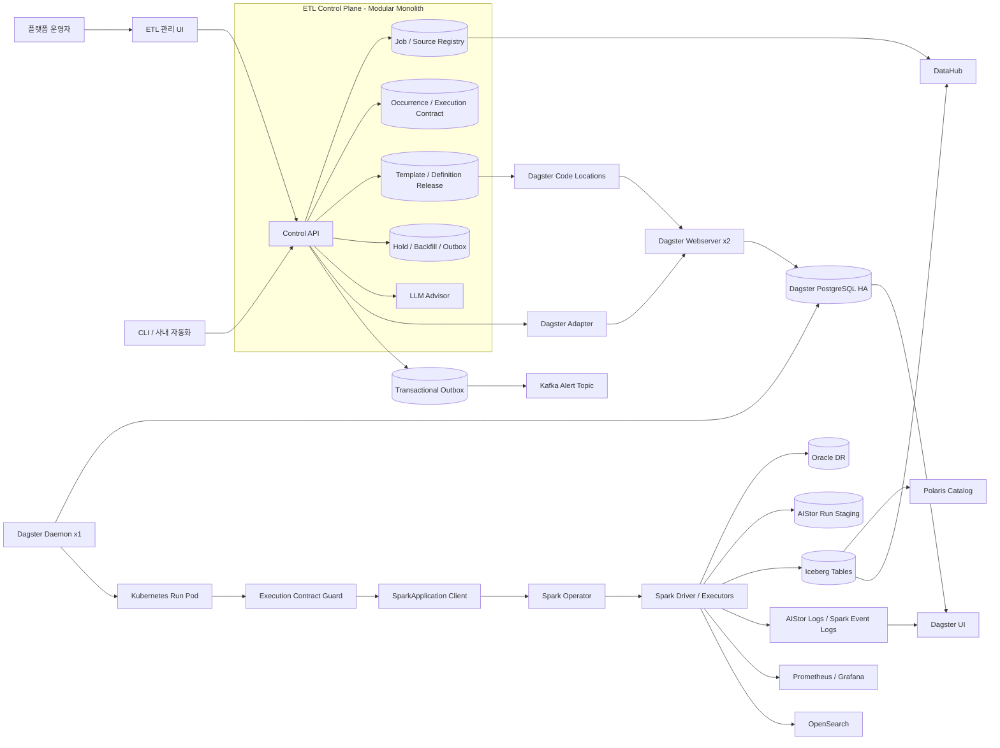
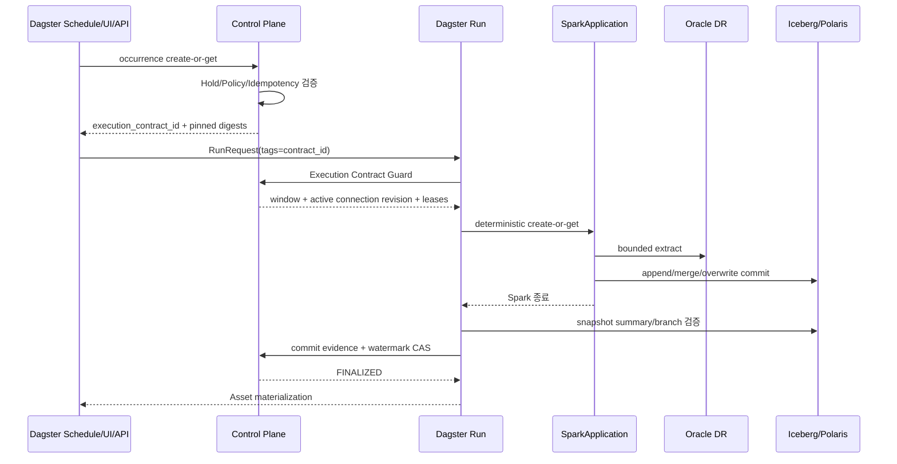

# 신규 ETL Platform 목표 아키텍처 v1

- 문서 상태: PoC 승인 후보안
- 작성일: 2026-08-22
- 기준 규모: Job 약 10,000개, Run 약 40,000건/일, 정시 Burst 약 500건
- 핵심 적재: Oracle → Spark → Iceberg/Polaris

## 1. 결론

신규 플랫폼은 **Dagster OSS-first + 얇은 ETL Control Plane** 구조를 권고한다.

- Dagster는 Asset 정의, 스케줄 평가, Run Queue, 재실행, 실행 이력과 운영 UI를 담당한다.
- 별도 Control Plane은 Dagster가 알 수 없는 Source/TNS, Job 등록 Wizard, Source 보호, 전역 실행 멱등성, Hold, Template Release만 담당한다.
- Spark Operator, Iceberg, Polaris, AIStor, DataHub, Prometheus/Grafana, OpenSearch, Kafka는 유지한다.
- `1 Job/1 Target Table = 1 Dagster Asset`으로 표현하되, **Job마다 Python 파일을 만들지 않는다.** JobSpec과 공용 Asset Factory/Component가 10,000개의 Asset 정의를 생성한다.
- Airbyte는 핵심 오케스트레이터로 도입하지 않는다. 향후 표준 Connector가 필요한 일부 Source에만 선택적으로 검토한다.

이 구조는 Airflow와 HAflow의 역할을 그대로 이름만 바꾸는 것이 아니다. 특히 다음 기능은 새로 만들지 않는다.

- 자체 Run Queue와 자체 실행 상태 머신
- 자체 Task retry 엔진
- Job별 DAG/Python 파일
- 범용 DAG 편집기
- 자체 로그/라인리지/인프라 모니터링 화면

다만 Source 보호와 Hold, 모든 실행 채널에 걸친 멱등성은 Dagster 단독으로 충족되지 않으므로 Control Plane이 필요하다. 따라서 “아무 UI도 개발하지 않는 순수 Dagster”는 현재 요구사항과 맞지 않는다.

## 2. 핵심 설계 원칙

1. **의도·실행·데이터 Commit의 권위 저장소를 분리한다.**
2. **LLM 추천보다 Source 보호 정책이 항상 우선한다.**
3. **Retry 전에 Iceberg commit 여부를 먼저 확인한다.**
4. **모든 실행은 불변 JobSpec·Template·Image digest를 고정한다.**
5. **정상 스케줄링은 Dagster가 담당하고, Control Plane은 매분 due Job을 계산하지 않는다.**
6. **Hold 해제 시 누락된 모든 cron을 재생하지 않고, 데이터 의미에 맞게 coalesce한다.**
7. **원천 DB를 다시 읽지 않고 Target 단계만 재시도할 수 있는 경로를 제공한다.**
8. **안전하지 않은 자동화보다 명시적 `RECONCILIATION_REQUIRED` 상태를 허용한다.**

## 3. 논리 아키텍처



## 4. 시스템별 책임과 권위

| 대상 | 소유하는 사실 | 소유하지 않는 것 |
|---|---|---|
| Job/Source Registry | 사용자가 승인한 Source, JobSpec, 정책과 Release | 실행 중 상태 |
| Occurrence/Execution Contract | 논리 실행 시점·범위, 불변 버전, commit 증거, watermark CAS | Dagster의 queued/running/failure 이력 |
| Dagster PostgreSQL | Schedule/Sensor tick, Run Queue, Run/Step/Retry/Event 이력 | Iceberg commit 진실, Source 정책 원본 |
| SparkApplication CR | Spark 계산의 현재 상태 | 데이터 commit 성공 판정 |
| Iceberg Snapshot | 데이터가 실제로 commit되었다는 최종 증거 | Job 설정과 Run Queue |
| Polaris | Iceberg REST Catalog와 접근 제어 | 오케스트레이션 상태 |
| DataHub | Discovery, ownership, table/column lineage | 실시간 Run 상태의 권위 원본 |
| Prometheus/Grafana | SLO와 시계열 지표/Alert | Job 상세 로그 |
| OpenSearch | 검색 가능한 상세 로그 | Job 설정 원본 |
| Kafka Outbox | 사내 메신저로 전달할 정규화 이벤트 | Run 상태 저장소 |

이 경계가 무너지면 새 Control Plane이 HAflow 2.0으로 커진다. 특히 Control DB에 Dagster의 `QUEUED/RUNNING/FAILURE`를 별도 상태 머신으로 복제하지 않는다. 화면에 필요한 통합 상태는 Dagster에서 재생성 가능한 read model로만 유지한다.

## 5. Kubernetes 배포 기준안

### 5.1 Dagster

- Webserver: 2 replicas
- Daemon: 1 replica, Kubernetes가 자동 재시작
- Dagster PostgreSQL: HA 구성, PITR/backup 포함
- Code Location: Source domain 또는 업무 domain 기준으로 shard
- Run Launcher: `K8sRunLauncher`
- Run executor: Run Pod 안에서는 우선 in-process
- Run Pod가 `SparkApplication` CR을 생성·감시·취소·재접속

Dagster OSS는 Webserver 다중 replica는 지원하지만 Daemon active-active와 동일 Code Location의 다중 replica는 지원하지 않는다. 따라서 목표는 무중단이 아니라 **30분 이내 자동 복구**, 내부 운영 목표는 5분으로 둔다. 이 제약은 공식 OSS 배포 구조와 일치한다. [Dagster OSS deployment architecture](https://docs.dagster.io/deployment/oss/oss-deployment-architecture)

### 5.2 Code Location shard

초기값을 고정하지 않고 PoC 결과로 정한다. 시작 후보는 8~16개이며 다음 기준을 동시에 만족해야 한다.

- 10,000 Asset cold load 시간
- 단일 Job publish 후 해당 shard reload 시간
- Code Location 장애 blast radius
- Webserver와 Daemon의 metadata 조회 부하
- 운영자가 이해할 수 있는 Source/domain 경계

Job 1건 변경마다 전체 10,000개를 다시 읽는 구조는 피한다. 변경된 shard의 불변 Definition Bundle만 새로 생성·검증·승격한다.

### 5.3 객체와 이력 보관

하루 40,000 Run이면 연간 약 1,460만 Run이다. Run Pod와 SparkApplication까지 합치면 Kubernetes object churn도 크다.

- 완료된 Run Pod와 SparkApplication에 TTL/GC 적용
- Dagster PostgreSQL의 Run/Event 용량, index, vacuum, backup/restore를 7일 soak test로 측정
- 온라인 상세 이력, 장기 요약 이력, AIStor 로그 보관 기간을 분리
- Iceberg ambiguous commit 조사 기간보다 Snapshot/metadata 보관 기간을 길게 설정
- Dagster 버전별 지원 범위를 확인한 뒤 Run/Event archive 또는 purge 절차를 운영 Runbook으로 고정

## 6. Control Plane 구조

초기에는 Microservice가 아니라 **Java 기반 Modular Monolith + PostgreSQL**을 권고한다. 현재 중앙 플랫폼팀만 Job을 관리하므로 서비스 분산의 이점보다 트랜잭션 일관성과 운영 단순성이 더 크다.

### 6.1 핵심 Aggregate

- `SourceSystem`
  - `ConnectionRevision`
  - `SecretRef`
  - `SourceSafetyEnvelopeVersion`
  - `MetadataSnapshot`
- `Job`
  - 변경 가능한 `JobDraft`
  - 불변 `JobSpecVersion`
- `Template`
  - 불변 `TemplateVersion`
- `DefinitionRelease`
  - `Bundle`, `Manifest`, 검증 결과
- `ExecutionOccurrence`
- `ExecutionContract`
  - Dagster Run binding
  - Commit evidence
  - Watermark state
- `BackfillPlan` / `BackfillItem`
- `MaintenanceHold`
- `AdvisorAnalysis`
- `NotificationOutbox`
- 공통 `AuditEvent`, `IdempotencyRecord`

### 6.2 버전 상태

`ConnectionRevision`:

```text
CANDIDATE → VERIFIED → ACTIVE → SUPERSEDED 또는 REVOKED
```

`DefinitionRelease`:

```text
DRAFT → COMPILED → VALIDATED → DEPLOYED → VERIFIED → ACTIVE
                                                ↘ FAILED
```

`ExecutionContract`는 계산 상태가 아니라 데이터 계약 상태만 가진다.

```text
PLANNED → WINDOW_RESERVED → DAGSTER_BOUND → COMMIT_OBSERVED → FINALIZED
                    ↘ ABORTED_NO_COMMIT
                    ↘ RECONCILIATION_REQUIRED
```

## 7. Job 생성 UX

### 7.1 Source System 관리

필수 화면과 기능:

- Source 이름, 소유 부서, 중요도, Primary/DR 구분
- Oracle service 정보와 기본 Schema
- Secret 저장소의 Credential reference
- TNS 연결 방식
  - Easy Connect
  - `tnsnames.ora` Alias
  - Raw Connect Descriptor
- Wallet/인증서는 일반 설정이 아니라 Secret으로 분리
- 실제 Spark 실행 namespace/network path에서 연결 테스트
- metadata 조회 권한 테스트
- Flashback SCN, Data Guard lag, hard delete, `update_dt` 신뢰성 등 capability 등록
- Source 보호 정책과 변경 이력

Job은 TNS revision을 직접 참조하지 않고 `source_system_id`만 참조한다. 실행 계약 생성 시점에 ACTIVE revision을 실제 descriptor hash로 해석해 고정한다. 그래서 TNS를 승격해도 10,000 Job을 다시 publish할 필요가 없다.

Raw Descriptor는 허용 host/port/protocol을 검증하고 `IFILE`, 외부 경로, 허용되지 않은 protocol을 차단한다.

### 7.2 Job Wizard

운영자가 한 화면 흐름에서 다음을 완료한다.

1. Source System 선택
2. Schema/Table 탐색과 컬럼·PK·Index·통계 확인
3. LLM/Rule Advisor 추천 확인
4. Full / Append / Merge 선택
5. Watermark 컬럼과 window 의미 선택
6. Source → Target 컬럼 mapping
7. 표준화/단순 가공식/업무 WHERE 입력
8. `dt/wt/mt/yt` 파생 partition 선택
9. Target namespace/schema/table 확인
10. 1/2/4/6/12/24시간 또는 cron 설정
11. Spark profile과 Source read profile 확인
12. Preview SQL, 실행계획 점검, 검증 후 publish

컬럼은 기본적으로 1:1 자동 생성하고 등록자가 이름·타입·표준화·가공식을 직접 수정한다. 복잡한 사용자 코드는 일반 JobSpec에 문자열로 넣지 않고 별도 고급 Template로 승격한다.

### 7.3 JobSpec 예시

```yaml
job_id: oracle_eqp_event_001
source_system_id: EQP_DR_A
source:
  schema: MES
  table: EQP_EVENT
  consistency_mode: FLASHBACK_SCN
load:
  mode: MERGE
  primary_key: [EVENT_ID]
  watermark:
    columns: [INSERT_DT, UPDATE_DT]
    predicate_strategy: UNION_DEDUP
    overlap: PT5M
  delete_semantics: NO_HARD_DELETE_CONFIRMED
target:
  catalog: polaris
  namespace: raw_mes
  table: eqp_event
  partition_transform: day(event_dt)
schedule:
  cron: "0 * * * *"
  timezone: Asia/Seoul
template:
  channel: approved
read_profile:
  num_partitions: 1
  query_timeout_seconds: 1800
  extract_once: true
```

실제 publish 결과에는 alias 대신 `job_spec_digest`, `template_digest`, `definition_bundle_digest`, `Spark image digest`, compiler version이 들어간다.

## 8. Template와 Definition 배포

### 8.1 소스 파일 생성 방식

- Job마다 Python/DAG 파일 생성: 금지
- 상위 10개 유형: 공용 Component/Asset Factory로 구현
- 나머지 유형: 검토 후 재사용 가능한 TemplateVersion으로 추가
- Job Registry의 불변 JobSpec을 compile하여 Asset 정의를 생성

Dagster는 설정에서 여러 Asset을 생성하는 Asset Factory 패턴을 공식 지원한다. [Creating asset factories](https://docs.dagster.io/guides/build/assets/creating-asset-factories)

외부 Registry 상태를 실행 시마다 live 조회하지 않는다. publish 시 검증된 **Definition Bundle**로 freeze하고 Code Location은 그 Bundle만 읽는다. Dagster의 state-backed component를 사용할 경우에도 OSS reload가 최신 state를 읽는 특성을 고려해, 별도 Manifest digest 검증으로 의도치 않은 최신 버전 유입을 막는다. [State-backed components](https://docs.dagster.io/guides/build/components/state-backed-components)

### 8.2 공용 Template 일괄 변경

기존처럼 Template 하나의 변경을 다수 Job에 반영할 수 있다. 단 즉시 전역 반영 대신 다음 Release 절차를 적용한다.

1. 새 `TemplateVersion` 생성
2. 영향 Job 목록과 변경된 compiled plan 산출
3. Unit/contract test
4. 대표 Job canary
5. Definition Bundle 생성
6. 특정 shard 배포와 load 검증
7. approved channel 승격
8. 이상 시 이전 Bundle로 rollback

Rollback은 **미래 Run의 코드 버전만** 되돌린다. 이미 Iceberg에 commit된 잘못된 데이터는 snapshot rollback, repair backfill 등 별도 데이터 복구 절차가 필요하다.

`latest` image tag는 사용하지 않는다. Queue 대기, Retry, Backfill에서도 이전 image digest를 실행할 수 있도록 Artifact 보관 기간을 데이터 재처리 기간보다 길게 둔다.

## 9. 스케줄과 전역 멱등성

### 9.1 정상 경로

정상 스케줄링의 권위는 Dagster이다.

- Definition Bundle이 동일 `(cron, timezone, shard)` Job을 묶은 `ScheduleDefinition`을 생성한다.
- Schedule tick은 대상 Asset별 `RunRequest`를 만든다.
- Job별 10,000 Schedule을 만들지 않으면서 각 Job은 독립 Run을 유지한다.
- Schedule 평가 시 Hold와 publish 상태를 확인하고 `ExecutionOccurrence`를 create-or-get한다.
- Dagster의 `run_key`는 추적과 동일 sensor/schedule 범위의 중복 억제에 사용하되 전역 멱등성의 권위로 사용하지 않는다.

Dagster 공식 API도 sensor의 `run_key`는 해당 sensor 평가 전체, schedule의 `run_key`는 해당 tick/복구 범위에서 중복 Run 생성을 막는다고 설명한다. [Dagster schedules and sensors API](https://docs.dagster.io/api/dagster/schedules-sensors)

### 9.2 ExecutionOccurrence unique key

전역 중복 방지는 Control PostgreSQL unique constraint가 담당한다.

```text
NORMAL:
  job_id + schedule_revision_id + logical_scheduled_time + job_spec_digest

BACKFILL:
  backfill_plan_id + job_id + logical_window

MANUAL:
  idempotency_key
```

- UI에서 같은 시간의 `NORMAL` 실행을 눌러도 이미 schedule occurrence가 있으면 같은 계약을 반환한다.
- Retry는 새 계약을 만들지 않고 같은 `execution_contract_id`와 고정된 버전을 사용한다.
- Replay는 의도적으로 새 계약을 만들며 `parent_contract_id`, 사유, 승인자를 요구한다.
- 모든 write는 추가로 `target_table` lease를 획득하므로 서로 다른 채널의 중복/충돌을 차단한다.

### 9.3 장애 복구

Daemon 30분 장애는 최소 1시간 주기보다 짧으므로 1차안은 Dagster의 missing schedule time 복구를 사용한다. Dagster scheduler는 실행되지 않은 schedule 시간을 주기적으로 확인해 Run을 제출한다.

그러나 다음 안전망을 둔다.

- Dagster catch-up 관련 설정을 30분 RTO와 실제 cron에 맞게 명시적으로 설정
- 복구 시 `expected cron time`과 `ExecutionOccurrence`를 비교하는 bounded Reconciler 실행
- Reconciler는 평상시 매분 due Job을 계산하지 않으며, daemon/code-location 복구 또는 운영자 요청 때 제한된 시간 범위만 검사
- 누락 occurrence가 있으면 동일 unique key로 복원하고 Dagster Adapter를 통해 제출
- PoC에서 한 건이라도 missing/duplicate가 나오면 precomputed occurrence + cursor sensor 방식으로 승격

이 절충으로 일반 스케줄러를 다시 만들지 않으면서도 장애 복구 증거를 남긴다.

## 10. 실행 흐름



### 10.1 SparkApplication adapter

Dagster Pipes의 일반 Kubernetes Pod 실행 기능만으로 `SparkApplication` CR의 create/watch/reconnect 의미가 자동 해결되지는 않는다. 얇은 전용 client를 둔다.

- 이름: contract ID 기반 deterministic name
- `create-or-get`: API timeout 후 중복 SparkApplication 생성 방지
- watch reconnect: resourceVersion 만료와 API disconnect 처리
- cancel: Dagster cancel과 SparkApplication delete/terminate 연결
- owner/reference와 label: Job, contract, Dagster run, template digest
- Spark Operator restart policy: 기본 `Never`; Application-level retry는 Dagster/Control 정책이 결정

### 10.2 Execution Contract Guard

Custom UI뿐 아니라 Dagster UI에서도 수동 실행·Retry·Backfill이 가능해야 하므로 **모든 Asset의 Spark submit 직전** Guard를 강제한다.

- 유효 contract tag 확인
- 없으면 허용된 Manual 계약을 생성하거나 Critical Job은 거부
- Hold 재확인
- JobSpec/Template/Image digest 확인
- Source weighted lease와 target-table lease 확인
- Launchpad에서 입력한 critical config는 무시하고 Contract의 고정 값을 사용

그래서 GraphQL이나 Dagster UI를 직접 사용해도 Source 보호와 Hold를 우회할 수 없다.

## 11. Oracle 읽기와 Source 보호

### 11.1 정책 계층

우선순위는 다음과 같다.

```text
Platform hard limit
  > DBA/플랫폼이 승인한 SourceSafetyEnvelope
    > JobReadProfile override
      > LLM recommendation
```

LLM은 Source 전체의 동시 세션/CPU 한도를 변경하지 못한다. LLM이 추천하는 것은 그 절대 상한 안의 Job별 read profile뿐이다.

`SourceSafetyEnvelope` 예:

- 최대 동시 ETL Job
- 최대 총 JDBC connection weight
- Job당 최대 `numPartitions`
- query timeout, fetch size
- 허용 실행 시간대
- catch-up chunk 크기, cooldown
- DR apply/transport lag threshold
- circuit breaker와 자동 Source Hold 조건
- Primary 자동 fallback 금지

Spark의 `numPartitions`는 최대 동시 JDBC connection 수도 결정하므로 Source quota의 핵심 변수이다. [Spark JDBC options](https://spark.apache.org/docs/latest/sql-data-sources-jdbc.html)

### 11.2 Connection 예산

PoC/MVP의 Critical Source 기본값은 `numPartitions=1`이다. 이 경우 Dagster concurrency pool의 1 slot과 실제 JDBC connection 1개가 거의 동일해진다.

병렬 읽기가 필요한 Job은 다음 중 하나를 선택한다.

- Source별 고정 profile로 모든 Job이 같은 connection weight를 사용
- Control DB의 atomic weighted lease가 `numPartitions`만큼 token을 획득

가중 lease에는 fencing token, heartbeat, 만료, 비정상 종료 회수, 감사 이력이 필요하다. Dagster concurrency pool도 보조 gate로 사용하되, 취소/실패 시 slot이 기본적으로 남을 수 있으므로 `free_slots_after_run_end_seconds`를 설정하고 장애 테스트한다. [Dagster concurrency pools](https://docs.dagster.io/guides/operate/managing-concurrency/concurrency-pools)

### 11.3 DR lag 신호

Source capability를 세 가지로 분리한다.

1. `V$DATAGUARD_STATS` 등 DB 내부 lag 조회 가능
2. 외부 Data Guard monitoring API/metric 사용 가능
3. 신호 없음

신호가 없으면 최신성을 추정하지 않는다. Source DB의 기준 시각, DBA가 정한 safety lag, overlap window를 사용하고 freshness 상태를 `DEGRADED_CONFIDENCE`로 표시한다. Primary로 자동 fallback하지 않는다.

### 11.4 읽기 일관성

여러 JDBC partition query는 동일 시점의 데이터를 읽는다는 보장이 없다.

- 가능하면 실행 시작 시 공통 SCN을 획득하고 모든 partition query에 동일 `AS OF SCN` 적용
- Flashback 권한/UNDO 보존/DR 지원 여부는 Source capability와 DBA 검증으로 확인
- 불가능한 Critical Source는 `numPartitions=1`
- 병렬도가 꼭 필요하면 bounded window + overlap + PK dedup + 정기 reconciliation

Oracle은 Flashback Query의 `AS OF`와 시간보다 정확한 SCN 사용을 공식 제공한다. [Oracle Flashback Query](https://docs.oracle.com/en/database/oracle/oracle-database/19/adfns/flashback.html)

### 11.5 extract-once

Critical 또는 대형 Source는 선택적으로 다음 경로를 사용한다.

```text
Oracle → run-scoped AIStor staging → validation/transform → Iceberg commit
```

- staging manifest에 contract ID, window, SCN, schema hash, file checksum 기록
- Target/Polaris/Iceberg 단계 실패 시 Oracle을 다시 읽지 않고 staging 재사용
- staging TTL은 retry/reconcile SLA보다 길게 설정
- 소형 Master Full load는 direct 경로 허용

S3 I/O와 저장량이 늘지만 생산 장비 DB의 재조회 위험을 줄이는 편이 우선이다.

## 12. 적재 방식별 의미

### 12.1 Full — 약 60%

- `INSERT OVERWRITE` 또는 Iceberg replace semantics
- Hold 중 놓친 여러 회차는 모두 버리고 최신 1회로 coalesce
- commit 후 새 snapshot ID, row/file 통계, Job/contract metadata 확인
- Target table lease로 compaction/StarRocks/schema 변경과 충돌 차단
- Source가 매우 큰 경우에도 “historical backfill”로 과거 상태를 재현할 수는 없다. Flashback/Archive가 있을 때만 가능

### 12.2 Append — 전체의 약 20%

전제:

- 단조 증가하고 변경되지 않는 watermark
- 안정적인 PK/unique key
- hard delete 없음 또는 별도 처리

기본 흐름:

1. `[low, high)` window 예약
2. fixed window extract
3. PK 중복 검사
4. append commit에 contract/run key metadata 기록
5. snapshot 검증
6. watermark compare-and-set

Append Replay/Backfill은 무조건 단순 `INSERT INTO`하지 않는다. 다음 중 정책을 선택한다.

- PK 기반 `MERGE repair`
- 영향 partition replace
- Run-specific branch에 write 후 검증·publish

### 12.3 Merge — 전체의 약 20%

- `INSERT_DT OR UPDATE_DT` 유형은 Merge가 기본
- Source 결과를 PK별 최신 `UPDATE_DT`와 tie-breaker로 deterministic dedup
- 같은 Target row에 Source 여러 row가 match하지 않도록 사전 검사
- fixed window와 stable PK로 retry를 결정론적으로 수행
- hard delete는 자동 처리되지 않으므로 `soft delete`, delete log, 정기 full reconciliation, 미래 CDC 중 하나를 명시

`INSERT_DT OR UPDATE_DT`가 Oracle index를 비효율적으로 사용할 수 있으므로 두 전략을 실행계획과 실제 부하로 비교한다.

```sql
-- A. 단일 OR predicate
WHERE INSERT_DT >= :low AND INSERT_DT < :high
   OR UPDATE_DT >= :low AND UPDATE_DT < :high

-- B. 두 bounded query를 UNION ALL 후 PK dedup
```

Iceberg `MERGE INTO`는 Source의 여러 row가 동일 Target row를 갱신하는 입력을 허용하지 않으므로 dedup이 필수다. [Iceberg Spark writes](https://iceberg.apache.org/docs/latest/spark-writes/)

### 12.4 파티션

`dt/wt/mt/yt`는 원천 컬럼을 그대로 복사하는 단순 컬럼이 아니라 JobSpec의 표준 derived column으로 관리한다.

- 데이터량과 주 사용 query를 기준으로 day/week/month/year 추천
- 사용자가 최종 승인
- 향후 Iceberg partition evolution을 고려해 사용자 노출 컬럼과 physical transform의 역할을 구분
- partition 변경은 일반 Job edit가 아니라 schema/release change로 취급

## 13. Commit 증명, Retry, Reconciliation

### 13.1 성공의 정의

SparkApplication의 `COMPLETED`만으로 성공 처리하지 않는다.

```text
Window 예약
→ Spark 실행
→ Iceberg Snapshot 확인
→ snapshot summary의 contract metadata 확인
→ Data Quality Check
→ watermark CAS
→ Dagster Asset materialization
```

Snapshot summary에 최소 다음을 기록한다.

- `etl.job_id`
- `etl.execution_contract_id`
- `etl.logical_window_low/high`
- `etl.job_spec_digest`
- `etl.template_digest`
- `etl.dagster_run_id`
- `etl.spark_application_id`

DataFrameWriterV2는 `snapshot-property.*`를 지원하고, SQL `MERGE` 등은 Iceberg `CommitMetadata` helper로 custom summary를 기록할 수 있다. 실제 사용 Spark/Iceberg 버전 조합에서 반드시 검증한다. [Iceberg Spark configuration](https://iceberg.apache.org/docs/latest/spark-configuration/)

### 13.2 Ambiguous commit

예: Iceberg commit은 성공했지만 Spark Driver가 응답 전에 종료된 경우.

- 무조건 재시도하지 않는다.
- contract ID가 들어간 snapshot/branch를 검색한다.
- 정확히 한 commit을 찾고 DQ가 통과하면 `COMMIT_OBSERVED → FINALIZED`
- commit이 없으면 `ABORTED_NO_COMMIT` 후 retry 가능
- 복수 commit, 증거 만료, 상충 결과면 `RECONCILIATION_REQUIRED`

중요 테이블은 run-specific Iceberg branch/WAP를 사용하고 검증 후 main으로 publish하는 방식을 PoC에서 비교한다.

### 13.3 Writer 직렬화

`target_table` 단위 lease에 다음 writer를 모두 포함한다.

- Spark Full/Append/Merge
- StarRocks → Iceberg write
- Compaction/data file rewrite
- Manifest rewrite
- Schema/partition change

StarRocks 경로가 동일 contract ID를 commit evidence로 남기고 동일 lease를 사용할 수 없으면 v1 신규 경로에서 제외하고 기존 플랫폼에 남긴다.

### 13.4 Watermark

- Window는 반개구간 `[low, high)`
- 같은 Job의 NORMAL execution은 한 번에 하나만 window 예약
- chunk별 snapshot 검증 후 watermark CAS
- Catch-up이 논리적으로 한 건이어도 물리적으로 여러 chunk일 수 있음
- 중간 chunk 실패 시 성공한 마지막 watermark부터 재개
- REPLAY/BACKFILL은 기본적으로 production watermark를 이동하지 않음

## 14. Hold, Backfill, 수동 운영

### 14.1 Maintenance Hold

Scope:

- Global
- Source System
- Domain/Code Location
- Job 목록

Mode:

- `HOLD_NEW`: 신규 Spark submit 차단
- `DRAIN`: 신규 실행 차단 후 active work 완료 대기 — 기본값
- `FORCE_STOP`: 명시적 승인 후 active Run 중지

Hold는 schedule 평가, Control API, Spark submit 직전 Guard의 세 지점에서 검사한다. 해제는 명시적 사용자 동작이며 자동 timer 해제를 기본으로 하지 않는다.

### 14.2 Hold 해제

- Full: 놓친 회차를 모두 버리고 최신 1회
- Incremental: 마지막 production watermark부터 Hold 종료 시점의 safe high watermark까지 논리적 1회 catch-up
- 대용량 Incremental: Source 정책에 따라 내부적으로 순차 chunk + cooldown
- DR lag 신호가 없으면 보수적 safety lag를 적용
- Hold 중 schedule tick은 Source를 읽지 않으며, 해제 때 500개가 한꺼번에 Source gate를 뚫지 못함

### 14.3 수동 실행 의미

| Mode | 의미 | 버전/Window | Watermark |
|---|---|---|---|
| `NORMAL` | 예정 실행과 동일 | 현재 승인 버전, 계산된 window | 성공 시 이동 |
| `RETRY` | 동일 실패 계약 재시도 | 기존 digest/window 고정 | 기존 계약 규칙 |
| `REPLAY` | 같은 범위를 의도적으로 재처리 | 명시 범위, parent 계약 기록 | 기본 미이동 |
| `BACKFILL` | 과거 범위 복구 계획 | plan/item별 고정 | 기본 미이동 |
| `RERUN_LATEST` | Full 등의 최신 상태 재적재 | 새 계약 | 모드별 |

Custom UI와 Dagster UI 양쪽에서 제공하되, 실제 실행 규칙은 공통 Control API와 Guard를 통과한다.

### 14.4 Backfill

- 단일 Job과 다중 Job 모두 지원
- `BackfillPlan`이 Job × time window를 `BackfillItem`으로 분해
- SourceSafetyEnvelope와 target lease를 공유
- 실행 전 예상 Source query 수, JDBC connection weight, Spark resource, 대상 partition을 Preview
- 승인/일시정지/재개/취소 지원
- Full table의 과거 시점 backfill은 Source Flashback/Archive가 없으면 지원 불가로 표시

## 15. LLM 기반 Job Advisor

### 15.1 목표

Job Wizard를 자동 입력하되 운영자가 검토·수정·publish한다.

추천 대상:

- Full / Append / Merge
- Watermark 후보와 `INSERT_DT + UPDATE_DT` 전략
- PK/unique key 후보
- `dt/wt/mt/yt`
- Template
- Spark/read profile
- Source protection 범위 안의 JobReadProfile
- 단순 컬럼 표준화와 mapping
- 확인이 필요한 위험 항목

### 15.2 입력 데이터

낮은 부하의 metadata만 기본 사용한다.

- Oracle dictionary의 row estimate, size, last analyzed, columns, index/PK
- DataHub description/ownership/domain
- 기존 유사 Job의 실제 처리량, 수행시간, 실패·Source 부하 결과
- 운영자가 입력한 table 성격과 delete/update 의미

큰 테이블에 `COUNT(*)`를 실행하거나 통계 수집을 자동 수행하지 않는다. 실제 row sample은 기본적으로 LLM에 보내지 않는다.

### 15.3 안전 구조

```text
Deterministic safety rules
→ LLM structured recommendation
→ 정책 validator
→ 운영자 확인/수정
→ publish
```

- JSON Schema output 강제
- confidence와 근거 metadata ID 제공
- model/prompt/rule/metadata 버전 저장
- 추천값과 운영자 수정값을 모두 audit
- column/table comment는 prompt injection 가능 입력으로 분리·표시
- LLM 장애 시 수동 Wizard는 정상 동작
- LLM은 SQL을 실행하거나 Job을 자동 publish하지 않음
- “Master/Event”, hard delete, `UPDATE_DT` 신뢰성은 컬럼명만으로 확정하지 않음

### 15.4 모델 도입 순서

초기부터 여러 모델 router를 만들지 않는다.

1. Rule engine + 사내 허용 모델 1개로 Shadow 평가
2. 안전하지 않은 추천률과 운영자 수정률 측정
3. 통과 후 UI auto-prefill
4. 이후 모호·고위험·Critical Source만 `gpt-5.6-sol` 같은 상위 reviewer로 escalation

기존 10,000 Job은 그대로 정답으로 학습하지 않는다. 장애, 데이터 품질, Source 부하 결과가 양호한 Job만 Golden Set으로 선별한다.

Advisor는 실행 경로의 필수 구성요소가 아니며 MVP 안정화 후 도입한다.

## 16. Observability, Lineage, Alert

### 16.1 화면 역할

- Custom UI: Source, Job Wizard/CRUD, Template/Release, Hold, Backfill plan, Advisor
- Dagster UI: Asset/Run/Retry/Step log, execution history
- DataHub: table/column lineage, ownership, discovery
- Grafana: 플랫폼/Source/Spark SLO
- OpenSearch: 상세 로그 검색
- Spark History Server: executor/stage 분석

### 16.2 로그

- Run Pod와 Spark Driver/Executor log를 AIStor에 영속화
- Spark event log를 AIStor에 저장
- Dagster 화면에서 contract ID, SparkApplication, Spark History, OpenSearch query로 연결
- Prometheus label에 `run_id` 같은 고 cardinality 값은 넣지 않음

### 16.3 Lineage

- DataHub Iceberg source: table schema/ownership
- Spark lineage agent: 실제 table/column lineage
- Dagster integration/sensor: orchestration Job/Run 관계
- 동일 Spark 실행에서 OpenLineage event를 두 번 보내지 않도록 producer를 하나로 지정

### 16.4 Kafka 알림

Control DB transaction과 함께 `NotificationOutbox`에 기록하고 별도 publisher가 Kafka로 전송한다.

Event 예:

- Job failed/recovered
- delay/freshness breach
- Source circuit breaker
- Hold created/released/drained
- ambiguous commit/reconciliation required
- Definition release failed/rolled back

At-least-once 전송을 전제로 `event_id` dedup, outage 중 집계, 동일 Source 폭주 억제와 rate limit을 적용한다.

## 17. Control API

외부 API는 Dagster GraphQL을 직접 노출하지 않는다. Control API의 stable endpoint 뒤에 version-pinned Dagster Adapter를 둔다. Dagster는 GraphQL API가 evolving이며 breaking change 가능하다고 명시한다. [Dagster GraphQL API](https://docs.dagster.io/api/graphql)

대표 API:

```text
POST   /v1/sources
POST   /v1/sources/{id}/connection-revisions
POST   /v1/sources/{id}/verify
GET    /v1/sources/{id}/schemas/{schema}/tables

POST   /v1/jobs/drafts
POST   /v1/jobs/{id}/advisor-analyses
POST   /v1/jobs/{id}/validate
POST   /v1/jobs/{id}/publish
GET    /v1/jobs/{id}/releases

POST   /v1/jobs/{id}/runs
POST   /v1/runs/{id}/retry
POST   /v1/backfill-plans
POST   /v1/backfill-plans/{id}/start

POST   /v1/holds
POST   /v1/holds/{id}/release
GET    /v1/operations/{operation_id}
```

Mutation은 `Idempotency-Key`를 받고 오래 걸리는 작업은 `202 Accepted + operation_id`를 반환한다. Adapter에는 Dagster 고정 버전별 contract test와 업그레이드 사전 검증이 필요하다.

## 18. Iceberg Maintenance

Compaction을 단순 부속 스크립트가 아니라 first-class Asset/Job으로 관리한다.

- data file compaction
- manifest rewrite
- snapshot expiration
- orphan file cleanup
- metadata cleanup

Maintenance Job은 ingestion과 별도 concurrency를 쓰지만 동일 target-table lease를 획득한다. ingestion watermark와 freshness는 이동시키지 않는다. Snapshot expiration은 ambiguous commit reconciliation SLA보다 길어야 한다. [Iceberg maintenance](https://iceberg.apache.org/docs/latest/maintenance/)

## 19. PoC 범위와 합격 기준

### 19.1 실제 Job matrix

대표 실 Job 24개를 선정한다. 각 유형 4개씩이다.

1. Full-small master
2. Full-large 상위 10%급
3. Append-small
4. Append-large event
5. Merge-small
6. Merge-large `INSERT_DT OR UPDATE_DT`

전체 matrix에 1/2/4/6/12/24시간 주기, dt/mt/yt, 컬럼 가공, business WHERE, schema change를 골고루 포함한다.

### 19.2 Scale test

생산 장비 DB에 500개 Burst를 직접 쏘지 않고 synthetic/stub Source로 플랫폼 한계를 분리 측정한다.

- 10,000 Asset definition load/reload
- 500 동시 occurrence와 Run queue
- 40,000 Run/day, 7일 soak
- 선택 stress: 60,000/day, 750 Burst
- PostgreSQL 크기/vacuum/query p95
- Kubernetes API/etcd object churn
- Dagster UI 목록/검색 p95

### 19.3 Fault injection

- Daemon 강제 종료와 30분 내 복구
- Code Location 종료/reload 실패
- Dagster PostgreSQL failover
- Run Pod 종료 후 SparkApplication 재접속
- Spark Driver/Executor 실패
- Iceberg commit 직후 Driver 종료
- Oracle DR outage — Primary fallback이 없어야 함
- TNS/RAC endpoint 전환
- Polaris/AIStor 일시 장애
- Kafka outage와 Outbox 재전송
- 잘못된 Template canary와 Bundle rollback
- Hold DRAIN/FORCE_STOP/release catch-up
- 동일 Job에 schedule/manual/backfill 동시 요청
- Source weighted lease 만료/회수

### 19.4 잠정 SLO

| 항목 | PoC 잠정 기준 |
|---|---|
| 데이터 정합성 | 설명되지 않은 row/hash 차이 0 |
| 정상 Run 중복/누락 | 7일 40,000/day에서 0 |
| PK 중복 | 0 |
| Watermark gap/regression | 0 |
| Snapshot contract metadata | 대상 commit 100% |
| Daemon/Code Location 복구 | 30분 이내, 내부 목표 5분 |
| Definition cold load | 10분 이내 |
| publish 가시화 | p95 3분, p99 5분 |
| 500 occurrence 저장 | 2분 이내 |
| 500 Run queue 등록 | 5분 이내 |
| 허용된 Run queue→launch | p95 2분, p99 5분 |
| Kafka 실패 알림 | p95 1분 |
| Job 목록 API | p95 2초 |
| 표준 Job 신규 등록 | 운영자 median 10분 이내 |
| Source 절대 한도 | 단 한 번도 초과 금지 |

Source CPU/Read IO 비교 기준은 DBA와 함께 기존 Airflow baseline을 측정한 뒤 확정한다. 예시 `CPU +5%p`, `Read IO +10%`는 사전 가설이지 합격 기준 확정값이 아니다.

### 19.5 즉시 No-Go

다음 중 하나라도 재현되면 채택을 중단하고 원인을 해결한 뒤 다시 평가한다.

- 설명할 수 없는 데이터 차이
- 정상 Run 중복 또는 누락
- 30분을 넘는 반복적 daemon/code-location 복구 실패
- Source session/connection 절대 한도 초과
- Primary DB 자동 fallback
- Append 이중 commit
- ambiguous commit을 확인 없이 retry
- Template rollback 불능
- Hold 중 신규 SparkApplication 제출
- Kafka Outbox event 유실
- UI/API로 필수 운영 절차를 완료할 수 없음

## 20. 도입 순서

### Phase 0 — Baseline, 약 2주

- 기존 24개 대표 Job의 Source 부하, 처리량, 데이터, 실패/Retry 측정
- 실제 Data Guard/Flashback/hard delete capability 확인
- Spark/Iceberg/Polaris 정확한 버전 확정

### Phase 1 — Adoption PoC, 약 3~4주

- 10k synthetic Assets, 500 Burst, 40k/day soak
- SparkApplication adapter
- Execution Contract/Watermark/ambiguous commit
- Source quota와 Hold
- Daemon/PostgreSQL/Code Location 장애 주입

### Phase 2 — MVP/Shadow, 약 4주

- Source/TNS 관리
- Full/Append/Merge Wizard
- immutable bundle/release
- 수동 실행/Retry
- Kafka Outbox
- 대표 24 Job shadow 비교

Critical Source의 Shadow는 Airflow와 Dagster가 Oracle을 각각 읽어 부하를 두 배로 만들지 않는다. extract-once staging을 공유하거나 DBA가 승인한 순차 시간대로 실행한다.

### Phase 3 — 신규 Job 우선

- 신규 Job 25 → 100 → 500 순차 확대
- 안정화 후 기존 Job wave 이관
- 이관 순서: small Full → large Full → simple Append → Merge → custom/StarRocks

### Phase 4 — 운영 확장

- 다중 Job Backfill
- schema drift workflow
- Iceberg maintenance 자동화
- Critical Source staging 확대
- LLM Advisor Shadow 평가 후 auto-prefill

## 21. MVP 범위

MVP에 포함:

- Source/TNS/Secret reference
- Job Wizard와 Full/Append/Merge
- JobSpec/Template/Definition Bundle 불변 버전
- grouped Dagster schedule
- ExecutionOccurrence/Contract/Watermark
- SparkApplication adapter
- SourceSafetyEnvelope와 Critical Source `numPartitions=1`
- target-table lease
- Hold DRAIN/release catch-up
- Manual NORMAL/RETRY
- Kafka Outbox
- Dagster/DataHub/Grafana/OpenSearch 연결

MVP 이후:

- 복잡한 다중 Job Backfill UX
- 가변 `numPartitions` weighted lease 확대
- 모든 Critical Source extract-once
- schema drift 자동 승인
- StarRocks 공통 commit receipt
- LLM 다중 모델 routing/reviewer
- CDC/hard delete 자동 포착

## 22. 채택 전에 확정할 항목

1. 실제 Spark, Iceberg, Polaris, Spark Operator 버전
2. Oracle별 Flashback SCN 사용 가능 여부와 UNDO 보존
3. Data Guard lag metric 접근 방식
4. Source별 hard delete와 `UPDATE_DT` 신뢰성
5. StarRocks가 동일 target lease와 commit metadata를 사용할 수 있는지
6. Snapshot/branch/WAP의 정확한 적용 테이블 등급
7. Run/Event/log/Snapshot 보관 기간
8. Code Location shard 수와 경계
9. Source별 DBA 승인 connection/CPU/IO 한도
10. Dagster direct UI 실행을 생성 허용할지, contract 없는 실행은 전부 거부할지

## 23. 최종 판단

Dagster는 이 환경에 적합한 중심 오케스트레이터다. 특히 Asset 중심 UI, 설정 기반 Asset Factory, Kubernetes Run, 실행 이력은 Airflow에서 벗어나려는 목표와 잘 맞는다.

다만 성공 조건은 Dagster 자체가 아니라 다음 네 가지이다.

1. **Job 파일 10,000개 대신 불변 JobSpec과 공용 Factory를 사용한다.**
2. **Source 보호를 Dagster Run 개수가 아닌 실제 JDBC connection 기준으로 강제한다.**
3. **Retry 성공 여부를 Spark 상태가 아니라 Iceberg Snapshot으로 판정한다.**
4. **Control Plane이 Dagster의 scheduler/retry/logging을 다시 구현하지 못하게 경계를 지킨다.**

따라서 최종 권고는 **Dagster-first를 채택 PoC로 진행하되, PoC No-Go 기준을 통과하기 전에는 기존 Airflow를 대체한다고 결정하지 않는 것**이다.

## 참고 자료

- [Dagster asset factories](https://docs.dagster.io/guides/build/assets/creating-asset-factories)
- [Dagster state-backed components](https://docs.dagster.io/guides/build/components/state-backed-components)
- [Dagster schedules and sensors API](https://docs.dagster.io/api/dagster/schedules-sensors)
- [Dagster OSS deployment architecture](https://docs.dagster.io/deployment/oss/oss-deployment-architecture)
- [Dagster Kubernetes integration](https://docs.dagster.io/integrations/libraries/k8s/dagster-k8s)
- [Dagster concurrency pools](https://docs.dagster.io/guides/operate/managing-concurrency/concurrency-pools)
- [Dagster GraphQL API](https://docs.dagster.io/api/graphql)
- [Spark JDBC data source](https://spark.apache.org/docs/latest/sql-data-sources-jdbc.html)
- [Iceberg Spark configuration](https://iceberg.apache.org/docs/latest/spark-configuration/)
- [Iceberg Spark writes](https://iceberg.apache.org/docs/latest/spark-writes/)
- [Iceberg maintenance](https://iceberg.apache.org/docs/latest/maintenance/)
- [Oracle Flashback Query](https://docs.oracle.com/en/database/oracle/oracle-database/19/adfns/flashback.html)
- [Oracle Data Guard lag](https://docs.oracle.com/en/database/oracle/oracle-database/26/haovw/redo-apply-troubleshooting-and-tuning.html)

